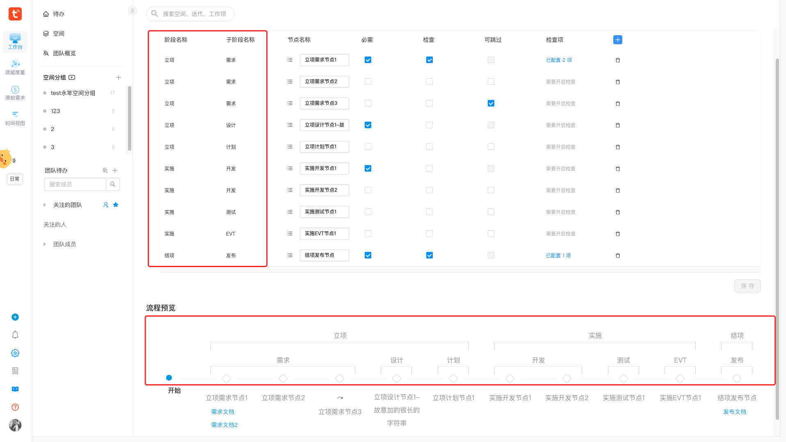

# 分析过程

【空间里程碑节点新增阶段和子阶段属性并预览展示】
里程碑流程配置是个可编辑表格，支持拖动排序，保存预览。
里程碑流程节点配置有：是否必填、是否可跳过、是否有检查项/审批项

- 需求涉及改动：

  - 新增节点不再是可编辑表格新增一条数据，而是改成弹窗，阶段、子阶段、节点名称三个控件必填，点击确定后可编辑表格新增一条数据
  - 节点拖动新增限制，按照阶段和子阶段各自的顺序，只能在同一个阶段且同一子阶段下才能调整顺序，之前没有阶段子阶段时任意调整顺序

- **实现过程**
  - 子阶段下的里程碑列表：长度为 len
    - 第一个里程碑节点和最后一个里程碑节点加分隔元素
    - 中间位置的节点才显示名称
      - len 为奇数，名称正常显示
      - len 为偶数，名称设置`marginLeft: -50%`，即左移一半
  - 父阶段下的里程碑列表同理。

# 显示处理代码

```jsx
const StepTitleContainer = styled.div`
  position: relative;
  .stage-name-node,
  .sub-stage-name-node {
    width: 100%;
    height: 32px;
    position: absolute;
    left: 50%;
    transform: translateX(-50%);
    top: -90px;
    border-bottom: 1px solid rgb(229, 229, 229);
    .title {
      width: 116px;
    }
    .split-start {
      position: absolute;
      width: 20px;
      height: 20px;
      top: 100%;
      left: 0;
      border-style: solid;
      border-width: 1px;
      // start盒子靠在最左边，盒子上方贴着.stage-name-node(父元素)的底部，与父元素的border-bottom重叠
      // start盒子boder的上边框白色覆盖20px父元素的border-bottom，boder的右边框则与父元素的border-bottom同色，下边框左边框透明，
      // 形成了一种父盒子的border-bottom起端折下20px的效果
      border-color: #fff #ccc transparent transparent;
    }
    .split-end {
      position: absolute;
      width: calc(100% - 56px - 38px);
      // 猜想 = calc(100% - 94px) 
      // = calc(100% - (116px - 22px)) 
      // = calc(100% - (116px - 20px - 1px*2))
      // = calc(100% - (title宽度 - 盒子宽度 - 2个border的宽度))
      // 继续猜想
      // 两个节点之间距离 = 0.5*title宽度 + y + 20 + 0.5*title宽度 = y + 20 + title宽度
      // y = 两个节点之间距离 - title宽度 - 20
      // ？？一个是+20 一个-20，对不上啊？？
      height: 20px;
      top: 100%;
      right: 0;
      border-style: solid;
      border-width: 1px;

      // end盒子靠在最右边，盒子上方贴着.stage-name-node(父元素)的底部，与父元素的border-bottom重叠
      // end盒子boder的上边框白色覆盖计算宽度xpx父元素的border-bottom，boder的左边框则与父元素的border-bottom同色，右边框下边框透明，
      // 形成了一种父盒子的border-bottom末端折下20px的效果
      border-color: #fff transparent transparent #ccc;
    }
  }
  .stage-name-node {
    top: -150px;
  }
`


  // 节点list按照阶段-子阶段字典的顺序处理成新list
  const handledPreviewMilestones = useMemo(() => {
    const latestMappingList = phaseMappingList as IHandledPreviewMilestonePhaseMappingItem[]
    const res = produce(latestMappingList || [], (draft) => {
      draft?.forEach((stageItem) => {
        stageItem.milestones = []
        if (stageItem?.children?.length) {
          stageItem?.children?.forEach((subStageItem) => {
            const filteredMilestones =
              milestones?.filter(
                (milestoneItem) =>
                  milestoneItem?.firstPhaseEnum === stageItem?.key &&
                  milestoneItem?.secondPhaseEnum === subStageItem?.key,
              ) || []
            subStageItem.milestones = filteredMilestones
            stageItem.milestones = stageItem.milestones.concat(filteredMilestones)
          })
        }
      })
    })
    return res || []
  }, [milestones, phaseMappingList])

return (
    <MilestonePreviewerContainer data-test="previewer">
      <h2 style={{ marginBottom: 24 }}>流程预览</h2>
      <Steps className="previewer-steps-wrapper" labelPlacement="vertical">
        <Step icon={<Circle />} title="开始" />

        {/* 子阶段下的里程碑列表：第一个里程碑节点和最后一个里程碑节点加分隔元素，中间节点才显示名称。阶段下的里程碑列表同理 */}
        {handledPreviewMilestones.map((stageitem) => {
          const stageMilestonesLen = stageitem?.milestones?.length || 0 // 阶段下节点数组长度
          const stageMilestonesMidEleIndex = Math.floor(stageMilestonesLen / 2) // 阶段下节点数组中间位置元素的下标
          const isStageMilestonesLenEven = stageMilestonesLen % 2 === 0 // 长度是偶数

          let countIndex = 0 // 里程碑节点在阶段下节点数组中的下标
          return stageitem?.children?.map((subStageitem) => {
            const subStageMilestonesLen = subStageitem?.milestones?.length || 0 // 子阶段下节点数组长度
            const subStageMilestonesMidEleIndex = Math.floor(subStageMilestonesLen / 2) // 子阶段下节点数组中间位置元素的下标
            const isSubStageMilestonesLenEven = subStageMilestonesLen % 2 === 0 // 长度是偶数

            return subStageitem?.milestones?.map((milestone, index) => {
              countIndex += 1
              return (
                <Step
                  key={milestone.id}
                  icon={<StepIcon />}
                  title={
                    <StepTitleContainer>
                      {/* 阶段范围提示 */}
                      <div className="stage-name-node">
                        <ConditionComponent isShow={countIndex === 1}>
                          <span className="split-start" />
                        </ConditionComponent>
                        <ConditionComponent isShow={countIndex - 1 === stageMilestonesMidEleIndex}>
                          <div
                            className="title"
                            style={isStageMilestonesLenEven ? { marginLeft: '-50%' } : {}}
                          >
                            {stageitem?.name}
                          </div>
                        </ConditionComponent>

                        <ConditionComponent
                          // 原为 isShow={countIndex - 1 === stageMilestonesLen - 1}
                          isShow={countIndex === stageMilestonesLen}
                        >
                          <span className="split-end" />
                        </ConditionComponent>
                      </div>

                      {/* 子阶段范围提示 */}
                      <div className="sub-stage-name-node">
                        <ConditionComponent isShow={index === 0}>
                          <span className="split-start" />
                        </ConditionComponent>

                        <ConditionComponent isShow={index === subStageMilestonesMidEleIndex}>
                          <div
                            className="title"
                            style={isSubStageMilestonesLenEven ? { marginLeft: '-50%' } : {}}
                          >
                            {subStageitem?.name}
                          </div>
                        </ConditionComponent>

                        <ConditionComponent isShow={index === subStageMilestonesLen - 1}>
                          <span className="split-end" />
                        </ConditionComponent>
                      </div>
                      <StepTitle data-test="title">
                        {milestone.needSkip && <Icon type="jumpout" />}
                        <CheckPersons persons={getPersons(milestone, isHardware)} />
                        {milestone.title}
                        <CheckContents
                          contents={getContents(milestone, isHardware)}
                          isHardware={isHardware}
                        />
                      </StepTitle>
                    </StepTitleContainer>
                  }
                />
              )
            })
          })
        })}
      </Steps>
    </MilestonePreviewerContainer>
  )
```

# UI

## 实现前


## 实现中


## 实现后


