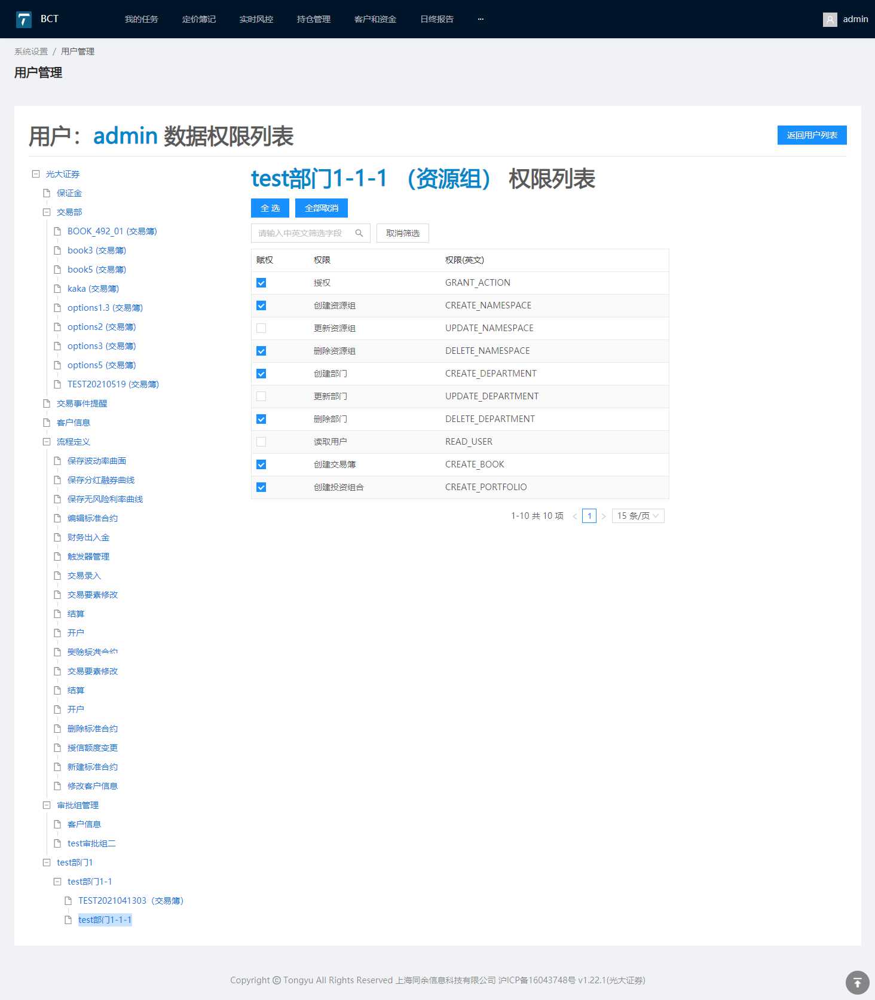
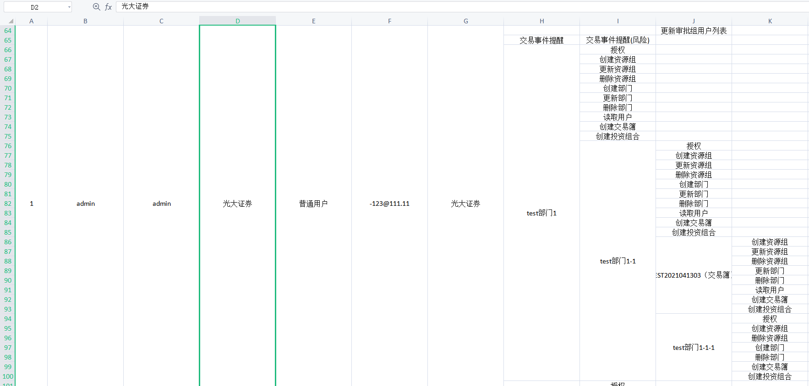
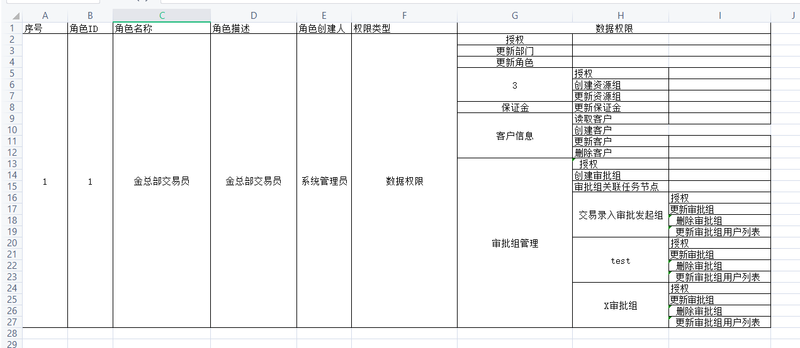
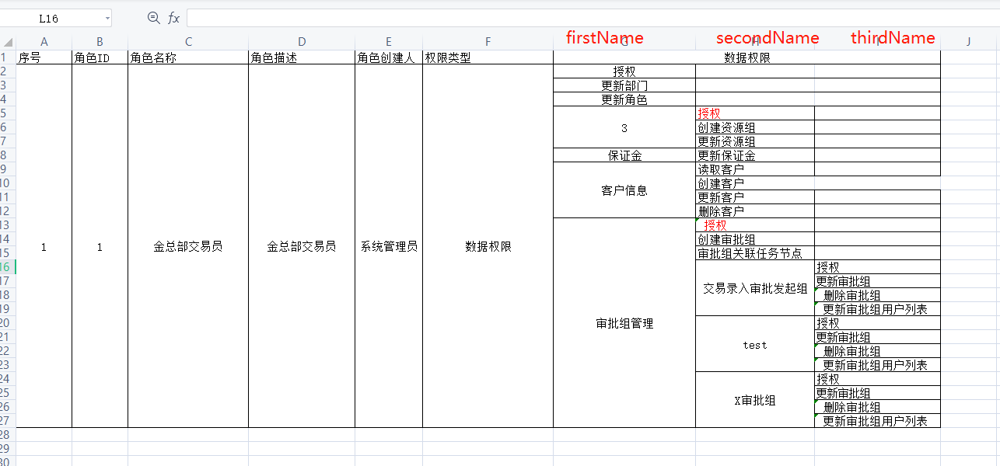

# xlsx 导出 Excel 表格实现行列合并

## 需求

提测后发现如果有多层级的部门情况下，原先写的只导出最多三个层级的权限已经无法满足需求。因此新增需求如下：

- 支持任意层级的权限数据导出
- 除最后一级的权限节点以外其余权限节点若没有权限也要将数据导出：即这一行的最后一列是节点的名称而不是权限的名称了

效果如下：



处理树形数据关键代码如下(详细见)：

```diff
- export const handleTreeDataToFlatData = rootNode => {
-   let res = [];
-   mapTree(rootNode, (node, parentNode) => {
-     if (node.level === 1) {
-       res = res.concat(
-         getAuthList(node).map(item => ({
-           firstName: item.name,
-           level: 1,
-         })),
-       );
-     }
-     if (node.level === 2) {
-       res = res.concat(
-         getAuthList(node).map(item => ({
-           firstName: node.resourceName,
-           secondName: item.name,
-           level: 2,
-         })),
-       );
-     }
-     if (node.level === 3) {
-       res = res.concat(
-         getAuthList(node).map(item => ({
-           firstName: parentNode.resourceName,
-           secondName: node.resourceName,
-           thirdName: item.name,
-           level: 3,
-         })),
-       );
-     }
-   });
-   return res;
- };


+export const handleTreeDataToFlatData = rootNode => {
+  let res = [];
+  mapTree(rootNode, (node, parentNodes) => {
+    const { level } = node;
+    // 返回当前节点的权限列表
+    const handledAuthList = getAuthList(node);+

+    const getConcatList = () => {
+      const getNodeNames = node => {
+        const { resourceName, resourceType } = node;
+        const resourceTypeZHCN = DATA_PERMISSION_RESOURCE_TYPE_MAP[resourceType];
+        if (resourceTypeZHCN) {
+          if (resourceTypeZHCN === DATA_PERMISSION_RESOURCE_TYPE_MAP.ROOT) {
+            return resourceName;
+          }
+          return `${resourceName} (${resourceTypeZHCN})`;
+        }
+        return resourceName;
+      };
+      const dataPermissionColumnNameObj = ([...Array(level).keys()].reduce((t, v, i) => {
+        const temp = t;
+        temp[`${v}_name`] = getNodeNames(parentNodes[i]);
+        return temp;
+      }, {}) as unknown) as object;
+      // 有权限的节点返回当前节点
+      if (handledAuthList.length) {
+        return handledAuthList.map(item => {
+          return {
+            ...dataPermissionColumnNameObj,
+            [`${level}_name`]: item.name,
+            level,
+          };
+        });
+      }
+      // 没有权限但是有子节点的返回nul
+      if (node.children) {
+        return null;
+      }
+      // 没有权限但是没有子节点的返回当前节点
+      return {
+        ...dataPermissionColumnNameObj,
+        level,
+      };
+    };
+    const toConcatList = getConcatList() || [];
+    res = res.concat(toConcatList);
+  });
+  return res;
+};
```

## 实现

### 三级 tree 数据转为平层数据

预期导出 excel 的效果如下图：


```js
// 三级 tree 原始数据
const treeData = {
  id: "7d1bf523-7220-413f-994d-4ed136ef4c65",
  sort: 0,
  children: [
    {
      id: "dfd354b2-3cd7-47c1-9820-522d9a2152ff",
      sort: 0,
      children: null,
      resourceName: "3",
      resourceType: "NAMESPACE",
      departmentId: "4a0e0e00-eaa2-4652-b018-982057113902",
      resourcePermissions: [
        "GRANT_ACTION",
        "CREATE_NAMESPACE",
        "UPDATE_NAMESPACE",
      ],
      parentId: { present: true },
    },
    {
      id: "8c4fdf2b-06d4-4410-88fe-2a19e5fa30ac",
      sort: 0,
      children: null,
      resourceName: "保证金",
      resourceType: "MARGIN",
      departmentId: "c89e0dd5-7ca4-4137-ae49-9b3c033bc462",
      resourcePermissions: ["UPDATE_MARGIN"],
      parentId: { present: true },
    },
    {
      id: "d7066507-394c-4a4d-9521-130934f03763",
      sort: 0,
      children: [
        {
          id: "f70759e0-539f-43e7-b126-177aabbd7455",
          sort: 0,
          children: null,
          resourceName: "交易簿A",
          resourceType: "BOOK",
          departmentId: "885c5a51-611e-4c48-a1ea-5b4ebcd4edf3",
          resourcePermissions: [],
          parentId: { present: true },
        },
      ],
      resourceName: "测试修改交易部",
      resourceType: "NAMESPACE",
      departmentId: "885c5a51-611e-4c48-a1ea-5b4ebcd4edf3",
      resourcePermissions: [],
      parentId: { present: true },
    },
    {
      id: "bf1268d6-5c9e-46ca-8da4-19c55b85428c",
      sort: 0,
      children: null,
      resourceName: "客户信息",
      resourceType: "CLIENT_INFO",
      departmentId: "c89e0dd5-7ca4-4137-ae49-9b3c033bc462",
      resourcePermissions: [
        "CREATE_CLIENT",
        "UPDATE_CLIENT",
        "READ_CLIENT",
        "DELETE_CLIENT",
      ],
      parentId: { present: true },
    },
    {
      id: "d40b13e4-fad9-46ea-9ef4-9f9310430aac",
      sort: 0,
      children: [
        {
          id: "b5b1d7d6-2646-444b-a770-438c3afabc8a",
          sort: 0,
          children: null,
          resourceName: "财务出入金",
          resourceType: "PROCESS_DEFINITION_INFO",
          departmentId: null,
          resourcePermissions: [],
          parentId: { present: true },
        },
        {
          id: "93e97447-4793-4a49-947d-dd75fa61ac6d",
          sort: 0,
          children: null,
          resourceName: "触发器管理",
          resourceType: "TRIGGER",
          departmentId: null,
          resourcePermissions: [],
          parentId: { present: true },
        },
        {
          id: "b653f621-ac45-4a13-bb73-541d7ad913d5",
          sort: 0,
          children: null,
          resourceName: "交易录入",
          resourceType: "PROCESS_DEFINITION_INFO",
          departmentId: null,
          resourcePermissions: [],
          parentId: { present: true },
        },
        {
          id: "71c583d7-2001-4b30-a47f-dcbe9c52a4ca",
          sort: 0,
          children: null,
          resourceName: "交易要素修改",
          resourceType: "PROCESS_DEFINITION_INFO",
          departmentId: null,
          resourcePermissions: [],
          parentId: { present: true },
        },
        {
          id: "aeeece82-6257-45d7-ba70-638f7114dd72",
          sort: 0,
          children: null,
          resourceName: "结算",
          resourceType: "PROCESS_DEFINITION_INFO",
          departmentId: null,
          resourcePermissions: [],
          parentId: { present: true },
        },
        {
          id: "4d6dce32-ee6e-4721-9dcd-1ebd4d87cfa7",
          sort: 0,
          children: null,
          resourceName: "开户",
          resourceType: "PROCESS_DEFINITION_INFO",
          departmentId: null,
          resourcePermissions: [
            "GRANT_ACTION",
            "UPDATE_PROCESS_DEFINITION",
            "BIND_PROCESS_TRIGGER",
          ],
          parentId: { present: true },
        },
        {
          id: "68663e0f-82b1-4377-a949-3ab490fc8039",
          sort: 0,
          children: null,
          resourceName: "授信额度变更",
          resourceType: "PROCESS_DEFINITION_INFO",
          departmentId: null,
          resourcePermissions: [],
          parentId: { present: true },
        },
        {
          id: "e61e9e85-c050-4ae4-ae4a-6c9ea84b0738",
          sort: 0,
          children: null,
          resourceName: "修改客户信息",
          resourceType: "PROCESS_DEFINITION_INFO",
          departmentId: null,
          resourcePermissions: [],
          parentId: { present: true },
        },
      ],
      resourceName: "流程定义",
      resourceType: "PROCESS_DEFINITION",
      departmentId: "c89e0dd5-7ca4-4137-ae49-9b3c033bc462",
      resourcePermissions: [],
      parentId: { present: true },
    },
    {
      id: "bd343174-3c54-45fe-a1fe-cc0765997cfc",
      sort: 0,
      children: [
        {
          id: "2be82480-881c-4d95-af81-3e8c2c807fcb",
          sort: 0,
          children: null,
          resourceName: "交易录入审批发起组",
          resourceType: "APPROVAL_GROUP_INFO",
          departmentId: null,
          resourcePermissions: ["UPDATE_APPROVAL_GROUP"],
          parentId: { present: true },
        },
        {
          id: "c77cb792-3c81-4b40-8514-366e6934a679",
          sort: 0,
          children: null,
          resourceName: "交易录入审批组",
          resourceType: "APPROVAL_GROUP_INFO",
          departmentId: null,
          resourcePermissions: [],
          parentId: { present: true },
        },
        {
          id: "2768cea1-5a25-4ea4-9273-6b48c5a604cc",
          sort: 0,
          children: null,
          resourceName: "审批组001",
          resourceType: "APPROVAL_GROUP_INFO",
          departmentId: null,
          resourcePermissions: [
            "UPDATE_APPROVAL_GROUP_USER",
            "GRANT_ACTION",
            "DELETE_APPROVAL_GROUP",
            "UPDATE_APPROVAL_GROUP",
          ],
          parentId: { present: true },
        },
        {
          id: "bb4ec777-30d2-4e6a-98a5-3354e6c54852",
          sort: 0,
          children: null,
          resourceName: "test",
          resourceType: "APPROVAL_GROUP_INFO",
          departmentId: null,
          resourcePermissions: [],
          parentId: { present: true },
        },
        {
          id: "443b4b30-bc47-4dee-9a72-d702790a3ba6",
          sort: 0,
          children: null,
          resourceName: "TEST-0407",
          resourceType: "APPROVAL_GROUP_INFO",
          departmentId: null,
          resourcePermissions: [],
          parentId: { present: true },
        },
        {
          id: "eb755026-879d-4f9e-8443-b361f1efa5c8",
          sort: 0,
          children: null,
          resourceName: "X审批组",
          resourceType: "APPROVAL_GROUP_INFO",
          departmentId: null,
          resourcePermissions: ["DELETE_APPROVAL_GROUP"],
          parentId: { present: true },
        },
      ],
      resourceName: "审批组管理",
      resourceType: "APPROVAL_GROUP",
      departmentId: "c89e0dd5-7ca4-4137-ae49-9b3c033bc462",
      resourcePermissions: ["UPDATE_TASK_NODE"],
      parentId: { present: true },
    },
    {
      id: "558cce51-0c5c-42d3-bc18-33c50ca51989",
      sort: 0,
      children: [
        {
          id: "874b970d-0e0f-4acc-a0c3-81b2faa3c56e",
          sort: 0,
          children: null,
          resourceName: "book001",
          resourceType: "BOOK",
          departmentId: "ed4172ba-dd97-47bf-9bfe-addf1104c162",
          resourcePermissions: [],
          parentId: { present: true },
        },
        {
          id: "da4b44e9-dd28-4a0c-acdb-2f0d74aebd7f",
          sort: 0,
          children: null,
          resourceName: "book002",
          resourceType: "BOOK",
          departmentId: "ed4172ba-dd97-47bf-9bfe-addf1104c162",
          resourcePermissions: [],
          parentId: { present: true },
        },
        {
          id: "0cba084c-b37c-4c39-82b1-6eb27af99324",
          sort: 0,
          children: null,
          resourceName: "No.1",
          resourceType: "BOOK",
          departmentId: "ed4172ba-dd97-47bf-9bfe-addf1104c162",
          resourcePermissions: ["DELETE_TRADE", "READ_TRADE"],
          parentId: { present: true },
        },
        {
          id: "81af2b96-16c9-4c3b-940b-c3cdd6052127",
          sort: 0,
          children: null,
          resourceName: "TEST NO.1",
          resourceType: "BOOK",
          departmentId: "ed4172ba-dd97-47bf-9bfe-addf1104c162",
          resourcePermissions: [],
          parentId: { present: true },
        },
        {
          id: "3e53df46-b87e-4593-9a69-2d14b535c9dd",
          sort: 0,
          children: null,
          resourceName: "TEST20210407",
          resourceType: "BOOK",
          departmentId: "ed4172ba-dd97-47bf-9bfe-addf1104c162",
          resourcePermissions: [],
          parentId: { present: true },
        },
      ],
      resourceName: "risk",
      resourceType: "NAMESPACE",
      departmentId: "ed4172ba-dd97-47bf-9bfe-addf1104c162",
      resourcePermissions: [
        "CREATE_NAMESPACE",
        "CREATE_DEPARTMENT",
        "UPDATE_DEPARTMENT",
        "DELETE_NAMESPACE",
        "UPDATE_NAMESPACE",
      ],
      parentId: { present: true },
    },
    {
      id: "84c72537-5f5c-400b-975a-2dd1e2eec013",
      sort: 0,
      children: [
        {
          id: "90ebe896-c91a-4692-be2e-9c3671eacd61",
          sort: 0,
          children: null,
          resourceName: "3",
          resourceType: "BOOK",
          departmentId: "58039e97-8ee6-44d8-9dcd-52f3c00cdebc",
          resourcePermissions: [],
          parentId: { present: true },
        },
        {
          id: "eb861623-759f-4f6d-9435-06269a15974c",
          sort: 0,
          children: null,
          resourceName: "6",
          resourceType: "BOOK",
          departmentId: "58039e97-8ee6-44d8-9dcd-52f3c00cdebc",
          resourcePermissions: [],
          parentId: { present: true },
        },
        {
          id: "8f6ca18f-d555-4c2d-94ef-66e1c531de58",
          sort: 0,
          children: null,
          resourceName: "测试专用交易簿",
          resourceType: "BOOK",
          departmentId: "58039e97-8ee6-44d8-9dcd-52f3c00cdebc",
          resourcePermissions: [],
          parentId: { present: true },
        },
        {
          id: "ae28fe14-ffbe-40ce-962a-15a415f01104",
          sort: 0,
          children: null,
          resourceName: "airflow",
          resourceType: "BOOK",
          departmentId: "58039e97-8ee6-44d8-9dcd-52f3c00cdebc",
          resourcePermissions: [],
          parentId: { present: true },
        },
        {
          id: "b04859bc-a58a-48a3-a640-9cc162cb9ebd",
          sort: 0,
          children: null,
          resourceName: "book1",
          resourceType: "BOOK",
          departmentId: "58039e97-8ee6-44d8-9dcd-52f3c00cdebc",
          resourcePermissions: [],
          parentId: { present: true },
        },
      ],
      resourceName: "test",
      resourceType: "NAMESPACE",
      departmentId: "58039e97-8ee6-44d8-9dcd-52f3c00cdebc",
      resourcePermissions: [],
      parentId: { present: true },
    },
    {
      id: "2fd54b84-98f7-4969-aa53-da4815cc17a4",
      sort: 0,
      children: [
        {
          id: "704dbf6c-8cf4-49be-af50-11ec304db4e5",
          sort: 0,
          children: null,
          resourceName: "12378569",
          resourceType: "BOOK",
          departmentId: "3774326a-fa6e-4e0f-8010-6754a008da9d",
          resourcePermissions: [],
          parentId: { present: true },
        },
        {
          id: "6924d25b-f0ba-4d3a-ac31-800bce41580f",
          sort: 0,
          children: null,
          resourceName: "3",
          resourceType: "BOOK",
          departmentId: "3774326a-fa6e-4e0f-8010-6754a008da9d",
          resourcePermissions: [],
          parentId: { present: true },
        },
        {
          id: "1beb75f4-e86c-4bde-9e76-b42783271a2f",
          sort: 0,
          children: null,
          resourceName: "4353453",
          resourceType: "BOOK",
          departmentId: "3774326a-fa6e-4e0f-8010-6754a008da9d",
          resourcePermissions: [],
          parentId: { present: true },
        },
        {
          id: "405c4c93-026f-4131-962a-a07ca525bb3f",
          sort: 0,
          children: null,
          resourceName: "8",
          resourceType: "BOOK",
          departmentId: "3774326a-fa6e-4e0f-8010-6754a008da9d",
          resourcePermissions: [],
          parentId: { present: true },
        },
        {
          id: "ab9afece-bbbb-40fd-9383-b542918a9f1e",
          sort: 0,
          children: null,
          resourceName: "test_10033",
          resourceType: "BOOK",
          departmentId: "3774326a-fa6e-4e0f-8010-6754a008da9d",
          resourcePermissions: [],
          parentId: { present: true },
        },
        {
          id: "f6ad2f0e-da21-4999-9ec2-75cb96f32d8e",
          sort: 0,
          children: null,
          resourceName: "TEST20210408",
          resourceType: "BOOK",
          departmentId: "3774326a-fa6e-4e0f-8010-6754a008da9d",
          resourcePermissions: [],
          parentId: { present: true },
        },
      ],
      resourceName: "X部门",
      resourceType: "NAMESPACE",
      departmentId: "3774326a-fa6e-4e0f-8010-6754a008da9d",
      resourcePermissions: [],
      parentId: { present: true },
    },
  ],
  resourceName: "23",
  resourceType: "ROOT",
  departmentId: "c89e0dd5-7ca4-4137-ae49-9b3c033bc462",
  resourcePermissions: ["GRANT_ACTION", "UPDATE_ROLE", "UPDATE_DEPARTMENT"],
  parentId: { present: false },
  choosedThisResource: true,
};
```

```js
// 给三级 tree 原始数据加个level层级
const handleLevel = (node, level = 1, fieldName = "children") => {
  return {
    ...node,
    level,
    [fieldName]: node[fieldName]
      ? node[fieldName].map((item) => handleLevel(item, level + 1))
      : null,
  };
};

const handledLevelTreeData = handleLevel(treeData);
```

```js
// AUTHES源文件
const CLIENT_INFO = [
  {
    value: "READ_CLIENT",
    zh: "读取客户",
  },
  {
    value: "CREATE_CLIENT",
    zh: "创建客户",
  },
  {
    value: "UPDATE_CLIENT",
    zh: "更新客户",
  },
  {
    value: "DELETE_CLIENT",
    zh: "删除客户",
  },
];

export default {
  CLIENT_INFO,
};
```

```js
// 三级tree转平层数据
const mapTree = (node, cb, fieldName = "children", parent = null) => {
  return cb(
    {
      ...node,
      [fieldName]: node[fieldName]
        ? node[fieldName].map((item) => mapTree(item, cb, fieldName, node))
        : undefined,
    },
    parent
  );
};

export const getAuthList = (item) => {
  const permissions = item.resourcePermissions;
  const authes = AUTHES[item.resourceType];
  return authes.reduce((t, v) => {
    const res = t;
    const obj = Object.assign({});
    obj.name = v.zh;
    obj.value = v.value;
    obj.choosed = permissions.includes(v.value);
    if (obj.choosed) {
      res.push(obj);
    }
    return res;
  }, []);
};

export const handleTreeDataToFlatData = (rootNode) => {
  let res = [];
  const data = mapTree(rootNode, (node, parentNode) => {
    if (node.level === 1) {
      res = res.concat(
        getAuthList(node).map((item) => ({
          firstName: item.name,
          level: 1,
        }))
      );
    }
    if (node.level === 2) {
      res = res.concat(
        getAuthList(node).map((item) => ({
          firstName: node.resourceName,
          secondName: item.name,
          level: 2,
        }))
      );
    }
    if (node.level === 3) {
      res = res.concat(
        getAuthList(node).map((item) => ({
          firstName: parentNode.resourceName,
          secondName: node.resourceName,
          thirdName: item.name,
          level: 3,
        }))
      );
    }
  });
  return res;
};

const subDataAuth = handleTreeDataToFlatData(handledLevelTreeData);
// subDataAuth 如下
[
  { firstName: "3", secondName: "授权", level: 2 },
  { firstName: "3", secondName: "创建资源组", level: 2 },
  { firstName: "3", secondName: "更新资源组", level: 2 },
  { firstName: "保证金", secondName: "更新保证金", level: 2 },
  { firstName: "客户信息", secondName: "读取客户", level: 2 },
  { firstName: "客户信息", secondName: "创建客户", level: 2 },
  { firstName: "客户信息", secondName: "更新客户", level: 2 },
  { firstName: "客户信息", secondName: "删除客户", level: 2 },
  { firstName: "流程定义", secondName: "开户", thirdName: "授权", level: 3 },
  {
    firstName: "流程定义",
    secondName: "开户",
    thirdName: "流程定义修改",
    level: 3,
  },
  {
    firstName: "流程定义",
    secondName: "开户",
    thirdName: "流程绑定触发器",
    level: 3,
  },
  {
    firstName: "审批组管理",
    secondName: "交易录入审批发起组",
    thirdName: "更新审批组",
    level: 3,
  },
  {
    firstName: "审批组管理",
    secondName: "审批组001",
    thirdName: "授权",
    level: 3,
  },
  {
    firstName: "审批组管理",
    secondName: "审批组001",
    thirdName: "更新审批组",
    level: 3,
  },
  {
    firstName: "审批组管理",
    secondName: "审批组001",
    thirdName: "删除审批组",
    level: 3,
  },
  {
    firstName: "审批组管理",
    secondName: "审批组001",
    thirdName: "更新审批组用户列表",
    level: 3,
  },
  {
    firstName: "审批组管理",
    secondName: "X审批组",
    thirdName: "删除审批组",
    level: 3,
  },
  { firstName: "审批组管理", secondName: "审批组关联任务节点", level: 2 },
  { firstName: "risk", secondName: "No.1", thirdName: "读取交易", level: 3 },
  { firstName: "risk", secondName: "No.1", thirdName: "删除交易", level: 3 },
  { firstName: "risk", secondName: "创建资源组", level: 2 },
  { firstName: "risk", secondName: "更新资源组", level: 2 },
  { firstName: "risk", secondName: "删除资源组", level: 2 },
  { firstName: "risk", secondName: "创建部门", level: 2 },
  { firstName: "risk", secondName: "更新部门", level: 2 },
  { firstName: "授权", level: 1 },
  { firstName: "更新部门", level: 1 },
  { firstName: "更新角色", level: 1 },
];
```

```js
// subDataAuth调整顺序
const groupListByKey = (arr = [], key) => {
  return key
    ? arr.reduce((t, v) => {
        if (!t[v[key]]) {
          t[v[key]] = [];
        }
        t[v[key]].push(v);
        return t;
      }, {})
    : {};
};

const groupedSubDataAuth = group(subDataAuth, "firstName");
//groupedSubDataAuth 如下
const groupedSubDataAuth = {
    3: [...],
    risk: [...],
    保证金: [...],
    审批组管理: [...],
    客户信息: [...],
    授权: [...],
    更新角色: [...],
    更新部门: [...],
    流程定义: [...],
}


const sortedSubDataAuth = Object.values(groupedSubDataAuth).map(v => {
      return v.sort((a, b) => a.level - b.level);
    }).reduce((t, v) => t.concat(v), [])
// sortedSubDataAuth 如下
[{firstName: "3", secondName: "授权", level: 2},
{firstName: "3", secondName: "创建资源组", level: 2},
{firstName: "3", secondName: "更新资源组", level: 2},
{firstName: "保证金", secondName: "更新保证金", level: 2},
{firstName: "客户信息", secondName: "读取客户", level: 2},
{firstName: "客户信息", secondName: "创建客户", level: 2},
{firstName: "客户信息", secondName: "更新客户", level: 2},
{firstName: "客户信息", secondName: "删除客户", level: 2},
{firstName: "流程定义", secondName: "开户", thirdName: "授权", level: 3},
{firstName: "流程定义", secondName: "开户", thirdName: "流程定义修改", level: 3},
{firstName: "流程定义", secondName: "开户", thirdName: "流程绑定触发器", level: 3},
{firstName: "审批组管理", secondName: "审批组关联任务节点", level: 2},
{firstName: "审批组管理", secondName: "交易录入审批发起组", thirdName: "更新审批组", level: 3},
{firstName: "审批组管理", secondName: "审批组001", thirdName: "授权", level: 3},
{firstName: "审批组管理", secondName: "审批组001", thirdName: "更新审批组", level: 3},
{firstName: "审批组管理", secondName: "审批组001", thirdName: "删除审批组", level: 3},
{firstName: "审批组管理", secondName: "审批组001", thirdName: "更新审批组用户列表", level: 3},
{firstName: "审批组管理", secondName: "X审批组", thirdName: "删除审批组", level: 3},
{firstName: "risk", secondName: "创建资源组", level: 2},
{firstName: "risk", secondName: "更新资源组", level: 2},
{firstName: "risk", secondName: "删除资源组", level: 2},
{firstName: "risk", secondName: "创建部门", level: 2},
{firstName: "risk", secondName: "更新部门", level: 2},
{firstName: "risk", secondName: "No.1", thirdName: "读取交易", level: 3},
{firstName: "risk", secondName: "No.1", thirdName: "删除交易", level: 3},
{firstName: "授权", level: 1},
{firstName: "更新部门", level: 1},
{firstName: "更新角色", level: 1}]


const beforeList = [];
const afterList = sortedSubDataAuth.reduce((t, v) => {
    if (v.level === 1) {
        beforeList.push(v);
    } else {
        t.push(v);
    }
    return t;
}, []);

const finalData = beforeList.concat(afterList)
// finalData 如下
[
{firstName: "授权", level: 1},
{firstName: "更新部门", level: 1},
{firstName: "更新角色", level: 1},
{firstName: "3", secondName: "授权", level: 2},
{firstName: "3", secondName: "创建资源组", level: 2},
{firstName: "3", secondName: "更新资源组", level: 2},
{firstName: "保证金", secondName: "更新保证金", level: 2},
{firstName: "客户信息", secondName: "读取客户", level: 2},
{firstName: "客户信息", secondName: "创建客户", level: 2},
{firstName: "客户信息", secondName: "更新客户", level: 2},
{firstName: "客户信息", secondName: "删除客户", level: 2},
{firstName: "流程定义", secondName: "开户", thirdName: "授权", level: 3},
{firstName: "流程定义", secondName: "开户", thirdName: "流程定义修改", level: 3},
{firstName: "流程定义", secondName: "开户", thirdName: "流程绑定触发器", level: 3},
{firstName: "审批组管理", secondName: "审批组关联任务节点", level: 2},
{firstName: "审批组管理", secondName: "交易录入审批发起组", thirdName: "更新审批组", level: 3},
{firstName: "审批组管理", secondName: "审批组001", thirdName: "授权", level: 3},
{firstName: "审批组管理", secondName: "审批组001", thirdName: "更新审批组", level: 3},
{firstName: "审批组管理", secondName: "审批组001", thirdName: "删除审批组", level: 3},
{firstName: "审批组管理", secondName: "审批组001", thirdName: "更新审批组用户列表", level: 3},
{firstName: "审批组管理", secondName: "X审批组", thirdName: "删除审批组", level: 3},
{firstName: "risk", secondName: "创建资源组", level: 2},
{firstName: "risk", secondName: "更新资源组", level: 2},
{firstName: "risk", secondName: "删除资源组", level: 2},
{firstName: "risk", secondName: "创建部门", level: 2},
{firstName: "risk", secondName: "更新部门", level: 2},
{firstName: "risk", secondName: "No.1", thirdName: "读取交易", level: 3},
{firstName: "risk", secondName: "No.1", thirdName: "删除交易", level: 3}]
```

## 问题

### 问题一: xlsx 设置样式无效

如果是用`xlsx-style`依赖下的核心模块：`node_modules\xlsx-style\dist\xlsx.full.min.js`。

导出 Excel 单元格设置样式无效。换成[JavaScript 导出 excel 文件，并修改文件样式](https://www.imooc.com/article/305180)里的源码中的`xlsx.full.min.js`文件即可。

### 问题二：三级数据权限合并时

三级数据权限合并时需要注意第二级和第三级是会重复的（第三级是重复的很正常，第二级比较少这种需要注意处理），所以计算合并的 index 时候，获取第二级的合并 index 数据时候，只用`${v.secondName}`作为 key
不可以，需要用`${v.firstName}${v.secondName}`作为 key。

```js
const mergeSecondNameObj = exportList.reduce((t, v, i) => {
  const key = `${v.firstName}${v.secondName}`;
  if (!(key in t)) {
    // eslint-disable-next-line no-param-reassign
    t[key] = i + 1;
  }
  return t;
}, {});
```



### 问题三：任意层级权限导出时工作表范围出错

```js
/*   codingCellObj打印如下
{
J556: {v: "授权", s: {…}}
J557: {v: "流程定义修改", s: {…}}
J558: {v: "流程绑定触发器", s: {…}}
J559: {v: "授权", s: {…}}
J560: {v: "流程定义修改", s: {…}}
J561: {v: "流程绑定触发器", s: {…}}
J589: {v: "授权", s: {…}}
J590: {v: "更新审批组", s: {…}}
J591: {v: "删除审批组", s: {…}}
J592: {v: "更新审批组用户列表", s: {…}}

K1: {v: "数据权限"}
K54: {v: "授权", s: {…}}
K55: {v: "创建资源组", s: {…}}
K56: {v: "删除资源组", s: {…}}
K57: {v: "更新部门", s: {…}}
K58: {v: "删除部门", s: {…}}
K59: {v: "创建交易簿", s: {…}}
K60: {v: "创建投资组合", s: {…}}
}
*/
const output_pos = Object.keys(codingCellObj);

/* output_pos 打印如下，可以看到codingCellObj对象中最后几个属性是Kxx开头的，但是Object.keys(codingCellObj)处理了之后得到的数组最后一个元素确是J592, 就导致了工作表范围的结尾是到J592，即只到J列最后一行，而K列则没有显示在excel中。解决方法：得到output_pos对数组进行排序
[
...
5471: "D592"
5472: "E592"
5473: "F592"
5474: "G592"
5475: "H592"
5476: "I592"
5477: "J592"
]
*/

const workbook = {
  SheetNames: ["sheet1"], // 保存工作表的名称
  Sheets: {
    sheet1: Object.assign(
      {},
      codingCellObj, // 单元格内容
      {
        // '!ref': `${output_pos[0]}:${output_pos[output_pos.length - 1]}`, // 旧的工作表范围
        "!ref": `${output_pos[0]}:K592`, // 新的工作表范围
      }
    ),
  },
};
```

```diff
- const output_pos = Object.keys(codingCellObj);
+ const output_pos = Object.keys(codingCellObj);
+ // 工作表氛围结尾
+ const lastRange = output_pos.sort().pop();
const workbook = {
  SheetNames: ["sheet1"], // 保存工作表的名称
  Sheets: {
    sheet1: Object.assign(
      {},
      codingCellObj, // 单元格内容
      {
        '!ref': `${output_pos[0]}:${lastRange}`, // 旧的工作表范围
      }
    ),
  },
};
```

## 参考链接

- [前端实现导出 excel 单元格合并和调整样式](https://www.jianshu.com/p/990d178fa2fc)
- [前端导出表格之 XLSX 使用](https://blog.csdn.net/weixin_42429220/article/details/107890961)
- [纯前端利用 js-xlsx 之单元格样式(4)](https://www.jianshu.com/p/869375439fee)
- [纯前端利用 js-xlsx 之合并单元格(3)](https://www.jianshu.com/p/5c131c27841c)
- [【node+demo】使用 xlsx-style 设置表格的宽高等样式](https://www.jianshu.com/p/877631e7e411)
- [XLSX 实现导出带样式的 Excel 表格的坑](https://blog.csdn.net/weixin_41803229/article/details/107488929)
- [@@@JavaScript 导出 excel 文件，并修改文件样式](https://www.imooc.com/article/305180)
- [xlsx xlsx-style 设置导出的 exce 表格样式](https://blog.csdn.net/qq_45368052/article/details/112915669)
