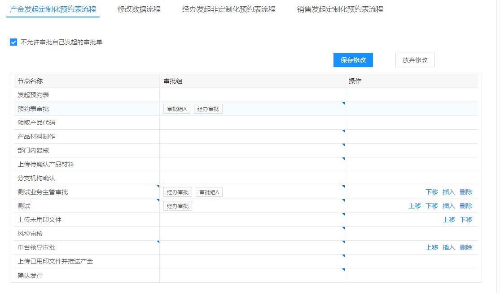
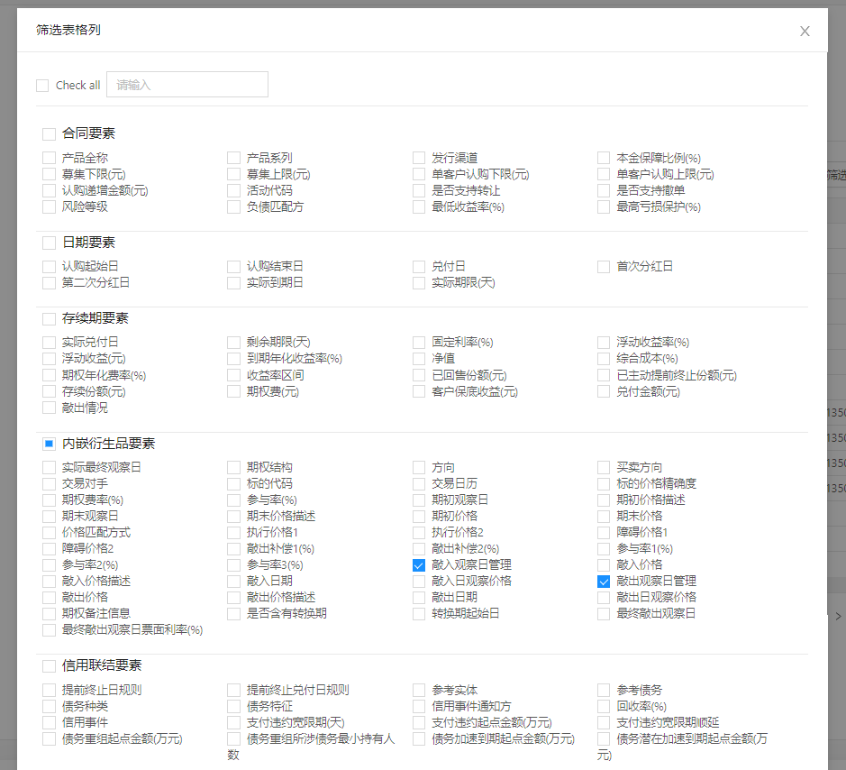
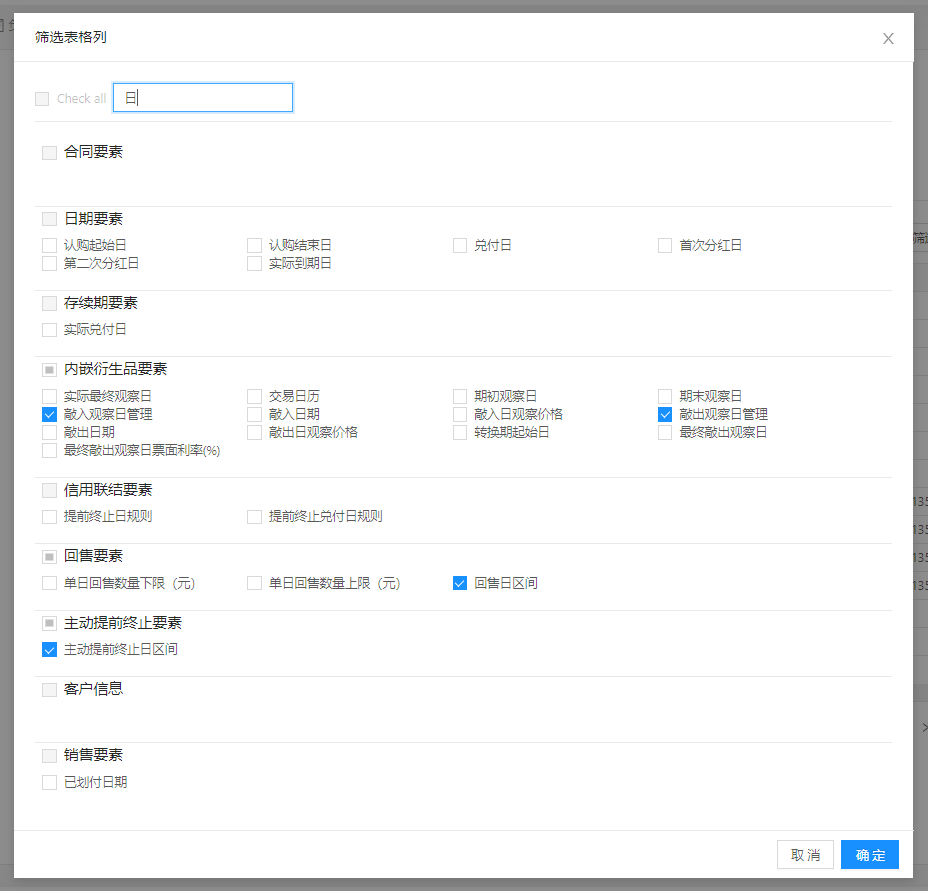

## table 假分页+人员筛选功能

```jsx
const handleDataSource = useCallback(
  (list = data?.["totalEndpointStaffCostResourceList"]) => {
    if (!list) {
      return;
    }
    setTableDataSource(list);
  },
  [data]
);

useEffect(() => {
  handleDataSource();
}, [handleDataSource]);

const handleInputSearch = useCallback(() => {
  handleDataSource(
    searchVal
      ? data?.["totalEndpointStaffCostResourceList"]?.filter((item) => {
          return item?.staffName?.includes(searchVal || "");
        })
      : undefined
  );
}, [searchVal, data, handleDataSource]);
```

## table 操作列

**界面效果：**

**需求：**

- `reviewTask` 即表格数据，operation 为 true 的元素会连续存放且有操作列按钮
  - 上移（第一条不能上移）
  - 下移（最后一条不能上移）
  - 插入
  - 删除
- 【上传未用印文件行、风控审核行】 是绑定在一起的，且按钮只出现在上传未用印上，它俩上移下移、它俩上面一个下移、它俩下面一个上移，对于它俩都是一起绑定生效的
- 【上传未用印文件行】record 的 operation 为 true，但没有插入和删除。

**实现：**

```js
const EditTable = memo((props) => {
  const operationIndexArr = reviewTask.reduce((t, v, i) => {
    if (Form2.getFieldValue(v.operation)) {
      t.push(i);
    }
    return t;
  }, []);

  const tableColumns = [
    ...{
      title: "操作",
      dataIndex: "operation",
      render: (value, record, index) => {
        if (!Form2.getFieldValue(record.operation)) {
          return null;
        }
        const startIndex = operationIndexArr[0];
        const endIndex = operationIndexArr[operationIndexArr.length - 1];
        return (
          <div style={{ display: "flex", justifyContent: "flex-end " }}>
            {index !== startIndex ? (
              <OperationBtn
                text="上移"
                onClick={() => reviewMove(1, record, index)}
              />
            ) : null}
            {index !== endIndex ? (
              <OperationBtn
                text="下移"
                onClick={() => reviewMove(-1, record, index)}
              />
            ) : null}
            {Form2.getFieldValue(record.taskName) !== "上传未用印文件" && (
              <OperationBtn
                text="插入"
                onClick={(e) => reviewInsert(e, record, index)}
              />
            )}
            {Form2.getFieldValue(record.taskName) !== "上传未用印文件" && (
              <OperationBtn
                text="删除"
                onClick={(e) => reviewDelete(e, record, index)}
              />
            )}
          </div>
        );
      },
    },
  ];
});

const handleReviewTask = (arr) => {
  const res = arr.map((v, i) => ({
    ...v,
    sequence: Form2.createField(i),
  }));
  setReviewTask(res);
};

// 上移下移
const reviewMove = (n, record, rowIndex) => {
  const recordData = Form2.getFieldsValue(record);
  setModified(true);
  const reviewTaskData = _.cloneDeep(reviewTask);
  const scwyyIndex = reviewTask.findIndex(
    (v) => Form2.getFieldValue(v.taskName) === "上传未用印文件"
  );
  // 紧邻绑定record组（上传未用印文件、风控审核）的record 的 index array
  const indexNextToScwyy =
    scwyyIndex !== -1 ? [scwyyIndex - 1, scwyyIndex + 2] : [];
  if (recordData.taskName === "上传未用印文件") {
    // 绑定record组上移下移
    const fkshRecord = reviewTask[rowIndex + 1];
    reviewTaskData.splice(rowIndex, 2);
    reviewTaskData.splice(rowIndex - n, 0, record, fkshRecord);
  } else if (indexNextToScwyy[0] === rowIndex && n === -1) {
    // 绑定record组的上一条record 下移
    reviewTaskData.splice(rowIndex, 1);
    reviewTaskData.splice(rowIndex + 2, 0, record);
  } else if (indexNextToScwyy[1] === rowIndex && n === 1) {
    // 绑定record组的下一条record 上移
    reviewTaskData.splice(rowIndex, 1);
    reviewTaskData.splice(rowIndex - 2, 0, record);
  } else {
    // 其它
    reviewTaskData.splice(rowIndex, 1);
    reviewTaskData.splice(rowIndex - n, 0, record);
  }
  handleReviewTask(reviewTaskData);
};

// 插入
const reviewInsert = (e, record, rowIndex) => {
  setModified(true);
  const recordData = Form2.getFieldsValue(record);
  const reviewTaskData = _.cloneDeep(reviewTask);
  const spliceIndex =
    rowIndex + (recordData.taskName === "上传未用印文件" ? 2 : 1);
  reviewTaskData.splice(spliceIndex, 0, {
    ...Form2.createFields({
      ...recordData,
      operation: true,
      approveGroupList: [],
      approveGroups: [],
      taskName: "",
      taskType: "reviewData",
      actionClass: ACTION_CLASS_MAP[processName] || "",
    }),
    taskId: uuidv4(),
  });
  handleReviewTask(reviewTaskData);
};

// 删除
const reviewDelete = (e, record, rowIndex) => {
  setModified(true);
  const reviewTaskData = _.cloneDeep(reviewTask);
  reviewTaskData.splice(rowIndex, 1);
  handleReviewTask(reviewTaskData);
};
```

## table 筛选表格列功能

**界面效果：**





**需求：**

- 对表格的列进行筛选显示
  - 可以勾选/撤选 全部
  - 可以勾选/撤选 模块
  - 根据 title 来搜索，此时只能对单个勾选/撤选，不能 勾选/撤选 全部/模块

**实现：**

```js
export const CHECKED_DEFAULT_VALUE = [
  "options1",
  "options2",
  "options3",
  "options4",
  "options5",
  "options6",
  "options7",
  "options8",
  "options9",
].reduce((t, v) => {
  t[v] = {
    checkedList: [],
    indeterminate: false,
    checkAll: false,
  };
  return t;
}, {});
```

```js
state = {
  setColVisible: false,
  checkedListObj: CHECKED_DEFAULT_VALUE,
  checkedAll: false,
  setColInputValue: '',
};


// 全选/反选 check all
onCheckAllChange = () => {
  const { checkedAll } = this.state;
  if (checkedAll) {
    this.setState({ checkedListObj: CHECKED_DEFAULT_VALUE, checkedAll: false });
  } else {
    this.setState({ checkedListObj: this.handleCheckedListObj(), checkedAll: true });
  }
};

// 全选
handleCheckedListObj = () => {
  const tempObj = _.cloneDeep(CHECKED_DEFAULT_VALUE);
  const CHECK_BOX_CONFIG = this.getCheckBoxConfig();
  CHECK_BOX_CONFIG.forEach(v => {
    tempObj[v.key] = {
      checkedList: v.dataSource.map(item => item.value),
      checkAll: true,
      indeterminate: false,
    };
  });
  return tempObj;
};

getCheckBoxConfig = () => {
    const {
      incomeModel: { item },
    } = this.props;
    const options1 = [];
    const options2 = [];
    const options3 = [];
    const options4 = [];
    const options5 = [];
    const options6 = [];
    const options7 = [];
    const options8 = [];
    const options9 = [];
    DEF_COLUMNS(item).forEach((val, index) => {
      const data = {
        label: val.title,
        value: index,
      };
      // 塞数据可以优化为分多个数组，直接数组赋值，就不用数index下标
      if (index <= 15) {
        options1.push(data);
      } else if (index > 15 && index <= 22) {
        options2.push(data);
      } else if (index > 22 && index <= 39) {
        options3.push(data);
      } else if (index > 39 && index <= 80) {
        options4.push(data);
      } else if (index > 80 && index <= 96) {
        options5.push(data);
      } else if (index > 96 && index <= 104) {
        options6.push(data);
      } else if (index > 104 && index <= 114) {
        options7.push(data);
      } else if (index > 114 && index <= 132) {
        options8.push(data);
      } else {
        options9.push(data);
      }
    });

    const CHECK_BOXCONFIG = [
      {
        partTitle: '合同要素',
        dataSource: options1,
        key: 'options1',
      },
      {
        partTitle: '日期要素',
        dataSource: options2,
        key: 'options2',
      },
      {
        partTitle: '存续期要素',
        dataSource: options3,
        key: 'options3',
      },
      {
        partTitle: '内嵌衍生品要素',
        dataSource: options4,
        key: 'options4',
      },
      {
        partTitle: '信用联结要素',
        dataSource: options5,
        key: 'options5',
      },
      {
        partTitle: '回售要素',
        dataSource: options6,
        key: 'options6',
      },
      {
        partTitle: '主动提前终止要素',
        dataSource: options7,
        key: 'options7',
      },
      {
        partTitle: '客户信息',
        dataSource: options8,
        key: 'options8',
      },
      {
        partTitle: '销售要素',
        dataSource: options9,
        key: 'options9',
      },
    ];
    return CHECK_BOXCONFIG;
  };


public setColumns = () => {
  const {
    incomeModel: { item },
    dispatch,
  } = this.props;
  const { checkedListObj, checkedAll } = this.state;
  const indexList = Object.values(checkedListObj).reduce((t, v) => t.concat(v.checkedList), []);
  dispatch({
    type: 'incomeModel/updateState',
    payload: {
      // table展示哪些列
      columns: [...DEFAULT_COLUMNS, ...indexList.map(key => DEF_COLUMNS(item)[key])],
    },
  });
  // localStorage本地持久化存储
  Storage.setItem('checkedListObj', JSON.stringify(checkedListObj));
  this.setState({ setColVisible: false });
};
```

```js
const LOCAL_STORAGE_CHECKED_LIST_OBJ = JSON.parse(Storage.getItem('checkedListObj'));

const CHECK_BOX_CONFIG = this.getCheckBoxConfig();

return (
  <Col>
    <Button
      onClick={() => {
        const checkedListObj = LOCAL_STORAGE_CHECKED_LIST_OBJ || CHECKED_DEFAULT_VALUE;
        const checkedAll = Object.values(checkedListObj).every(v => v && v.checkAll);
        this.setState({
          setColVisible: true,
          checkedListObj,
          checkedAll,
        });
      }}
    >
      筛选表格列
    </Button>
  </Col>

  <Modal
    visible={setColVisible}
    title="筛选表格列"
    maskClosable={false}
    onCancel={() => {
      this.setState({ setColVisible: false });
    }}
    onOk={this.setColumns}
    width={1000}
  >
    <div style={{ borderBottom: '1px solid #E9E9E9', paddingBottom: '10px' }}>
      <Checkbox
        onChange={this.onCheckAllChange}
        checked={this.state.checkedAll}
        disabled={!!setColInputValue}
      >
        Check all
      </Checkbox>

      <Input
        style={{ width: '200px', marginRight: '10px' }}
        value={setColInputValue}
        placeholder="请输入"
        onChange={e => this.setState({ setColInputValue: e.target.value })}
      />
    </div>
    <br />
    {CHECK_BOX_CONFIG.map(v => {
      const singlePartData = this.state.checkedListObj[v.key];

      const nowShowDataSource = v.dataSource.filter(ds =>
        ds.label.includes(setColInputValue),
      );
      const nowHiddenDataSourceKeys = v.dataSource
        .filter(ds => !ds.label.includes(setColInputValue))
        .map(hiddenItem => hiddenItem.value);
      return (
        <div key={v.partTitle} className={styles.checkBoxContainer}>
          <Checkbox
            indeterminate={singlePartData.indeterminate}
            checked={singlePartData.checkAll}
            disabled={!!setColInputValue}
            // 模块的全选/反选
            onChange={e => {
              const indexList = Array.isArray(v.dataSource)
                ? v.dataSource.map(data => data.value)
                : [];
              this.setState(prev => ({
                checkedListObj: {
                  ...prev.checkedListObj,
                  [v.key]: {
                    checkedList: e.target.checked ? indexList : [],
                    indeterminate: false,
                    checkAll: e.target.checked,
                  },
                },
              }));
            }}
          >
            <h3 style={{ display: 'inline-block' }}>{v.partTitle}</h3>
          </Checkbox>

          <CheckboxGroup
            onChange={checkedList => {
              const tempCheckedList = setColInputValue
                ? checkedList.concat(
                    singlePartData.checkedList.filter(checkedKey =>
                      nowHiddenDataSourceKeys.includes(checkedKey),
                    ),
                  )
                : checkedList;
              this.setState(prev => ({
                checkedListObj: {
                  ...prev.checkedListObj,
                  [v.key]: {
                    checkedList: tempCheckedList,
                    indeterminate:
                      !!checkedList.length && checkedList.length < v.dataSource.length,
                    checkAll: checkedList.length === v.dataSource.length,
                  },
                },
              }));
            }}
            style={{ width: '100%' }}
            value={singlePartData.checkedList}
          >
            <div style={{ display: 'flex', flexWrap: 'wrap' }}>
              {nowShowDataSource.map(data => {
                return (
                  <Checkbox value={data.value} key={data.value}>
                    {data.label}
                  </Checkbox>
                );
              })}
            </div>
          </CheckboxGroup>
        </div>
      );
    })}
  </Modal>)
```

## 视频引导弹窗 【vedio+localStorage】

[./典型需求/数据展示/视频引导]()

- 视频只是在第一次访问迭代页面的时候自动弹出来，后面都是手动点击才弹出，所以需要用`localStorage`存一下
- 视频通过 vedio 标签实现

## 导入数据后接口上传，展示进度条

webRecipeEditor 原料管理导入新增进度条。

**【问题描述】**
此处的导入是通过原生的`<input type="file"/>`读取文件流来实现的。然后将 `ImportBtn` 处理得到的 json 中文数据映射成 `dataSource` 格式，最多取前 5000 条。**导入接口是直接将 JSON 数据作为参数传递到后端的，而不是把 csv 文件直接传递给后端**。

**【解决方法】**

在`axios`调用 post 方法的参数中设置`onUploadProgress`回调，通过该回调来监听上传进度，等同于导入进度。

`const curProgress = loaded/total` (当前进度=当前上传的数据大小/整个要上传的数据大小)

`onUploadProgress`回调的参数内容如下：

```js
const processEvent = {
  isTrusted: true,
  bubbles: false,
  cancelBubble: false,
  cancelable: false,
  composed: false,
  // currentTarget: XMLHttpRequestUpload
  currentTarget: {
    onloadstart: null,
    onprogress: null,
    onabort: null,
    onerror: null,
    onload: null,
  },
  defaultPrevented: false,
  eventPhase: 0,
  lengthComputable: true,
  // 【1】当前上传的数据大小
  loaded: 16384,
  path: [],
  returnValue: true,
  // srcElement: XMLHttpRequestUpload
  srcElement: {
    onloadstart: null,
    onprogress: null,
    onabort: null,
    onerror: null,
    onload: null,
  },
  // target: XMLHttpRequestUpload
  target: {
    onloadstart: null,
    onprogress: null,
    onabort: null,
    onerror: null,
    onload: null,
  },
  timeStamp: 2572901.699999988,
  // 【2】整个要上传的数据大小
  total: 70252,
  type: "progress",
};
```
