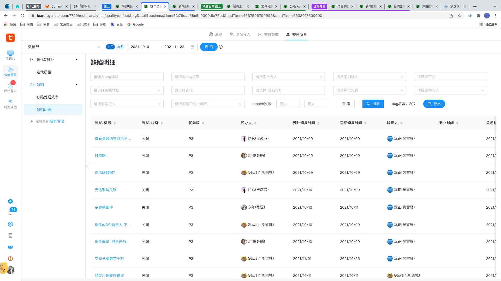

# 缺陷明细表单表格页面

- 控件改变 onchange 之后不查询 table，点击确定之后才查询 table

## 表单

表单的控件都是非受控的

- 表单控件

  - Input
  - Select
  - StaffSearchSelect：封装的模糊搜索组件（详细见`组件库self-use`）
  - Cascader：级联控件（两级
  - DoubleInputNumber：（详细见`组件库self-use`）

- 控件有涉及到控件联动（值、option 数据源）

## 表格

- 真分页
- 列排序

# 空间-迭代进展列表-表单表格页面

- 控件改变 onchange 后查询 table，无确定/查询按钮

## 表单

表单的控件都是非受控的

- 表单控件
  - PopSelect：封装的 select 组件， theme 支持 `'link' | 'option'`两种
