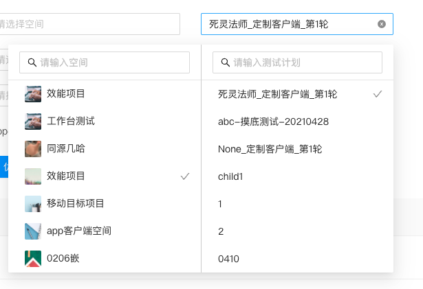
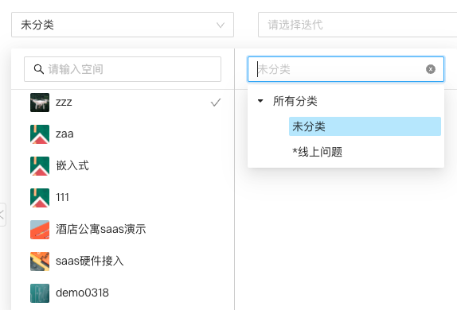

## Tips

Popover 的子元素是一个 select，该 select 只是显示值，唯一的操作就是点击清除 icon 清除值，且`open={false}`即不展示下拉框。Popover 的 content 是一个空间列表（props 传过来），点击某个空间，右侧资源列表开始请求。

- select： 请求空间下的测试计划列表
- treeselect： 请求空间下的 bug 分类 Tree 型数据

## UI

Popover 包裹 select 组件选择空间下测试计划如下


Popover 包裹 tree select 组件选择空间下 bug 分类如下



## 问题

1. Popover 入口子元素是个 Select，该 Select 唯一的操作就是点击清除 icon 清除值，开发过程中遇到一种异常，点击该 Select 的清除 icon 发现不仅清除了数据，还引起了 Popover 显示状态即 visible 值的取反，尝试多种方法：阻止事件冒泡、阻止默认行为都不能解决，只好搁置，先去做父子组件 value 值的传递管理，然后回头再试，上面描述的问题自己好了，即点击该 Select 的清除 icon 不会引起了 Popover 显示状态即 visible 值的改变。代码对比如下。

可以发现，通过 props.onChange 将值变化传递到父组件，再监听 props.value 更新子组件的 value 是可以解决显隐异常的问题的。

```diff
// diff
+  useEffect(() => {
+   setSelfValue(value?.title)
+   if (!value?.title) {
+      setSelectedProjectRightItem(undefined)
+    }
+  }, [value])

<div className="resource-list">
    {filteredCurProjectRightList?.map((item) => {
        return (
        <div
            key={item?.id}
            className="tag-item"
            onClick={() => {
                if (checked) {
                setSelectedProjectRightItem(undefined)
-                    setSelfValue(item?.title)
+                    onChange?.()
                    return
                }
                setSelectedProjectRightItem(item)
-               // setSelfValue(item?.title)
+               onChange?.({
                    ...item,
                    selectedProjectId: selectedProject?.id,
                })
            }}
        >
            <div>
            {item?.title}
            </div>
        </div>
        )
    })}
</div>


<PopoverSelect
  open={false}
  allowClear
  value={selfValue}
  className={className}
  placeholder={placeholder}
  onClick={(e) => {
    console.log("PopoverSelect onClick e :>> ", e);
    // e.preventDefault()
    // e.stopPropagation()
  }}
  onChange={(v) => {
    console.log("PopoverSelect onChange :>> ", v);
    setSelectedProjectRightItem(undefined);
-    setSelfValue(undefined)
+    onChange?.()
    // if (typeof v === 'undefined' && visible) {
    //   setVisible(false)
    // }
  }}
/>
```
