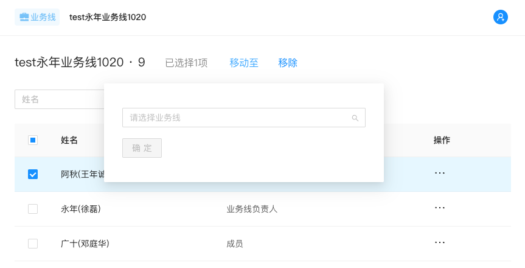
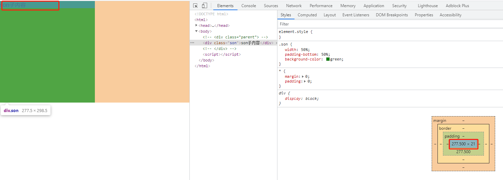
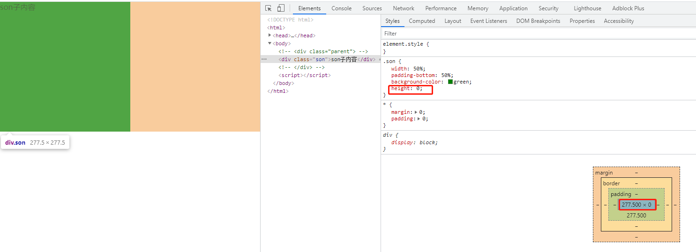
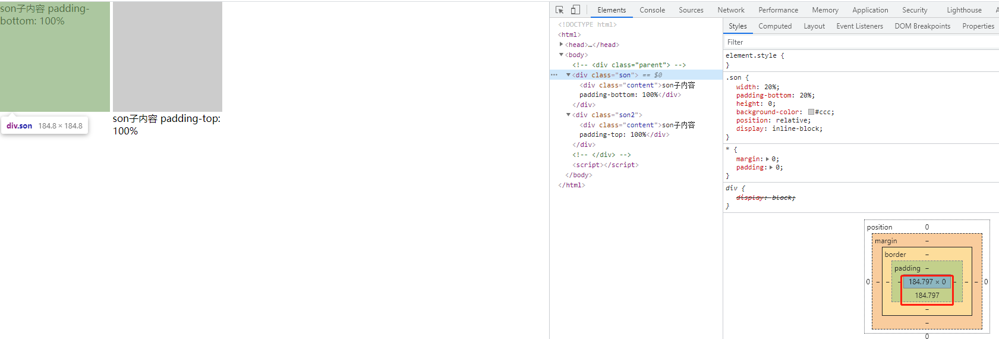
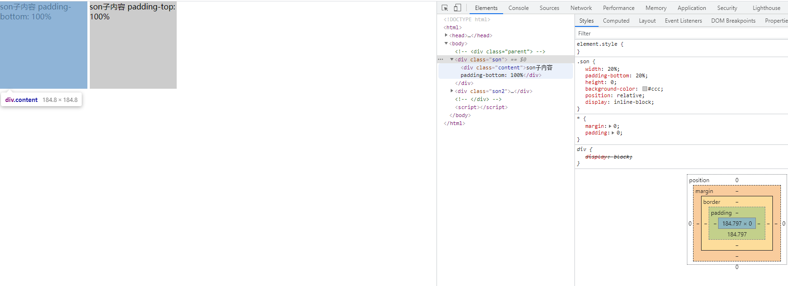

# 文本

## 文本超出显示省略号

文本显示一行，超出显示省略号，悬浮显示全部

```css
.oneLineTextWrap {
    white-space: nowrap;
    text-overflow: ellipsis;
    overflow: hidden;
    word-break: break-all;
}
```

```jsx
<div
  title={value}
  style={{ overflow: "hidden", textOverflow: "ellipsis", whiteSpace: "nowrap" }}
>
  //
  若Tooltip的children为全文本，则必须为div，为span的话，Tooltip没法显示在布局的正中间，而是文本的正中间（即使文本被hidden了），
  //
  但是这也解决还有一个问题，就是没有超出的时候Tooltip依旧显示在布局的正中间，而不是文本的正中间了
  <div style={{ width: "100%" }}>{value}</div>
</div>
```

```jsx
// 最终解决方法为：设置最大宽度为100%，ToolTip就能始终显示在文本的正中间，文本超出则显示在布局盒子的正中间

// .approval-item-title {
//   max-width: 100%; // 不设置宽度直接flex: 1 1 auto即可
//   display: inline-block;
//   overflow: hidden;
//   text-overflow: ellipsis;
//   white-space: nowrap;
// }

<Row>
  <Col span={4}>
    <Tooltip title={approvalItem?.approvalTitle}>
      <span
        className="approval-item-title"
        onClick={() => {
          props?.onClickDetail?.(approvalItem);
        }}
      >
        {approvalItem?.approvalTitle}
      </span>
    </Tooltip>
  </Col>

  <Col span={3} offset={1} className="status">
    {approvalItem?.approvalStatus}
  </Col>
</Row>
```

```jsx
// 解法方案一：flex布局，子项目长度可能很长超出显示省略号，悬浮显示Tooltip，不需要缩小的子项目就设置flex-shrink
const ApprovalITemCss = css`
  display: flex;
  align-items: center;
  padding: 10px;
  cursor: pointer;
  border-radius: 4px;
  transition: background-color 0.3s ease;

  .approval-processing {
    color: #0171c2;
  }
  .no-shrink {
    flex: 0 0 auto;
  }
  .text {
    overflow: hidden;
    text-overflow: ellipsis;
    white-space: nowrap;
  }
  .gap {
    margin-right: 16px;
  }
  .project-info {
    margin-left: 6px;
  }
  &:hover {
    background: #f7f7f7;
  }
`;

const ApprovalItem = (props) => {
  const { dashboard: lang } = useAppLocales();

  const { item } = props;
  return (
    <div css={ApprovalITemCss}>
      <Icon type="approval-process" className="gap approval-processing" />
      <div className="no-shrink gap">{lang?.myApproval}</div>
      <Tooltip title={item?.title}>
        <div className="text gap">{item?.title}</div>
      </Tooltip>
      <div className="text no-shrink gap">{item?.reviewDescription}</div>
      <div className="no-shrink">
        <ProjectSvg />
      </div>
      <div className="project-info text">{item?.projectName}</div>
    </div>
  );
};

export default ApprovalItem;
```

> **显示两行文本，超出第二行显示省略号**

```css
.twoLineTextWrap{
  overflow: hidden;
  text-overflow: ellipsis;
  display: -webkit-box;
  text-overflow: -o-ellipsis-lastline;
  line-clamp: 2;
  -webkit-line-clamp: 2;
  -webkit-box-orient: vertical;
}
```

## 静态字符串文本换行

```jsx
// 几个\n，就换几行
const info = '点击“全部成员”，可以根据角色来查看成员列表\n\n鼠标移过某个成员，右侧可以看到下拉图标，点击可以设置成员的角色\n权限说明：'


<Tooltip title={<div style={{ whiteSpace: 'pre-line' }}>{i18n.useInfo}</div>}>
  <InfoCircleOutlined />
</Tooltip>
```

## HTML 中多个空格却只显示一个的问题

- 方案一：使用字符`&nbsp;`代替空格。
- 方案二：设置 style 样式`white-space:pre`，浏览器会保留文本中的空格和换行。

# 滚动

## 点击事件后元素滚动进入视图

垂直/水平方向都支持
**垂直滚动：**

```js
const ele = <Card id={"member-detail"} />;
const toDetail = () => {
  const ele = document.getElementById("member-detail");

  if (ele) {
    ele.scrollIntoView({
      behavior: "smooth",
    });
  }
};
```

**水平滚动：**

```jsx
// 最后一列滚到视区
const scrollLastIntoView = useCallback(() => {
  if (isLastItem) {
    const ele = document.getElementById('last-item')
    if (ele) {
      ele?.scrollIntoView({
        behavior: 'smooth',
      })
    }
  }
}, [isLastItem])

useEffect(() => {
  scrollLastIntoView()
}, [scrollLastIntoView])

return (
      <FolderColumnItemWrapper id={isLastItem ? 'last-item' : ''}>
        <div className="folder-picker-handlers">
          <Tooltip title="创建文件夹">
            <FolderAddOutlined className="create-icon" onClick={undefined} />
          </Tooltip>
        </div>
      </FolderColumnItemWrapper>
    )
  },
```

# 滚动条

## 自定义滚动条样式

```css
::-webkit-scrollbar {
  display: none;
}
```

```css
/*滚动条整体宽高及背景 宽高分别对应横竖滚动条的尺寸*/
::-webkit-scrollbar {
  width: 8px;
  height: 8px;
}

/*滚动条滑块 圆角+内阴影*/
::-webkit-scrollbar-thumb {
  border-radius: 10px;
  background-color: rgba(0, 0, 0, 0.3);
}

/*滚动条轨道 圆角+内阴影*/
::-webkit-scrollbar-track {
  border-radius: 0;
  background-color: rgba(0, 0, 0, 0.1);
}
```

**【参考链接】**

- [React 设置自定义滚动条样式](https://blog.csdn.net/sg_knight/article/details/122689629)
- [用 CSS 修改滚动条样式](https://www.cnblogs.com/liulangbxc/p/15200433.html)

## 只修改某个类的滚动条样式

`.ClassName::-webkit-scrollbar` 即可实现让某个盒子有滚动效果，只是看不到滚动条。

```css
.LeftContextMenu {
  max-height: calc(100% - 40px);
  overflow-y: auto;
}

.LeftContextMenu::-webkit-scrollbar {
  width: 0px;
  height: 8px;
}
```
**【参考链接】**
- [3种方法实现CSS隐藏滚动条并可以滚动内容](https://mp.weixin.qq.com/s/R0wF45MiKZCZqw7I1wvAng)

# 点击

## CSS 实现禁止鼠标点击事件

```css
.disabled {
  pointer-events: none;
  cursor: default;
  opacity: 0.6;
}
```

**【参考链接】**

- [用纯 CSS 禁止鼠标点击事件](https://www.cnblogs.com/karajanking/p/5889300.html)

## 点击 a 元素 给 b 元素添加样式

**【最终做法】：** JS 实现

```tsx
// .high-light {
//   background-color: #fff;
//   transition: background-color 0.5s ease-in 0.5s;
//   animation: changebackgroundcolor 0.5s ease-in-out 0s 1 alternate running forwards;
// }

const intervalWorkloadRef = useRef < HTMLDivElement > null;

const onClickFormula = useCallback((ref: React.RefObject<HTMLDivElement>) => {
  ref?.current?.classList?.add("high-light");
  setTimeout(() => {
    ref?.current?.classList?.remove("high-light");
  }, 500);
}, []);

const Page = () => {
  return (
    <CanClickText onClick={() => onClickFormula(intervalWorkloadRef)}>
      {totalWorkDays ?? "-"}
    </CanClickText>
  );
};
```

**【简陋做法】：** CSS 实现，但是只是一瞬间，太短了

```css
a:hover .b {
  background: red;
}
```

## 按钮点击时（按下时，弹起就消失）的样式

设置按钮点击时候(按下的时候，弹起就消失了)的样式用`&:active{}`。

ps: 元素是 active 时，如何设置它的伪元素的样式。

```css
.AntdColInner {
  border: 1px solid #bfbfbf;
  display: flex;
  justify-content: center;
  align-items: center;
  position: relative;
  /* 正常显示时阴影在右下 */
  box-shadow: 1px 1px 1px 1px rgba(0, 0, 0, 0.35);
  will-change: transform;

  &:active {
    &::after {
      content: "";
      position: absolute;
      width: 94%;
      height: 80%;
      top: 50%;
      left: 50%;
      transform: translate(-50%, -50%);
      /* border: 1px dotted #4b4b4b; */
    }
    /* 鼠标点击按下时阴影在左上，并设置往左上移动1px */
    box-shadow: inset 1px 1px 1px 1px rgba(0, 0, 0, 0.35);
    transform: translate(1px, 1px);
  }
}
```

# 阴影

## 浮层 modalbox-shadow 效果

下面是 antd 的 popover 的 content 盒子的 box-shadow 样式

```css
.ant-popover-inner {
  background-color: #fff;
  background-clip: padding-box;
  border-radius: 2px;
  box-shadow: 0 3px 6px -4px rgba(0, 0, 0, 0.12), 0 6px 16px 0 rgba(0, 0, 0, 0.08),
    0 9px 28px 8px rgba(0, 0, 0, 0.05);
}
```



# 线条

## 画一条水平分隔直线

一个 li 实现的直线，作为两个 section 直接的分隔线

```css
.row-line {
  border-top: 1px solid #e5e5e5;
  margin: 4px 16px;
  display: block;
  list-style: none;
}
```

## 画一条垂直分隔直线

```css
.column-separator {
  margin: 0 16px;
  flex: 0 0 1px;
  height: 20px;
  background-color: #bfbfbf;
}
```

# 图形

## 纯 CSS 实现自适应正方形

> 方案一：CSS3 vw 单位

==CSS3 中新增了一组相对于可视区域百分比的长度单位 vw, vh, vmin, vmax==。其中 vw 是相对于视口宽度百分比的单位，1vw = 1% viewport width， vh 是相对于视口高度百分比的单位，1vh = 1% viewport height；==vmin 是相对当前视口宽高中较小的一个的百分比单位，同理 vmax 是相对当前视口宽高中较大的一个的百分比单位==。该单位浏览器兼容性如下（见原链接）。

代码如下，改变窗口大小， 正方形自适应变化。

- 优点：简洁方便
- 缺点：浏览器兼容不好

```html
<html>
  <head>
    <meta charset="UTF-8" />
    <meta name="viewport" content="width=device-width, initial-scale=1.0" />
    <style>
      * {
        margin: 0;
        padding: 0;
      }
      .son {
        width: 50%;
        height: 50vw;
        background-color: green;
      }
    </style>
  </head>
  <body>
    <div class="son">son子内容</div>
  </body>
</html>
```

> 方案二：设置垂直方向的 padding 撑开容器

在 CSS 盒模型中，一个比较容易被忽略的就是 margin, padding 的百分比数值计算。按照规定，**margin, padding 的百分比数值是相对 父元素的宽度计算的**。由此可以发现只需将元素垂直方向的一个 padding 值设定为与 width 相同的百分比就可以制作出自适应正方形了。

```html
<html>
  <head>
    <meta charset="UTF-8" />
    <meta name="viewport" content="width=device-width, initial-scale=1.0" />
    <style>
      * {
        margin: 0;
        padding: 0;
      }
      .son {
        width: 50%;
        padding-bottom: 50%;
        background-color: green;
      }
    </style>
  </head>
  <body>
    <div class="son">son子内容</div>
  </body>
</html>
```


代码及效果如上，可以发现，由于 div 内有文本内容导致 div 高度发生变化不再是正方形。为了解决这个问题，我们可以设置容器的高度为 0 即可。代码及效果如下。

```css
.son {
  height: 0;
}
```



这种方案简洁明了，且兼容性好；但是除了填充内容后会出现问题以外，还有可能碰上 max-height 不收缩的问题，于是第三种方案来了。

当前这种方案优化后如下：


运行之后我们发现写 padding-top 还是不可以，我们来检查代码发现，在写内层的 div 时候没有给 top，left 的值，让我们把 top，left 加上再看看，如下：

```html
<html>
  <head>
    <meta charset="UTF-8" />
    <meta name="viewport" content="width=device-width, initial-scale=1.0" />
    <style>
      * {
        margin: 0;
        padding: 0;
      }
      .son {
        width: 20%;
        padding-bottom: 20%;
        height: 0;
        background-color: #ccc;
        position: relative;
        display: inline-block;
      }
      .son2 {
        width: 20%;
        padding-top: 20%;
        height: 0;
        background-color: #ccc;
        position: relative;
        display: inline-block;
      }
      .content {
        position: absolute;
        width: 100%;
        height: 100%;
        top: 0; /* 新增 */
        left: 0; /* 新增 */
      }
    </style>
  </head>
  <body>
    <div class="son">
      <div class="content">son子内容 padding-bottom: 100%</div>
    </div>

    <div class="son2">
      <div class="content">son子内容 padding-top: 100%</div>
    </div>
  </body>
</html>
```



> 方案三：利用伪元素的 margin(padding)-top 撑开容器

在方案二中，我们利用百分比数值的 padding-bottom 属性撑开容器内部空间，但是这样做会导致在元素上设置的 max-height 属性失效。==而失效的原因是 max-height 属性只限制于 height，也就是只会对元素的 content height 起作用==。那么我们是不是能用一个子元素撑开 content 部分的高度，从而使 max-height 属性生效呢？我们来试试：

```css
.son {
  width: 100%;
}
.son:after {
  content: "";
  display: block;
  margin-top: 100%; /* margin 百分比相对父元素宽度计算 */
}
```

一刷新页面，啊嘞？怎么什么也没有？

这里就涉及到 margin collapse 的概念了，由于容器与伪元素在垂直方向发生了外边距折叠，所以我们想象中的撑开父元素高度并没有出现。而应对的方法是在父元素上触发 BFC：

```css
.son {
  overflow: hidden;
}
/* 注：若使用垂直方向上的 padding 撑开父元素，则不需要触发 BFC */
```

OK，父元素被撑起来了，我们再试一试设置 max-height：

完美！什么？你说元素内部添加内容时高度会溢出？(正方形内文字会溢出，溢出的高度正好就是文字所占空间的高度。)对于这样的情况，可以将内容放到独立的内容块中，利用绝对定位消除空间占用。如下：

```html
<html>
  <head>
    <meta charset="UTF-8" />
    <meta name="viewport" content="width=device-width, initial-scale=1.0" />
    <style>
      * {
        margin: 0;
        padding: 0;
      }
      .son {
        width: 20%;
        background-color: #ccc;
        overflow: hidden;
        position: relative;
      }
      .son:after {
        content: "";
        display: block;
        margin-top: 100%; /* margin 百分比相对父元素宽度计算 */
      }
      .content {
        position: absolute;
        width: 100%;
        height: 100%;
      }
    </style>
  </head>
  <body>
    <div class="son">
      <div class="content">son子内容</div>
    </div>
  </body>
</html>
```

> **总结：**

目前这三种制作自适应正方形的方案，抛去 CSS3 中的视口相对单位，==主要利用到 margin, padding 的百分比数值相对父元素的宽度计算得出来制作宽高相等、且相对视口宽度自适应的正方形==。如果需求是制作相对视口高度自适应的正方形，估计就只能使用 vh 单位了吧~

**参考链接：**

- [纯 CSS 实现自适应正方形](https://segmentfault.com/a/1190000009476303/)
- [纯 CSS 实现正方形、自适应正方形方法](https://blog.csdn.net/ztj771299799/article/details/79806769)
