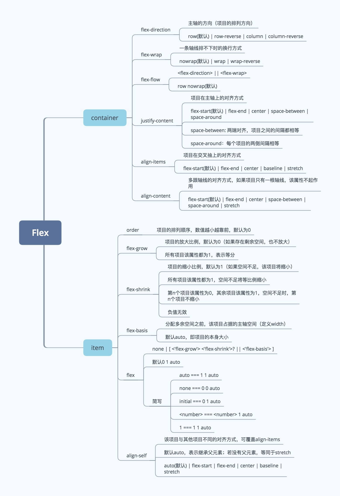

# 背景

网页布局（layout）是 CSS 的一个重点应用。

布局的传统解决方案，基于[盒状模型](https://developer.mozilla.org/zh-CN/docs/Web/CSS/box_model)，依赖 [`display`;](https://developer.mozilla.org/zh-CN/docs/Web/CSS/display) 属性 + [`position`](https://developer.mozilla.org/zh-CN/docs/Web/CSS/position)属性 + [`float`](https://developer.mozilla.org/zh-CN/docs/Web/CSS/float)属性。它对于那些特殊布局非常不方便，比如，[垂直居中](https://css-tricks.com/centering-css-complete-guide/)就不容易实现。

在 flex 出现之前，双列布局，三列布局，动态盒居中，绝对居中布局等常见的布局均是采用 `dispaly+float+定位`来布局的，一般包括以下几种布局策略：

- 1.`normal flow`(文档流:块级元素从上到下，行内元素从左到右)
- 2.`float + clear`
- 3.`position relative + absolute`
- 4.`display inline-block`
- 5.负 margin(扩大宽度，产生位移，如一行里的多个 column)

2009 年，W3C 提出了一种新的方案----Flex 布局，**可以简便、完整、响应式地实现各种页面布局**。目前，它已经得到了所有浏览器的支持，这意味着，现在就能很安全地使用这项功能。

# 定义

弹性盒子是 CSS3 的一种新的布局模式。
CSS3 弹性盒（ `Flexible Box` 或 `flexbox`），**是一种当页面需要适应不同的屏幕大小以及设备类型时确保元素拥有恰当的行为的布局方式**。

引入弹性盒布局模型的==目的是提供一种更加有效的方式来对一个容器中的子元素进行排列、对齐和分配空白空间==。

适用场景：弹性布局适合于移动前端开发，在 Android 和 ios 上也完美支持

## 内容

弹性盒子由弹性容器(`Flex container`)和弹性子元素(`Flex item`)组成。
弹性容器通过设置 `display` 属性的值为 `flex` 或 `inline-flex` 将其定义为弹性容器。弹性容器内包含了一个或多个弹性子元素。

## 特点

- 注意：**设为 Flex 布局以后，子元素的 `float`、 `clear`和 `vertical-align`属性将失效**。
- 注意：**弹性容器外及弹性子元素内是正常渲染的。弹性盒子只定义了弹性子元素如何在弹性容器内布局**。

# 思维导图

**【注意】：**

- 思维导图中的`item-flex-简写`中`<number> === <number> 1 auto`应该是`<number> === <number> 1 0%`
  

# 子项目 `flex` 属性值公式

flex 是 `flex-grow、flex-shrink、flex-basis` 的缩写。故其取值可以考虑以下情况：

- Flex 为单值：
  - `非负数字 = grow 1 0%`
  - `长度/% = 1 1 basic`
- Flex 为双值：
  - `非负数字 = grow shrink 0%`
  - `非负整数 长度/% = grow 1 basic`

## `initial = 0 1 auto`默认值

假设以上三个属性同样取默认值，则 flex 的默认值是 0 1 auto。同理，如下是等同的：

```css
.item {
  flex: 2333 3222 234px;
}
.item {
  flex-grow: 2333;
  flex-shrink: 3222;
  flex-basis: 234px;
}
```

## `none = 0 0 auto`

当 flex 取值为 none，则计算值为 0 0 auto，如下是等同的：

```css
.item {
  flex: none;
}
.item {
  flex-grow: 0;
  flex-shrink: 0;
  flex-basis: auto;
}
```

## `auto = 1 1 auto`

当 flex 取值为 auto，则计算值为 1 1 auto，如下是等同的：

```css
.item {
  flex: auto;
}
.item {
  flex-grow: 1;
  flex-shrink: 1;
  flex-basis: auto;
}
```

## `非负数字 = grow 1 0%`

当 flex 取值为一个非负数字，则该数字为 flex-grow 值，flex-shrink 取 1，flex-basis 取 0%，如下是等同的：

```css
.item {
  flex: 1;
}
.item {
  flex-grow: 1;
  flex-shrink: 1;
  flex-basis: 0%;
}
```

## `长度或百分比 = 1 1 basic`

当 flex 取值为一个长度或百分比，则视为 flex-basis 值，flex-grow 取 1，flex-shrink 取 1，有如下等同情况（注意 0% 是一个百分比而不是一个非负数字）：

```css
.item-1 {
  flex: 0%;
}
.item-1 {
  flex-grow: 1;
  flex-shrink: 1;
  flex-basis: 0%;
}
.item-2 {
  flex: 24px;
}
.item-1 {
  flex-grow: 1;
  flex-shrink: 1;
  flex-basis: 24px;
}
```

## `2个非负数字=grow shrink 0%`

当 flex 取值为两个非负数字，则分别视为 flex-grow 和 flex-shrink 的值，flex-basis 取 0%，如下是等同的：

```css
.item {
  flex: 2 3;
}
.item {
  flex-grow: 2;
  flex-shrink: 3;
  flex-basis: 0%;
}
```

## `非负数字+长度/百分比=grow 1 basic`

当 flex 取值为两个非负数字，则分别视为 flex-grow 和 flex-shrink 的值，flex-basis 取 0%，如下是等同的：

```css
.item {
  flex: 2333 3222px;
}
.item {
  flex-grow: 2333;
  flex-shrink: 1;
  flex-basis: 3222px;
}
```

# Tips

- 设置 flex 布局有时候可以解决元素 width 没法设置 100%(即跟父元素保持一致)问题

## 关于 flex-basis 的默认取值过程

`flex-basis` 规定的是子元素的基准值。所以是否溢出的计算与此属性息息相关。`flex-basis` 规定的范围取决于 `box-sizing`。这里主要讨论以下 `flex-basis` 的取值情况：

- `auto`：首先检索该子元素的主尺寸，如果主尺寸不为 `auto`，则使用值采取主尺寸之值；如果也是 `auto`，则使用值为 `content`。

- `content`：指根据该子元素的内容自动布局。有的用户代理没有实现取 `content` 值，等效的替代方案是 `flex-basis` 和主尺寸都取 `auto`。

- `百分比`：根据其包含块（即伸缩父容器）的主尺寸计算。如果包含块的主尺寸未定义（即父容器的主尺寸取决于子元素），则计算结果和设为 `auto` 一样。

**【参考链接】：**

- [(2021-08-19)flex-basis 中 0 和 auto 区别](https://juejin.cn/post/6997802025614327838)
- [@@(2016-01-12)【CSS 趣味】flex 缺省的 auto 跟 0 到底有何区别](https://segmentfault.com/a/1190000004288826)
- [@(2021-05-28)flex: 1 flex: auto flex: none flex: 0 到底有什么 区别 ？使用场景？](https://juejin.cn/post/6967177565458923557)

# 参考链接

- [(2015-07-10)阮一峰-Flex 布局教程：语法篇](https://www.ruanyifeng.com/blog/2015/07/flex-grammar.html)
- [(2015-07-14)阮一峰 Flex 布局教程：实例篇](https://www.ruanyifeng.com/blog/2015/07/flex-examples.html)
- [@@@有源码(2018-07-29)Flex 布局](https://www.jianshu.com/p/8c10bc11a13b)
- [@@(2019-02-26)思维导图-简单明了总结 flex 布局](https://juejin.cn/post/6844903782984187911)
- [(2018-04-02)【基础知识】Flex-弹性布局](https://juejin.cn/post/6844903586841755655)
- [使用 flex 实现 5 种常用布局](https://juejin.cn/post/6844903517241491463#heading-0)
  - [使用 flex 实现 5 种常用布局](https://blog.csdn.net/weixin_34152820/article/details/88922900)

`Demo F:\web\web学习\web笔记\阮一峰React 技术栈系列教程\ Flex布局教程 和 css3弹性盒子`
