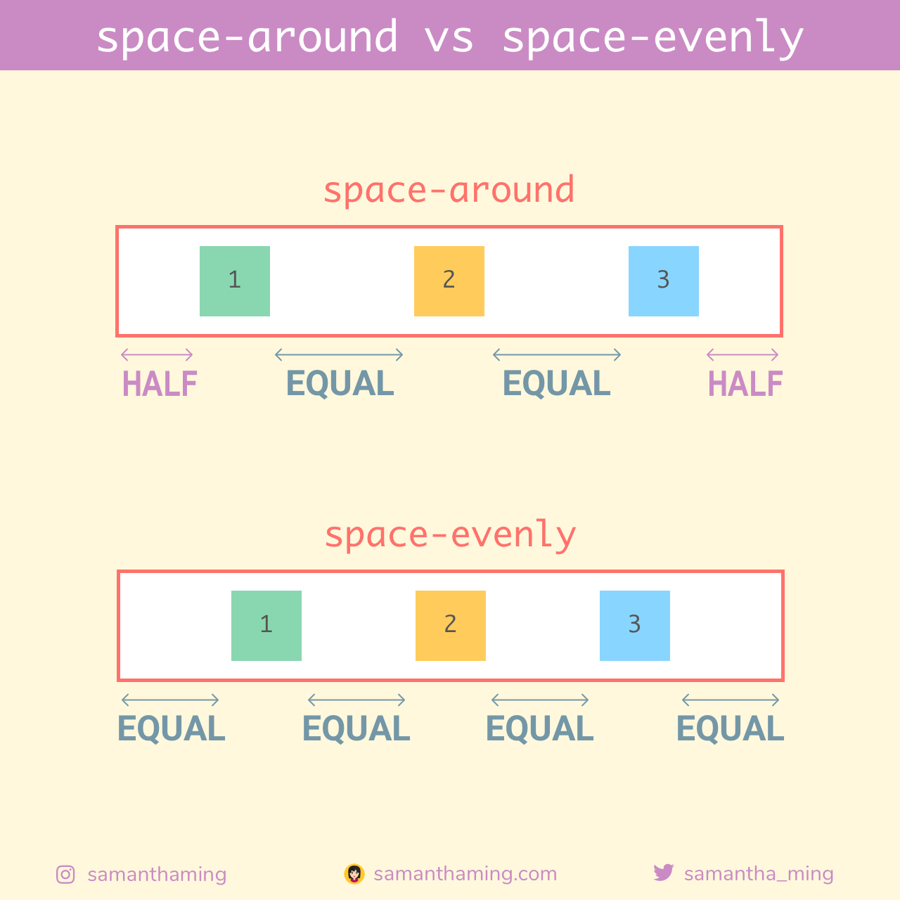

# CSS3 简介

> **定义：**

CSS3 语言开发是朝着模块化发展的。CSS3 是最新的 CSS 标准。

> **有哪些新特性：**

- 1. 新增特效

  - 圆角（border-radius）
  - 阴影（box-shadow）
  - 文字加特效（text-shadow）
  - 线性渐变（gradent）
  - 变形 (transform:)
    - rotate(9deg) // 旋转
    - scale(0.85,0.90) // 缩放
    - translate(0px,-30px) // 定位
    - skew(-9deg,0deg) // 倾斜
  - RGBA
  - opacity 透明度

- 2. 增加了更多的 CSS 选择器，新增媒体查询
- 3. 新增了一种盒模型计算方式，默认是 content-box，新增了 border-box

# 长度单位（vh、vw、rem）

> **vw、vh、vmin、vmax：**

vh、vw、vmin、vmax 这四个单位都是基于视口的。

- vw、vh
  vw 是相对视口（viewport）的宽度而定的，长度等于视口宽度的 1/100。假如浏览器的宽度为 200px，那么 1vw 就等于 2px（200px/100）。
  vh 是相对视口（viewport）的高度而定的，长度等于视口高度的 1/100。假如浏览器的高度为 500px，那么 1vh 就等于 5px（500px/100）。

- vmin、vmax
  vmin 和 vmax 是相对于视口的高度和宽度两者之间的最小值或最大值。如果浏览器的高为 300px、宽为 500px，那么 1vmin 就是 3px，1vmax 就是 5px；如果浏览器的高为 800px，宽为 1080px，那么 1vmin 也是 8px，1vmax 也是 10.8px。

> **rem：以根元素 html 标签来计算（浏览器默认字体大小，一般是 16px）：**

rem 是相对于根元素（html）的字体大小（font-size）来计算的长度单位。

注意：==由于浏览器默认最小字体大小的限制==，如果设置的根元素字体大小小于默认最小字体大小，那么就会以默认最小字体大小设置根元素。比如：在 chrome 中，最小字体大小是 12px，如果你设置的字体大小小于 12px，还是会以 12px 设置：

```css
html {
  font-size: 62.5%;
}
/* 16px*62.5% = 10px */
body {
  font-size: 1.4rem;
} /* 1.4rem*12px = 16.8px */

// 本意设置 body 的字体大小为 14px，可是实际上却是 16.8px，就是因为 10px 小于 12px，所以采取了 12px。
```

> **rem 与 em 的区别：**

- rem 是相对于根元素（html）的字体大小，而 em 是相对于其父元素的字体大小
- em 最多取到小数点的后三位
- 元素自身设置了字体大小，em 则参照自己的字体大小

```html
<style>
    html{ font-size: 20px; }
    body{ 
      font-size: 1.4rem;  /* 1rem = 20px * 1.4 = 28px */
      padding: 0.7rem;  /* 0.7rem = 20px * 0.7 = 14px */
    } 
    div{
      /* 元素自身无font-size，em就看父元素的font-size */
      padding: 1em;  /* 1em = 28px * 1 = 28px */
    }
    span{
      /* 元素自身有font-size，em就看自己的font-size */
      font-size:1rem;  /* 1rem = 20px * 1 = 20px */
      padding: 0.9em;  /* 0.9em = 20px * 0.9 = 18px */
    }
</style>
<html>
  <body>
    <div><span></span></div>
  </body>
</html>
```

- 基于上面这些原因，个人更倾向于使用 rem，因为 em 使用不当的话，当出现多层继承时，会很容易混淆。

```html
<style>
    html{ font-size: 20px; }
    body{ 
      font-size: 0.9em;  /* 1rem = 20px * 0.9 = 18px */
    } 
    div{
      font-size: 0.8em;  /* 1em =18px * 0.8 =  14.4px */
    }
    span{
      font-size: 0.9em;  /* 1rem = 14.4px * 0.9 = 12.96px */
    }
</style>

<html>
  <body>
    <div><span></span></div>
  </body>
</html>
```

基于上面这些原因，个人更倾向于使用 rem，因为 em 使用不当的话，当出现多层继承时，会很容易混淆，比如上例。
看到没有，使用 em 时，如果其祖先元素都是用了 em，那么就会像上面一样，body 继承其父元素 html 的字体大小，而 div 又继承其父元素 body 的字体大小，而 span 又继承其父元素 div 的字体大小，最终 span 的字体大小最终是 12.96px（20 × 0.9 ×0.8 × 0.9）。
而 rem 总是相对于根元素（html）的，也就是说，不管哪里使用了 rem 单位，都是根元素的字体大小 × 数字，由浏览器转为像素值。

# RGBA

> **CSS 中的颜色有三种定义方式：**

- 使用颜色方法（RGB、RGBA、HSL、HSLA）
- 十六进制颜色值
- 预定义的颜色名称

RGBA 是代表 Red（红色） Green（绿色） Blue（蓝色）和 Alpha（不透明度）三个单词的缩写。RGBA 颜色值是 RGB 颜色值的扩展，带有一个 alpha 通道 - 它规定了对象的不透明度。

# 弹性盒子：Flex Box

## 其它

> 【1】**space-around 和 space-evenly 的区别**

`space-evenly`，flex 元素之间和 flex 元素和容器的空间总是相等的，space-around，只有 flex 元素之间的空间是相等的，第一个 flex 元素和最后一个 flex 元素和容器的空间是 flex 元素间空间的一半，如下图。



**参考链接：**

- [space-around 和 space-evenly 的区别
  ](https://www.chenzhicheng.com/space-around-vs-space-evenly/)

# 参考链接

- [个人总结（css3 新特性）](https://segmentfault.com/a/1190000010780991)

```

```
