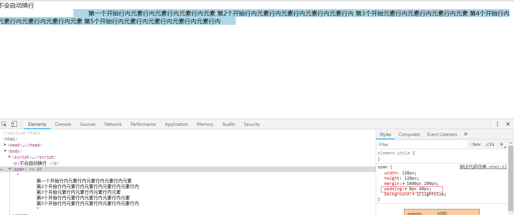
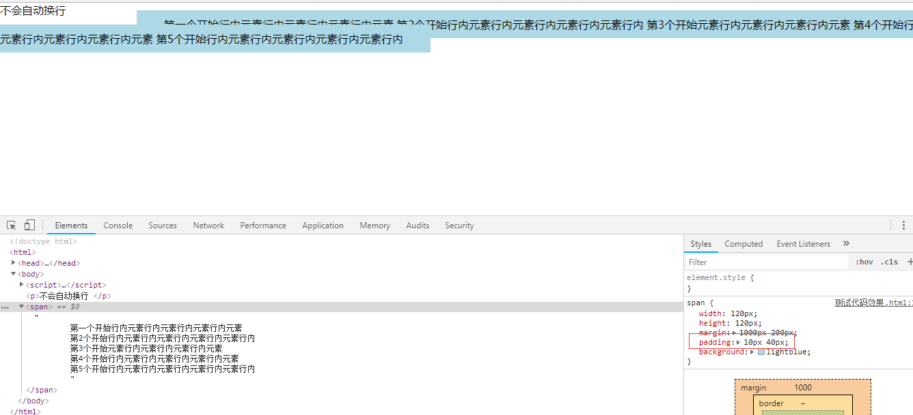
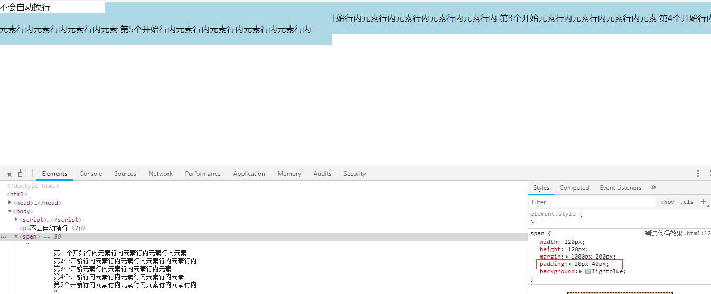
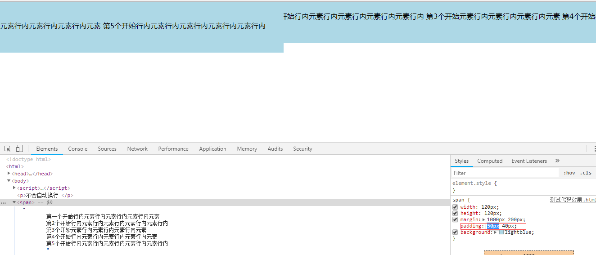
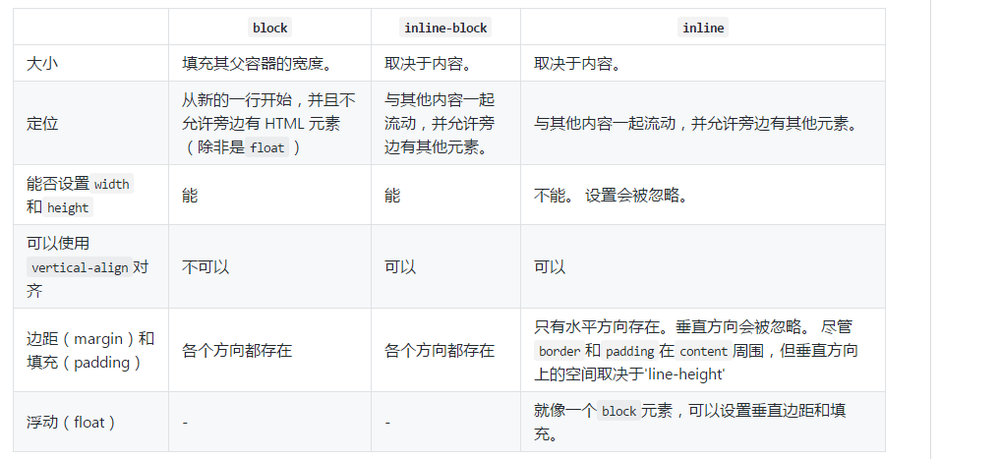
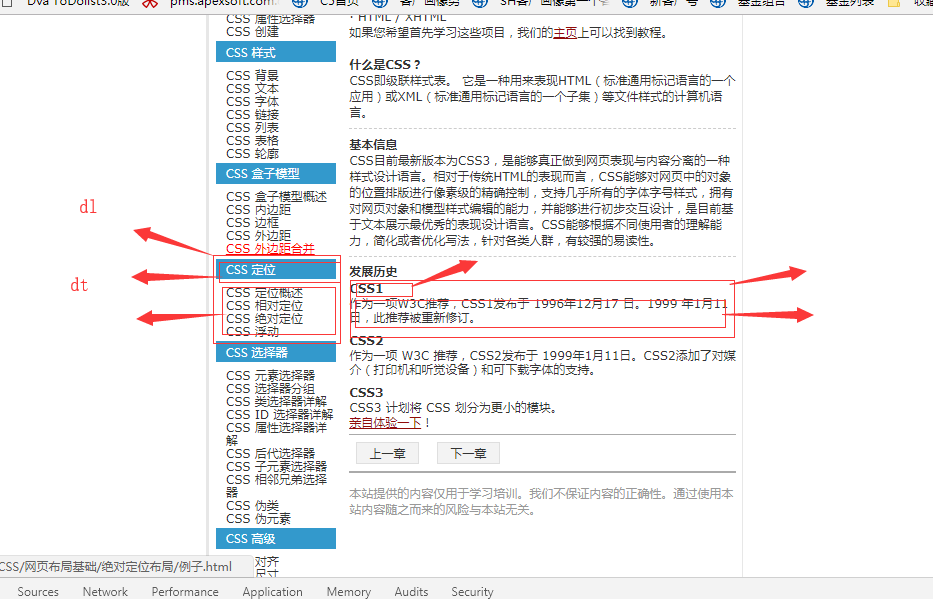
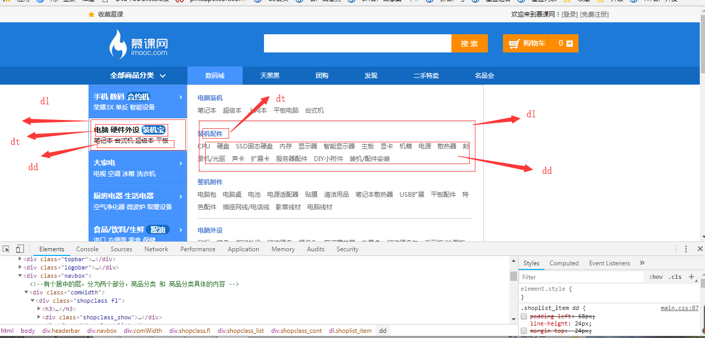
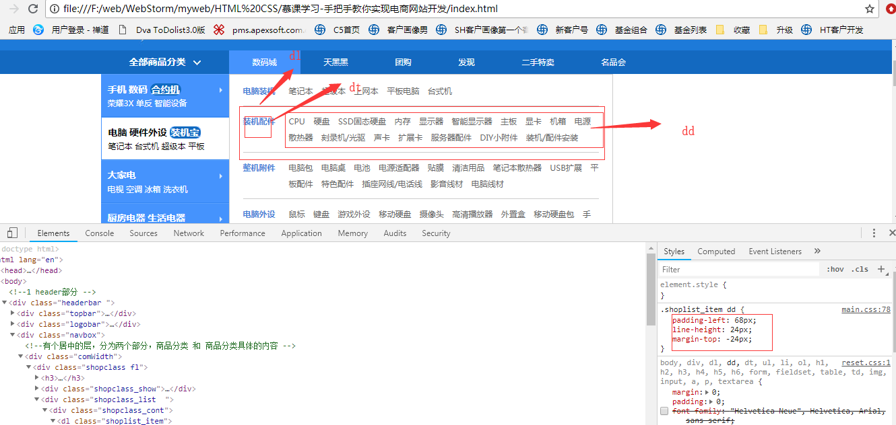
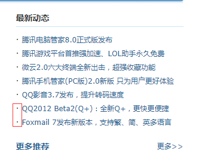

# HTML

## 简介

> **定义：**
> HTML 是指超文本标记语言( Hyper Text Markup Language)
> HTML 不是一种编程语言，而是一种标记语言(标记语言是一套标记标签  (markup tag))
> HTML 使用标记标签来描述网页
> HTML 文档包含了 HTML  标签及文本内容，也叫做  web 页面

## 元素

### 行内元素

行内元素多为描述性标记，行内元素最常使用的就是 `<span>`，还有`<sub>`和`<sup>`这两个标签可以直接做出平方的效果，而不需要类似移动属性的帮助，很实用。

```js
<span>...</span>
<a>...</a>  // 链接
<br/>   // 换行
<strong>...</strong>  // 加粗
  // 图片
<sup>...</sup> // 上标
<sub>...</sub> // 下标
<i>...</i> // 斜体
<em>...</em> // 斜体
<del>...</del>  // 删除线
<u>...</u>  // 下划线
<input>...</input>  // 文本框
<textarea>...</textarea>  // 多行文本
<select>...</select>  // 下拉列表
```

> **行内元素特征**

- 设置宽高无效
- 只有水平方向存在。垂直方向会被忽略。 尽管 border 和 padding 在 content 周围，但垂直方向上的空间取决于`line-height`
- 水平排列，不会自动进行换行
  如下图，可以看到，文字虽然换行了，但是每一行的 padding 也会起效果，即相当于没换行
  
  
  
  

### 块级元素

块级元素大多为结构性标记，块状元素代表性的就是 div，其他如 p、nav、aside、header、footer、section、article、ul-li、address 等等，都可以用 div 来实现。不过为了可以方便程序员解读代码，一般都会使用特定的语义化标签，使得代码可读性强，且便于查错。

```js
<address>...</adderss>   
  <center>...</center>  // 地址文字
  <h1>...</h1>  // 标题一级
  <h2>...</h2>  // 标题二级
  <h3>...</h3>  // 标题三级
  <h4>...</h4>  // 标题四级
  <h5>...</h5>  // 标题五级
  <h6>...</h6>  // 标题六级
  <hr />  // 水平分割线
  <p>...</p>  // 段落
  <pre>...</pre> // 预格式化
  <blockquote>...</blockquote>  // 段落缩进   前后5个字符
  <marquee>...</marquee> // 滚动文本
  <ul>...</ul>  // 无序列表
  <ol>...</ol>  // 有序列表
  <dl>...</dl>  // 定义列表
  <table>...</table>  // 表格
  <form>...</form>  // 表单
  <div>...</div>
```

> **块级元素特征**

- 能够识别宽高
- margin 和 padding 的上下左右均对其有效
- 可以自动换行
- 多个块状元素标签写在一起，默认排列方式为从上至下

### 行内块级元素

行内块状元素综合了行内元素和块状元素的特性，但是各有取舍。因此行内块状元素在日常的使用中，由于其特性，使用的次数也比较多。

> **行内块级元素特征**

- 能够识别宽高
- 不自动换行
- 默认排列方式为从左到右
  

## 标签

### `<meta>`

> **定义:**
> 元数据（metadata）是关于数据的信息。标签提供关于 HTML 文档的元数据。元数据不会显示在页面上，但是对于机器是可读的。典型的情况是，meta 元素被用于规定页面的描述、关键词、文档的作者、最后修改时间以及其他元数据。标签始终位于 head 元素中。元数据可用于浏览器（如何显示内容或重新加载页面），搜索引擎（关键词），或其他 web 服务。

简单总结下就是：<meta> 标签提供关于 HTML 文档的元数据。它不会显示在页面上，但是对于机器是可读的。可用于浏览器（如何显示内容或重新加载页面），搜索引擎（关键词），或其他 web 服务。

> **作用:**
> meta 里的数据是供机器解读的，告诉机器该如何解析这个页面，还有一个用途是可以添加服务器发送到浏览器的 http 头部内容

> **实例:**

我们可以借助<meta>元素的 viewport 来帮助我们设置视口、缩放等，从而让移动端得到更好的展示效果。

```js
<meta name="viewport" content="width=device-width; initial-scale=1; maximum-scale=1; minimum-scale=1; user-scalable=no;">
```

| value         | 可能值                 | 描述                                                  |
| ------------- | ---------------------- | ----------------------------------------------------- |
| width         | 正整数或 device-width  | 以 pixels(像素)为单位，定义布局视口的宽度             |
| height        | 正整数或 device-height | 以 pixels(像素)为单位，定义布局视口的高度             |
| initial-scale | 0.0-10.0               | 定义页面初始缩放比率                                  |
| minimum-scale | 0.0-10.0               | 定义缩放的最小值：必须小于或等于 maximum-scale 的值   |
| maximum-scale | 0.0-10.0               | 定义缩放的最大值：必须大于或等于 minimum-scale 的值   |
| user-scalable | yes/no                 | 如果设置成 no，用户将不能放大或缩小网页，默认值为 yes |

### `<dl>`：描述列表，键值对列表

<dl> 标签代表一个描述列表。该标签的常用用途是实现词汇表或显示元数据（键值对列表）

> **实例:**

如下图，左边的导航菜单和右边的发展历史。也都是`dl`包裹着`dt`和`dd`。


如下图，

右边的类型的 dt 是在上层，dd 是在下层，如何让 dd 跑到 dt 的右边呢，
给 dd 设置一个 margin-top: -xx，设置一个 padding-left:xx,如下图


### `<embed>`：页面中嵌入内容

如下嵌入优酷视频

```html
<div class="video_content">
  <embed src="http://player.youku.com/player.php/sid/XNjkzMDE5MTUy/v.swf" allowFullScreen="true" quality="high" width="220" height="140" align="middle" allowScriptAccess="always" type="application/x-shockwave-flash"></embed>
</div>
```

### `<hr>`：水平线

`<hr>`标签的显示上是一条水平线，效果在视觉上将文档分割成各个部分。
`<hr>`标签是单标签（空标签），没有元素内容，只是显示为一条水平线，表示话题的转移。

### `<iframe>`：内联框架

一个内联框架被用来在当前 HTML 文档中嵌入另一个文档。

### `<ul>`：无序列表

首页的导航一般都是 ul

```html
<ul>
  <li>咖啡</li>
  <li>茶</li>
  <li>牛奶</li>
</ul>
```

## 效果

### 1、如何显示小点

```html
<body>
  <li>&middot; <a href="#">腾讯游戏平台首推强加速、LOL助手永久免费</a></li>
</body>
```



### 2、html 和 css 处理空格符

- html 中空格

|            |          |                            |
| ---------- | -------- | -------------------------- |
| `&nbsp;`   | `&#160`  | 不断行的空白(1 个字符宽度) |
| `&ensp;`   | `&#8194` | 半个空白(1 个字符宽度)     |
| `&emsp;`   | `&#8195` | 一个空白(2 个字符宽度)     |
| `&thinsp;` | `&#8201` | 窄空白(小于 1 个字符宽度)  |

| 实体名称   |         | 显示结果 | 描述 |
| ---------- | ------- | -------- | ---- |
| `&amp;`    | `&#38`  | `&`      | 和号 |
| `&lt;`     | `&#60`  | `<`      |
| `&gt;`     | `&#62`  | `>`      |
| `&quot;`   | `&#34`  | `"`      |
| `&qpos;`   | `&#39`  | `'`      |
| `&copy;`   | `&#169` | `©`      | 版权 |
| `&times;`  | `&#215` | `×`      | 乘号 |
| `&divide;` | `&#247` | `÷`      | 除号 |

- css 的方式空格
  - css 中当 `white-space` 属性取值为 pre 时，浏览器会保留文本中的空格和换行
    `<div style="white-space:pre">AA BB<div>`
    显示效果为： AA   BB
  - CSS 的 `letter-spacing` 属性用于设置文本中字符之间的间隔
    `<div style="letter-spacing:5px;">欢迎光临！</div>`
    显示效果为：  欢     迎    光    临    ！
  - css 的 `word-spacing` 属性用于设置文本中单词之间的间隔
    `<div style="word-spacing:5px">Happy new year!</div>`
    显示效果为： Happy   new   year!

### 3、如何显示平方米

`㎡`
显示面积单位是平方米，如何显示，用`m<sup>2</sup>`: m<sup>2</sup>无效，直接从网页找个例子，复制到代码中就好了

# HTML5

## 简介

> **定义：** HTML5 是下一代 HTML 标准

> **HTML5 有哪些新特性：**

主要是关于图像，位置，存储，多任务等功能的增加。

- 1.用于绘画的 canvas 元素
- 2.多媒体元素 vedio、audio、embed。
- 3.本地离线存储（localstorage 和 sessionStorage）
- 4.语义化更好的元素（article（定义页面独立的内容区域），aside（定义页面的侧边栏- 内容。），header（定义了文档的头部区域），footer（定义 section 或 document 的页脚。），nav（定义导航链接的部分。），section（定义文档中的节（section、区段）- ），main，figure 等）
- 5.表单控件（calendar，date，time，email，url，search）
- 6.新的技术，webworker，websockt

> **HTML5 移除了哪些元素：**

- 1.纯表现的元素：u(下划线) s（穿过的中间线） big center（用 textAlign-center 替代了）basefont（设置默认字体，大小，颜色，css 替代了）
- 2.对可用性产生影响的元素，frame（定义子窗口（框架）），frameset，noframes，（iframe 一个内联框架被用来在当前 HTML 文档中嵌入另一个文档）

> **HTML5 浏览器支持：**

现代的浏览器都支持 HTML5。
此外，所有浏览器，包括旧的和最新的，对无法识别的元素会作为内联元素自动处理。
正因为如此，你可以 "教会" 浏览器处理 "未知" 的 HTML 元素

- 1.将 HTML5 元素定义为块元素,为了能让旧版本的浏览器正确显示这些元素，你可以设置 CSS 的 display 属性值为 block。
- 2.为 HTML 添加新元素。
- 3.JavaScript 语句  document.createElement("myHero")  是为了为 IE 浏览器添加新的元素。

## 新增

## 地理定位

HTML5 Geolocation（地理定位）用于定位用户的位置。
Geolocation 通过请求一个位置信息，用户同意后，浏览器会返回一个包含经度和维度的位置信息！

## vedio

control 属性供添加播放、暂停和音量控件

```html
<vedio width="320" height="240" controls>
  <source src="xxx" type="vedio/mp4" />
</vedio>
```

## audio

```html
<audio width="320" height="240" controls>
  <source src="”xxx”" type="audio/ogg" />
</audio>
```

## 新的语义/结构元素


## web-workers

**HTML5 Web Workers**
web worker 是运行在后台的 JavaScript，不会影响页面的性能，更好的解释是，你可以使用 web worker 提供的一种简单的方法来为 web 内容在后台线程中运行脚本，这些线程在执行任务的过程中并不会干扰用户界面！

**什么是 Web Worker？**
当在 HTML 页面中执行脚本时，页面的状态是不可响应的，直到脚本已完成。

`web worker 是运行在后台的 JavaScript，独立于其他脚本，不会影响页面的性能`。您可以继续做任何愿意做的事情：点击、选取内容等等，而此时 web worker 在后台运行。

## Flex 弹性布局

[简单明了总结 flex 布局](https://juejin.cn/post/6844903782984187911)
[flex 思维导图](https://user-gold-cdn.xitu.io/2019/2/26/16927612eee6be1a?imageView2/0/w/1280/h/960/format/webp/ignore-error/1)

`F:\web\web学习\web笔记\阮一峰React 技术栈系列教程\ Flex布局教程 和 css3弹性盒子`

- 设置 flex 布局有时候可以解决元素 width 没法设置 100%(即跟父元素保持一致)问题

## SVG

> **什么是 SVG？：**

SVG 指可伸缩矢量图形 (Scalable Vector Graphics)
SVG 用于定义用于网络的基于矢量的图形
SVG 使用 XML 格式定义图形
SVG 图像在放大或改变尺寸的情况下其图形质量不会有损失

> **SVG 优势：**

与其他图像格式相比（比如 JPEG 和 GIF），使用 SVG 的优势在于：

- SVG 图像可通过文本编辑器来创建和修改
- SVG 图像可被搜索、索引、脚本化或压缩
- SVG 是可伸缩的
- SVG 图像可在任何的分辨率下被高质量地打印
- SVG 可在图像质量不下降的情况下被放大

> **SVG 与 Canvas 两者间的区别：**

SVG 是一种使用 XML 描述 2D 图形的语言。
Canvas 通过 JavaScript 来绘制 2D 图形。
SVG 基于 XML，这意味着 SVG DOM 中的每个元素都是可用的。您可以为某个元素附加 JavaScript 事件处理器。
在 SVG 中，每个被绘制的图形均被视为对象。如果 SVG 对象的属性发生变化，那么浏览器能够自动重现图形。
Canvas 是逐像素进行渲染的。在 canvas 中，一旦图形被绘制完成，它就不会继续得到浏览器的关注。如果其位置发生变化，那么整个场景也需要重新绘制，包括任何或许已被图形覆盖的对象。

> **Canvas 与 SVG 的比较：**

Canvas

- 依赖分辨率
- 不支持事件处理器
- 弱的文本渲染能力
- 能够以 .png 或 .jpg 格式保存结果图像
- 最适合图像密集型的游戏，其中的许多对象会被频繁重绘

SVG

- 不依赖分辨率
- 支持事件处理器
- 最适合带有大型渲染区域的应用程序（比如谷歌地图）
- 复杂度高会减慢渲染速度（任何过度使用 DOM 的应用都不快）
- 不适合游戏应用

## Canvas

`<canvas>` 标签是 HTML5 中新定义的标签，它是一个画布标签，只是作为一个图形容器，必须使用脚本来绘制图形。
