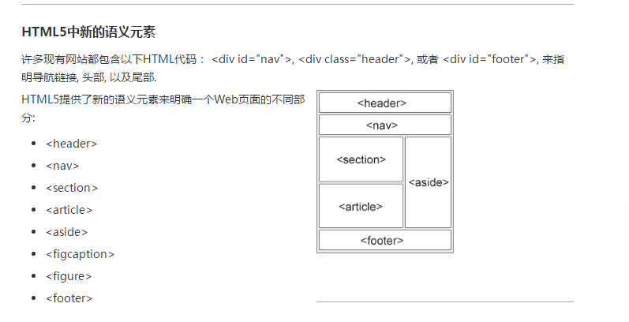

# HTML5

## 简介

> **定义：** HTML5 是下一代 HTML 标准

> **HTML5 有哪些新特性：**

主要是关于图像，位置，存储，多任务等功能的增加。

- 1.用于绘画的 canvas 元素
- 2.多媒体元素 vedio、audio、embed。
- 3.本地离线存储（localstorage 和 sessionStorage）
- 4.语义化更好的元素（article（定义页面独立的内容区域），aside（定义页面的侧边栏- 内容。），header（定义了文档的头部区域），footer（定义 section 或 document 的页脚。），nav（定义导航链接的部分。），section（定义文档中的节（section、区段）- ），main，figure 等）
- 5.表单控件（calendar，date，time，email，url，search）
- 6.新的技术，webworker，websockt

> **HTML5 移除了哪些元素：**

- 1.纯表现的元素：u(下划线) s（穿过的中间线） big center（用 textAlign-center 替代了）basefont（设置默认字体，大小，颜色，css 替代了）
- 2.对可用性产生影响的元素，frame（定义子窗口（框架）），frameset，noframes，（iframe 一个内联框架被用来在当前 HTML 文档中嵌入另一个文档）

> **HTML5 浏览器支持：**

现代的浏览器都支持 HTML5。
此外，所有浏览器，包括旧的和最新的，对无法识别的元素会作为内联元素自动处理。
正因为如此，你可以 "教会" 浏览器处理 "未知" 的 HTML 元素

- 1.将 HTML5 元素定义为块元素,为了能让旧版本的浏览器正确显示这些元素，你可以设置 CSS 的 display 属性值为 block。
- 2.为 HTML 添加新元素。
- 3.JavaScript 语句  document.createElement("myHero")  是为了为 IE 浏览器添加新的元素。

# 特性

## 地理定位

HTML5 Geolocation（地理定位）用于定位用户的位置。
Geolocation 通过请求一个位置信息，用户同意后，浏览器会返回一个包含经度和维度的位置信息！

## vedio

control 属性供添加播放、暂停和音量控件

```html
<vedio width="320" height="240" controls>
  <source src="xxx" type="vedio/mp4" />
</vedio>
```

## audio

```html
<audio width="320" height="240" controls>
  <source src="”xxx”" type="audio/ogg" />
</audio>
```

## 新的语义/结构元素



## web-workers

**HTML5 Web Workers**
web worker 是运行在后台的 JavaScript，不会影响页面的性能，更好的解释是，你可以使用 web worker 提供的一种简单的方法来为 web 内容在后台线程中运行脚本，这些线程在执行任务的过程中并不会干扰用户界面！

**什么是 Web Worker？**
当在 HTML 页面中执行脚本时，页面的状态是不可响应的，直到脚本已完成。

`web worker 是运行在后台的 JavaScript，独立于其他脚本，不会影响页面的性能`。您可以继续做任何愿意做的事情：点击、选取内容等等，而此时 web worker 在后台运行。

## Flex 弹性布局

[简单明了总结 flex 布局](https://juejin.cn/post/6844903782984187911)
[flex 思维导图](https://user-gold-cdn.xitu.io/2019/2/26/16927612eee6be1a?imageView2/0/w/1280/h/960/format/webp/ignore-error/1)

`F:\web\web学习\web笔记\阮一峰React 技术栈系列教程\ Flex布局教程 和 css3弹性盒子`

- 设置 flex 布局有时候可以解决元素 width 没法设置 100%(即跟父元素保持一致)问题

## SVG

> **什么是 SVG？：**

SVG 指可伸缩矢量图形 (Scalable Vector Graphics)
SVG 用于定义用于网络的基于矢量的图形
SVG 使用 XML 格式定义图形
SVG 图像在放大或改变尺寸的情况下其图形质量不会有损失

> **SVG 优势：**

与其他图像格式相比（比如 JPEG 和 GIF），使用 SVG 的优势在于：

- SVG 图像可通过文本编辑器来创建和修改
- SVG 图像可被搜索、索引、脚本化或压缩
- SVG 是可伸缩的
- SVG 图像可在任何的分辨率下被高质量地打印
- SVG 可在图像质量不下降的情况下被放大

> **SVG 与 Canvas 两者间的区别：**

SVG 是一种使用 XML 描述 2D 图形的语言。
Canvas 通过 JavaScript 来绘制 2D 图形。
SVG 基于 XML，这意味着 SVG DOM 中的每个元素都是可用的。您可以为某个元素附加 JavaScript 事件处理器。
在 SVG 中，每个被绘制的图形均被视为对象。如果 SVG 对象的属性发生变化，那么浏览器能够自动重现图形。
Canvas 是逐像素进行渲染的。在 canvas 中，一旦图形被绘制完成，它就不会继续得到浏览器的关注。如果其位置发生变化，那么整个场景也需要重新绘制，包括任何或许已被图形覆盖的对象。

> **Canvas 与 SVG 的比较：**

Canvas

- 依赖分辨率
- 不支持事件处理器
- 弱的文本渲染能力
- 能够以 .png 或 .jpg 格式保存结果图像
- 最适合图像密集型的游戏，其中的许多对象会被频繁重绘

SVG

- 不依赖分辨率
- 支持事件处理器
- 最适合带有大型渲染区域的应用程序（比如谷歌地图）
- 复杂度高会减慢渲染速度（任何过度使用 DOM 的应用都不快）
- 不适合游戏应用

## Canvas

`<canvas>` 标签是 HTML5 中新定义的标签，它是一个画布标签，只是作为一个图形容器，必须使用脚本来绘制图形。

## webGL

## history API

## requestAnimationFrame

动画方案，新的 JS 动画方案，比 JS 定时器动画更流畅

动画方案有

- JS 动画：定时器动画，存在丢帧失帧的问题。帧速率跟页面渲染速率不一样，而导致页面渲染的卡顿。
- CSS3 动画（首选）

## web socket

○ socket IO 是实现直播类型或者实时通讯类型很好的解决方案，没有之前实现是长轮询长连接，存在一些弊端。
