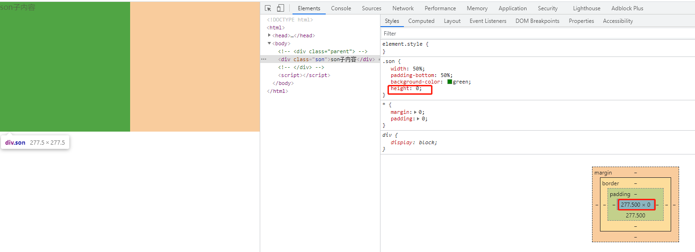
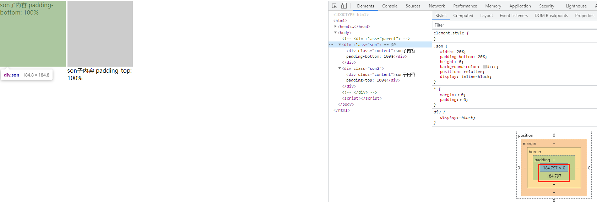

## 浮层 modalbox-shadow 效果

下面是 antd 的 popover 的 content 盒子的 box-shadow 样式

```css
.ant-popover-inner {
  background-color: #fff;
  background-clip: padding-box;
  border-radius: 2px;
  box-shadow: 0 3px 6px -4px rgba(0, 0, 0, 0.12), 0 6px 16px 0 rgba(0, 0, 0, 0.08),
    0 9px 28px 8px rgba(0, 0, 0, 0.05);
}
```


## 画一条水平分隔直线

一个 li 实现的直线，作为两个 section 直接的分隔线

```css
.row-line {
  border-top: 1px solid #e5e5e5;
  margin: 4px 16px;
  display: block;
  list-style: none;
}
```

## 画一条垂直分隔直线

```css
.column-separator {
  margin: 0 16px;
  flex: 0 0 1px;
  height: 20px;
  background-color: #bfbfbf;
}
```

## 纯 CSS 实现自适应正方形

> **方案一：CSS3 vw 单位：**

==CSS3 中新增了一组相对于可视区域百分比的长度单位 vw, vh, vmin, vmax==。其中 vw 是相对于视口宽度百分比的单位，1vw = 1% viewport width， vh 是相对于视口高度百分比的单位，1vh = 1% viewport height；==vmin 是相对当前视口宽高中较小的一个的百分比单位，同理 vmax 是相对当前视口宽高中较大的一个的百分比单位==。该单位浏览器兼容性如下（见原链接）。

代码如下，改变窗口大小， 正方形自适应变化。

- 优点：简洁方便
- 缺点：浏览器兼容不好

```html
<html>
  <head>
    <meta charset="UTF-8" />
    <meta name="viewport" content="width=device-width, initial-scale=1.0" />
    <style>
      * {
        margin: 0;
        padding: 0;
      }
      .son {
        width: 50%;
        height: 50vw;
        background-color: green;
      }
    </style>
  </head>
  <body>
    <div class="son">son子内容</div>
  </body>
</html>
```

> **方案二：设置垂直方向的 padding 撑开容器：**

在 CSS 盒模型中，一个比较容易被忽略的就是 margin, padding 的百分比数值计算。按照规定，==margin, padding 的百分比数值是相对 父元素的宽度 计算的==。由此可以发现只需将元素垂直方向的一个 padding 值设定为与 width 相同的百分比就可以制作出自适应正方形了。

```html
<html>
  <head>
    <meta charset="UTF-8" />
    <meta name="viewport" content="width=device-width, initial-scale=1.0" />
    <style>
      * {
        margin: 0;
        padding: 0;
      }
      .son {
        width: 50%;
        padding-bottom: 50%;
        background-color: green;
      }
    </style>
  </head>
  <body>
    <div class="son">son子内容</div>
  </body>
</html>
```


代码及效果如上，可以发现，由于 div 内有文本内容导致 div 高度发生变化不再是正方形。为了解决这个问题，我们可以设置容器的高度为 0 即可。代码及效果如下。

```css
.son {
  height: 0;
}
```



这种方案简洁明了，且兼容性好；但是除了填充内容后会出现问题以外，还有可能碰上 max-height 不收缩的问题，于是第三种方案来了。

当前这种方案优化后如下：


运行之后我们发现写 padding-top 还是不可以，我们来检查代码发现，在写内层的 div 时候没有给 top，left 的值，让我们把 top，left 加上再看看，如下：

```html
<html>
  <head>
    <meta charset="UTF-8" />
    <meta name="viewport" content="width=device-width, initial-scale=1.0" />
    <style>
      * {
        margin: 0;
        padding: 0;
      }
      .son {
        width: 20%;
        padding-bottom: 20%;
        height: 0;
        background-color: #ccc;
        position: relative;
        display: inline-block;
      }
      .son2 {
        width: 20%;
        padding-top: 20%;
        height: 0;
        background-color: #ccc;
        position: relative;
        display: inline-block;
      }
      .content {
        position: absolute;
        width: 100%;
        height: 100%;
        top: 0; /* 新增 */
        left: 0; /* 新增 */
      }
    </style>
  </head>
  <body>
    <div class="son">
      <div class="content">son子内容 padding-bottom: 100%</div>
    </div>

    <div class="son2">
      <div class="content">son子内容 padding-top: 100%</div>
    </div>
  </body>
</html>
```


> **方案三：利用伪元素的 margin(padding)-top 撑开容器：**

在方案二中，我们利用百分比数值的 padding-bottom 属性撑开容器内部空间，但是这样做会导致在元素上设置的 max-height 属性失效。==而失效的原因是 max-height 属性只限制于 height，也就是只会对元素的 content height 起作用==。那么我们是不是能用一个子元素撑开 content 部分的高度，从而使 max-height 属性生效呢？我们来试试：

```css
.son {
  width: 100%;
}
.son:after {
  content: "";
  display: block;
  margin-top: 100%; /* margin 百分比相对父元素宽度计算 */
}
```

一刷新页面，啊嘞？怎么什么也没有？

这里就涉及到 margin collapse 的概念了，由于容器与伪元素在垂直方向发生了外边距折叠，所以我们想象中的撑开父元素高度并没有出现。而应对的方法是在父元素上触发 BFC：

```css
.son {
  overflow: hidden;
}
/* 注：若使用垂直方向上的 padding 撑开父元素，则不需要触发 BFC */
```

OK，父元素被撑起来了，我们再试一试设置 max-height：

完美！什么？你说元素内部添加内容时高度会溢出？(正方形内文字会溢出，溢出的高度正好就是文字所占空间的高度。)对于这样的情况，可以将内容放到独立的内容块中，利用绝对定位消除空间占用。如下：

```html
<html>
  <head>
    <meta charset="UTF-8" />
    <meta name="viewport" content="width=device-width, initial-scale=1.0" />
    <style>
      * {
        margin: 0;
        padding: 0;
      }
      .son {
        width: 20%;
        background-color: #ccc;
        overflow: hidden;
        position: relative;
      }
      .son:after {
        content: "";
        display: block;
        margin-top: 100%; /* margin 百分比相对父元素宽度计算 */
      }
      .content {
        position: absolute;
        width: 100%;
        height: 100%;
      }
    </style>
  </head>
  <body>
    <div class="son">
      <div class="content">son子内容</div>
    </div>
  </body>
</html>
```

> **总结：**

目前这三种制作自适应正方形的方案，抛去 CSS3 中的视口相对单位，==主要利用到 margin, padding 的百分比数值相对父元素的宽度计算得出来制作宽高相等、且相对视口宽度自适应的正方形==。如果需求是制作相对视口高度自适应的正方形，估计就只能使用 vh 单位了吧~

**参考链接：**

- [纯 CSS 实现自适应正方形](https://segmentfault.com/a/1190000009476303/)
- [纯 CSS 实现正方形、自适应正方形方法](https://blog.csdn.net/ztj771299799/article/details/79806769)
