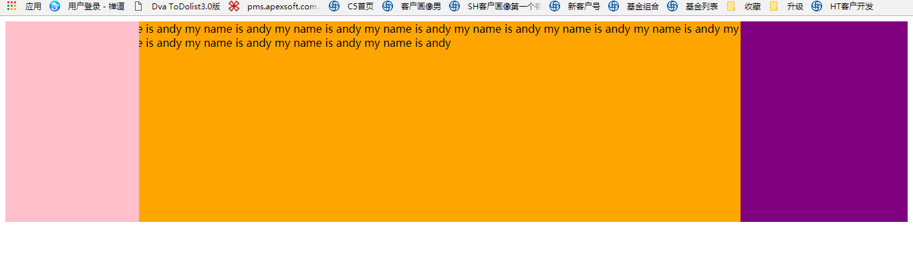
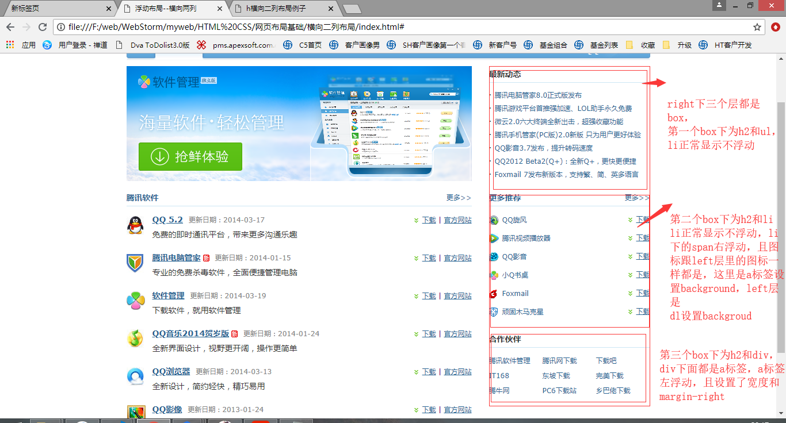

# 页面结构布局

页面结构从上到下为 header 层，mainBody 层，footer 层，包裹这三个的是 wrap 层（container 层:）。

# 网站页面构建步骤

1、页面头部（header 层），其中包括了 LOGO、MENU 和一幅 Banner 图片；
2、页面主体（mainbody 层），那就是我们的主体了，要求打开首页快速，所以我们在网站发布的信息设计为三列。mainbody-left,mainbody-center,mainbody-right;
3、底部（footer 层），包括一些版权信息。

# 命名规范

一．文件命名规范
全局样式：global.css；
框架布局：layout.css；
字体样式：font.css；
链接样式：link.css；
打印样式：print.css；

二．常用类/ID 命名规范
页　眉：header
内　容：content
主 体：body

容　器：container
页　脚：footer
版　权：copyright 　
导　航：menu
主导航：mainMenu
子导航：subMenu
标　志：logo
标　语：banner
标　题：title
侧边栏：sidebar
图　标：Icon
注　释：note
搜　索：search
按　钮：btn
登　录：login
链　接：link
信息框：manage
分隔器：separator
……

三．实例

```html
<div className="container">
  <div className="header"></div>
  <div className="body"></div>
  <div className="footer"></div>
</div>
```

常用类的命名应尽量以常见英文单词为准，做到通俗易懂，并在适当的地方加以注释。对于二级类/ID 命名，则采用组合书写的模式，后一个单词的首字母应大写：诸如“搜索框”则应命名为“searchInput”、“搜索图标”命名这“searchIcon”、“搜索按钮”命名为“searchBtn“等等。

页面结构从上到下为 header 层，mainBody 层，footer 层，包裹这三个的是 wrap 层（container 层:）。
Wrap 居中包裹层
大多数页面都是有一个 wrap 层，有个宽度，水平居中
如下图例


# 布局之结构与表现分离

在页面里只写入文档的结构，而将样式写于 css 文件中，通过外部调用 CSS 样式表来实现结构与样式的分离。

即 HTML 与 CSS 与 JS 之间的分离，不只是把它们放在不同的文件里写那么简单，不只是一种方法，而是一种思想。

## 具体做法

==拿到效果图，先不管样式，先按照 html 结构和语义编写代码。然后进行 css 样式设置，减少 html 和 css 的契合度，
先把 html 中最基本的标签元素写出来，再开始往上考虑加不加父层，或者加多少个父层，即怎样去组装最基本的标签元素，然后再加样式，加完样式效果就能出来，这才是结构与表现分离==。

## 实例


# 常见布局

Header 层，search 层，nav 导航层，banner 图层，商品列表层，footer 信息层

## 一列布局

一列固定布局：给个具体宽度
一列自适应布局：给个百分比宽度

## 两列布局

### 两列自适应布局

```css
/* <body>
  <div class="left">left</div>
  <div class="right">right</div>
</body> */

.left {
  width: 20%;
  height: 600px;
  background: #ccc;
  float: left;
}
.right {
  width: 80%;
  height: 600px;
  background: #fcc;
  float: right;
}
```

### 两列固宽居中布局

```css
/* <body>
  <div class="main">
    <div class="left">left</div>
    <div class="right">right</div>
  </div>
</body> */
.main {
  width: 960px;
  height: 600px;
  margin: 0 auto;
}
.left {
  width: 300px;
  height: 600px;
  background: #ccc;
  float: left;
}
.right {
  width: 660px;
  height: 600px;
  background: #fcc;
  float: right;
}
```

#### 实例

如下，mainbody 层，左右两列布局，左边的给个宽度左浮动，右边给个宽度右浮动。

并且注意父元素和左盒子，右盒子的 border，加上 width 之后是否超出父元素的整个宽度，如果超出，右盒子会出现在他本来位置的正下方。

### 两列自适应居中布局

```css
/* <body>
  <div class="main">
    <div class="left">left</div>
    <div class="right">right</div>
  </div>
</body> */
.main {
  width: 80%;
  height: 600px;
  margin: 0 auto;
}
.left {
  width: 20%;
  height: 600px;
  background: #ccc;
  float: left;
}
.right {
  width: 80%;
  height: 600px;
  background: #fcc;
  float: right;
}
```

### 左侧自适应右侧固定

[方法二三](https://juejin.im/post/5aa252ac518825558001d5de#heading-37)

#### (1)使用`float+margin`实现(操作左边)

```css
/* <div id="parent">
  <div id="left">左列自适应</div>
  <div id="right">右列定宽</div>
</div> */

#parent {
  height: 500px;
  padding-left: 100px;
  /*抵消#left的margin-left以达到#parent水平居中*/
}
#left {
  width: 100%;
  height: 500px;
  float: left;
  margin-left: -100px; /*正值等于#right的宽度*/
  background-color: #f00;
}
#right {
  height: 500px;
  width: 100px;
  float: right;
  background-color: #0f0;
}
```

#### (2)使用`float+margin`实现(操作右边)

参照：百度地图画圈找房 demo

```css
html,
body {
  margin: 0;
  padding: 0;
  height: 100%;
  min-width: 800px;
}

/* 父元素 */
.wrapper {
  height: 100%;
  padding-right: 300px;
}

/* 左子元素 */
.map-container {
  height: 100%;
  width: 100%;
  float: left;
}

/* 右子元素 */
.panel {
  float: left;
  margin-left: -300px;
  width: 300px;
  height: 100%;
  position: relative;
  right: -300px;
  box-shadow: -2px 2px 2px #d9d9d9;
}
```

#### (3)绝对定位实现（左右子都绝父相）

```css
/* <body>
  <div id="parent">
    <div id="left">左列自适应</div>
    <div id="right">右列定宽</div>
  </div>
</body> */

#parent {
  position: relative; /*子绝父相*/
}
#left {
  position: absolute;
  top: 0;
  left: 0;
  right: 100px; /*大于等于#rigth的宽度*/
  background-color: #f00;
  height: 500px;
}
#right {
  position: absolute;
  top: 0;
  right: 0;
  background-color: #0f0;
  width: 100px;
  height: 500px;
}
```

#### (4)flex 实现

```css
/* <body>
  <div id="parent">
    <div id="left">左列自适应</div>
    <div id="right">右列定宽</div>
  </div>
</body> */
#parent {
  height: 500px;
  display: flex;
}
#left {
  flex: 1;
  background-color: #f00;
}
#right {
  width: 100px;
  background-color: #0f0;
}
```

## 三列布局

### 三列都固定布局

例子：横向三列等多列布局

每一列都是`float: left`，每列都设置宽度，加起来宽度再加上一些 padding 和 margin 就等于 wrap 层的宽度。


### 三列左右固定布局

左右绝对定位，中间 margin：0 左右宽度。

```css
/* <body>
  <div class="left">left</div>
  <div class="main">main</div>
  <div class="right">right</div>
</body> */

.left {
  height: 600px;
  width: 240px;
  background: #ccc;
  position: absolute;
  left: 0;
  top: 0;
}
.main {
  height: 600px;
  margin: 0 240px;
  background: #9cf;
  min-width: 200px;
}
.right {
  height: 600px;
  width: 240px;
  position: absolute;
  top: 0;
  right: 0;
  background: #fcc;
}
```

### 三列自适应布局

左右绝对定位，宽度为 x%; 中间 margin：0 x%。

```css
/* <body>
  <div class="left">left</div>
  <div class="main">main</div>
  <div class="right">right</div>
</body> */

.left {
  width: 20%;
  height: 600px;
  background: #ccc;
  position: absolute;
  left: 0;
  top: 0;
}
.main {
  height: 600px;
  margin: 0 20%;
  background: #9cf;
}
.right {
  height: 600px;
  width: 20%;
  position: absolute;
  top: 0;
  right: 0;
  background: #fcc;
}
```

### 三列左右两边固定中间自适应布局

#### 绝对定位法

左右绝对定位+中间 margin （注意 main 盒子放在最前）

```html
<head>
  <style>
    .container {
      height: 300px;
      min-width: 1000px;
      position: relative;
    }
    .column {
      height: 300px;
    }
    .left {
      width: 200px;
      background-color: pink;
      position: absolute;
      top: 0;
      left: 0;
      bottom: 0;
    }
    .right {
      width: 300px;
      background-color: purple;
      position: absolute;
      top: 0;
      right: 0;
      bottom: 0;
    }
    .main {
      background-color: orange;
      min-width: 500px;
      margin: 0 300px 0 200px;
    }
  </style>
</head>
<body>
  <div class="container">
    <div class="column main"></div>
    <div class="column left"></div>
    <div class="column right"></div>
  </div>
</body>
```

#### 浮动法

左右浮动+中间 margin（注意 main 盒子放在最后）

```html
<head>
  <style>
      #parent {
        height: 500px;
        min-width: 1000px;
        position: relative;
      }
      .left {
        height: 500px;
        background-color: #f00;
        width: 200px;
        float: left;
      }
      .right {
        height: 500px;
        background-color: #0f0;
        width: 300px;
        float: right;
      }
      .main {
        height: 500px;
        min-width: 500px;
        background-color: blue;
        margin: 0 300px 0 200px;
      }
<body>  </style>
</head>
  <div class="container">
    <div class="column left"></div>
    <div class="column right"></div>
    <div class="column main"></div>
  </div>
</body>
```

#### 圣杯布局和双飞翼布局

即横向三列布局，两侧宽度固定，中间自适应，三栏布局，也叫固比固布局。

圣杯布局和双飞翼布局非常的相似，他们实现的是同一种效果，只不过实现的方式有一点点不一样。

写结构时先写中间盒子，中间盒子自适应是什么意思，就是中间盒子的宽度是 100%，左右盒子给个固定宽度，如下


##### 圣杯布局

- (1) 放三个浮动盒子，先放中间，再左，再右
  左右盒子和中间盒子都是浮动的，写结构时先写中间盒子 main，因为 main 盒子的宽度是 100%，所以后面的在下一行显示。如下图。

  ```html
  <head>
    <style>
      .container {
        height: 300px;
      }
      .column {
        float: left;
        height: 300px;
      }
      .left {
        width: 200px;
        background-color: pink;
      }
      .right {
        width: 250px;
        background-color: purple;
      }
      .main {
        width: 100%;
        background-color: orange;
      }
    </style>
  </head>
  <body>
    <div class="container">
      <div class="column main"></div>
      <div class="column left"></div>
      <div class="column right"></div>
    </div>
  </body>
  ```

  

- (2) 将左右盒子跟中间盒子放在一行
  如何让宽度为 100%的 main 盒子与左右盒子放在一行，给左右盒子设置 margin-left，左盒子相当于上移一行，即 -100%；右盒子左移本身的 width，如下图，三列在一行了，但是左盒子和右盒子把 main 盒子的内容给挡住了。

  ```html
  <head>
    <style>
      .container {
        height: 300px;
      }
      .column {
        float: left;
        height: 300px;
      }
      .left {
        width: 200px;
        background-color: pink;

        <!-- margin-left: -100%; -->
      }
      .right {
        width: 250px;
        background-color: purple;

        <!-- margin-left: -250px; -->
      }
      .main {
        width: 100%;
        background-color: orange;
      }
    </style>
  </head>
  <body>
    <div class="container">
      <div class="column main"></div>
      <div class="column left"></div>
      <div class="column right"></div>
    </div>
  </body>
  ```

  

- (3) 给父盒子加 padding

  ```html
  <head>
    <style>
      .container {
        height: 300px;

        <!-- padding: 0 250px 0 200px -->
      }
    </style>
  </head>
  ```

  

- (4) 让左右盒子不压住 main 盒子，即相对定位

  ```html
  <head>
    <style>
      .left {
        width: 200px;
        background-color: pink;
        margin-left: -100%;

        <!-- position: relative;
        left: -200px; -->
      }
      .right {
        width: 250px;
        background-color: purple;
        margin-left: -250px;

        <!-- position: relative;
        right: -250px; -->
      }
    </style>
  </head>
  <body>
    <div class="container">
      <div class="column main"></div>
      <div class="column left"></div>
      <div class="column right"></div>
    </div>
  </body>
  ```

  

- (5) 完善
  屏幕太小时会出现下图问题，要给 html 一个`min-width`
  ```html
  <head>
    <style>
      body {
        min-width: 700px;
      }
    </style>
  </head>
  ```
  
  

##### 双飞翼布局

起源于淘宝 个人还是更倾向于 双飞翼布局。
前两步跟圣杯布局一样，少了 container 盒子的 padding，少了左右盒子的定位，main 盒子里多了个 inner 盒子，给 inner 盒子设置 margin

```html
<head>
  <style>
    .inner {
      margin: 0 250px 0 200px;
    }
  </style>
</head>
<body>
  <div class="container">
    <div class="column main">
      <div class="inner"></div>
    </div>
    <div class="column left"></div>
    <div class="column right"></div>
  </div>
</body>
```

**思考：为啥左中右都加 float**
圣杯和双飞翼为啥加每个都加 float：为了布局让块级元素显示在一行

**思考：为什么不直接给 main 盒子设置 margin 呢**
main 盒子宽度已经是 100%，再设置 margin 或者 padding 布局都会混乱，如下面两图


# 实例分析

页面整体结构如下


第二层的 header 层如下


第二层的 mainbody 如下图


mainbody 下的 left 层如下图


mainbody 下的 right 层如下图


footer 层如下

