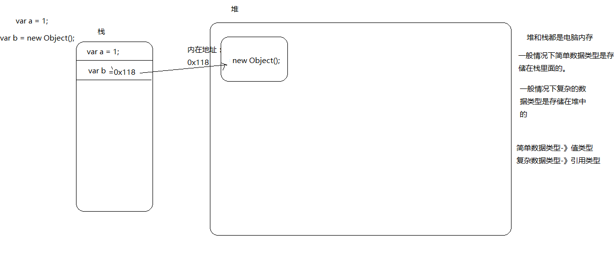

# 概述

- 一个对象往往是多个原始类型的值的合成，可以看作是**一个存放各种值的容器**。至于`undefined`和`null`，一般将它们看成两个特殊值

- 对象是最复杂的数据类型，又可以分为三个子类型
  - 狭义的对象（object）
  - 数组（array）
  - 函数（function）：其实是处理数据的方法，JS 把它当成一种数据类型，可以赋值给变量，这为编程带来了很大的灵活性，也为 JS 的“函数式编程”奠定了基础。

## 基本/引用 数据类型

数据类型分为两类，基本数据类型 和 引用数据类型。

> 基本数据类型：六种
>
> - string：字符串类型
> - number：数字类型
> - boolean：布尔类型
> - null：对空类型
> - undefined：未定义类型
> - symbol：符号类型

> 引用数据类型：
>
> - array：数组
> - object：对象
> - function：函数
> - Math、Date、RegExp 等：其它对象

基本类型 和 引用类型的区别

> 堆和栈都是电脑的内存。

- 基本数据类型把值存储在栈内存中。
- 引用数据类型的值是存储在堆内存中，地址存在栈内存中，栈内存中存储的地址指向堆内存中存储的值



## null-undefined

- **背景：**

  大多数计算机语言，有且仅有一个表示“无”的值，比如 C 语言的 NULL，java 的 null，Python 的 None，Ruby 的 nil。

  javascript 语言有两个表示“无”的值：null 和 undefined。

- **相似性：**

  - 都只有一个值
  - 都没有方法，准确的说都不能调用方法
  - 都表示“无”。

  ```js
    Boolean(null) = false ;
    Boolean(undefined) = false;
    undefined == null // true
  ```

- **用法含义：**

  - `null`表示空值，即该处的值现在为空。调用函数时，某个参数未设置任何值，这时就可以传入`null`，表示该参数为空。

  - `undefined`表示“未定义”，缺少值：即此处应该有一个值，但是还没有定义。下面是返回`undefined`的典型场景。

```javascript
// 【1】变量声明了，但没有赋值
var i;
i; // undefined

// 【2】调用函数时，应该提供的参数没有提供，该参数等于 undefined
function f(x) {
  return x;
}
f(); // undefined

// 【3】对象没有赋值的属性
var o = new Object();
o.p; // undefined

// 【4】函数没有返回值时，默认返回 undefined
function f() {}
f(); // undefined
```

- **对比：**

```js
typeof null; // object
typeof undefined; // undefined

Number(null); // 0
Number(undefined); // NaN
```

- **参考资料：** [javascript 中的 null 和 undefined](https://zhuanlan.zhihu.com/p/31067843)

## boolean

> 布尔值代表“真”和“假”两个状态。“真”用关键字`true`表示，“假”用关键字`false`表示。布尔值只有这两个值。

下列运算符会返回布尔值：

- 前置逻辑运算符： `!` (Not)
- 相等运算符：`===`，`!==`，`==`，`!=`
- 比较运算符：`>`，`>=`，`<`，`<=`

Boolean 类型转换时，只有下面六个值会被转为 false，其余都是 true

- `undefined`
- `null`
- `false`
- `0`
- `NaN`
- `""` / `''`

## number

- 整数和浮点数

  - JS 的底层根本没有整数，所有数字都是小数（64 位浮点数）。所以，1 与 1.0 是相同的，是同一个数。
  - 由于浮点数不是精确的值，所以涉及小数的比较和运算要特别小心。

  ```javascript
  1 === 1.0; // true

  0.1 + 0.2 === 0.3;
  // false

  0.3 /
    0.1(
      // 2.9999999999999996

      0.3 - 0.2
    ) ===
    0.2 - 0.1;
  // false
  ```

- 数值的进制
  JS 对整数提供四种进制的表示方法：十进制、十六进制、八进制、二进制。
  - 十进制：没有前导 0 的数值。
  - 八进制：有前缀`0o`或`0O`的数值，或者有前导 0、且只用到 0-7 的八个阿拉伯数字的数值。
  - 十六进制：有前缀`0x`或`0X`的数值。
  - 二进制：有前缀`0b`或`0B`的数值。

### 特殊数值

- 正零和负零

  ```js
  -0 === +0; // true
  0 === -0; // true
  (0 ===
    +0 + // true
      0 - // 0
      0(
        // 0
        -0
      )
        .toString()(
          // '0'
          +0
        )
        .toString()(
        // '0'

        1 / +0
      )) ===
    1 / -0; // false
  ```

- NaN

  > 含义：NaN 是 JS 的特殊值，表示“非数字”（Not a Number），主要出现在将字符串解析成数字出错的场合。

  ```js
  typeof NaN; // 'number'
  5 - "x"; // NaN
  0 / 0; // NaN
  0 === +0; // true
  ```

  运算规则

  ```js
  // NaN不等于任何值，包括它本身
  NaN ===
    NaN// NaN数组的indexOf方法内部使用的是严格相等运算符，所以该方法对NaN不成立。 // false
    [NaN].indexOf(NaN); // -1

  // NaN与任何数（包括它自己）的运算，得到的都是NaN。
  NaN + 32; // NaN
  NaN - 32; // NaN
  NaN * 32; // NaN
  NaN / 32; // NaN
  ```

- Infinity

  > 含义：Infinity 表示“无穷”，用来表示两种场景。一种是一个正的数值太大，或一个负的数值太小，无法表示；另一种是非 0 数值除以 0，得到 Infinity。

  ```js
  0 / 0; // NaN
  1 / 0; // Infinity

  Infinity === -Infinity; // false
  1 / -0 - // -Infinity
    1 / -0; // Infinity
  ```

### 与数值相关的全局方法

#### parseInt()

- **基本用法**

> 作用：解析字符串返回整数
> 语法：parseInt(string, _radix_)

| 参数   | 描述                                                                                                                           |
| ------ | ------------------------------------------------------------------------------------------------------------------------------ |
| string | 必需。 要被解析的字符串                                                                                                        |
| radix  | 可选。 表示被解析的值的进制（2-36），返回该值对应的十进制数。 默认情况下，parseInt 的第二个参数为 10，即默认是十进制转十进制。 |
| 返回值 | **`parseInt`的返回值只有两种可能，要么是一个十进制整数，要么是`NaN`。**                                                        |

规则如下：

- 如果字符串头部有空格，空格会被自动去除。
- 如果`parseInt`的参数不是字符串，则会先转为字符串再转换。
- 字符串转为整数的时候，是一个个字符依次转换，如果遇到不能转为数字的字符，就不再进行下去，返回已经转好的部分。
- 如果字符串的第一个字符不能转化为数字（后面跟着数字的正负号除外），返回`NaN`。

```js
parseInt("123"); // 123

// 字符串头部有空格
parseInt("   81"); // 81

// 参数不是字符串
parseInt(1.23); // 1
// 等同于
parseInt("1.23"); // 1

// 遇到不能转为数字的字符
parseInt("8a"); // 8
parseInt("12**"); // 12
parseInt("12.34"); // 12
parseInt("15e2"); // 15
parseInt("15px"); // 15

// 第一个字符不能转化为数字（后面跟着数字的正负号除外）
parseInt("abc"); // NaN
parseInt(".3"); // NaN
parseInt(""); // NaN
parseInt("+"); // NaN
parseInt("+1"); // 1
```

- **进制转换**

```js
parseInt("1000"); // 1000
// 等同于
parseInt("1000", 10); // 1000

// 转换指定进制的数
parseInt("1000", 2); // 8
parseInt("1000", 6); // 216
parseInt("1000", 8); // 512

// 如果第二个参数是0、undefined和null，则直接忽略。
parseInt("10", 37); // NaN
parseInt("10", 1); // NaN
parseInt("10", 0); // 10
parseInt("10", null); // 10
parseInt("10", undefined); // 10

parseInt("10"); // 10
parseInt("19", 10); // 19 (10+9=1*10^1+9*10^0)
parseInt("11", 2); // 3 (2+1=1*2^1+1*2^0)
parseInt("17", 8); // 15 (8+7=1*8^1+7*2^0)
parseInt("1f", 16); // 31 (16+15=1*16^1+f*16^0)
```

实例

```js
["1", "2", "3"]
  .map(parseInt) // [1, NaN, NaN]

  [("1", "2", "3")].map(parseInt) ==
  ["1", "2", "3"].map((v, i) => parseInt(v, i));

parseInt("1", 0); // 1  radix为0时，且string参数不以“0x”和“0”开头时，按照10为基数处理。这个时候返回1
parseInt("2", 1); // NaN 基数为1（1进制）表示的数中，最大值小于2，所以无法解析，返回NaN
parseInt("3", 2) // NaN 基数为2（2进制）表示的数中，最大值小于3，所以无法解析，返回NaN
  [("10", "10", "10", "10", "10")].map(parseInt); // [10, NaN, 2, 3, 4]
parseInt("10", 0); // 10
parseInt("10", 1); // NaN
parseInt("10", 2); // 2
parseInt("10", 3); // 3
parseInt("10", 4); // 4
```

#### parseFloat()

> 与 parseInt()作用一样，唯一区别是可以保留小数

```js
parseFloat("123"); // 123
parseFloat("123.0"); // 123
parseFloat("123.1"); // 123.1
parseFloat(".3"); // 0.3

// 字符串头部有空格
parseFloat("   81.2"); // 81.2

// 参数不是字符串
parseFloat(1.23); // 1.23
// 等同于
parseFloat("1.23"); // 1.23

// 遇到不能转为数字的字符
parseFloat("8a.0"); // 8
parseFloat("12**"); // 12
parseFloat("12.34"); // 12.34
parseFloat("15e2"); // 1500
parseFloat("15px"); // 15

// 第一个字符不能转化为数字（后面跟着数字的正负号除外）
parseFloat("abc"); // NaN
parseFloat(""); // NaN
parseFloat("+"); // NaN
parseFloat("+1"); // 1
```

#### isNaN()

> 作用：判断一个值是否为 NaN，返回布尔值

> **`isNaN(x) === isNaN(Number(x))`**

规则如下：

- isNaN 只对数值有效，如果传入其他值，会被先转成数值（`Number()`）。所以：**`isNaN为true的值，有可能不是NaN，而是一个字符串`**。

```js
isNaN(NaN); // true
isNaN(123); // false

isNaN("Hello"); // true
// 相当于
isNaN(Number("Hello")); // true

isNaN({}); // true
// 等同于
isNaN(Number({})); // true

isNaN(["xzy"]); // true
// 等同于
isNaN(Number(["xzy"])); // true

// 之所以返回false，原因是这些数组能被Number函数转成数值，详见数据类型转换
isNaN([]); // false
isNaN([123]); // false
isNaN(["123"]); // false
```

使用注意：

- 使用 isNaN 之前，最好判断一下数据类型

```js
function myIsNaN(value) {
  return typeof value === "number" && isNaN(value);
}
```

- 判断 NaN 更可靠的方法是，利用 **`NaN为唯一不等于自身的值`** 的这个特点，进行判断。

```js
function myIsNaN(value) {
  return value !== value;
}
```

#### isFinite()

> 作用：判断一个值是否为正常的数值，返回布尔值

```js
isFinite(Infinity); // false
isFinite(-Infinity); // false
isFinite(NaN); // false
isFinite(undefined); // false
isFinite(null); // true
isFinite(-1); // true
```

## string

**定义**

> 字符串就是零个或多个排在一起的字符，放在单引号或双引号之中。

```js
"abc";
"abc";

// 单引号字符串的内部，可以使用双引号。双引号同理
'key = "value"';
"It's a long journey";

// 如果要在单引号字符串的内部，使用单引号，就必须在内部的单引号前面加上反斜杠，用来转义。双引号字符串内部使用双引号，也是如此。
'Did she say \'Hello\'?';
// "Did she say 'Hello'?"

"Did she say \"Hello\"?";
// "Did she say 'Hello'?"
```

字符串默认只能写在一行内，分成多行将会报错。

```js
'a
b
c'
// SyntaxError: Unexpected token ILLEGAL
```

如果长字符串必须分成多行，可以在每一行的尾部使用反斜杠 或者 连接运算符（+）。

连接运算符（+）可以连接多个单行字符串，将长字符串拆成多行书写，输出的时候也是单行

```js
var longString = "Long " + "long " + "long " + "string";
```

**转义**

> 反斜杠（\）在字符串内有特殊含义，用来表示一些特殊字符，所以又称为转义符

需要用反斜杠转义的特殊字符，主要有下面这些

- `\0` ：null（`\u0000`）
- `\b` ：后退键（`\u0008`）
- `\f` ：换页符（`\u000C`）
- `\n` ：换行符（`\u000A`）
- `\r` ：回车键（`\u000D`）
- `\t` ：制表符（`\u0009`）
- `\v` ：垂直制表符（`\u000B`）
- `\'` ：单引号（`\u0027`）
- `\"` ：双引号（`\u0022`）
- `\\` ：反斜杠（`\u005C`）

```js
console.log("1\n2");
// 1
// 2

("Prev \\ Next");
// "Prev \ Next"
```

**字符串与数组**
字符串可以被视为字符数组，特性如下

- 可以使用数组的方括号运算符，用来返回某个位置的字符（位置编号从 0 开始）。
- 如果方括号中的数字超过字符串的长度，或者方括号中根本不是数字，则返回 undefined。

```js
var s = "hello";
s[0]; // "h"
s[1]; // "e"
s[4]; // "o"

// 直接对字符串使用方括号运算符
"hello"[1]; // "e"

"abc"[3]; // undefined
"abc"[-1]; // undefined
"abc"["x"]; // undefined
```

- 字符串与数组的相似性仅此而已。实际上，字符串内部的单个字符无法改变和增删，这些操作会默默地失败。

```js
var s = "hello";

delete s[0]; // false
s; // "hello"

s[1] = "a";
s; // "hello"

s[5] = "!";
s; // "hello"
```

- length 属性返回字符串的长度，该属性也是无法改变的。

```js
var s = "hello";
s.length; // 5

s.length = 3;
s.length; // 5

s.length = 7;
s.length; // 5
```

**字符集**

> JS 使用 Unicode 字符集。JS 引擎内部，所有字符都用 Unicode 表示。

**Base64 转码**

> Base64：一种编码方法，可以将任意值转成 0 ～ 9、A ～ Z、a-z、+和/这 64 个字符组成的可打印字符。使用它的主要目的，不是为了加密，而是**为了不出现特殊字符，简化程序的处理**。

使用场景

- 文本里面包含一些不可打印的符号，比如 ASCII 码 0 到 31 的符号都无法打印出来，这时可以使用 Base64 编码，将它们转成可以打印的字符。
- 有时需要以文本格式传递二进制数据，那么也可以使用 Base64 编码。

JS 原生提供两个 Base64 相关的方法。注意，这两个方法不适合非 ASCII 码的字符，会报错。

- `btoa()`：任意值转为 Base64 编码
- `atob()`：Base64 编码转为原来的值

```javascript
var string = "Hello World!";
btoa(string); // "SGVsbG8gV29ybGQh"
atob("SGVsbG8gV29ybGQh"); // "Hello World!"

btoa("你好"); // 报错
```

要将非 ASCII 码字符转为 Base64 编码，必须中间插入一个转码环节，再使用这两个方法。

```javascript
function b64Encode(str) {
  return btoa(encodeURIComponent(str));
}

function b64Decode(str) {
  return decodeURIComponent(atob(str));
}

b64Encode("你好"); // "JUU0JUJEJUEwJUU1JUE1JUJE"
b64Decode("JUU0JUJEJUEwJUU1JUE1JUJE"); // "你好"
```

## Tips

### 判断一个值的类型方法

#### typeof 运算符

- **作用：** 能判断基本数据类型（除了 null：`typeof null`失效返回 object）和 引用数据类型中的 function

```javascript
// typeof 对于基础数据类型来说，除了null都能返回正确的类型
typeof 1; // 'number'
typeof NaN; // 'number'
typeof "1"; // 'string'
typeof true; // 'boolean'
typeof undefined; // 'undefined'
typeof Symbol(); // 'symbol'

typeof null; // object

// typeof 对于引用数据类型来说，只有function能返回正确的类型
typeof []; // 'object'
typeof {}; // 'object'

typeof console.log; // 'function'
typeof function () {}; // 'function'

// 以下构造函数都返回 'function'
typeof Number; // 'function'
typeof String; // 'function'
typeof Boolean; // 'function'
typeof Symbol; // 'function'
typeof Object; // 'function'
typeof Array; // 'function'

// 使用 `字面量/构造函数` 来定义变量的区别
typeof 12; // "number"
typeof new Number(12); // "object"
typeof false; // "boolean"
typeof new Boolean(false); // "object"
```

#### instanceof 运算符

- **作用：** `instanceof`运算符用来验证，**一个对象是否为指定的构造函数的实例**。
- **规则：**
  - 内部机制是通过原型链来判断的，**不能直接判断基础类型，只能判断引用类型**

```js
const Person = function () {};
const p1 = new Person();
p1 instanceof Person; // true

var str = "hello world";
str instanceof String; // false
var str1 = new String("hello world");
str1 instanceof String; // true

"" instanceof String; // false
0 instanceof Number; // false
NaN instanceof Number; // false
false instanceof Boolean; // false
null instanceof Null; // Uncaught ReferenceError: Null is not defined
undefined instanceof Undefined; // Uncaught ReferenceError: Undefined is not defined
Symbol() instanceof
  Symbol[(1, 2, 3)] instanceof // false
  Array(
    // true
    { age: 12 }
  ) instanceof
  Object(
    // true
    function () {}
  ) instanceof
  Object; // true
```

#### Object.prototype.toString.call()

- **作用：** `toString`方法的作用是**返回一个对象的字符串形式，默认情况下返回类型字符串。**

- **规则：**
  不同数据类型的`Object.prototype.toString`方法返回值如下。

  - 数值：返回`[object Number]`。
  - 字符串：返回`[object String]`。
  - 布尔值：返回`[object Boolean]`。
  - undefined：返回`[object Undefined]`。
  - null：返回`[object Null]`。
  - 数组：返回`[object Array]`。
  - arguments 对象：返回`[object Arguments]`。
  - 函数：返回`[object Function]`。
  - Error 对象：返回`[object Error]`。
  - Date 对象：返回`[object Date]`。
  - RegExp 对象：返回`[object RegExp]`。
  - 其他对象：返回`[object Object]`。

```js
Object.prototype.toString.call(2); // "[object Number]"
Object.prototype.toString.call(""); // "[object String]"
Object.prototype.toString.call(true); // "[object Boolean]"
Object.prototype.toString.call(Symbol()); // "[object Symbol]"
Object.prototype.toString.call(undefined); // "[object Undefined]"
Object.prototype.toString.call(null); // "[object Null]"
Object.prototype.toString.call(Math); // "[object Math]"
Object.prototype.toString.call({}); // "[object Object]"
Object.prototype.toString.call([]); // "[object Array]"
```

可以写出一个比`typeof`运算符更准确的类型判断函数。详见【标准库-Object 对象】

### 转换成 boolean

- `Boolean(x)`
- `!!x`

### 转换成 number

- `Number(x)`
- `+x` （数值运算符，与 Number 函数作用相同）

### 转换成 string

- `String(x)`
- `x + ''`

