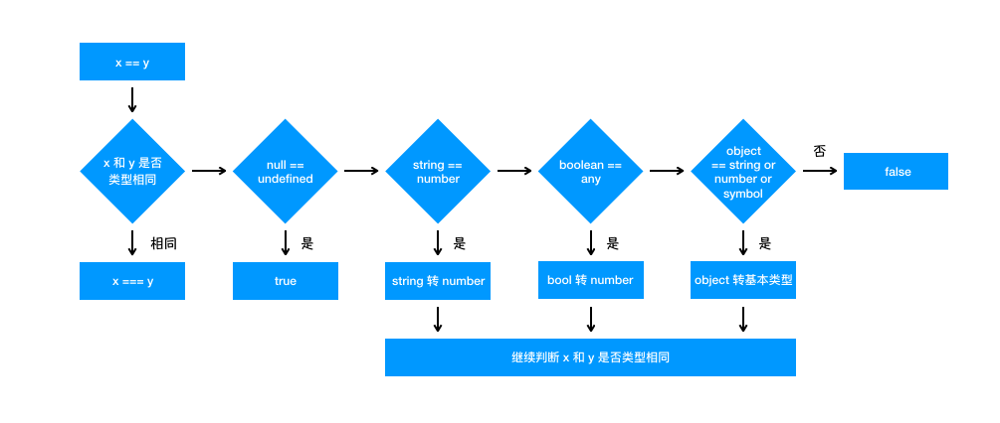

# 比较运算符

## 概述

- **作用**：比较运算符用于比较两个值的大小，然后返回一个布尔值，表示是否满足指定的条件。
- **规则**：比较运算符可以比较各种类型的值（通过 Number()转换），不仅仅是数值。

```javascript
2 > 1; // true
```

- **分类**
  JavaScript 一共提供了 8 个比较运算符。

  - `>` 大于运算符
  - `<` 小于运算符
  - `<=` 小于或等于运算符
  - `>=` 大于或等于运算符
  - `==` 相等运算符
  - `===` 严格相等运算符
  - `!=` 不相等运算符
  - `!==` 严格不相等运算符

这八个比较运算符分成两类：相等比较和非相等比较。

两者的规则是不一样的，对于非相等的比较，算法是先看两个运算子是否都是字符串，如果是的，就按照字典顺序比较（实际上是比较 Unicode 码点）；否则，将两个运算子都转成数值，再比较数值的大小。

## 非相等运算符

### 字符串的比较

**规则如下：**

- 字符串按照字典顺序进行比较。JavaScript 引擎内部首先比较首字符的 Unicode 码点。如果相等，再比较第二个字符的 Unicode 码点，以此类推。

```javascript
"cat" > "dog"; // false
"cat" > "catalog"; // false

"cat" > "Cat"; // true'
```

上面代码中，小写的`c`的 Unicode 码点（`99`）大于大写的`C`的 Unicode 码点（`67`），所以返回`true`。

- 由于所有字符都有 Unicode 码点，因此汉字也可以比较。

```javascript
"大" > "小"; // false
```

上面代码中，“大”的 Unicode 码点是 22823，“小”是 23567，因此返回`false`。

### 非字符串的比较

如果两个运算子之中，至少有一个不是字符串，需要分成以下两种情况。

**（1）原始类型值**
**规则如下：**

- 如果两个运算子都是原始类型的值，则是先转成数值（`Number()`）再比较。

```javascript
5 > "4"; // true
// 等同于 5 > Number('4')
// 即 5 > 4

true > false; // true
// 等同于 Number(true) > Number(false)
// 即 1 > 0

2 > true; // true
// 等同于 2 > Number(true)
// 即 2 > 1
```

上面代码中，字符串和布尔值都会先转成数值，再进行比较。

- 这里需要注意与`NaN`的比较。任何值（包括`NaN`本身）与`NaN`比较，返回的都是`false`。

```javascript
1 > NaN; // false
1 <= NaN; // false
"1" > NaN; // false
"1" <= NaN; // false
NaN > NaN; // false
NaN <= NaN; // false
```

**（2）对象**
**规则如下：**

- 如果运算子是对象，会转为原始类型的值，再进行比较。

对象转换成原始类型的值，算法是先调用`valueOf`方法；如果返回的还是对象，再接着调用`toString`方法，详细解释参见《数据类型的转换》一章。

```javascript
var x = [2];
x > "11"; // true
// 等同于 [2].valueOf().toString() > '11'
// 即 '2' > '11'

x.valueOf = function () {
  return "1";
};
x > "11"; // false
// 等同于 [2].valueOf() > '11'
// 即 '1' > '11'
```

两个对象之间的比较也是如此。

```javascript
[2] >
  [1][2] > // 即 '2' > '1' // 等同于 [2].valueOf().toString() > [1].valueOf().toString() // true
  [11](
    // true
    // 等同于 [2].valueOf().toString() > [11].valueOf().toString()
    // 即 '2' > '11'

    { x: 2 }
  ) >=
  { x: 1 }; // true
// 等同于 { x: 2 }.valueOf().toString() >= { x: 1 }.valueOf().toString()
// 即 '[object Object]' >= '[object Object]'
```

## 严格相等运算符

JavaScript 提供两种相等运算符：`==`和`===`。
**区别：**

- 相同类型：相等运算符（`==`）用来比较相同类型的数据时，与严格相等（`===`）运算符完全一样。
- 不同类型：如果两个值不是同一类型，严格相等运算符（`===`）直接返回`false`，而相等运算符（`==`）会将它们转换成同一个类型，再用严格相等运算符（`===`）进行比较。

本节介绍严格相等运算符的算法。

**（1）不同类型的值**
**规则如下：**

- 如果两个值的类型不同，直接返回`false`。

```javascript
1 === "1"; // false
true === "true"; // false
```

**（2）同一类的原始类型值**
**规则如下：**

- 同一类型的原始类型的值（数值、字符串、布尔值）比较时，值相同就返回`true`，值不同就返回`false`。

```javascript
1 === 0x1; // true
```

上面代码比较十进制的`1`与十六进制的`1`，因为类型和值都相同，返回`true`。

- 需要注意的是，`NaN`与任何值都不相等（包括自身）。另外，正`0`等于负`0`。

```javascript
(NaN ===
  NaN + // false
    0) ===
  -0; // true
```

**（3）复合类型值**
**规则如下：**

- 两个复合类型（对象、数组、函数）的数据比较时，不是比较它们的值是否相等，而是比较它们是否指向同一个地址。
- 如果两个变量引用同一个对象，则它们相等。
- 注意，对于两个对象的比较，严格相等运算符比较的是地址，而大于或小于运算符比较的是值。

```javascript
// 【1】
{} === {} // false
[] === [] // false
(function () {} === function () {}) // false


// 【2】
var v1 = {};
var v2 = v1;
v1 === v2 // true


// 【3】
var obj1 = {};
var obj2 = {};
obj1 > obj2 // false
obj1 < obj2 // false
obj1 === obj2 // false
// 上面的三个比较，前两个比较的是值，最后一个比较的是地址，所以都返回`false`。
```

**（4）undefined 和 null**

`undefined`和`null`与自身严格相等。

```javascript
undefined === undefined; // true
null === null; // true
```

由于变量声明后默认值是`undefined`，因此两个只声明未赋值的变量是相等的。

```javascript
var v1;
var v2;
v1 === v2; // true
```

## 严格不相等运算符

严格相等运算符有一个对应的“严格不相等运算符”（`!==`），它的算法就是先求严格相等运算符的结果，然后返回相反值。

```javascript
1 !== "1"; // true
// 等同于
!(1 === "1");
```

上面代码中，感叹号`!`是求出后面表达式的相反值。

## 相等运算符

相等运算符用来比较相同类型的数据时，与严格相等运算符完全一样。

```javascript
1 == 1.0;
// 等同于
1 === 1.0; // true
```

比较不同类型的数据时，相等运算符会先将数据进行类型转换，然后再用严格相等运算符比较。下面分成四种情况，讨论不同类型的值互相比较的规则。

**（1）原始类型值**

原始类型的值会转换成数值再进行比较。

```javascript
1 == true; // true
// 等同于 1 === Number(true)

0 == false; // true
// 等同于 0 === Number(false)

2 == true; // false
// 等同于 2 === Number(true)

2 == false; // false
// 等同于 2 === Number(false)

"true" == true; // false
// 等同于 Number('true') === Number(true)
// 等同于 NaN === 1

"" == 0; // true
// 等同于 Number('') === 0
// 等同于 0 === 0

"" == false; // true
// 等同于 Number('') === Number(false)
// 等同于 0 === 0

"1" == true; // true
// 等同于 Number('1') === Number(true)
// 等同于 1 === 1

"\n  123  \t" == 123; // true
// 因为字符串转为数字时，省略前置和后置的空格
```

上面代码将字符串和布尔值都转为数值，然后再进行比较。具体的字符串与布尔值的类型转换规则，参见《数据类型转换》一章。

**（2）对象与原始类型值比较**

对象（这里指广义的对象，包括数组和函数）与原始类型的值比较时，对象转换成原始类型的值，再进行比较。

```javascript
// 对象与数值比较时，对象转为数值
(((([1] == (1)[1]) == // 对象与字符串比较时，对象转为字符串 // 等同于 Number([1]) == 1 // true
  "1"[ // true
    // 等同于 String([1]) == '1'
    (1, 2)
  ]) ==
  "1,2"[1]) == // 对象与布尔值比较时，两边都转为数值 // 等同于 String([1, 2]) == '1,2' // true
  true[2]) == // 等同于 Number([1]) == Number(true) // true
  true; // false
// 等同于 Number([2]) == Number(true)
```

上面代码中，数组`[1]`与数值进行比较，会先转成数值，再进行比较；与字符串进行比较，会先转成字符串，再进行比较；与布尔值进行比较，对象和布尔值都会先转成数值，再进行比较。

**（3）undefined 和 null**

`undefined`和`null`与其他类型的值比较时，结果都为`false`，它们互相比较时结果为`true`。

```javascript
false == null; // false
false == undefined; // false

0 == null; // false
0 == undefined; // false

undefined == null; // true
```

**（4）相等运算符的缺点**

相等运算符隐藏的类型转换，会带来一些违反直觉的结果。

```javascript
0 == ""; // true
0 == "0"; // true

2 == true; // false
2 == false; // false

false == "false"; // false
false == "0"; // true

false == undefined; // false
false == null; // false
null == undefined; // true

" \t\r\n " == 0; // true
```

上面这些表达式都不同于直觉，很容易出错。因此建议不要使用相等运算符（`==`），最好只使用严格相等运算符（`===`）。

## 不相等运算符

相等运算符有一个对应的“不相等运算符”（`!=`），它的算法就是先求相等运算符的结果，然后返回相反值。

```javascript
1 != "1"; // false

// 等同于
!(1 == "1");
```

## Tips

### 判断 == 相等运算符

**规则如下：**

- 原始类型值：原始类型的值会转换成数值（Number）再进行比较。
- 对象与原始类型值比较：对象与原始类型的值比较时，对象转换成原始类型的值，再进行比较。
- undefined 和 null：`undefined`和`null`与其他类型的值比较时，结果都为`false`，它们互相比较时结果为`true`。
  

```js
"" == null; // false
0 == null; // false
false == null; // false
NaN == null; // false
null == null; // true
undefined == undefined; // true
undefined === undefined; // true
null === null; // true
undefined == null; // true
undefined === null; // fasle
NaN == NaN // false
NaN === NaN // false


[] == [] // false
[1,2,3] == '1,2,3' // === String([1,2,3]) == '1,2,3'   true
```

### 大于小于号比较

所以一些 table 数值列的比较大小，可以直接比较或者包一个 Number 比较

```jsx
const falseEleList = [0, false, "", null, undefined, NaN];

const testFun = () => {
  falseEleList.forEach((v) => {
    falseEleList.forEach((item) => {
      if (v < item) {
        console.log(`v=[${v}] 小于 item=[${item}]`);
      }
    });
  });
};
testFun(); // 没有输出，换成大于号也是如此
```
