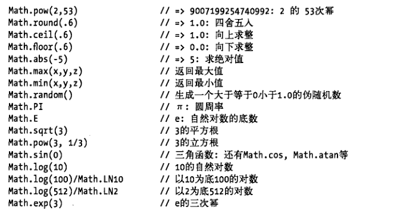

# Math 对象
- **作用：** `Math`是 JavaScript 的原生对象，提供各种数学功能。
- **注意：** 该对象不是构造函数，**不能生成实例，所有的属性和方法都必须在`Math`对象上调用**。

## 静态属性

`Math`对象的静态属性，提供以下一些数学常数。

- `Math.E`：常数`e`。
- `Math.LN2`：2 的自然对数。
- `Math.LN10`：10 的自然对数。
- `Math.LOG2E`：以 2 为底的`e`的对数。
- `Math.LOG10E`：以 10 为底的`e`的对数。
- `Math.PI`：常数`π`。
- `Math.SQRT1_2`：0.5 的平方根。
- `Math.SQRT2`：2 的平方根。

```javascript
Math.E // 2.718281828459045
Math.LN2 // 0.6931471805599453
Math.LN10 // 2.302585092994046
Math.LOG2E // 1.4426950408889634
Math.LOG10E // 0.4342944819032518
Math.PI // 3.141592653589793
Math.SQRT1_2 // 0.7071067811865476
Math.SQRT2 // 1.4142135623730951
```

这些属性都是只读的，不能修改。

## 静态方法

`Math`对象提供以下一些静态方法。

- `Math.abs()`：绝对值
- `Math.ceil()`：向上取整
- `Math.floor()`：向下取整
- `Math.max()`：最大值
- `Math.min()`：最小值
- `Math.pow()`：幂运算
- `Math.sqrt()`：平方根
- `Math.log()`：自然对数
- `Math.exp()`：`e`的指数
- `Math.round()`：四舍五入
- `Math.random()`：随机数

### Math.abs()

`Math.abs`方法返回参数值的绝对值。

```javascript
Math.abs(1) // 1
Math.abs(-1) // 1
```

### Math.max()，Math.min()

`Math.max`方法返回参数之中最大的那个值，`Math.min`返回最小的那个值。如果参数为空, `Math.min`返回`Infinity`, `Math.max`返回`-Infinity`。

```javascript
Math.max(2, -1, 5) // 5
Math.min(2, -1, 5) // -1
Math.min() // Infinity
Math.max() // -Infinity
```

### Math.floor()，Math.ceil()

`Math.floor`方法返回小于或等于参数值的最大整数（地板值）。

```javascript
Math.floor(3.2) // 3
Math.floor(-3.2) // -4
```

`Math.ceil`方法返回大于或等于参数值的最小整数（天花板值）。

```javascript
Math.ceil(3.2) // 4
Math.ceil(-3.2) // -3
```

这两个方法可以结合起来，实现一个总是返回数值的整数部分的函数。

```javascript
function ToInteger(x) {
  x = Number(x);
  return x < 0 ? Math.ceil(x) : Math.floor(x);
}

ToInteger(3.2) // 3
ToInteger(3.5) // 3
ToInteger(3.8) // 3
ToInteger(-3.2) // -3
ToInteger(-3.5) // -3
ToInteger(-3.8) // -3
```

上面代码中，不管正数或负数，`ToInteger`函数总是返回一个数值的整数部分。

### Math.round()

`Math.round`方法用于四舍五入。

```javascript
Math.round(0.1) // 0
Math.round(0.5) // 1
Math.round(0.6) // 1

// 等同于
Math.floor(x + 0.5)
```

注意，它对负数的处理（主要是对`0.5`的处理）。

```javascript
Math.round(-1.1) // -1
Math.round(-1.5) // -1
Math.round(-1.6) // -2
```

### Math.pow()

`Math.pow`方法返回以第一个参数为底数、第二个参数为指数的幂运算值。

```javascript
// 等同于 2 ** 2
Math.pow(2, 2) // 4
// 等同于 2 ** 3
Math.pow(2, 3) // 8
```

下面是计算圆面积的方法。

```javascript
var radius = 20;
var area = Math.PI * Math.pow(radius, 2);
```

### Math.sqrt()

`Math.sqrt`方法返回参数值的平方根。如果参数是一个负值，则返回`NaN`。

```javascript
Math.sqrt(4) // 2
Math.sqrt(-4) // NaN
```

### Math.log()

`Math.log`方法返回以`e`为底的自然对数值。

```javascript
Math.log(Math.E) // 1
Math.log(10) // 2.302585092994046
```

如果要计算以10为底的对数，可以先用`Math.log`求出自然对数，然后除以`Math.LN10`；求以2为底的对数，可以除以`Math.LN2`。

```javascript
Math.log(100)/Math.LN10 // 2
Math.log(8)/Math.LN2 // 3
```

### Math.exp()

`Math.exp`方法返回常数`e`的参数次方。

```javascript
Math.exp(1) // 2.718281828459045
Math.exp(3) // 20.085536923187668
```

### Math.random()
- **作用：** `Math.random()`返回0到1之间的一个伪随机数，可能等于0，但是一定小于1。

```javascript
Math.random() // 0.7151307314634323
```
- **应用：**
  - 任意范围的随机数生成函数如下。
  - 任意范围的随机整数生成函数如下。
  - 返回随机字符的例子如下。
 
```javascript
// 【1】
function getRandomArbitrary(min, max) {
  return Math.random() * (max - min) + min;
}

getRandomArbitrary(1.5, 6.5)
// 2.4942810038223864


// 【2】
function getRandomInt(min, max) {
  return Math.floor(Math.random() * (max - min + 1)) + min;
}

getRandomInt(1, 6) // 5
```


```javascript
// 【3】
function random_str(length) {
  var ALPHABET = 'ABCDEFGHIJKLMNOPQRSTUVWXYZ';
  ALPHABET += 'abcdefghijklmnopqrstuvwxyz';
  ALPHABET += '0123456789-_';
  var str = '';
  for (var i = 0; i < length; ++i) {
    var rand = Math.floor(Math.random() * ALPHABET.length);
    str += ALPHABET.substring(rand, rand + 1);
  }
  return str;
}

random_str(6) // "NdQKOr"
```

上面代码中，`random_str`函数接受一个整数作为参数，返回变量`ALPHABET`内的随机字符所组成的指定长度的字符串。

### 三角函数方法

`Math`对象还提供一系列三角函数方法。

- `Math.sin()`：返回参数的正弦（参数为弧度值）
- `Math.cos()`：返回参数的余弦（参数为弧度值）
- `Math.tan()`：返回参数的正切（参数为弧度值）
- `Math.asin()`：返回参数的反正弦（返回值为弧度值）
- `Math.acos()`：返回参数的反余弦（返回值为弧度值）
- `Math.atan()`：返回参数的反正切（返回值为弧度值）

```javascript
Math.sin(0) // 0
Math.cos(0) // 1
Math.tan(0) // 0

Math.sin(Math.PI / 2) // 1

Math.asin(1) // 1.5707963267948966
Math.acos(1) // 0
Math.atan(1) // 0.7853981633974483
```

## Tips

### 求幂运算
- `Math.pow(x, y)`：x的y次方
- `x << (y - 1)`：x的y次方
- `x**y`：x的y次方

```js
Math.pow(2,3) // 8
2 << 2 // 8
2**3 // 8
```

