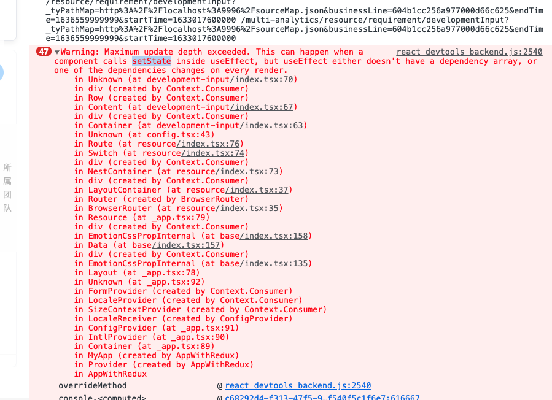

# 简介

> **定义**：
> Hook 是 React 16.8 的新增特性。
> Hook 是一些可以让你在函数组件里“钩入” React state 、refs、生命周期函数等特性的函数

> **作用**：
> 它可以让你在不编写 class 的情况下使用 state、refs、生命周期函数以及其他的 React 特性。

> **特点**：

- 完全可选的
- 100% 向后兼容的。 Hook 不包含任何破坏性改动。
  Hook 和现有代码可以同时工作，你可以渐进式地使用他们。  不用急着迁移到 Hook。我们建议避免任何“大规模重写”，尤其是对于现有的、复杂的 class 组件。
- Hook 不会影响你对 React 概念的理解。
  恰恰相反，Hook 为已知的 React 概念提供了更直接的 API：props， state，context，refs 以及生命周期。Hook 还提供了一种更强大的方式来组合他们。

> **动机：为什么出现**：

- 在组件之间复用状态逻辑很难
  可能要用到 render props （渲染属性）或者 HOC（高阶组件），但无论是渲染属性，还是高阶组件，**都会在原先的组件外包裹一层父容器（一般都是 div 元素），导致层级冗余**
  Hooks：**能在无需修改组件结构的情况下复用状态逻辑（自定义 Hooks ）**
- 复杂组件变得难以理解

  - 在生命周期函数中混杂不相干的逻辑，而相关逻辑又被拆分到多个生命周期函数中。
  - 类组件中到处都是对状态的访问和处理，导致组件难以拆分成更小的组件

- 难以理解的 class

> **Hooks 上手**：

审批组管理页面：增删查改数据。

- class 写法：`TY\structured-finance\src\pages\system\auditingManagement`
- hooks 写法：`TY\BCT\src\pages\ApprovalProcessAuditingManagement`

Hooks 写法代码量少三分之一左右。

# 规则

Hook 本质就是 JavaScript 函数，但是在使用它时需要遵循两条规则。

- 规则一：**只在最顶层使用 Hook
  不要在循环，条件或嵌套函数中调用 Hook**， 确保总是在你的 React 函数的最顶层以及任何 return 之前调用他们。遵守这条规则，你**就能确保 Hook 在每一次渲染中都按照同样的顺序被调用。这让 React 能够在多次的 useState 和 useEffect 调用之间保持 hook 状态的正确**。

- 规则二：只在 React 函数中调用 Hook
  不要在普通的 JavaScript 函数中调用 Hook。遵循此规则，确保组件的状态逻辑在代码中清晰可见。你可以：
  - 在 React 的函数组件中调用 Hook
  - 在自定义 Hook 中调用其他 Hook

> **为什么不能在循环，条件或嵌套函数中调用 Hook**

钩子在设计层面并没有“状态命名”这个动作，也就是说你每生成一个新的状态，React 并不知道这个状态名字叫啥，所以**需要通过顺序来索引到对应的状态值**。

我们把 mountState 和 updateState 做的事情放在一起来看：mountState（首次渲染）构建链表并渲染；updateState 依次遍历链表并渲染。

**hooks 的渲染是通过“依次遍历”来定位每个 hooks 内容的。如果前后两次读到的链表在顺序上出现差异，那么渲染的结果自然是不可控的**。

只要 Hook 的调用顺序在多次渲染之间保持一致，React 就能正确地将内部 state 和对应的 Hook 进行关联。

- [React Hooks: 没有魔法，只是数组](https://zhuanlan.zhihu.com/p/66923924)
- [React Hooks-02 为什么不能在循环、条件或嵌套函数中调用 Hooks](https://juejin.cn/post/6959086536834940965)

# 基本 Hook

## useState 【维护状态】

```jsx
const [state, setState] = useState(initialState);
```

返回一个 state，以及更新 state 的函数。

在初始渲染期间，返回的状态 (state) 与传入的第一个参数 (initialState) 值相同。

setState 函数用于更新 state。它接收一个新的 state 值并将组件的一次重新渲染加入队列。

```jsx
setState(newState);
```

在后续的重新渲染中，useState 返回的第一个值将始终是更新后最新的 state。

> **`Hooks`写法 vs`Class`写法**

```jsx
// `Hooks`写法
import { useState } from "react";

function Example() {
  const [count, setCount] = useState(0);

  return (
    <>
      Count: {count}
      <button onClick={() => setCount(0)}>Reset</button>
      <button onClick={() => setCount(count + 1)}>+</button>
      // 等同于下面这种函数式更新写法
      <button onClick={() => setCount((prevCount) => prevCount + 1)}>+</button>
      <button onClick={() => setCount((prevCount) => prevCount - 1)}>-</button>
    </>
  );
}
```

```jsx
// `Class`写法
class Example extends React.Component {
  constructor(props) {
    super(props);
    this.state = {
      count: 0,
    };
  }

  render() {
    return (
      <div>
        <p>You clicked {this.state.count} times</p>
        <button onClick={() => this.setState({ count: this.state.count + 1 })}>
          Click me
        </button>
      </div>
    );
  }
}
```

### 函数式更新

> **函数式更新:** > **如果新的 state 需要通过使用先前的 state 计算得出，那么可以将函数传递给 setState。该函数将接收先前的 state，并返回一个更新后的值**。

下面的计数器组件示例展示了 setState 的两种用法：

```jsx
function Counter({ initialCount }) {
  const [count, setCount] = useState(initialCount);
  return (
    <>
      Count: {count}
      <button onClick={() => setCount(initialCount)}>Reset</button>
      <button onClick={() => setCount((prevCount) => prevCount - 1)}>-</button>
      <button onClick={() => setCount((prevCount) => prevCount + 1)}>+</button>
    </>
  );
}
```

“+” 和 “-” 按钮采用函数式形式，因为被更新的 state 需要基于之前的 state。但是“重置”按钮则采用普通形式，因为它总是把 count 设置回初始值。

### 规则

- > 【1】跳过 state 更新：与 class 组件中的 `this.setState` 方法不同，**如果你的更新函数返回值与当前 state 完全相同(浅比较)，则随后的重渲染会被完全跳过**。

  调用 setState 的更新函数并传入当前的 state 时，React 将跳过子组件的渲染及 effect 的执行。（因为 React 使用 Object.is 比较算法 来比较 state。）
  所以可以实现在 setState 时走判断逻辑，返回 prev 则不会更新，返回新的值则更新。如下：

  ```jsx
  useEffect(() => {
    setSelectedProject((prev) => {
      if (projectList?.find?.((item) => item?.id === prev?.id)) {
        return prev;
      }
      return undefined;
    });
  }, [projectList]);
  ```

- > 【2】与 class 组件中的 `this.setState` 方法不同，**`useState`不会将旧值自动“合并”并更新对象，它会使用新值覆盖 state**。

  而`this.setState` 会把更新的字段自动合并到 `this.state` 对象中。所以`useState`在更新对象类型时，切记要合并旧的状态，否则旧的状态会丢失，类似于`this.setState`修改对象的写法。你**可以用函数式的 setState 结合展开运算符来达到合并更新对象的效果**。

  ```jsx
  const [state, setState] = useState({});
  setState((prevState) => {
    // 也可以使用 Object.assign
    return { ...prevState, ...updatedValues };
  });
  ```

  `useReducer` 是另一种可选方案，**它更适合用于管理包含多个子值的 state 对象**。

- > 【3】**惰性初始 state**

  `initialState` 参数只会在组件的初始渲染中起作用，后续渲染时会被忽略。如果初始 `state` 需要通过复杂计算获得，则可以传入一个函数，在函数中计算并返回初始的 state，此函数只在初始渲染时被调用：

  ```jsx
  const [state, setState] = useState(() => {
    const initialState = someExpensiveComputation(props);
    return initialState;
  });
  ```

### Tips

- > 【1】**`useState`函数式写法中返回之前可以做一些同步操作**

```jsx
const sprintFilterFun = (v) => handledSprintIds?.includes(v);

setSprintIdList((prev) => {
  const latest = [...prev.filter(sprintFilterFun)];
  updateParamRef("sprintIdList", latest);
  return latest;
});
```

- > 【2】一个 state 受另一个 state 影响用 useEffect 去监听去处理，一个值受另一个 state 影响用 useMemo 去监听去处理，（state 是会有主动更新的，值是只有被动更新的）

- > 【3】**一个 state 状态：B 只有某些情况才随着另一个 state 状态：A 的变化而变化:**

  使用 setState 的`(prev) => {... return xxx}`形式去更新 A，并在其中判断情况去更新 B

```jsx
// 重置右侧文件夹的各种状态
const resetFolderState = useCallback(() => {
  setActiveFolderItems([]);
  setSelectedFolderItem(projectDefaultFolder);
  // setFolderColumnList只能在这里，若在监听selectProject的useEffect中写，
  // 上个选择的空间下展开了几列文件夹，最新选择的空间下就会请求这几列文件夹的详情数据，
  // 但是显然刚切换空间，只希望请求第一列root根文件夹
  setFolderColumnList([projectDefaultFolder]);
}, []);

const onSelectProject = useCallback(
  (project) => {
    setSelectProject((prev) => {
      // 切换不同空间、重置状态
      if (project.id !== prev?.id) {
        resetFolderState();
      }
      return project;
    });
  },
  [resetFolderState]
);

const retSelectProject = useCallback(() => {
  if (context.project) {
    onSelectProject(context.project);
  }
}, [context.project, onSelectProject]);
```

- > 【4】**相关数据合并使用单个 state 对象**

在使用 state 之前，**我们需要考虑状态拆分的「粒度」问题。如果粒度过细，代码就会变得比较冗余。如果粒度过粗，代码的可复用性就会降低**。那么，到底哪些 state 应该合并，哪些 state 应该拆分呢？我总结了下面两点：

1. 将完全不相关的 state 拆分为多组 state。比如 size 和 position。
2. 如果某些 state 是相互关联的，或者需要一起发生改变，就可以把它们合并为一组 state。比如 left 和 top。

```jsx
  const [formData, setFormData] = useState({
    username: null, // 用户名
    roleName: null, // 角色名
    departmentId: null // 部门ID
  })

onChange={e => setFormData(prev => ({ ...prev, username: e.target.value }))}
```

- > 【5】**子组件调用父组件的 setState 函数**

Class 写法参考`异步编程/父子组件函数等待异步调用完成`

```jsx
// Hooks写法，可以直接传setState函数到子组件
onModalCancel = { setFormData };

// 子组件调用
onModalCancel((pre) => ({
  ...pre,
  counterPartyCode: undefined,
  salesCode: undefined,
}));
```

- > 【6】**模拟 setState 第二个参数回调函数**
  > ==正常是没有这个场景的，很可能是因为状态管理、代码组织的有问题==

期望是更新状态后，后续执行函数里面用的状态是最新的，其实并不是，这时候状态还没更新。

通常场景是可以用 useEffect 解决的，特别场景 useEffect 无法解决（**如某些情况下改变状态的值才触发事件，其它情况改变状态，不触发事件**）

从上面这句话可以得到解决方法，即新增一个状态（Boolean 类型），再通过 useEffect 去监听这个状态。

```jsx
// class写法
onReset = () => {
  this.setState(
    {
      filterItem: "username",
      username: null,
      roleName: null,
      departmentId: null,
    },
    () => {
      this.onSearch(); // 函数里会用到filterItem
    }
  );
};
```

```jsx
// hook写法
const [resetFlag, setResetFlag] = useState(false); // 重置按钮flag
const onReset = () => {
  setFormData({
    username: null,
    roleName: null,
    departmentId: null,
  });
  setFilterItem("username");
  setResetFlag((prev) => !prev);
};

// 作用只有一点跟class写法不一样，除了resetFlag更新触发的时候，初始化didmount的时候也会执行一次
useEffect(() => {
  onSearch();
}, [resetFlag]);
```

```jsx
上面待测试一种做法，即resetFlag初始值置为null， 
useEffect(() => {
   Typeof resetFlag === ‘boolean’ &&  onSearch();
  }, [resetFlag]);
```

- > 【7】**我依赖了某些值，但是我不要在初始化就执行回调方法，我要让依赖改变再去执行回调方法**
  > 借助 useRef 钩子解决。

```jsx
const firstLoad = useRef(true);
useEffect(() => {
  if (firstLoad.current) {
    firstLoad.current = false;
    return;
  }
  // do something...
}, [xxx]);
```

- > **参考链接**
  - [简单易懂的 React useState() Hook 指南](https://segmentfault.com/a/1190000021010240?utm_source=tag-newest#item-3)
  - [useState 的使用小结](https://www.haorooms.com/post/reacthooks_usestate)

## useEffect【完成副作用操作】

> **作用**：
> Effect Hook 可以让你在函数组件中执行副作用操作，何时执行：**默认情况下，它在第一次渲染之后和每次更新之后都会执行，React 保证了每次运行 effect 的同时，DOM 都已经更新完毕。**
> 副作用：数据获取，设置订阅以及手动更改 React 组件中的 DOM 都属于副作用

> **本质**：
> 可以看成是`didMount、didUpdate、willUnmount`三个生命周期函数合成的一个 API

该 Hook 接收一个包含命令式、且可能有副作用代码的函数。

**在函数组件主体内（这里指在 React 渲染阶段 render 函数中）改变 DOM、添加订阅、设置定时器、记录日志以及执行其他包含副作用的操作都是不被允许的**，因为这可能会产生莫名其妙的 bug 并破坏 UI 的一致性。

使用 useEffect 完成副作用操作。**赋值给 useEffect 的函数会在组件渲染到屏幕之后执行**。你可以把 effect 看作从 React 的纯函数式世界通往命令式世界的逃生通道。

**默认情况下，effect 将在每轮渲染结束后执行，但你可以选择让它在只有某些值改变的时候才执行**。

### 两种副作用操作

> **副作用操作分类**：
>
> - 无需清除的 effect：
>   只想**在 React 更新 DOM 之后运行一些额外的代码。比如发送网络请求，手动变更 DOM，记录日志，这些都是常见的无需清除的操作**。因为我们在执行完这些操作之后，就可以忽略他们了。
> - 需要清除的 effect：
>   还有一些副作用是需要清除的。例如订阅外部数据源。这种情况下，清除工作是非常重要的，可以防止引起内存泄露！

> 【1】无需清除的 effect 的示例：使用 class 和 hook

在 React class 中，我们把副作用操作放到 componentDidMount 和 componentDidUpdate 函数中。回到示例中，这是一个 React 计数器的 class 组件。它在 React 对 DOM 进行操作之后，立即更新了 document 的 title 属性。

```jsx
// ...
componentDidMount() {
  document.title = `You clicked ${this.state.count} times`;
}
componentDidUpdate() {
  document.title = `You clicked ${this.state.count} times`;
}
```

注意，在这个 class 中，**我们需要在两个生命周期函数中编写重复的代码**。

这是因为很多情况下，**我们希望在组件加载和更新时执行同样的操作**。从概念上说，我们希望它在每次渲染之后执行 —— 但 React 的 class 组件没有提供这样的方法。**即使我们提取出一个方法，我们还是要在两个地方调用它**。

现在让我们来看看如何使用 useEffect 执行相同的操作。

```jsx
// ...
const [count, setCount] = useState(0);

useEffect(() => {
  document.title = `You clicked ${count} times`;
});
```

**默认情况下，它在第一次渲染之后和每次更新之后都会执行**。（我们稍后会谈到如何控制它。）你可能会更容易接受 effect 发生在“渲染之后”这种概念，不用再去考虑“挂载”还是“更新”。**React 保证了每次运行 effect 的同时，DOM 都已经更新完毕**。

> 【2】需要清除的 effect 的示例：使用 class 和 hook，见官网

你可能认为需要单独的 effect 来执行清除操作。**但由于添加和删除订阅的代码的紧密性，所以 useEffect 的设计是在同一个地方执行**。如果你的 effect 返回一个函数，React 将会在执行清除操作时调用它：

为什么要在 effect 中返回一个函数？ **这是 effect 可选的清除机制。每个 effect 都可以返回一个清除函数**。如此可以将添加和移除订阅的逻辑放在一起。它们都属于 effect 的一部分。

React 何时清除 effect？ **React 会在组件卸载的时候执行清除操作**。

### effect 的条件执行 = 性能优化

> **依赖数组**：useEffect 的第二个参数，依赖数组中的变量改变才会触发 effect 的执行
>
> - 什么都不传
>   组件每次 render 之后 useEffect 都会调用，相当于 `componentDidMount 和 componentDidUpdate`
> - 传递一个空数组（[]）
>   只运行一次的 effect（仅在组件挂载和卸载时执行），相当于 `componentDidMount 和 componentWillUnmount`，effect 内部的 props 和 state 就会一直持有其初始值。
> - 传递一个非空数组（[xx]）
>   传入一个变量数组，只有其中包括的变量变动时，useEffect 才会执行，**而且这个比较变量是浅比较，如果 state 是一个对象，那么对象只要指向不发生变化，那么就不会执行 effect 里面的函数**。

默认情况下，effect 会在每轮组件渲染完成后执行。这样的话，一旦 effect 的依赖发生变化，它就会被重新创建。

**每次渲染后都执行清理或者执行 effect 可能会导致性能问题**。在 class 组件中，我们可以通过在 componentDidUpdate 中添加对 prevProps 或 prevState 的比较逻辑解决：

```jsx
componentDidUpdate(prevProps, prevState) {
  if (prevState.count !== this.state.count) {
    document.title = `You clicked ${this.state.count} times`;
  }
}
```

这是很常见的需求，所以它被内置到了 useEffect 的 Hook API 中。如果某些特定值在两次重渲染之间没有发生变化，你可以通知 React 跳过对 effect 的调用，只要传递数组作为 useEffect 的第二个可选参数即可：

```jsx
useEffect(() => {
  document.title = `You clicked ${count} times`;
}, [count]); // 仅在 count 更改时更新
```

如果你要使用此优化方式，**请确保依赖数组中包含了所有外部作用域中会随时间变化并且在 effect 中使用的变量，否则你的代码会引用到先前渲染中的旧变量**。

### 提示

> 【1】使用多个 Effect 实现关注点分离

**使用 Hook 其中一个目的就是要解决 class 中生命周期函数经常包含不相关的逻辑，但又把相关逻辑分离到了几个不同方法中的问题**。

那么 Hook 如何解决这个问题呢？就像你可以使用多个 state 的 Hook 一样，你也可以使用多个 effect。这会将不相关逻辑分离到不同的 effect 中。

**Hook 允许我们按照代码的用途分离他们**， 而不是像生命周期函数那样。React 将按照 effect 声明的顺序依次调用组件中的每一个 effect。

> 【2】**清除 effect**

通常，组件卸载时需要清除 effect 创建的诸如订阅或计时器 ID 等资源。要实现这一点，useEffect 函数需返回一个清除函数。

**为防止内存泄漏，清除函数会在组件卸载前执行。另外，如果组件多次渲染（通常如此），则在执行下一个 effect 之前，上一个 effect 就已被清除**。在上述示例中，意味着组件的每一次更新都会创建新的订阅。若想避免每次更新都触发 effect 的执行

> 【3】**effect 的执行时机**

详细见[官网](https://zh-hans.reactjs.org/docs/hooks-reference.html#usestate)

与 componentDidMount、componentDidUpdate 不同的是，**传给 useEffect 的函数会在浏览器完成布局与绘制之后，在一个延迟事件中被调用。这使得它适用于许多常见的副作用场景，比如设置订阅和事件处理等情况**，因为绝大多数操作不应阻塞浏览器对屏幕的更新。

然而，并非所有 effect 都可以被延迟执行。例如，一个对用户可见的 DOM 变更就必须在浏览器执行下一次绘制前被同步执行，这样用户才不会感觉到视觉上的不一致。（概念上类似于被动监听事件和主动监听事件的区别。）React 为此提供了一个额外的 useLayoutEffect Hook 来处理这类 effect。它和 useEffect 的结构相同，区别只是调用时机不同。

此外，从 React 18 开始，当它是离散的用户输入（如点击）的结果时，或者当它是由 flushSync 包装的更新结果时，传递给 useEffect 的函数将在屏幕布局和绘制之前同步执行。这种行为便于事件系统或 flushSync 的调用者观察该效果的结果。

### Tips

- > 【1】**`useLifecycles`相当于 DidMount**

除了 useEffect 的第二个参数传空数组[]外，使用`useLifecycles`  也相当于是执行 DidMount。

```jsx
import useLifecycles from "react-use/lib/useLifecycles";
useLifecycles(async () => {
  fetchTable();
});
```

# 额外的 Hook

## useMemo 【缓存值】

> **定义：**
> 返回一个 memoized 值。**把“创建”函数和依赖项数组作为参数传入 useMemo，它仅会在某个依赖项改变时才重新计算 memoized 值。这种优化有助于避免在每次渲染时都进行高开销的计算**。

```js
const memoizedValue = useMemo(() => computeExpensiveValue(a, b), [a, b]);
```

useMemo 的使用场景主要是用来缓存计算量比较大的函数结果，可以避免不必要的重复计算，有过 vue 的使用经历同学可能**会觉得跟 Vue 里面的计算属性有异曲同工的作用**。

> **规则：**

- 【1】只能做渲染相关操作，不能有副作用
  记住，**传入 useMemo 的函数会在渲染期间执行（而不是像 useEffect 是渲染之后）。请不要在这个函数内部执行与渲染无关的操作，诸如副作用这类的操作属于 useEffect 的适用范畴，而不是 useMemo**。
- 【2】**如果没有提供依赖项数组，useMemo 在每次渲染时都会计算新的值**。

- 【3】仅是性能优化的手段，不是保证
  你可以把 useMemo 作为性能优化的手段，但不要把它当成语义上的保证。将来，React 可能会选择“遗忘”以前的一些 memoized 值，并在下次渲染时重新计算它们，比如为离屏组件释放内存。**先编写在没有 useMemo 的情况下也可以执行的代码 —— 之后再在你的代码中添加 useMemo，以达到优化性能的目的**。

> **实例一：缓存一个本应该写在 render 中的 JSX**

```jsx
// 收藏空间
  const starProject = useMemo(() => {
    if (project?.detail?.isCollectionItems) {
      return (
        <Tooltip title={i18n.cancelColleation}>
          <div
            onClick={() => addOrRemoveColleactionProject(project?.detail!, false)}
          >
            <StarFilled />
          </div>
        </Tooltip>
      )
    } else {
      return (
        <Tooltip title={i18n.colleaction}>
          <div
            onClick={() => addOrRemoveColleactionProject(project?.detail!, true)}
          >
            <StarOutlined />
          </div>
        </Tooltip>
      )
    }
  }, [addOrRemoveColleactionProject, i18n.cancelColleation, i18n.colleaction, project])
```

> **实例二**

```jsx
const handledData = useMemo(
  () =>
    (data || [])?.reduce((t: any[], item) => {
      const { executor, executorId, orgName, requirementDevelopDetailList } =
        item;
      const summaryItem = {
        executor,
        orgName,
        executorId,
        ...(requirementDevelopDetailList?.shift() || {}),
        date: "汇总",
      };
      return t.concat(
        summaryItem,
        requirementDevelopDetailList?.map((detailItem) => ({
          ...detailItem,
          executorId: `${executorId}${detailItem.date}`,
        }))
      );
    }, []),
  [data]
);
```

## useCallback【缓存函数】

> **定义：**
> 返回一个 memoized 回调函数。**把内联回调函数及依赖项数组作为参数传入 useCallback，它将返回该回调函数的 memoized 版本，该回调函数仅在某个依赖项改变时才会更新**。当你把回调函数传递给经过优化的并使用引用相等性去避免非必要渲染（例如 shouldComponentUpdate）的子组件时，它将非常有用。

> **本质：**
> 可以说是 useMemo 的语法糖，能用 useCallback 实现的，都可以使用 useMemo
> **`useCallback(fn, deps)` 相当于`useMemo(() => fn, deps)`**。

```js
const memoizedCallback = useCallback(() => {
  doSomething(a, b);
}, [a, b]);
```

在 react 中我们经常面临一个子组件渲染优化的问题。**尤其是在向子组件传递函数 props 时，每次 render 都会创建新函数，导致子组件不必要的渲染，浪费性能**，这个时候，就是 useCallback 的用武之地了，**useCallback 可以保证，无论 render 多少次，我们的函数都是同一个函数**，减小不断创建的开销，具体如何使用看下面实例一。
[React 函数式组件性能优化指南](https://mp.weixin.qq.com/s/mpL1MxLjBqSO49TRijeyeg)。

> **实例一：父组件向子组件传递函数 props 时，会引发不必要渲染**

```jsx
// 父组件
import Child from "./child";
function App() {
  const [title, setTitle] = useState("这是一个 title");
  const [subtitle, setSubtitle] = useState("我是一个副标题");

  const callback = () => {
    setTitle("标题改变了");
  };
  return (
    <div className="App">
      <h1>{title}</h1>
      <h2>{subtitle}</h2>
      <button onClick={() => setSubtitle("副标题改变了")}>改副标题</button>
      <Child onClick={callback} name="桃桃" />
    </div>
  );
}
```

```jsx
// 子组件
function Child(props) {
  console.log(props);
  return (
    <>
      <button onClick={props.onClick}>改标题</button>
      <h1>{props.name}</h1>
    </>
  );
}

export default React.memo(Child);
```

点击`改副标题`这个 button 之后，副标题会变为「副标题改变了」，并且控制台会再次打印出桃桃，**这就证明了子组件又重新渲染了，但是子组件没有任何变化，那么这次 Child 组件的重新渲染就是多余的**，那么如何避免掉这个多余的渲染呢？（传递给子组件的 onClick 函数用 useCallBack 包裹即可）

原因：当父组件重新渲染的时候，传递给子组件的 props 发生了改变，再看传递给 Child 组件的就两个属性，一个是 name，一个是 onClick ，name 是传递的常量，不会变，变的就是 onClick 了，**为什么传递给 onClick 的 callback 函数会发生改变呢？在文章的开头就已经说过了，在函数式组件里每次重新渲染，函数组件都会重头开始重新执行，那么这两次创建的 callback 函数肯定发生了改变，所以导致了子组件重新渲染**。

> **实例二**

```js
const prevDef = useCallback((e) => {
  e.stopPropagation();
  e.preventDefault();
}, []);

// 恢复空间
const recoverProject = useCallback(
  (e) => {
    prevDef(e);
    // 删除空间和恢复空间的权限保持一致
    canDel && handleRecover?.({ id, name });
  },
  [prevDef, id, canDel, name, handleRecover]
);
```

## useRef 【访问 DOM/存数据】

> **定义：**
> useRef **返回一个可变的 ref 对象，其 .current 属性被初始化为传入的参数（initialValue）**。返回的 ref 对象在组件的整个生命周期内持续存在。
>
> useRef 返回的 ref 对象在组件的整个生命周期内保持不变，**也就是说每次重新渲染函数组件时，返回的 ref 对象都是同一个（使用 React.createRef ，每次重新渲染组件都会重新创建 ref）**

> **两种用法：**
>
> - 获取子组件的实例(只有类组件可用)
> - 保存值，更新不会触发组件从新渲染：在函数组件中的一个全局变量，不会因为重复 render 重复申明， 类似于类组件的 this.xxx

```js
const refContainer = useRef(initialValue);
```

一个常见的用例便是命令式地访问子组件：

```js
function TextInputWithFocusButton() {
  const inputEl = useRef(null);
  const onButtonClick = () => {
    // `current` 指向已挂载到 DOM 上的文本输入元素
    inputEl.current.focus();
  };
  return (
    <>
      <input ref={inputEl} type="text" />
      <button onClick={onButtonClick}>Focus the input</button>
    </>
  );
}
```

**本质上，useRef 就像是可以在其 .current 属性中保存一个可变值的“盒子”**。

你应该熟悉 ref 这一种[访问 DOM](https://zh-hans.reactjs.org/docs/refs-and-the-dom.html) 的主要方式。如果你将 ref 对象以 `<div ref={myRef} />` 形式传入组件，则无论该节点如何改变，React 都会将 ref 对象的 .current 属性设置为相应的 DOM 节点。

然而，useRef() 比 ref 属性更有用。它可以很方便地保存任何可变值，其类似于在 class 中使用实例字段的方式。

这是因为它创建的是一个普通 Javascript 对象。而 **useRef() 和自建一个 {current: ...} 对象的唯一区别是，useRef 会在每次渲染时返回同一个 ref 对象**。

> **规则：**

- 【1】Ref 改变更新`.current` 属性不会引发组件重新渲染
  请记住，==**当 ref 对象内容发生变化时，useRef 并不会通知你。变更 .current 属性不会引发组件重新渲染**==。如果想要在 React 绑定或解绑 DOM 节点的 ref 时运行某些代码，则需要使用[回调 ref](https://zh-hans.reactjs.org/docs/hooks-faq.html#how-can-i-measure-a-dom-node)来实现。

- 【2】ref 在本组件保存值
  useRef 用来保存值的话只能在本组件用，如果传递给子组件，子组件都不会更新，因为父组件都没有更新就更不提子组件了，==**因为 useState 值的更新会触发组件重新渲染，而 useRef 的值`.current`更新不会触发重新渲染**==。所以在本组件用作保存表单控件的值是蛮好的。

### 变更 ref 不会引发渲染问题？？

> **实例一：？？某些情况依赖数组需要监听 ref**

Ref 改变更新.current 属性不会引发组件重新渲染，但是某些用到 ref 的 useCallback 或者 useMemo 中若使用到了 ref.current 对象中的某些属性（假设为属性 A），也需要在依赖数组中加入属性 A，不然的话 A 变了没发触发 useCallback 和 useMemo 的更新。
==出现这种情况，很可能是因为状态管理、代码组织的有问题，需要优化==

```jsx
const searchTypeRef = useRef < any > null; // 搜索类型ref

// 渲染树
const treeData = useMemo(() => {
  if (!businessLineTree.businessLine) return [];
  // 在新建时保持原先展开的节点
  const newExpandedKeys = !searchValue ? [...expandedKeys] : [];
  console.log("newExpandedKeys :>> ", !searchValue, newExpandedKeys);
  console.log("根节点object :>> ", businessLineTree?.businessLine);
  setLoading(true);
  const treeData =
    searchTypeRef.current === "staff" // 这里使用到了searchTypeRef.current，所以需要监听这个ref，且.current是个基础类型就直接监听searchTypeRef.current
      ? [
          transformBusinessTreeForStaff(
            businessLineTree?.businessLine,
            newExpandedKeys,
            null
          ),
        ]
      : [
          transformBusinessTreeForLine(
            businessLineTree?.businessLine,
            newExpandedKeys,
            null
          ),
        ];
  setExpandedKeys([...newExpandedKeys, "com_root"]);
  setTimeout(() => {
    setLoading(false);
  }, 100);
  return treeData.filter(Boolean);
}, [
  businessLineTree.businessLine,
  transformBusinessTreeForLine,
  transformBusinessTreeForStaff,
  setExpandedKeys,
  searchValue,
  searchTypeRef.current, // 不加这个监听，searchTypeRef.current变了之后该useMemo不会触发更新
]);
```

> **实例二：ref 的值 作为 props 传递给子组件**

**ref 的值 作为 props 传递给子组件也是同理，不会引起子组件重新渲染（跟子组件用没用 memo 包裹也没关系），根本原因是父组件都没有重新渲染，即 Ref 改变更新.current 属性不会引发组件重新渲染**。

解决方法：`...展开符`解构对象，使得传递给子组件的 value 属性每次都是新的对象。

```jsx
<WorkTypeFilter
  workTypeConfigs={approvalTypeList}
  // value={approvalTypeIds}
  value={[...(paramRef.current?.commonApprovalType || [])]}
  onChange={(value) => {
    // setApprovalTypeIds
    console.log("value", value);
    paramRef.current = {
      ...paramRef.current,
      commonApprovalType: value,
    };
  }}
/>
```

> **实例三：实例一再次测试结果**

==最新测试结果：监听 currt 或者 current 下的属性（基本/引用）都是没法更新渲染页面的，也没法触发 useMemo 的更新==

但是事件方法中是可以打印最新的 currt 或者 current 下的属性（基本/引用）。

如何解决：事件方法中 setState 更新一个状态即可（`setTestValue(prev => prev + 1)`），此时每次触发事件组件从新 render，current 会渲染最新的。（**最好不要这么做，因为此时看来改用 state 状态更好，还是状态管理、代码组织的有问题**）

```jsx
// 父组件通过ref使用子组件暴露给父组件的.focus属性
const Parent = () => {
  const sonRef = useRef();
  const [testValue, setTestValue] = useState(0); // 让父组件更新的一个state

  const handleFocusClick = () => {
    sonRef.current?.focus?.();
    // setTestValue(prev => prev + 1) // 加上父组件更新的方法，才能在render中打印子组件最新的值（state和静态值）
    console.log("sonRef.current?.sonValue", sonRef.current?.sonValue);
    console.log(
      "sonRef.current?.sonStaticValue",
      sonRef.current?.sonStaticValue
    );
  };

  const handleAddClick = () => {
    sonRef.current?.setSonValue((prev) => prev + 1);
  };

  const showSonValueJSX = useMemo(
    () => <div>父组件展示子组件的state value:{sonRef.current?.sonValue}</div>,
    [sonRef.current?.sonValue]
  );

  console.log("render", sonRef.current?.sonStaticValue);

  return (
    <>
      <FancyInput ref={sonRef} />
      <div onClick={handleFocusClick} style={{ marginTop: 30 }}>
        点击触发子组件中的input的focus
      </div>
      {showSonValueJSX}
      <div>父组件展示子组件的静态属性：{sonRef.current?.sonStaticValue}</div>
      <div onClick={handleAddClick}>父组件点击累加子组件的value:</div>
    </>
  );
};

export default Parent;
```

### state 状态 vs ref 引用

考虑这样一个场景:咱们想要计算组件渲染的次数。

一种简单的实现方法是初始化 countRender 状态，并在每次渲染时更新它(使用 useEffect() hook)。

```jsx
import React, { useState, useEffect } from "react";

function CountMyRenders() {
  const [countRender, setCountRender] = useState(0);

  useEffect(function afterRender() {
    setCountRender((countRender) => countRender + 1);
  });

  return <div>I've rendered {countRender} times</div>;
}
```

useEffect()在每次渲染后调用 afterRender()回调。但是一旦 countRender 状态更新，组件就会重新渲染。**这将触发另一个状态更新和另一个重新渲染，依此类推。会死循环下去**。

可变引用 useRef()保存可变数据，这些数据在更改时不会触发重新渲染，使用可变的引用改造一下<CountMyRenders> ：

```jsx
import React, { useRef, useEffect } from "react";

function CountMyRenders() {
  const [count, setCount] = useState(0);

  const countRenderRef = useRef(1);

  useEffect(function afterRender() {
    countRenderRef.current++;
  });

  return (
    <div>
      rendered {countRenderRef.current} times
      <div
        onClick={() => {
          setCount((prev) => prev + 1);
        }}
      >
        点击重新渲染
      </div>
    </div>
  );
}
```

单击几次按钮来触发重新渲染。每次渲染组件时，countRenderRef 可变引用的值都会使`countRenderRef.current ++`递增。 重要的是，更改不会触发组件重新渲染。

### input 绑定设置 ref 后获取、设置值

> **实例一： 非受控 input 获取值、设置值**

- ref 获取 input 值： `inputRef.current?.state?.value`
- ref 设置 input 值： `inputRef.current?.setValue?.('')`

```jsx
const inputRef = useRef<any>(null) // 搜索内容或贴入内容inputRef


const handleInputChange = useCallback(
    useDebounce(() => {
      searchContentLinkMatch(inputRef.current?.state?.value)
    }, 300),
    [],
  )

const handleLinkContent = async (item, type: string) => {
  const params = {
    type,
    contentId: item?.id!,
    detail: item,
  }
  props?.handlePasteURLLinkContent?.(params)
  inputRef.current?.setValue?.('') // 关联后将input框清空
  setMatchResult(undefined)
}

render (
  <Input
    // autoFocus
    ref={inputRef}
    bordered={false}
    allowClear
    placeholder={placeholder}
    onChange={handleInputChange}
    onPressEnter={handleInputChange}
  />
)

```

> **实例二： 实例一 结合 useDebounce**

需求如下：

- 两个输入框其中一个输入有值，另一个清空

如下，注释的代码表面之前两个 inputSearch 值读写用的是 useState，虽然使用了`handleSearch`这个防抖方法，但是不起作用，因为 onChange 有`// setLineSearchValue(value)`这种更新 state 的操作，防抖就不会生效，而换成下面这种 input 的 ref 的写法，防抖就能生效（即使`handleSearch`方法中也有 setState 的操作）。

```jsx
// 搜索业务线/空间
const handleSearch = useDebounce((value, searchType) => {
  // searchTypeRef.current = searchType
  setSearchType(searchType); // 更新搜索类型
  // 用refMap去更新麻烦，没必要，直接 setSearchValue(value?.trim?.()) 更简单
  // const refMap = {
  //   line: lineSearchInputRef,
  //   project: projectSearchInputRef,
  // };
  // setSearchValue(refMap?.[searchType]?.current?.state?.value?.trim?.());
  setSearchValue(value?.trim?.());
  console.log("value :>> searchType ", value, searchType); // 防抖生效，最多500ms打印一次
}, 500);

return (
  <div className="search-wrapper">
    <Input.Search
      placeholder="搜索业务线"
      // loading={loading && searchTypeRef.current === 'line'}
      // value={lineSearchValue}
      loading={loading && searchType === "line"}
      ref={lineSearchInputRef}
      onChange={(e) => {
        const value = e?.target?.value;
        // setLineSearchValue(value)
        // setProjectSearchValue('')
        projectSearchInputRef.current?.setValue?.(""); // 将空间输入框清空

        console.log("冲冲冲 :>> "); // 这里每次onChange都会触发
        handleSearch(value, "line");
      }}
      className="businessline-input"
    />

    <Input.Search
      placeholder="搜索空间"
      // loading={loading && searchTypeRef.current === 'project'}
      // value={projectSearchValue}
      loading={loading && searchType === "project"}
      ref={projectSearchInputRef}
      onChange={(e) => {
        const value = e?.target?.value;
        // setProjectSearchValue(value)
        // setLineSearchValue('')
        lineSearchInputRef.current?.setValue?.(""); // 将业务线输入框清空
        handleSearch(value, "project");
      }}
    />
  </div>
);
```

## useContext 【使用共享状态】

> **作用**：
> 作用参考 class 组件中的 context
>
> - `useContext(MyContext)` 相当于 class 组件中的 `static contextType = MyContext` 或者 `<MyContext.Consumer>`。
> - ==`useContext(MyContext)` 只是让你能够读取 context 的值以及订阅 context 的变化。你仍然需要在上层组件树中使用 `<MyContext.Provider>` 来为下层组件提供 context==。

```jsx
const value = useContext(MyContext);
```

接收一个 context 对象（React.createContext 的返回值）并返回该 context 的当前值。当前的 context 值由上层组件中距离当前组件最近的 <MyContext.Provider> 的 value prop 决定。

当组件上层最近的 `<MyContext.Provider>` 更新时，该 Hook 会触发重渲染，并使用最新传递给 MyContext provider 的 context value 值。**即使祖先使用 React.memo 或 shouldComponentUpdate，也会在组件本身使用 useContext 时重新渲染**。

别忘记 useContext 的参数必须是 context 对象本身：`useContext(MyContext)`。

> 简单实例：`API实例`实例一简单版

```jsx
// ./contexts/resource-action-context.tsx
import { createContext, useContext } from 'react'

export interface IResourceActionContext {
  createFolder: () => Promise<IResource | undefined>
  remove: (args: { list: IResource[] }) => Promise<boolean>
  rename: (args: { resourceId: string; fileName: string }) => Promise<boolean>
  upload: (args?: { resourceId?: string; multiple?: boolean }) => Promise<boolean>
}

// @ts-ignore // 没有这个creteContext没有默认参数会报错
export const ResourceActionContext = createContext<IResourceActionContext>()


// useContext使用 context
export function useResourceAction() {
  return useContext(ResourceActionContext)
}
```

```jsx
// index.tsx
// 根组件中使用生产者提供属性/方法
function Index() {

/** 删除文件 */
  const remove = useCallback<IResourceActionContext['remove']>(
    async ({ list }) => {
      if (!projectId) return false
      // ...
      return true
    },
    [projectId, refresh, setResourceList],
  )


   /** 创建文件夹 */
  const handleCreateFolder = useCallback<IResourceActionContext['createFolder']>(async () => {
    if (!projectId) return
    // ..
  }, [projectId, parentId, setResourceList])

  /** 文件重命名 */
  const rename = useCallback<IResourceActionContext['rename']>(
    async ({ resourceId, fileName }) => {
      if (!projectId) {
        return false
      }
      // ..
      return true
    },
    [projectId, setResourceList],
  )


  const handleUpload = useCallback<IResourceActionContext['upload']>(
    async ({ resourceId, multiple = false } = {}) => {
      // ..
      return true
    },
    [parentId, projectId, refresh],
  )

  const actions = useMemo(
    () => ({
      rename,
      createFolder: handleCreateFolder,
      remove,
      upload: handleUpload,
    }),
    [handleCreateFolder, handleUpload, remove, rename]
  );

  return (
    <ResourceActionContext.Provider
      value={actions}
    ></ResourceActionContext.Provider>
  );
}
export default Index;
```

```jsx
// 消费者通过useContext使用属性/方法
import { useResourceAction } from '../contexts/resource-action-context'


export const ResourceItem = React.memo(
  ({ resource, selected, viewType, onSelect }: IResourceItemProps) => {
    const { rename, remove, upload } = useResourceAction()

    const handleDelete = useCallback(() => {
      remove({ list: [resource] })
    }, [remove, resource])

    const handleUpdate = useCallback(async () => {
      upload({ multiple: false, resourceId: resource.id })
    }, [upload, resource.id])

    return(
      // ...
    )
  }
）
```

## useReducer【类似 redux】

> **使用场景：**
> 在某些场景下，useReducer 会比 useState 更适用，**当 state 是一些逻辑较复杂且包含多个子值的状态**，或者下一个 state 依赖于之前的 state 等等的特定场景，我们就可以用这个钩子来代替 useState，它的工作方式犹如 Redux。

> **使用方法：**
> useReducer 总共有三个参数
>
> - 第一个参数是 一个 reducer，就是一个函数类似 (state, action) => newState 的函数，传入 上一个 state 和本次的 action
> - 第二个参数是初始 state，也就是默认值，是比较简单的方法
> - 第三个参数是惰性初始化，这么做可以将用于计算 state 的逻辑提取到 reducer 外部，这也为将来对重置 state 的 action 做处理提供了便利
>
> 返回值为[state,dispatch] > `const [state, dispatch] = useReducer(reducer, initialState);`

> **使用实例：**

```jsx
//暴露出去的 type 可以让我们更加的了解，当下我们正在做什么事。

const initialState = [
  { id: 1, name: "张三" },
  { id: 2, name: "李四" },
];

const reducer = (state: any, { type, payload }: any) => {
  switch (type) {
    case "add":
      return [...state, payload];
    case "remove":
      return state.filter((item: any) => item.id !== payload.id);
    case "update":
      return state.map((item: any) =>
        item.id === payload.id ? { ...item, ...payload } : item
      );
    case "clear":
      return [];
    default:
      throw new Error();
  }
};

const List = () => {
  const [state, dispatch] = useReducer(reducer, initialState);
  return (
    <>
      <div style={{ marginBottom: 30 }}>List: {JSON.stringify(state)}</div>
      <button
        onClick={() =>
          dispatch({ type: "add", payload: { id: 3, name: "周五" } })
        }
      >
        add
      </button>
      <button onClick={() => dispatch({ type: "remove", payload: { id: 1 } })}>
        remove
      </button>
      <button
        onClick={() =>
          dispatch({ type: "update", payload: { id: 2, name: "李四-update" } })
        }
      >
        update
      </button>
      <button onClick={() => dispatch({ type: "clear" })}>clear</button>
    </>
  );
};
```

## useImperativeHandle【使用子组件暴露的属性/方法】

> **作用**：
> useImperativeHandle：配合 forwardRef 使用，可以让你在使用 ref 时，自定义暴露给父组件的实例值，不能让父组件想干嘛就干嘛，**可以让我们在父组件调用到子组件暴露出来的属性/方法。**

```jsx
useImperativeHandle(ref, createHandle, [deps]);
```

在大多数情况下，应当避免使用 ref 这样的命令式代码。useImperativeHandle 应当与 forwardRef 一起使用：

```jsx
// 子组件通过useImperativeHandle暴露.focus属性给父组件
const FancyInput = forwardRef((props, ref) => {
  const inputRef = useRef();
  useImperativeHandle(ref, () => ({
    focus: () => {
      console.log("执行useImperativeHandle中的focus方法");
      inputRef.current.focus();
    },
  }));
  return <input ref={inputRef} />;
});
```

```jsx
// 父组件通过ref使用子组件暴露给父组件的.focus属性
const Parent = () => {
  const sonRef = useRef();
  const [testValue, setTestValue] = useState(0); // 让父组件更新的一个state

  const handleFocusClick = () => {
    sonRef.current?.focus?.();
    // setTestValue(prev => prev + 1) // 加上父组件更新的方法，才能在render中打印子组件最新的值（state和静态值）
    console.log("sonRef.current?.sonValue", sonRef.current?.sonValue);
    console.log(
      "sonRef.current?.sonStaticValue",
      sonRef.current?.sonStaticValue
    );
  };

  const handleAddClick = () => {
    sonRef.current?.setSonValue((prev) => prev + 1);
  };

  const showSonValueJSX = useMemo(
    () => <div>父组件展示子组件的state value:{sonRef.current?.sonValue}</div>,
    [sonRef.current?.sonValue]
  );

  console.log("render", sonRef.current?.sonStaticValue);

  return (
    <>
      <FancyInput ref={sonRef} />
      <div onClick={handleFocusClick} style={{ marginTop: 30 }}>
        点击触发子组件中的input的focus
      </div>
      {showSonValueJSX}
      <div>父组件展示子组件的静态属性：{sonRef.current?.sonStaticValue}</div>
      <div onClick={handleAddClick}>父组件点击累加子组件的value:</div>
    </>
  );
};

export default Parent;
```

**测试能否在父组件中展示子组件暴露出来的值：父组件 render 中渲染子组件中的 state 值和静态值都没法渲染（除非父组件再次 render）**，因为父组件先 render 的，这时候别说获取到的 sonRef.current 下面的属性了，就连打印`sonRef.current`都是 undefined。

**但是在父组件的事件方法中获取打印`sonRef.current`下的属性方法都是可以**。（且在事件方法中加上父组件更新 state 的操作`setTestValue(prev => prev + 1)` 即可在 render 中渲染出最新的`sonRef.current`下的属性值，**原因还是 ref 的.current 的改变不会触发组件的重新渲染**）

总结：类似于 vue 在组件上用 ref 标志，然后 this.$refs.xxx 来操作 dom 或者调用子组件值/方法，只是 react 把它“用两个钩子来表示”。

### forwardRef

> React.forwardRef：要访问的是一个组件，操作组件里的具体 DOM 或者访问暴露出的属性方法，我们就需要用到 **React.forwardRef 这个高阶组件，来转发 ref。**

**因为函数组件没有实例，所以函数组件无法像类组件一样可以接收 ref 属性**。

```jsx
function Parent() {
  return (
    <>
      // <Child ref={xxx} /> 这样是不行的
      <Child />
      <button>+</button>
    </>
  );
}
```

forwardRef 可以将父组件中的 ref 对象转发到子组件中的 dom 元素上。子组件接受 props 和 ref 作为参数。

```jsx
function Child(props, ref) {
  return <input type="text" ref={ref} />;
}
Child = React.forwardRef(Child);

function Parent() {
  let [number, setNumber] = useState(0);
  // 在使用类组件的时候，创建 ref 返回一个对象，该对象的 current 属性值为空
  // 只有当它被赋给某个元素的 ref 属性时，才会有值
  // 所以父组件（类组件）创建一个 ref 对象，然后传递给子组件（类组件），子组件内部有元素使用了
  // 那么父组件就可以操作子组件中的某个元素
  // 但是函数组件无法接收 ref 属性 <Child ref={xxx} /> 这样是不行的
  // 所以就需要用到 forwardRef 进行转发
  const inputRef = useRef(); //{current:''}
  function getFocus() {
    inputRef.current.value = "focus";
    inputRef.current.focus();
  }
  return (
    <>
      <Child ref={inputRef} />
      <button onClick={() => setNumber({ number: number + 1 })}>+</button>
      <button onClick={getFocus}>获得焦点</button>
    </>
  );
}
```

## useLayoutEffect【完成副作用操作，会阻塞浏览器绘制】

> **用途：**
> useLayoutEffect：其函数签名与 useEffect 相同，**但它会在所有的 DOM 变更之后同步调用 effect。可以使用它来读取 DOM 布局并同步触发重渲染**。在浏览器执行绘制之前，useLayoutEffect 内部的更新计划将被同步刷新。也就是说它会阻塞浏览器绘制。所以尽可能使用 useEffect 以避免阻塞视觉更新。
>
> 用法和 useEffect 一致，与 useEffect 的差别是执行时机，**useLayoutEffect 是在浏览器 layout 之后，painting (绘制节点)之前执行（和 componentDidMount 以及 componentDidUpdate 执行时机相同）**


> **规则：**

- **useLayoutEffect 会在 浏览器 layout 之后，painting 之前执行**
- **useEffect 在全部渲染完毕后才会执行**
- 其函数签名与 useEffect 相同，但它会在所有的 DOM 变更之后同步调用 effect
- 可以使用它来读取 DOM 布局并同步触发重渲染
- 在浏览器执行绘制之前 useLayoutEffect 内部的更新计划将被同步刷新
- 尽可能使用标准的 useEffect 以避免阻塞视图更新

> **实例：**

```jsx
const LayoutEffectTest = () => {
  const [color, setColor] = useState("red");
  useLayoutEffect(() => {
    alert(color);
    console.log("useLayoutEffect-color", color);
  });
  useEffect(() => {
    console.log("useEffect-color", color);
  });
  return (
    <>
      <div id="myDiv" style={{ background: color }}>
        颜色
      </div>
      <button onClick={() => setColor("red")}>红</button>
      <button onClick={() => setColor("yellow")}>黄</button>
      <button onClick={() => setColor("blue")}>蓝</button>
    </>
  );
};

export default LayoutEffectTest;
```

- [useLayoutEffect](https://juejin.cn/post/6844903985338400782)

# 自定义 Hook

通过自定义 Hook，可以将组件逻辑提取到可重用的函数中。

目前为止，在 React 中有两种流行的方式来共享组件之间的状态逻辑: `render props` 和高阶组件，现在让我们来看看 Hook 是如何在让你不增加组件的情况下解决相同问题的。

> **规则：**
>
> - 自定义 Hook 是一个函数，其名称必须以 “use” 开头，函数内部可以调用其他的 Hook
> - 在两个组件中使用相同的 Hook 会共享 state 吗？不会。
>   自定义 Hook 是一种重用状态逻辑的机制(例如设置为订阅并存储当前值)，**所以每次使用自定义 Hook 时，其中的所有 state 和副作用都是完全隔离的**。
>   **Hook 是一种复用状态逻辑的方式，它不复用 state 本身。事实上 Hook 的每次调用都有一个完全独立的 state**：参考`自定义Hook-实例一`

## 实例一

```jsx
import { getOriginalTaskInitInfo } from 'client/ekko/services/original-task'
import { useCallback, useEffect, useState } from 'react'

export function useOriginalStateFlow() {
  const [info, setInfo] = useState<IOriginalTaskInit>()
  const refresh = useCallback(async () => {
    const response = await getOriginalTaskInitInfo()
    if (response.success) setInfo(response.result)
  }, [])

  useEffect(() => {
    refresh()
  }, [refresh])

  return info?.flow
}


const flow = useOriginalStateFlow()
// 这种自定义hook的请求，只要使用该hook的组件挂载都会触发重新请求（甚至是更新渲染的时候）
```

# Tips

## useState 和 useRef 的区别

- useRef: 在函数组件中保存一个

关于他们的区别，除了 useRef 可以获取 dom 之外：他们都可以声明一个数据，并在 render 中不被重置。

> **区别：**

- useState 的值在每个 rernder 中都是独立存在的。而 useRef.current 则更像是相对于 render 函数的一个全局变量，每次他会保持 render 的最新状态。这种关系更像是 js 一个经典的案例：for 循环中异步打印 i 的值，let 声明的 i 就相当于每个都是独立作用域，互相之间不会干扰。var 则反之。

- ==useState 值的更新会触发组件重新渲染，而 useRef 的 current 不会触发重新渲染==。
- 它们之间的共同点是两者，useState 并且 useRef 在重新渲染后可以记住它们的数据。因此，如果您的变量是决定视图图层渲染的变量，请使用 useState。其他用途 useRef

> **参考链接：**

- [@@@React 入门 useState,useRef,useContent 等 API 讲解](https://segmentfault.com/a/1190000023098947)
- [关于 useState 和 useRef 的区别
  ](https://coding.imooc.com/learn/questiondetail/194075.html)
- [反应：useState 或 useRef？](https://codingdict.com/questions/78928)

## useCallBack/useMemo 的依赖

- useCallBack 包着的函数 A 被别的 useCallBack 包着的函数 B 中使用到时，需要监听 A，即 B 的依赖项也必须含有 A，不然会有错误：数据时好时坏，且坏的时候是之前某次渲染时候用到的数据
  - 如何排查？：==一般都是触发事件的依赖项, 且 render 里打印是对的，函数里面打印就不对了==
- **实例：**

  ```jsx
    const tableSearch = useCallback(
    async (params = {}) => {
      if (!bizLineId) return

      sourceAction.setLoading(true)
      const result = await getAllRequirementDetail({
        bizLineId: bizLineId!,
        limit: paginationData?.pageSize,
        pageIndex: paginationData?.current,
        title: keyword || '',
        requirementIds: requirementIds || [],
        ...params,
      })
      sourceAction.setLoading(false)

      if (result?.success) {
        sourceAction.setData(result?.result?.content!)
        paginationAction.setTotal(result?.result?.total!)
      }
    },
    [
      bizLineId,
      paginationData,
      keyword,
      requirementIds,
    ],

    const onSearch = useCallback(
    (name?: string) => {
      paginationAction.setPage(1, paginationData.pageSize)
      const searchName = name ?? keyword
      tableSearch({
        title: searchName,
        pageIndex: 1,
      })
    },
    [keyword, tableSearch], // 此处若不加tableSearch 就会产生上述问题
  )
  ```

- **实例：**

  - 没加 hooks 依赖提醒的插件时这样写的

  ```jsx
  const onClickTaskTitle = (record) => {
    taskDetailAction.showDialog({
      projectId: record.projectId,
      taskId: record.taskId,
    });
  };

  const tableColumns = useMemo(() => getBugDetailColumns(onClickTaskTitle), []);

  // tableColumns的依赖项悬浮上去会提示：React Hook useMemo has a missing dependency: 'onClickTaskTitle'. Either include it or remove the dependency array.eslintreact-hooks/exhaustive-deps

  // 是因为 tableColumns用useMemo包着，且依赖数组为空，则传给列的是第一次渲染时候的onClickTaskTitle：A，后面每次render onClickTaskTitle 都重新生成了，但是tableColumns传给列的还是A
  ```

  - 于是给 tableColumns 的依赖项数组新增一个 `onClickTaskTitle`，如下，但是还是警告了如下

  ```jsx
  const onClickTaskTitle = (record) => {
    taskDetailAction.showDialog({
      projectId: record.projectId,
      taskId: record.taskId,
    });
  };

  const tableColumns = useMemo(
    () => getBugDetailColumns(onClickTaskTitle),
    [onClickTaskTitle]
  );

  // onClickTaskTitle整个函数提示：The 'onClickTaskTitle' function makes the dependencies of useMemo Hook (at line 432) change on every render. Move it inside the useMemo callback. Alternatively, wrap the definition of 'onClickTaskTitle' in its own useCallback() Hook.eslintreact-hooks/exhaustive-deps

  // 是因为 tableColumns的依赖项数组已经有了onClickTaskTitle，但是每次render onClickTaskTitle 都重新生成了，就会导致tableColumns每次render都重新生成，所以需要把onClickTaskTitle用useCallBack包一下
  ```

  - 于是给 onClickTaskTitle 用 useCallBack 包一下，此时没有任何警告了

  ```jsx
  const onClickTaskTitle = useCallback(
    (record) => {
      taskDetailAction.showDialog({
        projectId: record.projectId,
        taskId: record.taskId,
      });
    },
    [taskDetailAction]
  );

  const tableColumns = useMemo(
    () => getBugDetailColumns(onClickTaskTitle),
    [onClickTaskTitle]
  );
  ```

## 使用 useCallBack 时注意闭包问题

和避免使用 inline function 一样，有时需要使用 useCallback 来优化性能，但是 useCallback 会返回之前的闭包，使用到的局部变量是不会更新的。
举个例子

```jsx
const [count, setCount] = useState(0);
const increaseCount = useCallback(() => {
  setCount(count + 1);
}, []);

// 因为useCallback总是返回第一次render时传入的闭包，increaseCount内访问到的count永远都是0
increaseCount(); // 相当于setCount(1);
increaseCount(); // 无论调用几次都是setCount(1);
```

解决方法就是避免引用外部的局部变量

```jsx
const [count, setCount] = useState(0);
const vRef = useRef(0);
const increaseCount = useCallback(() => {
  // 方法一：传入function的话每次都能拿到最新值
  setCount((prevCount) => prevCount + 1);
  // 方法二：用一个对象来保存，适用于不需要触发更新的情况
  vRef.current += 1;
}, []);

// 方法三：使用useReducer解决
const [count, increase] = useReducer((c, increment) => c + increment, 0);
const increaseCount = useCallback(() => {
  increase(1);
}, []);
```

## 效果时对时不对

基本上就是依赖项没添加，或者初始化用的数据变了之后用的地方没有再取最新的。

## useEffect 不能接收 async 作为回调函数

[如何在 Hooks 中优雅的 Fetch Data](https://juejin.cn/post/6844903985338400782#heading-27)
useEffect 接收的函数，要么返回一个能清除副作用的函数，要么就不返回任何内容。而 async 返回的是 promise。

```jsx
import React, { useState, useEffect } from "react";
import axios from "axios";
function App() {
  const [data, setData] = useState({ hits: [] });

  // 注意 async 的位置
  // 这种写法，虽然可以运行，但是会发出警告
  // 每个带有 async 修饰的函数都返回一个隐含的 promise
  // 但是 useEffect 函数有要求：要么返回清除副作用函数，要么就不返回任何内容
  useEffect(async () => {
    const result = await axios(
      "https://hn.algolia.com/api/v1/search?query=redux"
    );
    setData(result.data);
  }, []);

  // 更优雅的方式
  useEffect(() => {
    const fetchData = async () => {
      const result = await axios(
        "https://hn.algolia.com/api/v1/search?query=redux"
      );
      setData(result.data);
    };
    fetchData();
  }, []);

  return (
    <ul>
      {data.hits.map((item) => (
        <li key={item.objectID}>
          <a href={item.url}>{item.title}</a>
        </li>
      ))}
    </ul>
  );
}
export default App;
```

# 配置

## Hooks 依赖项提醒插件

```jsx
// package.json
 "eslint-plugin-react-hooks": "^4.2.0",
```

```json
{
  "plugins": ["react-hooks"],
  // ...
  "rules": {
    "react-hooks/rules-of-hooks": "error", // 检查 Hook 的规则
    // "react-hooks/exhaustive-deps": "off", // 关闭依赖检查
    "react-hooks/exhaustive-deps": "warn" // 检查 effect 的依赖
  }
}
```

# 报错

## Warning: Maximum update depth exceeded

### 实例

bug 现象：页面 在接口报错时来回切换路由回来的时候页面卡死，
报错如下：

```text
Warning: Maximum update depth exceeded. This can happen when a component calls setState inside useEffect, but useEffect either doesn't have a dependency array, or one of the dependencies changes on every render

// 警告：已超出最大更新深度。 当组件在 useEffect 中调用 setState 时会发生这种情况，
// 但 useEffect 要么没有依赖项数组，要么依赖项之一在每次渲染时发生变化
```



如警告内容，导致的原因是 【==要么没有依赖项数组，要么依赖项之一在每次渲染时发生变化：A==】。

首先根据上图 react 报错提示，是在`./development-input/index.tsx`文件的第 70 行， 而 70 行的代码是`<PMTable {...setSprintIntervalData} />`，所以可以断定是 PMTable 组件出了问题，且是 A，即是 useEffect 的依赖数组导致的问题。

经过试验分析，加 console 之后发现是 useEffect 内调用的函数一直在执行，发现将 data 的 默认值 `[]`去掉之后就不会再死循环了。

组件如下，解决方法为【==去掉 data 的默认值，改为父组件兜底==】

```diff
// 子组件
- const { data = [], bizLineId, setRankingModalVisible, loading } = props
+ const { data, bizLineId, setRankingModalVisible, loading } = props

+const handleDataSource = useCallback(
+  (origin = data) => {
+    setDataSource(radioVal === 'pm' ? origin?.filter((item) => item?.pm) : origin)
+  },
+  [radioVal, data],
+)

// 报错出处的effect，useeffect监听handleDataSource并调用handleDataSource的目的是为了
// 确保初始化后，父组件掉接口后传来的data更新之后子组件用到data的 state: dataSource 能拿
// 到最新数据
+useEffect(() => {
+  handleDataSource()
+}, [handleDataSource])

+const handleStaffFilterClick = useCallback(() => {
+  handleDataSource(
+    data?.filter((item) => {
+      return item?.executorId?.includes(staff || '')
+    }) || [],
+  )
+}, [staff, data, handleDataSource])

```

```diff
// 父组件

const setSprintIntervalData = {
  functionalBizLine: overviewData?.functionalBizLine,
-  data: overviewData?.pmRequirements,
+  data: overviewData?.pmRequirements || [],
  bizLineId: bizLineId!,
  loading: loading!,
  setDevelopInputRankingParams,
  setRankingModalVisible,
}

return (
    <Container>
      <Content style={{ marginLeft: -8, marginRight: -8 }}>
        <PMTable {...setSprintIntervalData} />
      </Content>
    </Container>
  )
```

```jsx
// 修改后的
const ProductDevelopmentInputDetail = memo<IProps>((props) => {
  const { data, bizLineId, setRankingModalVisible, loading } = props
  const [dataSource, setDataSource] = useState<IPMRequirementsItem[]>(data!)
  const [staff, setStaff] = useState<string>()
  const [options, setOptions] = useState<Array<{ label: string; value: string }>>()
  const [radioVal, setRadioVal] = useState('pm')

  const handleRadioChange = useCallback((e?) => {
    const val = e.target.value
    setRadioVal(val)
  }, [])

  const handleDataSource = useCallback(
    (origin = data) => {
      setDataSource(radioVal === 'pm' ? origin?.filter((item) => item?.pm) : origin)
    },
    [radioVal, data],
  )

  useEffect(() => {
    handleDataSource()
  }, [handleDataSource])

  const handleStaffFilterClick = useCallback(() => {
    handleDataSource(
      data?.filter((item) => {
        return item?.executorId?.includes(staff || '')
      }) || [],
    )
  }, [staff, data, handleDataSource])

  const produceStaffOptions = useCallback(async () => {
    if (bizLineId) {
      const { result, success } = await getStaffsByBusinessId(true, { businessLineId: bizLineId })
      if (success) {
        setOptions(genStaffs([result], bizLineId))
      } else {
        setOptions([])
      }
    }
  }, [bizLineId])

  useEffect(() => {
    if (bizLineId) {
      produceStaffOptions()
    }
  }, [bizLineId])

  const handleStaffChange = useCallback((v) => {
    setStaff(v)
  }, [])


  return (
    <Col >
        <ChartContainer>
          <div >
            <div className="title-header">
              <div className="title">各产品经理的需求研发工作量</div>
            </div>
            <div className="filter">
              <Radio.Group onChange={handleRadioChange} value={radioVal}>
                <Radio value="all">全部</Radio>
                <Radio value="pm">只看产品经理</Radio>
              </Radio.Group>
              <Select
                style={{ margin: '0 5px', width: 300 }}
                placeholder="请选择员工"
                value={staff}
                options={options}
                onChange={handleStaffChange}
              />
              <Button
                type="primary"
                shape="circle"
                icon={<SearchOutlined />}
                onClick={handleStaffFilterClick}
              />
            </div>
          </div>
          <div className="card-body">
            <div className="chart-body">
              <Table
                dataSource={dataSource}
                rowKey={(record) => record?.executorId!}
                columns={columns}
              />
            </div>
          </div>
        </ChartContainer>
    </Col>
  )
})

export default ProductDevelopmentInputDetail
```

### 示例分析

问题代码如下：

```jsx
export default (props) => {
  const [detail, option = {}] = props.data;
  const [info, setInfo] = useState({});

  useEffect(() => {
    setInfo({ ...detail, ...option });
  }, [option]);
};
```

当 props.data 的值中没有 option 的时候，option 就是给的默认值`{}`,就死循环了

**原因：**

- 每次 state 更新，页面就会重新渲染。
- 由于在 useEffect 中使用了 setState，执行 useEffect 就会重新渲染。
- 执行到 useEffect 时候，会比对依赖数组，获取 detail 和 option 的值没有依赖，所以页面渲染就会重新取值。
- 由于给 option 值赋了默认值，每次 render 时重新取值就会重新赋值一个空对象
- 但是由于空对象 {} !== {}
- useEffect 依赖于 option, option 更新就会重新执行 useEffect 中的代码
- 所以每次页面重新渲染，option 的值就会变化，导致再次执行 useEffect 中的代码，然后再次重新渲染，进入死循环。页面从而卡死失去响应

**解决方案：**

- 方案一：option 不设置默认值，在使用时进行为空判断
- 方案二：父组件传过来的时候就给默认值，在父组件完成兜底

**参考链接：**

- [UseEffect 死循环问题记录](https://blog.csdn.net/qq_22836769/article/details/110139490)

# 参考链接

- [@React Hook 丨用好这 9 个钩子，所向披靡](https://juejin.cn/post/6895966927500345351#heading-11)
- [@React Hooks 详解 【近 1W 字】+ 项目实战](https://juejin.cn/post/6844903985338400782#heading-27)
- [umi-hooks](https://hooks.umijs.org/zh-CN/hooks/state/use-controllable-value)
- [React Hooks 入门教程-阮一峰](http://www.ruanyifeng.com/blog/2019/09/react-hooks.html)
- [react hooks 踩坑记录](https://frezc.github.io/2019/03/23/react-hooks-traps)
- [React Hooks 完全上手指南](https://zhuanlan.zhihu.com/p/92211533)
- [一文看懂 react hooks 中 useState、useEffect、useContext、useRef、自定义 hook](https://blog.csdn.net/landl_ww/article/details/102158814)
- [React Hooks 你真的用对了吗？](https://zhuanlan.zhihu.com/p/85969406)
