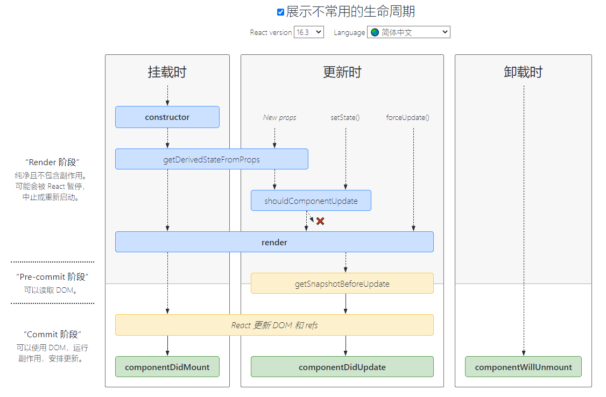
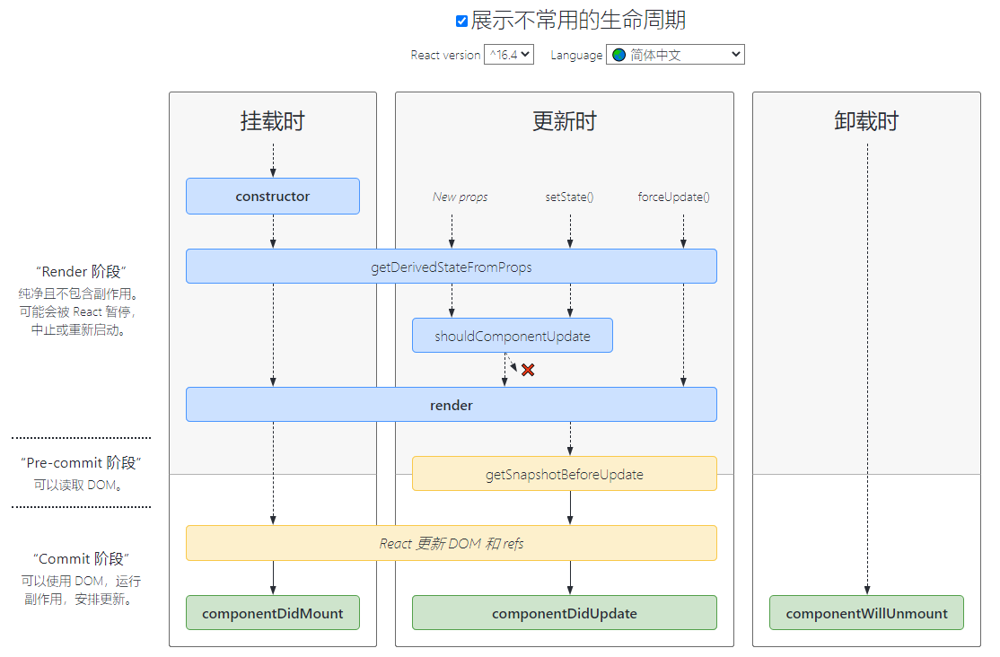

## 背景
React v16.3虽然是一个小版本升级，但是却对React组件生命周期函数有巨大变化，这个话题其实应该早就讲一讲，一直忙，拖到今天才有机会和大家分享一下。

React v16.0刚推出的时候，是增加了一个componentDidCatch生命周期函数，这只是一个增量式修改，完全不影响原有生命周期函数；但是，到了React v16.3，大改动来了，引入了两个新的生命周期函数：
- getDerivedStateFromProps
- getSnapshotBeforeUpdate

先来看React v16.3之前的生命周期函数（图中实际上少了componentDidCatch)，如下图。


这个生命周期函数非常的对称，有componentWilUpdate对应componentDidUpdate，有componentWillMount对应componentDidMount；也考虑到了因为父组件引发渲染可能要根据props更新state的需要，所以有componentWillReceiveProps。

但是，这个生命周期函数的组合在Fiber（[React Fiber是什么](https://zhuanlan.zhihu.com/p/26027085)）之后就显得不合适了，因为，==如果要开启async rendering，在render函数之前的所有函数，都有可能被执行多次==。长期以来，原有的生命周期函数总是会诱惑开发者在render之前的生命周期函数做一些动作，现在这些动作还放在这些函数中的话，有可能会被调用多次，这肯定不是你想要的结果。

总有开发者问我，为什么不在componentWillMount里写AJAX获取数据的功能，他们的观点是，componentWillMount在render之前执行，早一点执行早得到结果。要知道，==在componentWillMount里发起AJAX，不管多快得到结果也赶不上首次render==，而且componentWillMount在服务器端渲染也会被调用到（当然，也许这是预期的结果），这样的IO操作放在componentDidMount里更合适。==在Fiber启用async render之后，更没有理由在componentWillMount里做AJAX，因为componentWillMount可能会被调用多次==，谁也不会希望无谓地多次调用AJAX吧。

## getDerivedStateFromProps
道理说了都明白，==但是历史经验告诉我们，不管多么地苦口婆心教导开发者不要做什么不要做什么，都不如直接让他们干脆没办法做==。

随着getDerivedStateFromProps的推出，同时deprecate了一组生命周期API，包括：
- componentWillReceiveProps
- componentWillMount
- componentWillUpdate

可以看到，==除了shouldComponentUpdate之外，render之前的所有生命周期函数全灭，就因为太多错用滥用这些生命周期函数的做法，预期追求对称的美学，不如来点实际的，让程序员断了在这些生命周期函数里做些不该做事情的念想==。

至于shouldComponentUpdate，如果谁还想着在里面做AJAX操作，那真的是没救了。

**按照官方说法，以前需要利用被deprecate的所有生命周期函数才能实现的功能，都可以通过getDerivedStateFromProps的帮助来实现**。

**这个getDerivedStateFromProps是一个静态函数，所以函数体内不能访问this**，简单说，就是应该一个纯函数，纯函数是一个好东西啊，输出完全由输入决定。同样的输入一定会有同样的输出。

```js
static getDerivedStateFromProps(nextProps, prevState) {
  //根据nextProps和prevState计算出预期的状态改变，返回结果会被送给setState
}
```

看到这样的函数声明，应该感受到React的潜台词：老实做一个运算就行，别在这里搞什么别的动作。

==每当父组件引发当前组件的渲染过程时，getDerivedStateFromProps会被调用，这样我们有一个机会可以根据新的props和之前的state来调整新的state==，如果放在三个被deprecate生命周期函数中实现比较纯，没有副作用的话，基本上搬到getDerivedStateFromProps里就行了；如果不幸做了类似AJAX之类的操作，首先要反省为什么自己当初这么做，然后搬到componentDidMount或者componentDidUpdate里面去。

==所有被deprecate的生命周期函数，目前还凑合着用，但是只要用了，开发模式下会有红色警告，在下一个大版本（也就是React v17)更新时会彻底废弃==。

## getSnapshotBeforeUpdate
React v16.3还引入了一个新的声明周期函数getSnapshotBeforeUpdate，==这函数会在render之后执行，而执行之时DOM元素还没有被更新，给了一个机会去获取DOM信息，计算得到一个snapshot，这个snapshot会作为componentDidUpdate的第三个参数传入==。
```js
getSnapshotBeforeUpdate(prevProps, prevState) {
  console.log('#enter getSnapshotBeforeUpdate');
  return 'foo';
}

componentDidUpdate(prevProps, prevState, snapshot) {
  console.log('#enter componentDidUpdate snapshot = ', snapshot);
}
```
上面这段代码可以看出来这个snapshot怎么个用法，snapshot咋看还以为是组件级别的某个“快照”，其实可以是任何值，到底怎么用完全看开发者自己，getSnapshotBeforeUpdate把snapshot返回，然后DOM改变，然后snapshot传递给componentDidUpdate。

官方给了一个例子，用getSnapshotBeforeUpdate来处理scroll，坦白说，我也想不出其他更常用更好懂的需要getSnapshotBeforeUpdate的例子，这个函数应该大部分开发者都用不上（听得懂我的潜台词吗：不要用！）
## v16.3之后的生命周期函数一览图
[生命周期图网站](https://projects.wojtekmaj.pl/react-lifecycle-methods-diagram/)



可以注意到，说getDerivedStateFromProps取代componentWillReceiveProps是不准确的，因为componentWillReceiveProps只在Updating过程中才被调用，而且只在因为父组件引发的Updating过程中才被调用；而getDerivedStateFromProps在Updating和Mounting过程中都会被调用。

此外，从上面这个也看得出来，同样是Updating过程，如果是因为自身setState引发或者forceUpdate引发，而不是不由父组件引发，那么getDerivedStateFromProps也不会被调用。

这其实容易引发一些问题，不用仔细想，光是由此让开发者不得不理解这乱七八糟的差异，就可以知道这是一个大坑！

还好，==React很快意识到这个问题，在React v16.4中改正了这一点，改正的结果，就是让getDerivedStateFromProps无论是Mounting还是Updating，也无论是因为什么引起的Updating，全部都会被调用==。

这样简单多了！

所以，上面的生命周期函数一览图要改一改。



## 总结

用一个静态函数getDerivedStateFromProps来取代被deprecate的几个生命周期函数，就是==强制开发者在render之前只做无副作用的操作，而且能做的操作局限在根据props和state决定新的state，而已==。

这是进一步施加约束，防止开发者乱来，我说过，施加约束的哲学指导思想，是我最爱React的原因。
# 参考链接
- [React v16.3之后的组件生命周期函数](https://zhuanlan.zhihu.com/p/38030418)