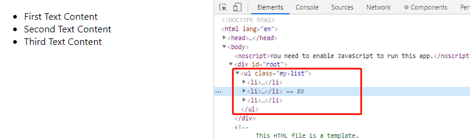

## 一、什么是 React 元素?

React 元素就是 普通的 js 对象 (俗称:虚拟 DOM) 。
React 元素不是真实的 DOM 元素，所以也没办法直接调用 DOM 上原生的 API。

> 渲染过程：React 元素 描述 虚拟 DOM，再根据 虚拟 DOM 渲染出 真实 DOM。
> 1、虚拟 DOM ：就是用 js 对象结构模拟出 html 中 dom 结构，批量的增删改查先直接操作 js 对象，最后更新到真正的 DOM 树上。因为直接操作 js 对象的速度要比操作 DOM 的那些 api 要快。
> 2、React 元素就是 js 对象，它用来告诉 React，你希望哪些东西显示在页面中。

总的说：
元素就是用来描述 DOM 节点或者 React 组件的纯对象。元素可以在自己的属性中包含其它元素。创建一个元素的成本很低，一旦元素被创建之后，就不再发生变化。

例如：我们可以使用 JSX 语法，创建一个 React 元素 element:

```js
const element = <h1 className="greeting">Hello, world</h1>;
```

在编译过程中，JSX 会被编译成对 React.createElement()的调用，从这个函数名上也可以看出，JSX 语法返回的是一个 React 元素。
上面的例子编译后的结果为：

```js
const element = React.createElement(
  "h1",
  { className: "greeting" },
  "Hello, world!"
);
```

最终，element 的值被编译为是类似下面 的 js 对象：

```js
const element = {
  type: 'h1',
  props: {
    className: 'greeting',
    children: 'Hello, world'
  }，
  _context: Object,
  _owner: null,
  key: null,
  ref: null,
}
```

## 二、创建 React 元素

- 1、使用 JSX 语法

  ```js
  const element = <h1>Hello, world</h1>;
  ```

- 2、React.createElement()
  JSX 语法就是用 React.createElement()来构建 React 元素的。
  它接受三个参数：

  - 第一个参数：可以是一个标签名。如 div、span，或者 React 组件
  - 第二个参数：为传入的属性
  - 第三个及之后的参数：皆作为组件的子组件

  ```js
  React.createElement(type, [props], [...children]);
  ```

- 3、React.cloneElement()
  React.cloneElement()与 React.createElement()相似，不同的是它传入的第一个参数是一个 React 元素，而不是标签名或组件。
  新添加的属性会并入原有属性，同属性名新的会替换旧的，传入到返回的新元素中。

  ```js
  React.cloneElement(element, [props], [...children]);
  ```

  ```js
  let element = <h1 id="myid">dadad</h1>;
  let element2 = React.cloneElement(
    element,
    { className: "myclass", id: "myid2" },
    "哈哈哈哈"
  );
  ReactDOM.render(element2, document.getElementById("root"));
  ```

  输出：哈哈哈哈

  我们查看下此时被编译后的 html,我们发现 id，class 属性合并，且子节点被替换。

  ```html
  <h1 id="myid2" class="myclass">哈哈哈哈</h1>
  ```

## 三、渲染 React 元素 到 DOM

- 渲染粗略过程：React 元素描述的是 虚拟 DOM 的结构，React 会根据虚拟 DOM 渲染出页面的真实 DOM。
- 渲染详细过程：[React 渲染过程](https://segmentfault.com/a/1190000009415798)
  （1）先调用 React.createElement()编译成上面的 js 对象(即虚拟 DOM 节点)
  （2）然后再调用 ReactDOMComponent( vdom ).mountComponent()将虚拟 DOM 变成真实的 DOM
  （3）最后用 appendChild( domNode )插入 DOM 树，显示出来。

我们要渲染一个 React 元素到一个 root DOM 节点，需要把它们传递给 ReactDOM.render() 方法：

例 1、

```html
<!-- 该DOM节点内的所有内容都由 React DOM 管理-->
<div id="root"></div>
```

```js
const element = <h1>Hello, world</h1>;
ReactDOM.render(element, document.getElementById("root"));
```

输出：Hello, world

例 2、

```html
<div id="root"></div>
<script type="text/babel">
  var child1 = React.createElement("li", null, "First Text Content");
  var child2 = React.createElement("li", null, "Second Text Content");
  var child3 = React.createElement("li", null, "Third Text Content");
  var root = React.createElement(
    "ul",
    { className: "my-list" },
    child1,
    child2,
    child3
  );
  // 可以认为第三个参数是一个数组，数组中的元素就是该节点的所有子节点。
  // 所以还可以为 var root = React.createElement('ul', { className: 'my-list' }, [child1, child2, child3]);
  ReactDOM.render(root, document.getElementById("root"));
</script>
```

输出：


## 四、更新已渲染的元素

React 元素是不可变的. 一旦你创建了一个元素, 就不能再修改其子元素或任何属性。
更新 UI 的唯一方法是创建一个新的元素, 并将其传入 ReactDOM.render() 方法.

```js
<div id="root"></div>
<script type="text/babel">
    function tick() {
      const element = (
        <div>
          <h1>Hello, world!</h1>
          <h2>It is {new Date().toLocaleTimeString()}.</h2>
        </div>
      );
      ReactDOM.render(
        element,
        document.getElementById('root')
      );
    }
    setInterval(tick, 1000);
 </script>
```

## 五、只更新必须要更新的部分

React 只更新必需要更新的部分。
React DOM 会将元素及其子元素与之前版本逐一对比, 并只对有必要更新的 DOM 进行更新, 以达到 DOM 所需的状态。
(React 判断 DOM 是否变化的方式很暴力：遍历所有 DOM 节点，一边遍历一边判断 DOM 前后是否相等) 这里涉及到 diff 算法，我们暂时不做解释。

## 参考资料

- [React 学习：元素渲染](https://blog.csdn.net/b954960630/article/details/79809898)
- [React 渲染过程](https://segmentfault.com/a/1190000009415798)
