## Helmet 标签

react 在做基本布局时，也会用上。有时，需要动态修改页面的<head>中的标签，如修改标题`<title>、<link> <meta>` 等时，可以用这个实现

```js
import React, { Component } from "react";
import { Helmet } from "react-helmet";

export default class App extends Component {
  render() {
    return (
      <div>
        <Helmet>
          <meta charSet="utf-8" />
          <title>{title}</title>
          <meta name="keywords" content={title} />
        </Helmet>
      </div>
    );
  }
}
```

# React 开发者工具安装及使用

`React developer tools`

**链接：**

- [React Developer Tools 工具安装](https://www.cnblogs.com/misscai/p/11578292.html)
- [chrome 插件网](http://www.cnplugins.com/devtool/react-developer-tools/download.html)
- []()

两种方法

- 一种是翻墙直接在应用商店里面安装
  打开 chrome 浏览器里的更多工具，点击扩展程序，得翻墙才能访问，然后搜索 react，点击添加至 chrome，下载 react developer tools 这个工具。
- 另一种是直接离线安装 crx（crxhelp2.7）[链接](https://blog.csdn.net/qq_42690685/article/details/81039700)

**Tips:**

- 回到项目页面会发现右上角出现图标，是红色的表示是 react 开发的且是开发环境
- 打开百度发现图标灰了，说明不是用 react 开发的
- 打开知乎图标是黑色，表示是 react 开发的且是上线版本
- 线上版本跟开发版本区别？
  线上代码会经过 css，jss 压缩，同时也会剔除掉一些没多大用处的警告的代码，相对于本地开发的代码，更精悍一些

**react developer tools 开发工具的作用：**
如下图。进行组件间数据调试的时候，就不需要 console.log()打印了，省去了大量编译时间。在右侧区域可以实时查看 props 和 state 的变化
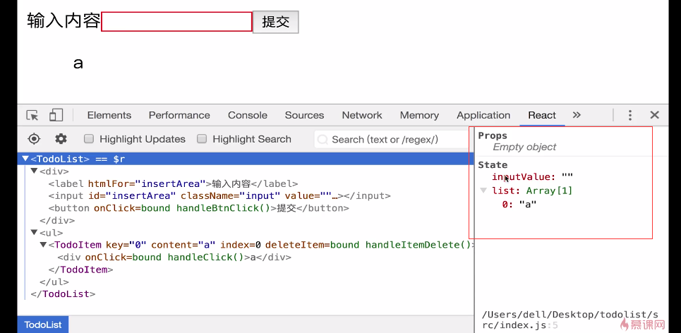

勾选上图中的 Highlight Updates ，改变数据后，哪些组件被重新 render，哪些组件就会在界面上加上有颜色的抖动框。

## Hooks 函数式组件如何查看

[链接](https://react-devtools-experimental-chrome.now.sh/)

# Mock 数据：接口数据本地模拟

## 方法一：Charles 实现本地 mock

在前端开发过程中实际上是与后端分离的，接口可能都没好，所以需要在本地进行数据的模拟。Mock 就是用来模拟接口数据的。

Charles 作用：可以捕获浏览器发送的请求，可以对这些请求做一些处理，如下面实例一，你请求了我配置的地址，我就把配置的对应文件返回给你。就是个中间的代理服务器。

### 实例

如下，在 didMmount 中用 axios 请求 api 为 xx 的数据

```js
componentDidMount() {
  axios.get('api/todolist')
  .then((res) => {
    console.log(res)
  })
  .catch((err) => {
    console.log(err)
  })
}
```

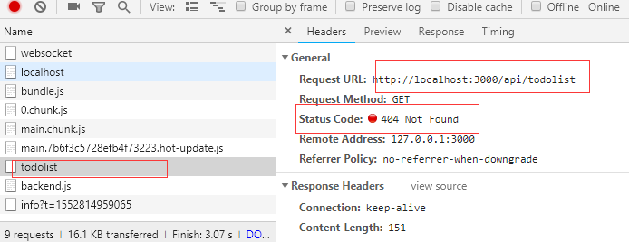

如上图，页面确实请求了，但是 api 是瞎写的，所以报 404 错误，
接着使用 charles 来模拟数据
现在一个地方放好一个 json 文件，文件内容为模拟的数据，如下下图，

```js
// 路径：F:web/web学习/web笔记/React/todoListMockData.json
["大方地", "第二个数据", "第三个数据"];
```

现在我们希望去请求`/api/todolist`这个接口的时候，把上面的模拟数据返回，下面来用 charles 实现。

- 打开 charles，tools，有个 maplocal，里面是空，点击 add，增加一条配置项
  如下图，
  - map for 配置一下，http，localhost 这个域名下的 3000 端口下的/api/todolist
  - map to 将这个请求代理到 localpath 输入框里的地址对应的内容，即我放我模拟数据的地方

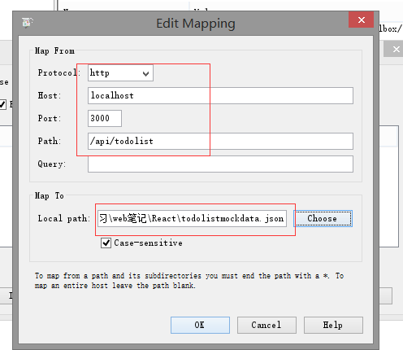
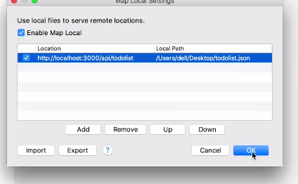

再次刷新页面如下图，todolist 接口返回的就是模拟的数据了

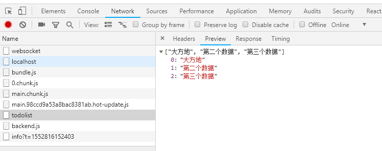

## 方法二：public/api/xxx.json

在 public 目录下新建 api 目录，.json 模拟数据可以放里面直接访问。

Creat-react-app 底层也是个 node 的服务器，如下图，当你去访问下图这个地址的 json 文件时。会到工程目录下去找对应的路径，如果找不到还会去 public 目录下找，即 public/api/headerList.json ,如果能找到，就会把文件里的内容取出来。等到后端开发完成，就把 public 下的 api 目录给删除，不然会有影响。

```js
const getSearchListData = () => {
  axios
    .get("api/headerList.json")
    .then((res) => {
      console.log(res);
    })
    .catch((err) => {
      console.log(err);
    });
};
```

```js
// 根目录/public/api/headerList.json
{
  'success': true,
  'data': ['区块链', '小程序', 'vue', '毕业', 'php', '理财', '美食', '书法']
}
```

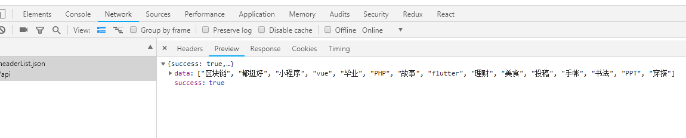

# 获取服务器数据

react 中没有提供专门的请求数据的模块。但是我们可以使用任何第三方请求数据模块实现请求数据

## axios 插件

公司这边请求接口的方法是 axios，见 utils 下的 request.js 文件

- 1.安装 axios 模块 `npm install axios --save`
- 2.引入 import axios from 'axios'
- 3.看文档使用

  ```js
  var api = "http://www.phonegap100.com/appapi.php?a=getPortalList&catid=20";

  axios
    .get(api)
    .then((response) => {
      console.log(response);
    })
    .catch((error) => {
      console.log(error);
    });
  ```

# React 如何进行组件/逻辑复用

抛开已经被官方弃用的 Mixin,组件抽象的技术目前有三种比较主流

- 高阶组件
  - 属性代理
  - 反向继承
- 渲染属性 render props
- react-hooks

# React 细节

## CSS 样式

- CSSModule 模块化 如何在组件引入样式
  1、新建：在本组件同级目录新建 同名.css 文件
  2、引入： `import styles from './同名.css'`
  3、使用：<div className={ ${styles.样式名}/>

- 如何引入图片

```js
import logo from from '../assets/images/1.jpg';


 // 远程图片

<div style={{ backgroundImage: `url(${logo})` }}></div>
```

- React 中实现 CSS 过渡
  实例一：
  如下，toggle 这个 button 控制上面这个 div 的类名，从 show 切换到 hide，或者从 hide 切换到 show

```js
render() {
  return (
    <Fragment>
      <div className={this.state.show ? 'show' : 'hide'}>
        hello
      </div>
      <Button onClick={() => {
        this.setState((prev) => ({
          show: !prev.show
        }))
      }}>toggle</Button>
    </Fragment>
  )
}
```

在组件的同级目录下新建一个.css 文件，在组件中引入 import './xxx.css'

```css
.show {
  opacity: 1;
  transition: all 1s ease-in;
}

.hide {
  opacity: 0;
  transition: all 1s ease-in;
}
```

两个类只加 opacity 的话，来回切换时瞬间的，不是动画的，加上 transition 就好了。有渐隐渐现的动画效果 。

## 如何实现元素光标的聚焦 htmlFor

点击输入内容，光标自动聚焦到 input 输入框

Html 中 Label 作用是：扩大点击的区域，例如光标聚焦

```js
render() {
  return (
    <Fragment>
      <div>
        <label htmlFor="insertArea">输入内容</label>
        <input
          id="insertArea"
          className="input"
          value={this.state.inputValue}
          onChange={this.handleInputChange.bind(this)}
        />
        <button onClick={this.handleBtnClick.bind(this)}>提交</button>
      </div>
    </Fragment>
  )
}
```

## render 使用数据注意事项

由于第一次 render 之后才会在 didMount 里面请求数据，所以第一次 render 时，渲染逻辑会因为取数据取不到报错，所以需要容错，给默认数据 或者 ||

## 插入原生 HTML

为防止 XSS 攻击，提供安全性，在插入原生的 HTML 时需使用
`<span dangerouslySetInnerHTML={{__html: rawHtml}}>`

# Tips

## setState：得到的数据总是上一次希望得到的数据的值

```js
handleBtnClick() {
  this.setState((prevState) => {
    return {
      list: [...prevState.list, prevState.inputValue]
      inputValue: ''
    }
  })
  // this.ul 设置了ref
  // querySelectorAll 选取子元素
  console.log(this.ul.querySelectorAll('div').length)
}
```

点击提交后往 state 中的 list 中新增刚输入的 inputValue，然后打印渲染出的子内容的长度。但是如下图，总是比实际的长度少一个
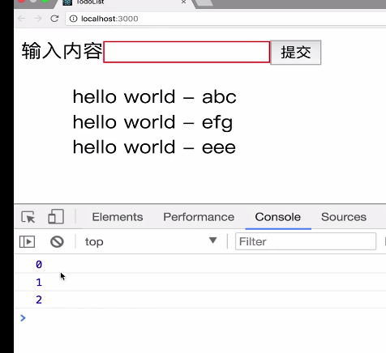

**原因如下：**
这在初学者中经常会遇到的问题，初学者还没适应 react 面向数据编程这种思想。总是想操作 DOM，但是只要操作 DOM，就会出现这样的问题。 因为 setState 是个异步函数，虽然写在 console.log 的前面，但是实际执行时 console.log 先执行，再执行 setstate 更新数据，所以得到的数据总是上一次希望得到的数据的值。

**解决方法：** setState 第二个参数

#

异步请求数据 setState 前设置\_this.IsMounted=true;（见报错 2）
在 willUnmount 里面设置 this.\_IsMounted=false，接受数据后判断 this.\_IsMounted 为 true 再 setState

# React 报错

## an array or iterator should have a unique "key" prop

Each child in an array or iterator should have a unique "key" prop.
只要在 js 中遍历数组生成 jsx 标签块时，必须给生成的标签块加一个唯一的 key，即 item 中的一个字段。

## can’t call state on an unmounted component

一般在 componentDidMount 里面 fetch 数据，都会出现这样的的 Warning
没有挂载的组件执行了 setState()操作，会造成内存泄漏。异步请求返回数据之前，组件可能就已经被卸载了，等数据回来再使用 setState 就会报出上面的警告

```js
componentDidMount() {
  this._isMounted = true;
}
componentWillUnmount() {
  this._isMounted = false;
}
fetchData() {
  fetchProdCatalogHisNumber({
    mhss: '',
    ksrq: '',
    jsrq: '',
    czcj: 1,
  })
  .then(({records = []}) => {
    if (_isMounted) {
      this.setState({
        cplxCountList: records
      })
    }
  })
  .catch(error => {

  })
}
```

## npm start 报错

解决方案：

- npm install react-scripts
- npm install 安装完成后再次运行 npm start 即可

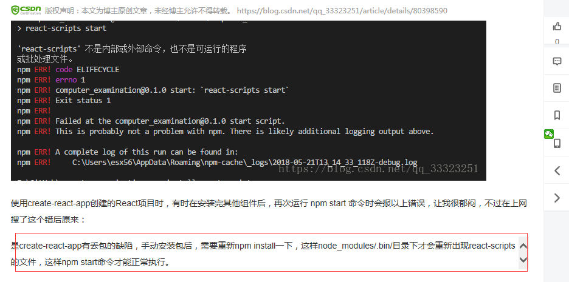
create-react-app 脚手架新建项目后 执行 npm install react-router-dom --save （安装 react-router）后报错，且 npm start 也会报错

直接在 vscode 中 npm install 也会报如下图错误，转到管理员权限下的 cmd 进入项目目录再 npm install 就好了
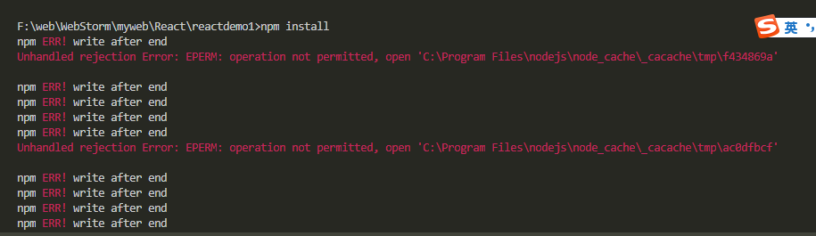

## `a <Router> may have only one child element`

这是因为<Router> 只能包裹一个字标签，吧 Router 之前包裹的东西用一个 div 再包一下就好了

```js
<Router>
  <div>
    <ul>
      <li>
        <Link to="/">home组件</Link>
      </li>
      <li>
        <Link to="/news">news组件</Link>
      </li>
    </ul>
    <br />
    <Route exact path="/" component={Home} />
    <Route path="/news" component={News} />
  </div>
</Router>
```

## React.createElement: type is invalid

`expected a string (for built-in components) or a class/function (for composite components) but got: undefined. You likely forgot to export your component from the file it's defined in, or you might have mixed up default and named imports.`

写表单控件时用法写错
`const FormItem = Form.Item;`

上面是正确写法，我写成了 `const { FormItem } = Form;`

## HTML entities must be escaped

HTML 实体必须被转义
因为字符串中含有转义字符，所以不能直接放到 html 标签中，

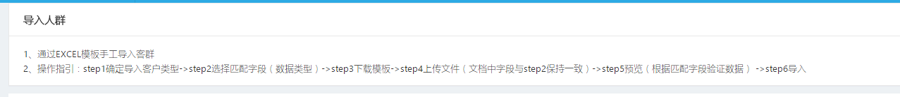

必须向下图这样
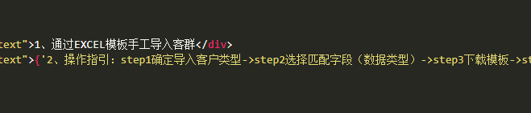

## Functions are not valid as a React child

`This may happen if you return a Component instead of <Component /> from render. Or maybe you meant to call this function rather than return it.`

已解决，还是创建 Form.create()的格式写错了（搞了一个小时。。。。）
写成了`export default Form.create(SearchForm);`
正确的应该是
`export default Form.create()(SearchForm);`
