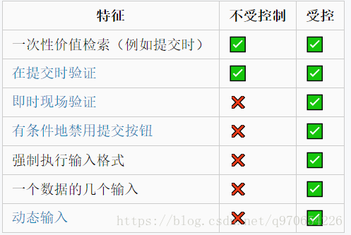

## 概况
在 web 开发中经常会用表单来提交数据， react 中实现表单主要使用两种组件：受控和非受控。==两者的区别就在于组件内部的状态是否是全程受控的==。
- 受控组件的状态全程响应外部数据的变化，
- 而非受控组件只是在初始化的时候接受外部数据，然后就自己在内部维护状态了。

这样描述可能比较抽象，下面通过 demo 来看一下具体的怎么书写。


## 受控组件
原生组件还有一些公用组件库都有一些通用的实践，即用于表单的组件一般都暴露出两个数据接口： value，defaultValue。如果指定了value，那么这个组件就被控制了，时刻响应父组件中数据的变化。例如
`<DatePicker value={this.state.time} onChange={this.onChange} />`
下面以 antd-design 举例

```js
import React, { Component } from 'react';
import { DatePicker } from 'antd';
import 'antd/dist/antd.css';

class Form extends Component{
  constructor(props){
    super(props)
    this.state = {
      time: ""
    }
    this.onChange.bind(this);
  }

  onChange(value){
    this.setState({
      time: value
    });
  }
  render(){
    return(
      <div>
        <DatePicker value={this.state.time} onChange={this.onChange} />
      </div>
    )
  }
}
```

## 非受控组件
如果只是指定了 defaultValue ，那么这个组件就是非受控的，只是在初始化的时候指定一下初始值，随后就交出了控制权。就像这样：
`<DatePicker defaultValue={this.state.time} ref={(input) => this.input = input} />`
具体看下面的例子：

```js
import React, { Component } from 'react';
import { DatePicker } from 'antd';
import 'antd/dist/antd.css';

class Form extends Component{
  constructor(props){
    super(props)
    this.state = {
      time: ""
    }
    this.handleSubmit.bind(this);
  }

  handleSubmit(){
    console.log(this.input.value);
  }
  
  render(){
    return(
      <div>
        <DatePicker defaultValue={this.state.time} ref={(input) => this.input = input} />
        <div class="submit" onClick={ handleSubmit }/>
      </div>
    )
  }
}
```

## 具体在业务中的新增和编辑应该怎么写？
在实际业务中具体使用哪种方式来实现表单就得看需求。我引用了一张图片很好的说明了这两个组件的使用场景：



大致来说，当仅仅需要一次性收集数据，提交时菜需要验证，用两种方式都可以。
但是，当业务中需要对数据进行即时校验，格式化输入数据等需求，就只能使用受控组件了。毕竟受控组件能力更强。
## 参考资料
[表单中的受控组件与非受控组件](https://zhuanlan.zhihu.com/p/37579677)