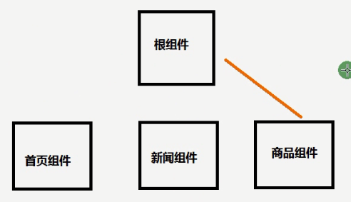

# 为什么要用路由

（原理见 wps 文档/其它/前端路由）

如下图，如果要展示首页组件，需要将首页组件引入并挂载到根组件，如果要展示新闻组件，也需要将新闻组件引入并挂载到根组件，商品组件也是如此，这样做很麻烦，而且需要自己手动到根页面，把不想显示的隐藏，把将要显示的引入并挂载到根页面。



==用 React—router 就可以动态的去挂载不同的子组件，根据用户访问不同页面的地址动态的加载相应页面的效果==。[React—router](https://reacttraining.com/react-router/web/example/basic) 或者 github 上搜 react-router site 进行访问

路由用来分发请求。后端是提供服务的，所以它的路由是在找 controller，前端是显示页面的，所以它的路由是在找 component。

# 动态路由以及 get 传值

如下图，新闻列表页，每点一个新闻，都会跳转到新闻详情页面，而且会传递不同的值(详情 ID)

一个页面跳转到另一个页面进行传值有三种方法：

- 1.get 传值
- 2.动态路由
- 3.Localstorage

## 动态路由

```js
传  /:id
获取 this.props.match.params
```


官方文档的 basic 下的 topic 就是配的动态路由

如下，url 后面带有/:xxx,这就表示 topicld 是任意值都可以，就是动态路由，这个任意值会传递到子组件。

```js
<Route path={`${match.path}/:topicId`} component={Topic} />
```

> **实例：**

如下，新闻组件中的新闻列表，展示新闻 title，加个链接跳转到详情，即`/${value.aid}`，传 aid 到详情页面

```js
render() {
  return (
    <div>
      我是新闻组件
      <ul>
        {
          this.state.list.map((value, key) => {
            return (
              <li key={key}>
                <Link to={`/content/${value.aid}`}>{value.title}</Link>
              </li>
            )
          })
        }
      </ul>
    </div>
  )
}
```

如下，就是配置动态路由，/:aid ，加载的是详情页面 Content

```js
render() {
  return (
    <Router>
      <div>
        我是新闻组件
        <header>>
          <Link to="/">首页</Link>
          <Link to="/news">新闻</Link>
          <Link to="/product">商品</Link>
        </header>
        <br />

        <Route exact path="/" component={Home} >
        <Route exact path="/news" component={News} >
        <Route exact path="/product" component={Product} >
        <Route exact path="/content/:aid" component={Content} >
      </div>

    </Router>
  )
}
```

如下，在新闻详情组件 Content 中获取 get 传的值

```js
import React, { Component } from "react";

class Content extends Component {
  constructor(props) {
    super(props);
    this.state = {};
  }
  componentDidMount() {
    // 获取动态路由的传值：详情id
    console.log(this.props.match.params.aid);
    // 然后用详情id去请求数据
  }
}
```

## get 传值

```js
传 ?aid=${}&bid=1
获取 this.props.location.search
```

如下，get 传值跳转到的页面的路由配置跟普通的路由配置一样

```js
render() {
  return (
    <Router>
      <div>
        我是新闻组件
        <header>>
          <Link to="/">首页</Link>
          <Link to="/news">新闻</Link>
          <Link to="/product">商品</Link>
        </header>
        <br />

        <Route exact path="/" component={Home} >
        <Route exact path="/news" component={News} >
        <Route exact path="/product" component={Product} >
        <Route exact path="/content/:aid" component={Content} >

        <Route exact path="/productcontent" component={ProductContent} >
      </div>

    </Router>
  )
}
```

如下，在商品列表页面，`？aid=${value.aid} 就是get传值`

```js
render() {
  return (
    <div>
      我是商品组件
      <ul>
        {
          this.state.list.map((value, key) => {
            return (
              <li key={key}>
                <Link to={`/productcontent?aid=${value.aid}`}>{value.title}</Link>
              </li>
            )
          })
        }
      </ul>
    </div>
  )
}
```

如下，在商品详情页面，如何获取 get 方式传来的值

```js
import React, { Component } from "react";

class Content extends Component {
  constructor(props) {
    super(props);
    this.state = {};
  }
  componentDidMount() {
    // 获取get传值
    console.log(this.props.location.search);
    // ?aid=222
  }
}
```

值如下图，不过需要解析一下，因为带有？aid=，解析可以用原生 js，或者用 nodejs 下的 url 模块，

### 使用 url 模块解析 get 传来的值

`npm install url --save`

```js
import url from "url";
import React, { Component } from "react";

class Content extends Component {
  constructor(props) {
    super(props);
    this.state = {};
  }
  componentDidMount() {
    // 获取get传值
    console.log(url.parse(this.props.location.search, true));
    var query = url.parse(this.props.location.search, true).query;
    console.log(query);

    // 打印如下
    // {...}
    // { aid: '4' }
  }
}
```

# js 实现路由跳转

- 【1】从 react-router-dom 中引入 Redirect

```js
import {
  BrowserRouter as Router,
  Route,
  Link,
  Redirect,
  withRouter,
} from "react-router-dom";
```

- 【2】定义一个 flag

```js
this.state = {
  loginFlag: false,
};
```

- 【3】render 中判断 flag 决定是否跳转页面
  ```js
  render() {
    if (this.state.loginFlag) {
      return <Redirect to={{ pathname: "/" }} />
    }
    return (
      <div>
        <form onSubmit={this.doLogin}>
          <input type="text" ref="username" />
          <br />
          <input type="password" ref="password" />
          <br />
          <input type="submit" value="登陆" />
        </form>
      </div>
    )
  }
  ```
- 【3】输完登录信息后点击登录后判断用户名和密码是否正确

```js
// 正确loginFlag为true，不正确为flase
doLogin = (e) => {
  e.preventDefault();
  let username = this.refs.username.value;
  let password = this.refs.password.value;
  console.log(username, password);
  if (username === "admin" && password === "123456") {
    // 登陆成功 跳转到首页
    this.setState({
      loginFlag: true,
    });
  } else {
    alert("登录失败");
  }
};
```

# 未完待续

# react-router4.x 中实现路由的嵌套

链接

- [React-router4 的简单理解](https://www.cnblogs.com/webqiand/p/13862928.html)

- [https://github.com/remix-run/react-router/blob/main/docs/getting-started/tutorial.md](https://github.com/remix-run/react-router/blob/main/docs/getting-started/tutorial.md)
