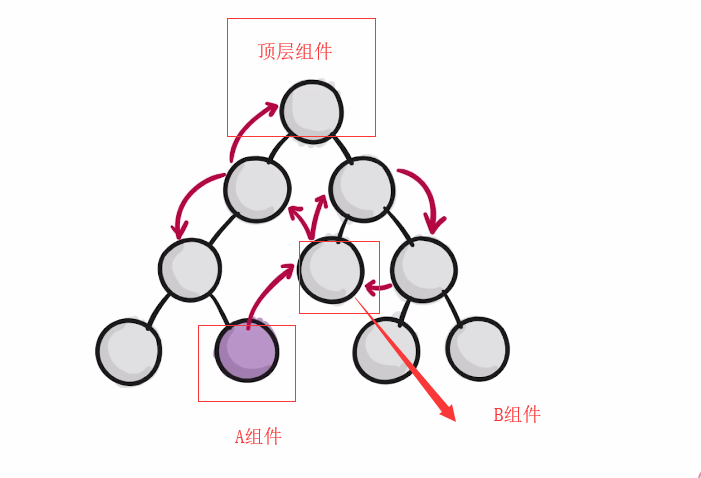

# React

## React 简介

### React 是什么

> **React 不是一个 MVC 框架，而是一个用于构建组件化 UI 的库**，是一个前端界面开发工具。**算是 MVC 中的 V（view），一个轻量级的视图层的框架**。

React 是 Facebook 开发的一款 JS 库（React is a JavaScript library for building user interfaces.），据说是因为 Facebook 不满现在的 MVC 框架，认为 MVC 无法满足他们的扩展需求，因此才有了 React。做出来以后，发现这套东西很好用，就在 2013 年 5 月开源了。当然，

**由于 React 的设计思想极其独特，属于革命性创新，性能出众，代码逻辑却非常简单**。所以，越来越多的人开始关注和使用，认为它可能是将来 Web 开发的主流工具。

### React 的意义

基于 HTML 的前端界面开发正变得越来越复杂，**其本质问题基本都可以归结于如何将来自于服务器端或者用户输入的动态数据高效的反映到复杂的用户界面上**。

而来自 Facebook 的 React 框架**正是完全面向此问题的一个解决方案**，按官网描述，其出发点为：用于开发数据不断变化的大型应用程序（Building large applications with data that changes over time）。相比传统型的前端开发，React 开辟了一个相当另类的途径，**实现了前端界面的高效率高性能开发**。

## 对 React 的认识

### React 认识误区

首先，对于 React，有一些认识误区，这里先总结一下：

- **React 不是一个完整的 MVC 框架，最多可以认为是 MVC 中的 V（View）**，甚至 React 并不非常认可 MVC 开发模式；
- React 的服务器端 Render 能力只能算是一个锦上添花的功能，并不是其核心出发点，事实上 React 官方站点几乎没有提及其在服务器端的应用；
- 有人拿 React 和 Web Component 相提并论，但两者并不是完全的竞争关系，你完全可以用 React 去开发一个真正的 Web Component；
- React 不是一个新的模板语言，JSX 只是一个表象，**没有 JSX 的 React 也能工作**。

### React 的背景和原理

在 Web 开发中，我们**总需要将变化的数据实时反应到 UI 上，这时就需要对 DOM 进行操作**。**而复杂或频繁的 DOM 操作通常是性能瓶颈产生的原因**（如何进行高性能的复杂 DOM 操作通常是衡量一个前端开发人员技能的重要指标）。

React 为此引入了虚拟 DOM（Virtual DOM）的机制：（见虚拟 DOM）

如果你像在 90 年代那样写过服务器端 Render 的纯 Web 页面那么应该知道，服务器端所要做的就是根据数据 Render 出 HTML 送到浏览器端。**如果这时因为用户的一个点击需要改变某个状态文字，那么也是通过刷新整个页面来完成的。服务器端并不需要知道是哪一小段 HTML 发生了变化，而只需要根据数据刷新整个页面**。换句话说，**任何 UI 的变化都是通过整体刷新来完成的。而 React 将这种开发模式以高性能的方式带到了前端**，每做一点界面的更新，你都可以认为刷新了整个页面。**至于如何进行局部更新以保证性能，则是 React 框架要完成的事情**。

借用 Facebook 介绍 React 的视频中聊天应用的例子，当一条新的消息过来时，传统开发的思路如上图，你的开发过程需要知道哪条数据过来了，如何将新的 DOM 结点添加到当前 DOM 树上；而基于 React 的开发思路如下图，你永远只需要关心数据整体，两次数据之间的 UI 如何变化，则完全交给框架去做。可以看到，**使用 React 大大降低了逻辑复杂性，意味着开发难度降低，可能产生 Bug 的机会也更少**。

### React 的优点（六优一特）

- 虚拟 DOM
- 组件化
- 单向数据流
- 声明式开发
- 函数式编程
- 可以与其它框架共存
- （特点）只是视图层框架

## 六优一特

### 虚拟 DOM

> 组件并不是真实的 DOM 节点，而是存在于内存之中的一种数据结构，叫做虚拟 DOM （virtual DOM）。只有当它插入文档以后，才会变成真实的 DOM 。
> **根据 React 的设计，所有的 DOM 变动，都先在虚拟 DOM 上发生，然后再将实际发生变动的部分，反映在真实 DOM 上**，比对新旧虚拟 DOM 的算法叫做  diff  算法，它可以极大提高网页的性能表现。

- **定义：** 虚拟 DOM 是存在于内存之中的一种数据结构，就是个 JS 对象，用它来描述真实 DOM

- **优点：** 提高渲染的性能

- **虚拟 DOM 最大优势：**

  Virtual DOM 提高性能是其中一个优势，其实最大的优势还是在于：

  - 将 Virtual DOM **作为一个兼容层，让我们还能对接非 Web 端的系统，实现跨端开发**。
  - 同样的，通过 Virtual DOM 我们可以渲染到其他的平台，比如实现 SSR、同构渲染等等。
  - 实现组件的高度抽象化

React 为此引入了虚拟 DOM（Virtual DOM）的机制：在浏览器端用 Javascript 实现了一套 DOM API。**基于 React 进行开发时所有的 DOM 构造都是通过虚拟 DOM 进行，每当数据变化时，React 都会重新构建整个 DOM 树，然后 React 将当前整个 DOM 树和上一次的 DOM 树进行对比，得到 DOM 结构的区别，然后仅仅将需要变化的部分进行实际的浏览器 DOM 更新**。而且 React 能够批处理虚拟 DOM 的刷新，在一个事件循环（Event Loop）内的两次数据变化会被合并，例如你连续的先将节点内容从 A 变成 B，然后又从 B 变成 A，React 会认为 UI 不发生任何变化，而如果通过手动控制，这种逻辑通常是极其复杂的。**尽管每一次都需要构造完整的虚拟 DOM 树，但是因为虚拟 DOM 是内存数据，性能是极高的，而对实际 DOM 进行操作的仅仅是 Diff 部分，因而能达到提高性能的目的**。这样，**在保证性能的同时，开发者将不再需要关注某个数据的变化如何更新到一个或多个具体的 DOM 元素，而只需要关心在任意一个数据状态下，整个界面是如何 Render 的**。

所以 React 里面不能直接改变真实节点，即不能通过 e.target.value 去设置控件的值，而是应该先改变虚拟 DOM 节点。

#### React 底层实现过程

尝试分析 React 底层实现过程如下，越来越优化，性能越来越好。

- **第一种实现：**

> 1. state 数据
> 2. jsx 模板
> 3. 数据 + 模板 结合生成真实的 DOM，来显示
> 4. state 数据发生改变
> 5. 数据 + 模板 结合生成真实的 DOM，替换原始的 DOM
>
> 缺陷：
>
> - 第一次生成了一个完整的 DOM 片段
> - 第二次生成了一个完整的 DOM 片段
> - 第二次的 DOM 替换第一次的 DOM，非常耗性能

- **第二种实现：**

> 1. state 数据
> 2. jsx 模板
> 3. 数据 + 模板 结合生成真实的 DOM，来显示
> 4. state 数据发生改变
> 5. 数据 + 模板 结合生成真实的 DOM，**并不直接替换原始的 DOM**
> 6. **比对新旧 DOM，找出差异**
> 7. **只在旧 DOM 上替换掉跟新 DOM 有差异的部分**
>
> 缺陷：
>
> - 性能提升并不明显，因为还是生成了两次完整的真实 DOM

- **第三种实现（虚拟 DOM 方案）：**

> 1. state 数据
> 2. jsx 模板
> 3. 数据 + 模板 结合生成虚拟 DOM（损耗了性能）
>    `['div', { id: 'abc' }, ['span', {}, 'hello world']]`
> 4. 通过虚拟 DOM 来生成真实的 DOM，来显示
>    `<div id="abc"><span>hello world</span></div>`
> 5. state 数据发生改变
> 6. 数据 + 模板 结合生成新的虚拟 DOM（极大的提升了性能）
>    `['div', { id: 'abc' }, ['span', {}, 'bye bye']]`
> 7. **比较新旧虚拟 DOM 的区别，找到差异的内容**（即 span 标签的文本）
> 8. **直接操作 DOM，仅改变有差异的部分**
>
> 优点：
>
> - 性能极大提升
>   - 原因：虚拟 DOM 实际是个描述真实 DOM 的 JS 对象，**生成和对比 JS 对象基本不耗性能，但是生成新的 DOM 和比对新旧 DOM 是很耗性能的**。
> - 使得跨端应用得以实现，React Native
>   - 原因：原生应用中，可以用生成的虚拟 DOM 转为原生应用中的组件，这是 React 能够写原生应用的原因。

组件里的各种标签或者组件都只是 JSX 模板里内容，不是 DOM 节点，关系如下：

> JSX 模板会被底层先变成 JS 对象（即虚拟 DOM）=> 再根据虚拟 DOM 生成真实 DOM

#### Diff 算法

详见【高级指引-diff 算法】

- **定义：**

  > **比对新旧虚拟 DOM 的方式就叫 Diff 算法**
  > (diffrence：即找差异，找这两个新旧 JS 对象的差异)

  > 什么是调和？
  > **将 Virtual DOM 树转换成 actual DOM 树的最少操作的过程 称为调和**

  > 什么是 React diff 算法？
  > **diff 算法是调和的具体实现**

- **作用：**
  > 计算出 Virtual DOM 中真正变化的部分，并只针对该部分进行原生 DOM 操作，而非重新渲染整个页面。
- **Diff 算法实例：**
  比如说，现在你的 list 是这样，

  ```js
  <ul>
    <li>0</li>
    <li>1</li>
    <li>2</li>
    <li>3</li>
  </ul>
  ```

  你想把它变成这样

  ```js
  <ul>
    <li>6</li>
    <li>7</li>
    <li>8</li>
    <li>9</li>
    <li>10</li>
  </ul>
  ```

  通常的操作是先把 0， 1，2，3 这些 Element 删掉，然后加几个新的 Element 6，7，8，9，10 进去，这里面就有 4 次 Element 删除，5 次 Element 添加。
  而 React 会把这两个做一下 Diff，然后发现其实不用删除 0，1，2，3，而是可以直接改 innerHTML，然后只需要添加一个 Element（10）就行了，这样就是 4 次 innerHTML 操作加 1 个 Element 添加，这样，操作从 9 次变成了 5 次，页面渲染速度不就加快了？

- **问题：**

  - 为什么数组 map 不建议设置 index 为 key 值

    **答：**
    **用 index 做 key 值，唯一标识 key 值是不稳定可能会变的**。就没法保证原始虚拟 dom 上的 key 值和新的 dom 上的 key 值一致了。

    **解释：**
    [a, b, c] 下标 0，1，2
    [b, c] 下标 0，1
    如果用下标 index 做唯一标识，a 删除之后，重新渲染，b 的 key 值变成了 0，c 的 key 值变成了 1，b 和 c 没有变，但是下标 index 变了导致他们的唯一标识 key 值变了，失去了 key 值作为唯一标识的意义，这就是不用下标 index 作唯一标识的原因。

### 组件化

> 组件：具有独立功能的 UI 部件

虚拟 DOM(virtual-dom)不仅带来了简单的 UI 开发逻辑，同时也带来了组件化开发的思想，所谓组件，即封装起来的具有独立功能的 UI 部件。**React 推荐以组件的方式去重新思考 UI 构成，将 UI 上每一个功能相对独立的模块定义成组件，然后将小的组件通过组合或者嵌套的方式构成大的组件，最终完成整体 UI 的构建**。例如，Facebook 的 instagram.com 整站都采用了 React 来开发，整个页面就是一个大的组件，其中包含了嵌套的大量其它组件。

如果说 **MVC 的思想让你做到视图-数据-控制器的分离，那么组件化的思考方式则是带来了 UI 功能模块之间的分离**。我们通过一个典型的 Blog 评论界面来看 MVC 和组件化开发思路的区别。

对于 MVC 开发模式来说，开发者将三者定义成不同的类，实现了表现，数据，控制的分离。开发者更多的是从技术的角度来对 UI 进行拆分，实现松耦合。

**对于 React 而言，则完全是一个新的思路，开发者从功能的角度出发，将 UI 分成不同的组件，每个组件都独立封装**。

在 React 中，你按照界面模块自然划分的方式来组织和编写你的代码，对于评论界面而言，整个 UI 是一个通过小组件构成的大组件，**每个组件只关心自己部分的逻辑，彼此独立**。

- **组件化的意义：**
  组件化开发的意义有很多，一些新手会狭隘地认为只是为了复用（包括对于模块化的理解），**认为只有一个地方用就没必要抽取封装为组件，但实则不尽然**：

  - 组件化是**对实现的分层**，**是更有效地代码组合方式**
  - 组件化是**对资源的重组和优化**，从而使项目资源管理更合理
  - 组件化有利于单元测试
  - 组件化**对重构较友好**

- **React 组件的特征：**
  - 可组合（Composeable）：一个组件易于和其它组件一起使用，或者嵌套在另一个组件内部。如果一个组件内部创建了另一个组件，那么说父组件拥有（own）它创建的子组件，通过这个特性，一个复杂的 UI 可以拆分成多个简单的 UI 组件；
  - 可重用（Reusable）：每个组件都是具有独立功能部件，它可以被使用在多个 UI 场景；**React 是基于组件化的开发**，那么组件化开发**最大的优点**是什么？毫无疑问，**当然是复用**，
  - 可维护（Maintainable）：**每个小的组件仅仅包含自身的逻辑，更容易被理解和维护**；


### 单向数据流

**意义：** 易于管理数据，判断数据出错来源

之前有了解过 Angular 的双向数据绑定，也曾为双向数据绑定所实现的效果感到惊叹！而 React 推出了单向数据流模式，为什么也那么受人们喜爱？楼主认为，**双向绑定就是 view 层和 model 数据同步变化**，这种效果确实很应该受到青睐，**但在大型项目开发中，在遇到数据出错的情况下，单向数据流模式数据能够快速找到数据错误源头，数据来源比较直接，而双向数据绑定显得比较乱，比较难判定数据出错来源。单向数据流让 React 变得简洁，易用**，这算是 React 的一个特点。

例如，**子组件可以使用父组件传来的值，但是你不能直接在子组件里面修改传来的值**，即不能去改变 this.props 里面的数据。改变之后就会报下面的错误，提示这是只读属性（为了开发测试时方便，假设父组件有 5 个子组件，都传数据了，其中一个子组件不小心改变了父组件的值，别的四个子组件数据也都会改变，出了 bug 很难查找出原因）

### 声明式开发

**声明式开发：** 如 React，可以节约大量的对 DOM 的操作。，==不是直接操作 dom，而是通过操作数据，react 会自动感知到数据的变化，react 即不再关注 dom，而是关注数据层的操作==
**命令式开发：** 之前写 JQ/原生代码时，是直接来操作 DOM，操作 DOM 的这种编程方式称之为命令式编程，（开发一个页面需要一点点的告诉 DOM，你要怎么去挂载，怎么去做），60%到 70%都是在做 dom 的操作。

### 函数式编程

每个组件中的 constructor，render 都是函数，再加上自己定义的函数

**函数式编程的好处：**

- 1.**易于维护，每个函数各司其职**。
- 2.**自动化测试非常简单**
  目前前端界有个叫面向测试的开发流程，很多前端的项目已经引入了自动化测试的概念，在做前端自动化测试的时候，如果一个这个项目的代码都是由一个个函数组成，就非常容易进行自动化测试。**只需要给函数一个输入，看它的输出是否符合我们的预期，就能知道这个函数是否运行的正确**，给前端自动化测试带来了很大的便捷性

### 与其它框架共存

React 可以与其它框架共存

在一个网页用 React 写代码同时，也可以用 JQ，VUE 去写，这些框架可以完美的并存，如何做到呢？

React 中入口文件中的根组件只挂载到了 body 下 id 为 root 的 div 下面，所以后面可以继续接着添加 DOM 节点

即 react 只负责 id 为 root 的元素的渲染，下面的 dom 和 React 一点关系也没有，所以可以用 JQ 和 vue 等操作剩下的 DOM，所以可以完美的共存

```js
ReactDOM.render(<TodoList />, document.getElementById("root"));
```

### 只是视图层框架

**不是个大型完整的框架。只解决数据渲染页面的问题**，很小的项目如 todolist 用组件见通信传值就好，**大型项目必须要用数据层框架**。这也是 React 被称为视图层框架的原因。

## React 未解决的问题

React 本身只是一个 **DOM 的抽象层，使用组件构建虚拟 DOM**。

如果开发大应用，还需要解决一个问题。

- 通信：**组件之间如何通信**？
- 数据流：**数据如何和视图串联起来？路由和数据如何绑定？如何编写异步逻辑？等等**

### 通信问题

组件会发生三种通信。

- 向子组件发消息
- 向父组件发消息
- 向其他组件发消息

React **只提供了一种通信手段：传参。对于大应用，很不方便**。
如下图，大型应用的组件树，真实的肯定比这还复杂，


如果组件 A 要跟 B 组件通信，需要找到他们最小的公共节点，即顶层组件，通信数据需要存在顶层组件，**需要层层的传值和回调**，大型项目这么做得疯掉。
如果组件中很多代码都是做数据的传值，代码会非常冗余，所以大型项目必须要使用数据层框架，如 redux。

### 组件通信的例子

```js
class Son extends React.Component {
  render() {
    return <input onChange={this.props.onChange} />;
  }
}

class Father extends React.Component {
  constructor() {
    super();
    this.state = {
      son: "",
    };
  }
  changeHandler(e) {
    this.setState({
      son: e.target.value,
    });
  }
  render() {
    return (
      <div>
        <Son onChange={this.changeHandler.bind(this)} />
        <p>这里显示 Son 组件的内容：{this.state.son}</p>
      </div>
    );
  }
}

ReactDOM.render(<Father />, mountNode);
```

### 数据流问题

目前流行的数据流方案有：

- Flux，单向数据流方案，以 Redux 为代表
- Reactive，响应式数据流方案，以 Mobx 为代表
- 其他，比如 rxjs 等

到底哪一种架构最合适 React ？

### 目前最流行的数据流方案

截止 2017.1，最流行的社区 React 应用架构方案如下。

- 路由： React-Router
- 架构： Redux
- 异步操作： Redux-saga

缺点：**要引入多个库，项目结构复杂**。

## 参考

- **官网：** [React 官网](https://zh-hans.reactjs.org/docs/hello-world.html)
- **教程：**
  - [阮一峰 React 技术栈系列教程](http://www.ruanyifeng.com/blog/2016/09/react-technology-stack.html)
  - [阮一峰 React 入门实例教程](http://www.ruanyifeng.com/blog/2015/03/react.html)
  - [ReactJS 简介](https://www.jianshu.com/p/ee97db18dcf3)
