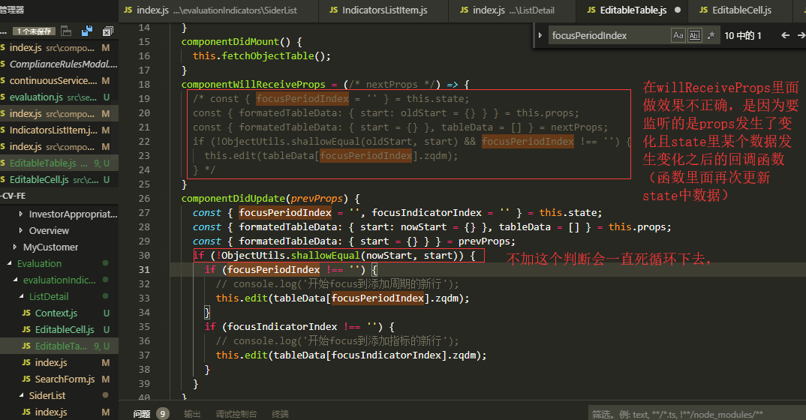

# 主要概念

## Hello World

```html
<!DOCTYPE html>
<html>
  <head>
    <script src="../../build/react.js"></script>
    <script src="../../build/react-dom.js"></script>
    <script src="../../build/browser.min.js"></script>
  </head>
  <body>
    <div id="example"></div>
    <script type="text/babel">
      ReactDOM.render(
        <h1>Hello, world!</h1>,
        document.getElementById("example")
      );
    </script>
  </body>
</html>
```

上面代码有两个地方需要注意。

- 首先，最后一个 `<script>` 标签的 type 属性为 text/babel 。这是因为 React 独有的 JSX 语法，跟 JavaScript 不兼容。凡是使用 JSX 的地方，都要加上 type="text/babel" 。

- 其次，上面代码一共用了三个库： react.js 、react-dom.js 和 Browser.js ，它们必须首先加载。其中，**react.js 是 React 的核心库，react-dom.js 是提供与 DOM 相关的功能，Browser.js 的作用是将 JSX 语法转为 JavaScript 语法**，这一步很消耗时间，实际上线的时候，应该将它放到服务器完成。

ReactDOM.render 是 React 的最基本方法，**用于将模板转为 HTML 语言，并插入指定的 DOM 节点**。这里需要注意的是，react 并不依赖 jQuery，当然我们可以使用 jQuery，但是 **render 里面第二个参数必须使用 JavaScript 原生的 getElementByID 方法，不能使用 jQuery 来选取 DOM 节点**。

## JSX 简介

> **定义：**

JSX: HTML 语言直接写在 JavaScript 语言之中，不加任何引号，这就是 JSX 的语法，它允许 HTML 与 JavaScript 的混写

> **基本语法规则：**

```js
var names = ["Alice", "Emily", "Kate"];

ReactDOM.render(
  <div>
    {names.map(function (name) {
      return <div>Hello, {name}!</div>;
    })}
  </div>,
  document.getElementById("example")
);
```

JSX 的基本语法规则：遇到 HTML 标签（以 < 开头），就用 HTML 规则解析；遇到代码块（以 { 开头），就用 JavaScript 规则解析。

JSX 允许直接在模板插入 JavaScript 变量。如果这个变量是一个数组，则会展开这个数组的所有成员

```js
var arr = [<h1>Hello world!</h1>, <h2>React is awesome</h2>];

ReactDOM.render(<div>{arr}</div>, document.getElementById("example"));
```

### 为什么使用 JSX？

> JSX => createElement => JS 对象（虚拟 DOM） => 真实 DOM

React.createELement 创建元素太麻烦了所以才有了 JSX 语法，**方便阅读和开发**，实现的是相同效果。

> **React.createELement 与 JSX 效果对比：**

```js
// 使用React.createElement
React.render(
  React.createElement(
    "div",
    null,
    React.createElement(
      "div",
      null,
      React.createElement("div", null, "content")
    )
  ),
  document.getElementById("example")
);

// 使用JSX
React.render(
  <div>
    <div>
      <div>content</div>
    </div>
  </div>,
  document.getElementById("example")
);
```

在没使用 JSX 的情况下，我们需要 createElement 创建一个又一个的元素，页面的可读性变的很差，使用 JSX，我们便**可以像写 html 代码一样编写组件，代码变得简单明了，有利于代码开发与维护**。

### JSX 表示对象

Babel 会把 JSX 转译成一个名为 React.createElement() 函数调用。

以下两种示例代码完全等效：

```js
const element = <h1 className="greeting">Hello, world!</h1>;
```

```js
const element = React.createElement(
  "h1",
  { className: "greeting" },
  "Hello, world!"
);
```

React.createElement() 会预先执行一些检查，以帮助你编写无错代码，但实际上它创建了一个这样的对象：

```js
// 注意：这是简化过的结构
const element = {
  type: "h1",
  props: {
    className: "greeting",
    children: "Hello, world!",
  },
};
```

这些对象被称作“React 元素”。你可以把他们想象成为你想在屏幕上显示内容的一种描述。React 会读取这些对象，用他们来构建 DOM，并且保持它们的不断更新。

### JSX 实例

> **map 渲染元素写法**

```js
const names = ["张三", "李四", "王五"];

// 完整写法
{
  names.map((v, i) => {
    return <div key={i}>hello,{v}!</div>;
  }).;
}

// 简洁写法
{
  names.map((v, i) => (<div key={i}>hello,{v}!</div>));
}

// 最简洁写法
{
  names.map((v, i) => <div key={i}>hello,{v}!</div>);
}
```

> **组件函数简洁写法**

即 `函数名：function() {}` 简写成 `函数名() {}`

```js
var Test = React.createClass({
  getInitialState: function () {},
  componentDidMount: function () {},
  render: function () {
    return <div>hello</div>;
  },
});

var Test = React.createClass({
  getInitialState() {},
  componentDidMount() {},
  render() {
    return <div>hello</div>;
  },
});
```

> **异步函数写法**

```js
handleChange = async () => {}

async handleChange() {}
```

> **render 中条件判断渲染不同内容**

短小 JSX 用三元，大块 JSX 用 `{ 变量 && <div></div>}`

- 若直接返回 null，就不进行任何渲染。

- 三元表达式(是与否两种情况)

```js
<div>{expand ? "收缩" : "展开"}</div>
```

- 逻辑与或(是与否两种情况)

```js
<div>
  {expand && <span>收缩</span>}
  {!expand && <span>展开</span>}
</div>
```

- 大量`if else` 判断时用函数替换(能判断多种情况)

```js
renderUserMessage(){
  const { type }= this.state
  let temp = null
  if (type === 'zushou') {
    temp = (<span>这是租售房源</span>);
  } else if (type === 'chuzu') {
    temp = (<span>这是出租房源</span>);
  } else if (type === 'chushou') {
    temp = (<span>这是出售房源</span>);
  }
  return temp;
}


render (){
  return(
    <div>
    {this.renderUserMessage()}
    </div>
  )
}
```

> **组件传属性简便写法**

```js
<Select
  value={value}
  onChange={onChange}
  style={{ width: '60%', minWidth: '150px' }}
  defaultOpen={!editing}
  allowClear={true}
  placeholder='请输入内容搜索'
  data-test={dataTest}
/>


<Select
 {...{
   value,
   onChange,
   style: {
     width: '60%',
     minWidth: '150px',
   },
   defaultOpen: !editing,
   allowClear: true,
   placeholder: '请输入内容搜索',
 }}
 data-test={dataTest}
/>

const seletProps = {
  value,
  onChange,
  style: {
    width: '60%',
    minWidth: '150px',
  },
  defaultOpen: !editing,
  allowClear: true,
  placeholder: '请输入内容搜索',
  data-test: dataTest
}
<Select
  {...seletProps}
/>
 
```

## 元素渲染

[详细见 ./React/其它]()

元素(Elements) 是 React 应用中最小的构建块(building blocks) 。

一个元素用于描述你在将在屏幕上看到的内容：

```js
const element = <h1>Hello, world</h1>;
```

> notes: 有人可能会将元素与更广为人知的 “组件(Components)” 概念相混淆。元素是构成组件的”材料”，

## 组件

组件是独立的封装的可以复用的一个小部件，它是 React 的核心思想之一。==**通过划分组件，可以将一个页面划分成独立的多个可复用的组件，各个组件通过嵌套、组合形成一个完整的页面**==。

> **组成部分**

在 React 中，组件基本由三个部分组成：

- 属性（props）
- 状态（state）
- 生命周期方法

==可以将组件简单地看作一个“状态机”，根据不同的 state 和 props 呈现不同的 UI，通过与用户的交互实现不同的状态，然后重新渲染组件，UI 可以跟随数 据变化而变化==。

==一个组件的显示形态可以由数据状态和外部参数所决定，外部参数也就是 props，而数据状态就是 state，只要组件的 state/props 发生改变，会触发 render 函数从新渲染==。

> **实例**

React 允许将代码封装成组件（component），然后像插入普通 HTML 标签一样，在网页中插入这个组件。React.createClass 方法就用于生成一个组件类

```js
var HelloMessage = React.createClass({
  render: function () {
    return <h1>Hello {this.props.name}</h1>;
  },
});

ReactDOM.render(
  <HelloMessage name="John" />,
  document.getElementById("example")
);
```

上面代码中，变量 HelloMessage 就是一个组件类。模板插入 `<HelloMessage />` 时，会自动生成 HelloMessage 的一个实例（**下文的"组件"都指组件类的实例**）。所有组件类都**必须有自己的 render 方法，用于输出组件**。

> **组件分类**

组件常分为两种：

- 有状态组件（Class Component）
- 无状态组件（Functional Component）

### 无状态组件

无状态组件多用于纯展示组件，这种组件只负责根据传入的 props 来渲染组件，而不涉及 state 状态管理。

在大部分 React 代码中，大多数组件被写成无状态的组件，通过简单组合可以构建成其他的组件等；这种通过多个简单然后合并成一个大应用的设计模式被提倡。

所以，在项目中如果不需要进行状态管理，应该尽量写成无状态组件的形式。

> **ES5 函数式声明**

```js
function HelloFunctional(props) {
  return <div>hello {props.name}</div>;
}
```

> **ES6 箭头函数式声明**

```js
const HelloFunctional = (props) => <div>hello {props.name}</div>;
```

> **特点**

- 无状态，没有 state 状态管理
- 无法使用 this，因为其没有指针
- 没有生命周期方法
- 组件不会被实例化，渲染性能提升（性能高因为无状态组件就是一个函数，而有状态组件是一个类还有各种生命周期函数。）
- 不能使用 ref 引用
- 只能输入 props，同样的输入一定会有同样的输出
- 代码可读性更好

### 有状态组件

> **ES5 createClass 式**

```js
const Dialog = React.createClass({
  getInitialState() {
    return {};
  },
  handleClick() {
    console.log("handle click");
  },
  render() {
    return <div className="dialog"></div>;
  },
});
```

> **ES6 class 式写法 类组件**

类组件又可以分为:

- 普通类组件（React.Component）
- 纯类组件（React.PureComponent）

总之这两类都属于类组件，只不过 PureComponent 基于 shouldComponentUpdate 做了一些优化。

```js
import React, { PureComponent } from "react";

export default class constants extends PureComponent {
  state = {};

  render() {
    return <div></div>;
  }
}
```

#### class 和 createClass 的区别

[React.createClass 方法与 class App extends Component 方法的区别](https://blog.csdn.net/wbiokr/article/details/73027398?utm_source=itdadao&utm_medium=referral)

createClass 本质上是一个工厂函数，class 的方式更加接近最新的 ES6 规范的 class 写法。==两种方式在语法上的差别主要体现在方法的定义和静态属性的声明上==。

- createClass 方式的方法定义使用逗号,隔开，因为 creatClass 本质上是一个函数，传递给它的是一个 Object；
- 而 class 的方式定义方法时务必谨记不要使用逗号隔开，这是 ES6 class 的语法规范。

> **区别**

- 1.语法区别

  方法定义语法区别， 有逗号 vs 无逗号

- 2.propType defaultProps

  ```js
  // 通过proTypes对象和getDefaultProps()方法来设置和获取props
  import React from 'react';

  const Contacts = React.createClass({
    propTypes: {
      name: React.PropTypes.string
    },
    getDefaultProps() {
      return {};
    }
    render() {
      return (
        <div></div>
      );
    }
  });

  export default Contacts
  ```

  ```js
  // 通过设置两个属性propTypes和defaultProps

  import React from 'react';

  class Contacts extends React.Component {
    static propTypes: { // as static property
      name: React.PropTypes.string
    },
    static defaultProps = { // as static property
      name: ''
    },
    constructor(props) {
      super(props)
    }
    render() {
      return (
        <div></div>
      );
    }
  }

  /*
  Contacts.propTypes = {
  };
  Contacts.defaultProps = {
  };
  */
  export default Contacts
  ```

- 3.初始化状态的区别

  ```js
  // 通过getInitialState()方法返回一个包含初始值的对象
  import React from "react";
  const Contacts = React.createClass({
    // getInitialState函数必须有返回值，可以是NULL或者一个对象
    getInitialState() {
      return {};
    },
    render() {
      return <div></div>;
    },
  });
  export default Contacts;
  ```

  ```js
  // 通过constructor设置初始状态
  import React from "react";
  class Contacts extends React.Component {
    constructor(props) {
      super(props);
      this.state = {};
    }
    render() {
      return <div></div>;
    }
  }
  export default Contacts;
  ```

- 4.this 区别
  ES5 createClass 会正确绑定 this
  ES6 class 需要用三种方法才能正确绑定 this

  ```js
  // 会正确绑定this
  import React from "react";

  const Contacts = React.createClass({
    handleClick() {
      console.log(this); // React Component instance
    },
    render() {
      return (
        <div onClick={this.handleClick}></div> //会切换到正确的this上下文
      );
    },
  });

  export default Contacts;
  ```

  ```js
  //由于使用了 ES6，这里会有些微不同，属性并不会自动绑定到 React 类的实例上。
  import React from 'react';
  class TodoItem extends React.Component{
      constructor(props){
          super(props);
          this.handleClick = this.handleClick.bind(this);
      }
      handleClick(){ // 通过bind改变this指向 （在构造函数中）
          console.log(this); // React Component Instance
      }
      handleFocus(){  // 通过bind改变this指向
          console.log(this); // React Component Instance
      }
      handleBlur: ()=>{  // 使用箭头函数
          console.log(this); // React Component Instance
      }
      render(){
          return (
            <input
              onClick={this.handleClick}
              onFocus={this.handleFocus.bind(this)}
              onBlur={this.handleBlur}/>
          )
      }
  }
  ```

#### ES6 改变 this 指向的三种方法

createClass 创建的组件会正确绑定当前组件的 this，而 class extends 创建的组件，即在以类继承的方式定义的组件中，不会正确绑定当前组件 this,不过有下面三种方法。（详细见 class 和 createClass 的区别/ this 区别 ）

- 构造函数中 bind 改变 this 指向
- 调用函数时 bind 改变 this 指向
- 箭头函数

为了能方便地调用当前组件的其他成员方法或属性（如：this.state），通常需要将事件处理函数运行时的 this 指向当前组件实例。

### **注意**

- **组件类名的第一个字母必须大写**否则会报错，比如 HelloMessage 不能写成 helloMessage。用于区分原生的 Html 标签和自定义组件
- **组件类只能包含一个顶层标签**，否则也会报错。
- 组件的用法与原生的 HTML 标签完全一致，可以任意加入属性，比如 `<HelloMessage name="John">` ，就是 HelloMessage 组件加入一个 name 属性，值为 John。**组件的属性可以在组件类的 this.props 对象上获取**，比如 name 属性就可以通过 `this.props.name` 读取
- 添加组件属性，有一个地方需要注意，就是 **class 属性需要写成 className ，for 属性需要写成 htmlFor ，这是因为 class 和 for 是 JavaScript 的保留字**。
- **组件的 style 属性的设置方式也值得注意**，要写成 `style={{ width: '30px' }`。这是因为  React 组件样式是一个对象，所以第一重大括号表示这是 JavaScript 语法，第二重大括号表示样式对象。

- **render 中使用变量**：变量用{}包裹，不需要再加双引号。
- **执行方法传值**
  如下图，

  - 方法一是错的，this.setName(‘王五’)会立即传值执行函数，即在 render 中 setState，程序会崩溃
  - 方法二是对的，只是先绑定 this，等 click 之后才会传值执行函数
  - 方法三跟法二是一个意思，()=>this.setName(‘王六’) 箭头函数绑定 this，等 click 之后才会传值执行函数

  ```js
  import React, { PureComponent } from "react";

  export default class Constants extends PureComponent {
    state = {
      name: "",
    };

    setName = (str) => {
      this.setState({
        name: str,
      });
    };

    render() {
      return (
        <div>
          <h2>你好React{this.state.name}</h2>
          /* <Button onClick={this.setName("张三")}>
            执行方法传值 一（报错）
          </Button> */
          <Button onClick={this.setName.bind(this, "张三")}>
            执行方法传值 二
          </Button>
          <Button onClick={() => this.setName("张三")}>执行方法传值 三</Button>
        </div>
      );
    }
  }
  ```

- **Fragment**
  当你不需要在 fragment 标签中添加任何 prop 且你的工具支持的时候，你可以使用 短语法

```js
render(){
  return (
    <React.fragment>
      <button  aid='123' onclick={this.handleClick}>测试按钮<button>
    </React.fragment>
    // <>
    //   <button  aid='123' onclick={this.handleClick}>测试按钮<button>
    // </>
  )
}
```

## 组件属性 props

组件从概念上看就是一个函数，可以接受一个参数作为输入值，这个参数就是 props，所以可以把==props 理解为从外部传入组件内部的数据==。由于 React 是单向数据流，所以 props 基本上也就是从父级组件向子组件传递的数据。

> **特点**

- 只读性、不变性

  props 经常被用作渲染组件和初始化状态，当一个组件被实例化之后，它的==props 是只读的，不可改变的==。如果 props 在渲染过程中可以被改变，会导致这个组件显示的形态变得不可预测。==只能通过外部组件主动传入新的 props 来重新渲染子组件，否则子组件的 props 以及展现形式不会改变==。

> **作用**

- 用于传递数据，组件显示形态中的外部参数

### propTypes

组件的属性可以接受任意值，字符串、对象、函数等等都可以。有时，我们需要一种机制，验证别人使用组件时，提供的参数是否符合要求。

> **作用**

组件类的 PropTypes 属性，就是用来验证组件实例的 props 属性是否符合要求/规范 的类型。getDefaultProps 方法可以用来设置组件属性的默认值。

若 props 属性不满足规则，控制台会报错如下

```js
Warning: Failed propType: Invalid prop `title` of type `number` supplied to `MyTitle`, expected `string`.
```

> **propTypes 实例**

```js
  // PropTypes.string.isRequired 表示是字符串且必须传递

  // propTypes，可以声明为以下几种类型：
  // PropTypes.array
  // PropTypes.bool
  // PropTypes.func
  // PropTypes.number
  // PropTypes.object
  // PropTypes.string
  // PropTypes.symbol

  KnockoutObservationModal.propTypes = {
    scrollElement: PropTypes.node,
    modalTitle: PropTypes.string,
    editable: PropTypes.bool,
    params: PropTypes.object,
    onRefresh：PropTypes.func,
    list: PropTypes.array,
  };
  KnockoutObservationModal.defaultProps = {
    scrollElement: null，
    modalTitle: "敲出观察日管理",
    editable: true,
    params: {},
    onRefresh: () => {}
    list: []
  };
```

## 组件状态 State

访问 state 属性：`this.state.属性名`。

```js
class Test extends React.Component {
  state = {
    liked: false,
  };

  handleClick() {
    this.setState({
      liked: !this.state.liked,
    });
  }

  render() {
    const text = this.state.liked ? "like" : "haven't liked";

    return (
      <div onClick={this.handleClick}>you {text} this, click to toggle</div>
    );
  }
}

export default Test;

/* 分析：
用户单击文本，触发 handleClick 函数，
this.setState 方法就修改状态值，
每次修改以后，自动调用 this.render 方法，重新渲染组件 */
```

> **特点**

- 可变性

> **作用**

state 的主要作用是==用于组件保存、控制以及修改自己的状态==，它只能在 constructor 中初始化，它算是组件的私有属性，==不可通过外部访问和修改，只能通过组件内部的 this.setState 来修改，修改 state 属性会导致组件的重新渲染==。

> **那么什么样的变量应该做为组件的 State 呢:**

[说说 React 组件的 State](https://blog.csdn.net/weixin_30439131/article/details/95279715)

- 可以通过 props 从父组件中获取的变量不应该做为组件 State。
- 这个变量如果在组件的整个生命周期中都保持不变就不应该作为组件 State。
- 通过其他状态（State）或者属性(Props)计算得到的变量不应该作为组件 State。
- 没有在组件的 render 方法中使用的变量不用于 UI 的渲染，那么这个变量不应该作为组件的 State 。这种情况下，这个变量更适合定义为组件的一个普通属性。

### setState

state 不同于 props 的一点是，state 是可以被改变的。不过，

比如，我们经常会通过异步操作来获取数据，我们需要在 didMount 阶段来执行异步操作：

> **实例**

```js
componentDidMount(){
  fetch('url')
  .then(response => response.json())
  .then((data) => {
    this.setState({
      itemList:item
    });
  }
}
```

当数据获取完成后，通过 this.setState 来修改数据状态。当我们调用 this.setState 方法时，React 会更新组件的数据状态 state，并且重新调用 render 方法，也就是会对组件进行重新渲染。

> **setState()规则**

[setState 用法需要注意的点](https://www.jianshu.com/p/fa1e28f8c418)
[关于 this.setState()的那些事](https://www.jianshu.com/p/a883552c67de)

- setState ==接受一个对象或者函数作为第一个参数，只需要传入需要更新的部分即可，不需要传入整个对象==，比如：

  ```js
  this.setState({
    isLiked: !this.state.isLiked,
  });

  this.setState((prevState, props) => {
    return {
      isLiked: !prevState.isLiked,
    };
  });
  // 或者
  this.setState((prevState, props) => ({
    isLiked: !prevState.isLiked,
  }));
  ```

- setState 还可以==接受第二个参数，它是一个函数，会在 setState 调用完成并且组件开始重新渲染时被调用，可以用来监听渲染是否完成，即数据更新之后的回调函数==

  ```js
  export default class ItemList extends React.Component {
    constructor() {
      super();
      this.state = {
        name: "axuebin",
        age: 25,
      };
    }
    componentDidMount() {
      this.setState({ age: 18 }, () => console.log("setState finished"));
    }
    // 在执行完setState之后的state应该是{name:'axuebin',age:18}。
  }
  ```

> **setState 三个注意**

- 不要直接修改 State

  ==不可以直接通过 this.state=xxx 的方式来修改，而需要通过 this.setState()方法来修改 state==。constructor 是唯一能够初始化的地方或者 state = {}。

  ```js
  // Wrong
  this.state.comment = "Hello";

  // Correct
  this.setState({ comment: "Hello" });
  ```

- State 的更新可能是异步的

  出于性能考虑，React 可能会把多个 setState() 调用合并成一个调用。
  因为 this.props 和 this.state 可能会异步更新，所以你不要依赖他们的值来更新下一个状态。要解决这个问题，可以让 setState() 接收一个函数而不是一个对象。这个函数用上一个 state 作为第一个参数，将此次更新被应用时的 props 做为第二个参数：

  ```js
  // Wrong
  this.setState({
    counter: this.state.counter + this.props.increment,
  });

  // Correct
  this.setState((state, props) => ({
    counter: state.counter + props.increment,
  }));
  ```

- State 的更新会被合并

  当你调用 setState() 的时候，React 会把你提供的对象合并到当前的 state。

### setState 使用细节

> **setState 中有 e.target.value**

```js
// 直接e.target.value赋值会有报错，在外面赋值个value就好了
handleInputChange(e) {
  const value = e.target.value;
  this.setState(() => ({
    inputValue: value
  }))
}
```

> **改变 state 中引用数据类型**

- 修改对象

  ```js
  state = {
    infoObj: {
      name: 'xl',
      age: 25
    }
  }

  componentDidMount() {
    this.setState({
      infoObj: {
        ...this.state.infoObj,
        age: 26,
      }
    });
  }
  ```

- 修改数组

  推荐的是 immutable 的写法，比如：

  ```js
  const items = this.state.items;
  const tempArr = items.map((v) => v); // items.map(v => { ...v })

  // 改
  this.setState({
    items: items.map((v, i) => (index === i ? { ...v, status: "doing" } : v)),
  });

  // 删
  this.setState({
    items: items.filter((_, i) => i !== index),
    // items: tempArr.splice(index, 1),
  });

  // 增
  tempArr.push({ name: "test" });
  this.setState({
    items: tempArr,
  });
  ```

  为什么直接修改不推荐呢？

  有两个原因：

  1. 性能问题
     这种直接改变原有对象的方式导致 react 无法对其进行任何优化，因此
     会有潜在的性能问题

  2. 很难定位问题
     如果你用了 purecomponent， 会发现状态无法直接更新。原因在于 purecomponent 重写了 SCU，SCU 中通过直接判断 state 和 props 前后的引用差别来判断，因此会返回 false，导致 render 无法运行。继承 component 可以直接修改。继承 purecomponent 则不行

> **以参数形式批量存数据到 state 中**

```js
onCheckBoxChange = (key, e) => {
  this.setState({
    [key]: e.target.checked,
  });
}

render() {
  return (
    <Row>
      {records.map((item, index) => {
        return (
          <Col sm={24} md={24} lg={12} key={bqid}>
            <FormItem
              label={
                <Checkbox
                  onChange={(e) => {
                    this.onCheckBoxChange(item.bqmc, e);
                  }}
                >
                  {index + 1}.{item.bqmc || "--"}
                </Checkbox>
              }
            >
              <Select placeholder="请选择">
                {item.tagCode.map((inner) => (
                  <Select.Option value={inner.bqz} key={inner.bqz}>
                    {inner.bqz || "--"}
                  </Select.Option>
                ))}
              </Select>
            </FormItem>
          </Col>
        );
      })}
    </Row>
  );
}
```

### state 具体执行过程

图不清楚可以点击

- partialState：setState 传入的第一个参数，对象或函数
- \_pendingStateQueue：当前组件等待执行更新的 state 队列
- isBatchingUpdates：react 用于标识当前是否处于批量更新状态，所有组件公用
- dirtyComponent：当前所有处于待更新状态的组件队列
- transcation：react 的事务机制，在被事务调用的方法外包装 n 个 waper 对象，并一次执行：waper.init、被调用方法、waper.close
- FLUSH_BATCHED_UPDATES：用于执行更新的 waper，只有一个 close 方法

> **执行过程：**

对照上面流程图的文字说明，大概可分为以下几步：

- 1.将 setState 传入的 partialState 参数存储在当前组件实例的 state 暂存队列中。
- 2.判断当前 React 是否处于批量更新状态，如果是，将当前组件加入待更新的组件队列中。
- 3.如果未处于批量更新状态，将批量更新状态标识设置为 true，用事务再次调用前一步方法，保证当前组件加入到了待更新组件队列中。
- 4.调用事务的 waper 方法，遍历待更新组件队列依次执行更新。
- 5.执行生命周期 componentWillReceiveProps。
- 6.将组件的 state 暂存队列中的 state 进行合并，获得最终要更新的 state 对象，并将队列置为空。
- 7.执行生命周期 componentShouldUpdate，根据返回值判断是否要继续更新。
- 8.执行生命周期 componentWillUpdate。
- 9.执行真正的更新，render。
- 10.执行生命周期 componentDidUpdate。

> **总结：**

- 1.钩子函数和合成事件中：
  在 react 的生命周期和合成事件中，react 仍然处于他的更新机制中，这时 isBranchUpdate 为 true。
  按照上述过程，==这时无论调用多少次 setState，都会不会执行更新，而是将要更新的 state 存入\_pendingStateQueue，将要更新的组件存入 dirtyComponent==。
  当上一次更新机制执行完毕，以生命周期为例，所有组件，==即最顶层组件 didmount 后会将 isBranchUpdate 设置为 false。这时将执行之前累积的 setState==。

- 2.异步函数和原生事件中
  由执行机制看，setState 本身并不是异步的，而是如果在调用 setState 时，如果 react 正处于更新过程，当前更新会被暂存，等上一次更新执行后在执行，这个过程给人一种异步的假象。
  在生命周期，根据 JS 的异步机制，会将异步函数先暂存，等所有同步代码执行完毕后在执行，这时上一次更新过程已经执行完毕，isBranchUpdate 被设置为 false，根据上面的流程，这时再调用 setState 即可立即执行更新，拿到更新结果。

### state 与 props 区别

- state 是组件自己管理数据，控制自己的状态，可变；props 是外部传入的数据参数，不可变；
- 没有 state 的叫做无状态组件，有 state 的叫做有状态组件；
- 多用 props，少用 state。也就是多写无状态组件。

## 事件处理

React 中的双向数据绑定其实并不是 vue 的那种双向绑定，只有一半，另一半需要自己实现。

- Model 改变影响 View（react 自动实现），
- View 改变要想影响 Model（需要自己手动监听实现）

```js
import React, { PureComponent } from "react";

export default class historyTable extends PureComponent {
  state = {
    value: "hello!",
  };

  handleChange(event) {
    const value = event.target.value;
    this.setState({
      value,
    });
  }
  render() {
    return (
      <div>
        <input type="text" value={value} onChange={this.handleChange} />
        <p>{this.state.value}</p>
      </div>
    );
  }
}
```

### 事件

**事件对象**：==在触发 dom 上的某个事件时，会产生一个事件对象 event，这个对象中包含着所有与事件相关的信息==。

**如何获取事件对象**：在方法的参数里加 event 或者缩写 e。

```js
event.target.value  // 获取当前节点的value，如input输入框中的value
event.targe   // 获取触发或执行事件的dom节点
event.target.getAttribute('aid');  // 获取dom节点的属性
event.preventDefault()  // 来阻止默认行为 （如a链接跳转行为）
event.stopPropagation() // 阻止冒泡


handleClick=(event) => {
  console.log(event)
  console.log(event.target)
  console.log(event.target.getAttribute('aid'))  // 123
}
render(){
  return (
  <React.fragment>
    <button  aid='123' onclick={this.handleClick}>测试按钮<button>
  </React.fragment>
  )
}
```

### 事件传参

```js
onclick={this.handleClick}>   // 不传参
onclick={() => this.handleClick(v.name, v.age)}>   // 传参
onclick={this.handleClick.bind(this, v.name, v.age)}>   // 传参
```

```js
/*
下面两行是等价的  箭头函数和函数.bind
下面两个例子中，参数 e 作为 React 事件对象将会被作为第二个参数进行传递。
通过箭头函数的方式，事件对象必须显式的进行传递，
但是通过 bind 的方式，事件对象以及更多的参数将会被隐式的进行传递。 */

<button onClick={(e) => this.deleteRow(id, e)}>Delete Row</button>
<button onClick={this.deleteRow.bind(this, id)}>Delete Row</button>
```

> **实例**

```js
onClick={this.handleClickUnFlow.bind(this, item)}

// 取消关注经纪人
handleClickUnFlow = async (item, e) => {
  e.stopPropagation()
  item.agentUuid &&
  (await this.props.dispatch({
    type: 'businessCardDetail/unfollowAgent',
    payload: {
    agentUuid: item.agentUuid
    }
  }))
  this.initialGetData()
}
```

> **e.target 获取不到报错问题**

```js
  <Form.Item>
    <Input
      value={formData.username}
      onChange={onUserNameChange}
      onPressEnter={onSearch}
    />
  </Form.Item>
  const onUserNameChange = e => {
  const username = e.target.value  // 暂存一下就不会出现 输入没有关系，但一旦删除就会报如下错
  // cannot read property 'value' of null

   setFormData(prev => ({ ...prev, username }))
```

### 表单事件

获取表单数据的两种方法

- 第一种
  ```js
  1. 监听表单的改变事件，              // onChange
  2. 在改变的事件里面获取表单输入的值   // 通过事件对象event.target.value获取
  3. 并把这个值赋值给state中的一个值   // this.setstae({});
  ```
- 第二种 ref 获取 dom 节点

  ```js
  1. 监听表单的改变事件，             // onChange
  2. 在改变的事件里面获取表单输入的值  // ref获取dom节点
    // 1.给元素定义ref属性
      <input ref="username" />
    // 2. 通过this.refs.username 获取DOM节点
  3. 并把这个值赋值给state中的一个值   // this.setstae({});


  onInputChange = () => {
    const value = this.refs.username.value
    this.setState({
      username: value
    })
  }
  ```

### 表单控件

- input 输入框
- radio 单选
- checkbox 多选
- select 选择
- textarea 文本输入域


```js
import React, { useState } from "react";
import { Row } from "antd";
const CITY_LIST = [
  {
    key: "shanghai",
    value: "上海",
  },
  {
    key: "nanjing",
    value: "南京",
  },
  {
    key: "hangzhou",
    value: "杭州",
  },
];

const Demo = () => {
  const [formData, setFormData] = useState({
    userName: "",
    sex: "",
    city: "",
    hobby: [
      {
        title: "睡觉",
        checked: false,
      },
      {
        title: "吃饭",
        checked: false,
      },
      {
        title: "敲代码",
        checked: false,
      },
    ],
    selfIntroduction: "",
  });

  const handleSubmit = (e) => {
    e.preventDefault();
    console.log("formData", formData);
    // 打印示例如下

    /* {
      city: "杭州",
      hobby: [
        {title: "睡觉", checked: true},
        {title: "吃饭", checked: false},
        {title: "敲代码", checked: true}
      ],
      selfIntroduction: "我是真的菜",
      sex: "man",
      userName: "徐磊",
    } */
  };

  const onFormFieldChange = (e, key) => {
    const value = e.target.value;
    setFormData((prev) => ({
      ...prev,
      [key]: value,
    }));
  };

  const { userName, sex, city, hobby, selfIntroduction } = formData;
  return (
    <>
      <form
        onSubmit={handleSubmit}
        style={{ paddingLeft: "20px", paddingTop: "40px" }}
      >
        <Row>
          用户名：
          <input
            type="text"
            value={userName}
            onChange={(e) => onFormFieldChange(e, "userName")}
          />
        </Row>
        <br />
        <Row>
          性别：
          <input
            type="radio"
            value="man"
            checked={sex === "man"}
            onChange={(e) => onFormFieldChange(e, "sex")}
          /> 男
          <input
            type="radio"
            value="woman"
            checked={sex === "woman"}
            onChange={(e) => onFormFieldChange(e, "sex")}
          />
          女
        </Row>
        <br />

        <Row>
          城市：
          <select value={city} onChange={(e) => onFormFieldChange(e, "city")}>
            {CITY_LIST.map((v) => (
              <option key={v.key}>{v.value}</option>
            ))}
          </select>
        </Row>
        <br />

        <Row>
          爱好：
          {hobby.map((v) => (
            <span key={v.title}>
              <input
                type="checkbox"
                checked={v.checked}
                onChange={() => {
                  const handledHobby = hobby.map((item) => {
                    if (item.title === v.title) {
                      return {
                        ...item,
                        checked: !item.checked,
                      };
                    }
                    return item;
                  });
                  setFormData((prev) => ({
                    ...prev,
                    hobby: handledHobby,
                  }));
                }}
              />{" "}
              {v.title}
            </span>
          ))}
        </Row>
        <br />

        <Row>
          自我介绍：
          <textarea
            value={selfIntroduction}
            onChange={(e) => onFormFieldChange(e, "selfIntroduction")}
          />
        </Row>
        <br />

        <Row>
          <input type="submit" defaultValue="提交" />
        </Row>
      </form>
    </>
  );
};
```

### (非)约束性组件

**非约束性组件：**
`<input type="text" defaultValue="a" />` 这个 defaultValue 其实就是原生 DOM 中的 value 属性。这样写出来的组件，其 value 值就是用户输入的内容，React 完全不管理输入的过程。

**约束性组件：**
`<input type="text" value={this.state.username} onchange={this.handleInputChange} />` 这里，value 属性不再是一个写死的值，而是 this.state.username，它是由 this.handleChange 负责管理的。这是时候实际上 input 的 value 根本不是用户输入的内容，而是 onChange 事件触发之后，由于 this.setState 导致了一次重新渲染。不过 React 会优化这个...

```js
// 如果只是实现mv，即model改变后，view也改变，用defaultvalue
// 如果要是实现mvvm，即model改变，viem改变，view改变model也改变，用onchange事件和value。
<input
  type="text"
  value={this.state.username}
  onchange={this.handleUserName}
/>;

{
  this.state.username;
}

<input type="text" defaultValue={this.state.username} />;
```

### 受控/非受控组件

在 web 开发中经常会用表单来提交数据， react 中实现表单主要使用两种组件：受控和非受控。**两者的区别就在于组件内部的状态是否是全程受控的**。

- 受控组件的状态全程响应外部数据的变化，
- 而非受控组件只是在初始化的时候接受外部数据，然后就自己在内部维护状态了。

这样描述可能比较抽象，下面通过 demo 来看一下具体的怎么书写。

[表单中的受控组件与非受控组件](https://zhuanlan.zhihu.com/p/37579677)

## 组件的生命周期

组件的生命周期分成三个状态：

- Mounting：挂载 —— 已插入真实 DOM —— 4 种处理函数
- Updating：渲染 —— 正在被重新渲染 —— 5 种处理函数
- Unmounting：卸载 —— 已移出真实 DOM —— 1 种处理函数

**生命周期函数：** 组件在某个时刻会自动调用执行的函数。

当渲染后的组件更新后，会重新渲染组件，直到卸载。先分阶段来看看每个阶段有哪些生命周期函数。
React 为每个状态都提供了两种处理函数，will 函数在进入状态之前调用，did 函数在进入状态之后调用，三种状态共计 10 种处理函数。

### 挂载阶段(Mounting)

属于这个阶段的生命周期函数有：

- constructor()
- componentWillMount()
- render()
- componentDidMount()

#### constructor(props)

```js
constructor() {
  super();
  this.state = {name: 'axuebin'};
  this.handleClick = this.handleClick.bind(this);
}
```

这个阶段就是组件的初始化，constructor()可以理解为组件的构造函数，从组件的类 class 实例化一个组件实例。这个函数是组件形成时就被调用的，是生命周期中最先执行的。

> **super()**

在 constructor()函数内，==首先必须执行 super()==，否则 this.props 将是未定义，会引发异常。

==React 中 super 关键字，它指代父类的实例（即父类的 this 对象）。子类必须在 constructor 方法中调用 super 方法，否则新建实例时会报错。这是因为子类没有自己的 this 对象，而是继承父类的 this 对象，然后对其进行加工。如果不调用 super 方法，子类就得不到 this 对象==。

然后，如果有必要，可以进行：

- state 的初始化
- 方法的绑定

如果不需要这两步，可以直接省略 constructor 函数。
有一点，在 constructor()中，this.props 返回 undefined。

#### componentWillMount()

这个函数按照驼峰法的命名规则可以理解为“组件即将被挂载”，所以这个函数是组件首次渲染（render）前调用的。

在每次页面加载、刷新时，或者某个组件第一次展现时都会调用这个函数。通常地，我们推荐使用 constructor()来替代。

在这个函数中，可以对 props 进行调用并组合，但不可修改。
**注意：** ==在这个函数中，不推荐调用 setState 来修改状态(试验过了，确实是可以 setState 的)==。

#### render()

```js
render() {
  return(
    <div>hello {this.state.name} {this.props.age}</div>
  )
}
```

render()在生命周期中是必须的，是渲染组件用的。

当这个函数被调用时，需要检查 this.props 和 this.state 并且返回一个元素（有且只有一个元素），这个元素可能是一个原生 DOM 元素，也有可能是另一个 React 组件。

可以在 state 或 props 状态为空时试着返回一个 null 或者 false 来声明不想渲染任何东西。

在这个函数中，不能应该改变组件的状态，也就是==不能执行 this.setState（因为 this.setState 会重新渲染界面即执行 render()，这样就导致了死循环。）==，需要保持 render()函数的纯净。

#### componentDidMount()

```js
componentDidMount() {
  this.setState({name:'xb'});
}
```

==这个函数在组件加载渲染完成后立即调用，此时页面上已经渲染出真实的 DOM 了，可以在这个函数中访问到真实的 DOM（可以通过 this.refs 来访问真实 DOM）==。

在这个阶段，还可以做一件事，==可以修改 state 了！！！==

而且，==异步获取数据在这个阶段执行也是比较合理的，获取数据之后 setState，然后重新渲染组件==。

### 更新阶段(Updating)

属性或状态的改变会触发一次更新。当一个组件在被重新渲染时，这些方法将会被调用：

- componentWillReceiveProps()
- shouldComponentUpdate()
- componentWillUpdate()
- render()
- componentDidUpdate()

#### componentWillReceiveProps(nextProps)

已加载的组件在 props 发生变化时调用，若需要更新状态，可能需要对比 this.props 和 nextProps 然后在该方法中使用 this.setState 来处理状态的改变。

需要注意的是，有些情况下，**即使 props 未改变也会触发该函数，所以一定要先比较 this.props 和 nextProps 再做操作**。

该函数只监听 props 的改变，this.setState 不会触发这个函数。

```js
componentWillReceiveProps(nextProps){
  if (this.props.color !== nextProps.color){
    this.setState({});
  }
}


componentWillReceiveProps(nextProps) {
  if (!ObjectUtils.shallowEqual(this.props.payload, nextProps.payload)) {
    // 如果表单传来的payload发生变化，再调接口
    this.fetchTaskList(nextProps.payload || {});
  }
}
// objectUtils.shallowEqual(对象1，对象2)是用来判断这两个对象是否相等，即浅比较这两个对象是否相等，实现看源码，
```

> **执行这个函数的条件**

一个子组件从父组件接收了参数且父组件的 render 被重新执行，子组件的这个函数才会被执行（子组件第一次在父组件出现不会执行，如果子组件之前已经存在于父组件中才会被执行）

在生命周期的第一次 render 后不会被调用，但是会在之后的每次 render 中被调用 = 当父组件再次传送 props。

#### shouldComponentUpdate(nextProps, nextState)

这个函数只返回 true 或 false，表示组件是否需要更新（重新渲染）。

- 返回 true 就是紧接着以下的生命周期函数；
- 返回 false 表示组件不需要重新渲染，不再执行任何生命周期函数（包括 render）。

这个函数使用需谨慎，react 官方文档中说道，在未来这个函数返回 false 可能仍然使得组件重新渲染。

#### componentWillUpdate(nextProps, nextState)

这个函数看名字就和 componentWillMount 很像，它执行的阶段也很像。在接收到新的 props 或者 state 之后，这个函数就会在 render 前被调用。

==同样的，在这个函数中不能使用 this.setState()。如果需要更新状态，请在 componentWillReceiveProps 中调用 this.setState()==。

#### render()

又是一次的 render。这和挂载阶段的 render 有什么区别呢？

==在函数的性质上来说，两者毫无区别，只不过是在生命周期的不同阶段的调用==。

- 前一个 render 是在组件第一次加载时调用的，也就是初次渲染，可以理解为 mount；
- 后一个 render 是除去第一次之后调用的，也就是再渲染，re-render；

#### componentDidUpdate(prevProps, prevState)

同样地，这个方法是在组件 re-render 之后调用的，该方法不会在初始化的时候调用。和 componentDidMount 一样，在这个函数中可以使用 this.refs 获取真实 DOM。

还可以修改 state 哦，不过会导致组件再次 re-render。

==在这个周期函数中可以获取到当前最新的 state 和 props，还有上一次 state 和 props==。

componentDidUpdate 生命周期在 shouldComponentUpdate 返回 true 后触发。在此生命周期中 setState 会导致视图再次更新，类似于 componentDidMount，因此除非特殊业务需求，否则不建议在此生命周期中使用 setState

> **实例一**

如下面例子，DidMount 中将 isMounted 置为 true，然后监听父组件过来的 props，不是在 willReceiveProps 中，而是在 componentDidUpdate 中监听 this.props.week 与 prevProps.week 是否有变化，有变化的话再调接口。

```js
static propTypes = {
// 开始日期
  week: PropTypes.object,
};

state = {
  bzwcl: null,
  loading: false,
};

componentDidMount() {
  this._isMounted = true;
}

componentDidUpdate(prevProps) {
  if (this.props.week !== prevProps.week) {
    this.queryStatistics(this.props.week);
  }
}

componentWillUnmount() {
  this._isMounted = false;
}

queryStatistics = async (week) => {
  this.setState({
    loading: true,
  });

  try {
    const { records: [{ bzwcl }] } = await 		getMotHomePageWeakExecuteStatistics({
      ksrq: formatDate(week),
    });
    if (this._isMounted) {
      this.setState({
        bzwcl,
        loading: false,
      });
    }
  } catch (e) {
    if (this._isMounted) {
      this.setState({
        bzwcl: null,
        loading: false,
      });
    }
  }
}
```

> **实例二**

要监听 props 发生变化且 state 发生变化，再执行某些函数（函数里面再次更新 state），只能在 props 改变之后且 state 更新之后的生命周期里面做，就是 Didupdate;



需求如下图，table 数据保存在父组件，点击添加指标按钮，父组件数组新增一条数据，
且自动点击新数据的编辑按钮，(详见 CV-FE 源码)


### 卸载阶段(UnMount)

#### componentWillUnmount()

卸载阶段就很简单了，就这一个生命周期函数，在组件被卸载和销毁之前立刻调用。

在这个函数中，应该处理任何必要的清理工作，比如销毁定时器、取消网络请求、清除之前创建的相关 DOM 节点等。

### 参考资料

- [React 的生命周期到底是怎么一回事？](http://axuebin.com/blog/2017/09/15/react-lifecycle/#constructor)

## 生命周期流程图


## v16.3 之后的组件生命周期函数

[详细见 ./React/其它]()
[React16.3 的新生命周期](https://juejin.cn/post/6844903802194100238#heading-5)
`顶点标准版 React版本是 16.8.6`

> **getDerivedStateFromProps && getSnapshotBeforeUpdate**

当组件的 state 需要根据 props 来改变的时候可调用此方法。这个方法是在 render() 前会被执行，每次触发 render 前，都会触发此方法。

该方法有两个参数 props 和 state; ==返回值为 state 对象, 不需要返回整体 state，把需要改变的 state 返回即可。如果不需要，可以返回 null==。

```js
static getDerivedStateFromProps(nextProps, prevState) {
  //根据nextProps和prevState计算出预期的状态改变，返回结果会被送给setState
}
```


```js
getSnapshotBeforeUpdate(prevProps, prevState) {
  console.log('#enter getSnapshotBeforeUpdate');
  return 'foo';
}

componentDidUpdate(prevProps, prevState, snapshot) {
  console.log('#enter componentDidUpdate snapshot = ', snapshot);
}
```

```js

class Resume extends PureComponent {
  state = {
    index: 0,
  };

    static getDerivedStateFromProps(nextProps, prevState) {
    // 根据nextProps和prevState计算出预期的状态改变，返回结果会被送给setState
    console.log("#enter getDerivedStateFromProps");
    console.log("prevState", prevState);
    return {
      test: "test文本",
    };
  }

  getSnapshotBeforeUpdate(prevProps, prevState) {
    console.log("#enter getSnapshotBeforeUpdate");
    console.log("prevState", prevState);
    console.log("this.state", this.state);
    return "foo";
  }

  componentDidUpdate(prevProps, prevState, snapshot) {
    console.log("#enter componentDidUpdate snapshot = ", snapshot);
  }

  render() {
      <div
        onClick={() =>
          this.setState((prev) => ({
            index: prev.index + 1,
          }))
        }
      >
        标题
        <div>{this.state.test}</div>
      </div>
    );
  }
}

export default Resume;

// 初次打印如下：
/*
  #enter getDerivedStateFromProps
    prevState {index: 0, test: 'test文本'}
  #enter getSnapshotBeforeUpdate
    prevState {index: 0, test: 'test文本'}
    this.state {index: 0, test: 'test文本'}
  #enter componentDidUpdate snapshot =  foo
*/

// 后续点击标题两次打印如下：
/*
  #enter getDerivedStateFromProps
    prevState {index: 1, test: 'test文本'}
  #enter getSnapshotBeforeUpdate
    prevState {index: 0, test: 'test文本'}
    this.state {index: 1, test: 'test文本'}
  #enter componentDidUpdate snapshot =  foo


  #enter getDerivedStateFromProps
    prevState {index: 2, test: 'test文本'}
  #enter getSnapshotBeforeUpdate
    prevState {index: 1, test: 'test文本'}
    this.state {index: 2, test: 'test文本'}
  #enter componentDidUpdate snapshot =  foo
*/

// 可见 每次更新state，两个函数都会触发，getDerivedStateFromProps中的
// prevState参数其实就是this.state，最新的state和最新的props来计算出
// 最新的state
```

## React Fiber

[详细见 ./React/其它]()

Facebook 已经推出到了 React16 版本 ：React Fiber，==这个版本在性能和便捷度上都得到了大幅度提升（React 底层在事件循环中加入了优先级等一些概念，可以用事件循环的一些碎片时间执行一些高优先级的用户交互，提高使用 react 中的用户体验）：因为之前的更新，更新过程是同步的，这可能会导致性能问题，这就是所谓的界面卡顿，很不好的用户体验==

## 其它

### 元素 key

```js
function ListItem(props) {
  // 正确！这里不需要指定 key：
  return <li>{props.value}</li>;
}

function NumberList(props) {
  const numbers = props.numbers;
  const listItems = numbers.map((number) => (
    // 正确！key 应该在数组的上下文中被指定
    <ListItem key={number.toString()} value={number} />
  ));
  return <ul>{listItems}</ul>;
}

const numbers = [1, 2, 3, 4, 5];
ReactDOM.render(
  <NumberList numbers={numbers} />,
  document.getElementById("root")
);
```

### this.props.children

this.props 对象的属性与组件的属性一一对应，但是有一个例外，就是 this.props.children 属性。它表示组件的所有子节点。

```js
var NotesList = React.createClass({
  render: function () {
    return (
      <ol>
        {React.Children.map(this.props.children, function (child) {
          return <li>{child}</li>;
        })}
      </ol>
    );
  },
});

ReactDOM.render(
  <NotesList>
    <span>hello</span>
    <span>world</span>
  </NotesList>,
  document.body
);
```

这里需要注意， this.props.children 的值有三种可能：

- 如果当前组件没有子节点，它就是 undefined;
- 如果有一个子节点，数据类型是 object;
- 如果有多个子节点，数据类型就是 array。

所以，处理 this.props.children 的时候要小心。

React 提供一个工具方法 React.Children 来处理 this.props.children 。我们可以用 React.Children.map 来遍历子节点，而不用担心 this.props.children 的数据类型是 undefined 还是 object。

## render 是组件中必须存在的

因为别的生命周期函数 都在 React.component 父类中写了，所以会继承，父类中唯独 render 函数没有，所以每个组件中必须要写 render 函数。不写会报错。
