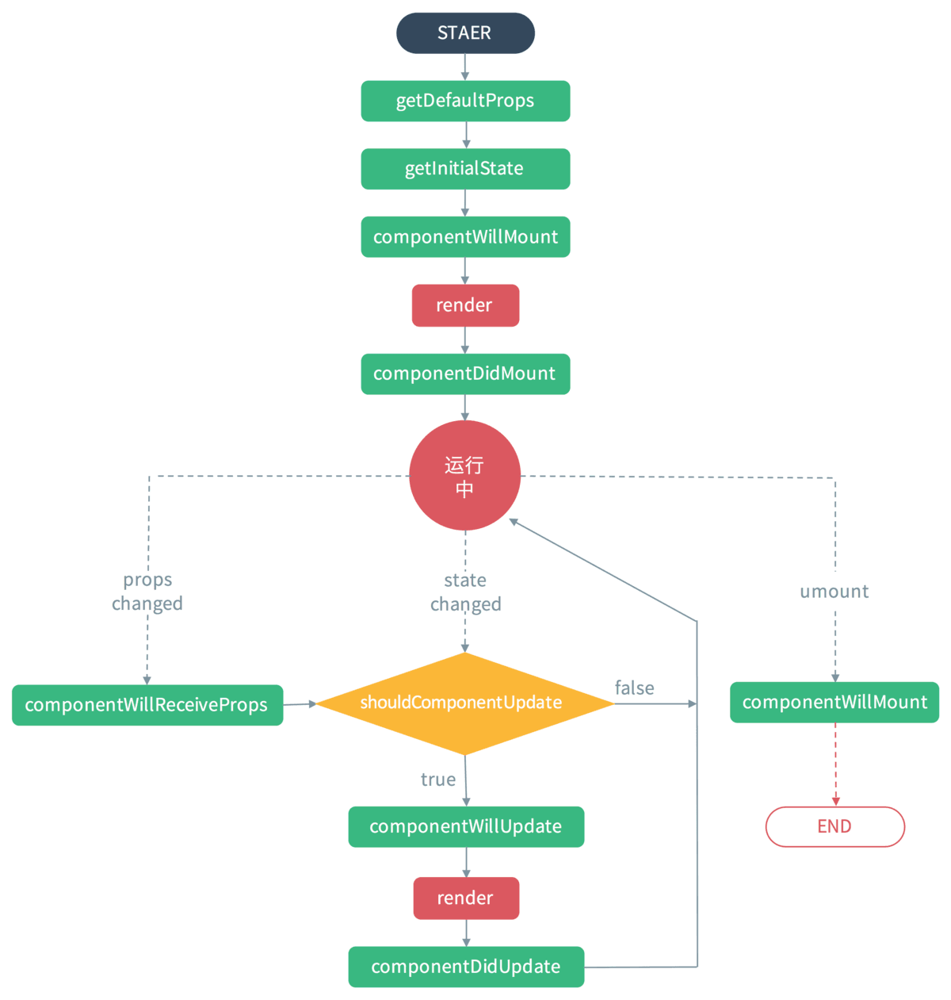

# 父子组件生命周期方法执行顺序

[参考链接](https://www.jianshu.com/p/318ffc6f4848)

## 旧生命周期



PS：无状态组件中没有这些生命周期方法

### 过程

#### 组件挂载的过程

- 初始化 props，通过类的静态属性 defaultProps 或者 getDefaultProps 函数，初始化的 props 会与父组件指定的 props 合并，最后赋值给 this.props
- constructor()或者 getInitialState
- componentWillMount()，此时 dom 还没渲染，在这里执行的 setState 不会导致重绘，执行无效果 (==试验过了，是有效果的==)
- render()
- componentDidMount()，在这里执行的 setState 会导致重绘（或称为二次渲染）

#### 被动更新流程（父组件 setState）

- componentWillReceiveProps()，这时子组件的 props 仍然是旧的，可以在这里把新的 props 通过 setState 设置进 state 中，不会触发二次渲染
- shouldComponentUpdate()，这里读取到的 state 是以上更新后的 state
- componentWillUpdate()，不能在这里执行 setState，执行了无效果（==需加条件不然会造成死循环==）
- render()
- componentDidUpdate()，可以在这里进行异步的 setState（==需加条件不然会造成死循环==）

#### 主动更新流程（当前组件 setState）

- 执行的函数相比上面的被动更新流程，少了一个 componentWillReceiveProps 方法，其余的都一样。

#### 卸载流程

父组件先于子组件卸载

```js
Parent componentWillUnmount
Child componentWillUnmount
```

### Demo 效果

```js
import React from "react";

const buildClass = (name) => {
  return class extends React.Component {
    constructor(props) {
      super(props);
      console.log(name + " constructor");
    }
    componentWillMount() {
      console.log(name + " componentWillMount");
    }
    componentDidMount() {
      console.log(name + " componentDidMount");
    }
    componentWillUnmount() {
      console.log(name + " componentWillUnmount");
    }
    componentWillReceiveProps(nextProps) {
      console.log(name + " componentWillReceiveProps(nextProps)");
    }
    shouldComponentUpdate(nextProps, nextState) {
      console.log(name + " shouldComponentUpdate(nextProps, nextState)");
      return true;
    }
    componentWillUpdate(nextProps, nextState) {
      console.log(name + " componentWillUpdate(nextProps, nextState)");
    }
    componentDidUpdate(prevProps, prevState) {
      console.log(name + " componetDidUpdate(prevProps, prevState)");
    }
  };
};

class Child extends buildClass("Child") {
  render() {
    console.log("Child render");
    return <div>child</div>;
  }
}
class Parent extends buildClass("Parent") {
  render() {
    console.log("Parent render");
    return <Child />;
  }
}
export default Parent;
```

执行结果

```js
Parent constructor
Parent componentWillMount
Parent render
  Child constructor
  Child componentWillMount
  Child render
  Child componentDidMount
Parent componentDidMount
```

总结：**当执行 render 子组件的时候，才会进入子组件的生命周期，子组件的周期结束后，再回到上级的周期**。

### 更新组件的两种方式

- 主动更新：组件通过 setState 修改自己的状态。
  修改子组件的代码：

```js
class Child extends buildClass("Child") {
  render() {
    console.log("Child render");
    return (
      <button
        onClick={() => {
          this.setState({ data: 123 });
        }}
      >
        child
      </button>
    );
  }
}
```

执行结果：

```js
Child shouldComponentUpdate(nextProps, nextState)
Child componentWillUpdate(nextProps, nextState)
Child render
Child componetDidUpdate(prevProps, prevState)
```

- 被动更新：父组件通过 props 把自己的 state 传递给子组件，父组件执行 setState 更新状态
  还原子组件的代码，修改父组件代码如下：

执行结果：

```js
Parent shouldComponentUpdate(nextProps, nextState)
Parent componentWillUpdate(nextProps, nextState)
Parent render
  Child componentWillReceiveProps(nextProps)
  Child shouldComponentUpdate(nextProps, nextState)
  Child componentWillUpdate(nextProps, nextState)
  Child render
  Child componetDidUpdate(prevProps, prevState)
Parent componetDidUpdate(prevProps, prevState)
```

### 总结

不管父组件有没有把数据传递给子组件，只要父组件 setState，都会走一遍子组件的更新周期。而且子组件被动更新会比主动更新所执行的流程多出来一个
componentWillReceiveProps 方法。

如果在以上被动更新的基础上，修改 buildClass 中的代码，使 shouldComponentUpdate 返回 false，代码如下：

```js
shouldComponentUpdate(nextProps, nextState) {
    console.log( name + ' shouldComponentUpdate(nextProps, nextState)');
    return false;
}
```

点击 parent 中的更新按钮，仅仅输出一句：
`Parent shouldComponentUpdate(nextProps, nextState)`
结论：只要组件在以上函数中返回 false，则子组件不会进行更新 re-render，所有更新流程都不执行了。

## 新生命周期

> **说明：**

componentWillUpdate,componentWillReceiveProps,componentWillUpdate 这三个生命周期在 React 未来版本中会被废弃。
而 UNSAFE_componentWillUpdate,UNSAFE_componentWillReceiveProps,UNSAFE_componentWillUpdate 未来版本中仍可继续使用。

### 初始化阶段


### 运行阶段：父组件 props/state 更新

子组件的 shouldComponentUpdate 返回 false，则子组件其后的生命周期都不在进行，但是父组件的生命周期继续执行。


### 卸载阶段


## 如何让子组件的 didmount 晚于父组件的执行

- **方法一：条件渲染**
  初始化时条件是不满足展示的，父的数据来了才会满足并展示

```js
render(){
  return (
    {
      tabIndex === '1' && (
        <MyCollectionSettingLabels initialFields={originalParams} onChange={this.handleAttentionLabelChange} />
      )
    }
  )
}
```

如上图，父组件中根据条件渲染子组件，可以实现。
但是父组件初始渲染时，`tabIndex !== '1'` 子组件的 render 却执行了，没执行 didmount（可能是因为是小程序引起的，react Demo 项目没有复现）。

然后满足条件，`tabIndex === '1'` 子组件开始挂载 didmount 开始执行。

- **方法二：子组件 WillReceiveProps 方法中监听父组件是否初始化数据完成**

```js
componentWillReceiveProps(nextProps) {
  const { requested } = this.state
  const { parentFlag } = nextProps
  if (parentFlag && !requested) {
    this.initialData(nextProps)
    this.setState({
      requested: true,
    })
  }
}
```

- **方法三：子组件只用父组件给的数据，内部状态自己维护**
  如下，新房房源详情页面，户型图是个子组件，父的只传过来需要的数据：`houseTypes`。
  子组件的活跃 tab 可以用默认的 0，下面对应的数据该用什么？
  

如下，先从 state 中取 activeTabName ，找不到再用第一个，手动切换 tab 就更新 activeTab 和 activeTabName。

就实现了子组件只用父给的数据，内部状态自己维护

```js
state = {
  activeTab: 0, // 户型图active tab
  activeTabName: "", // 户型图active tab 名称
};

onClickTab = (v, i) => {
  this.setState({
    activeTab: i,
    activeTabName: v,
  });
};

const showPics = activeTabName
  ? activeTabName
  : Object.keys(houseTypes || {})[0] || "";
```

# 父子组件渲染更新情况

## 原始

```jsx
// .classComParent.js
import React from "react";
import { Card, Button } from "antd";
import { getRandomInt } from "@/utils/math";
import Child from "./Child";
import "./index.scss";

class Parent extends React.Component {
  state = {
    parentTitle: "父-1",
  };

  render() {
    const { parentTitle } = this.state;
    console.log("Parent render");
    return (
      <div>
        <Card title="父组件" style={{ marginBottom: "16px" }}>
          <p>parentTitle：{parentTitle}</p>
          <Button
            type="primary"
            onClick={() =>
              this.setState({
                parentTitle: `父-${getRandomInt(0, 10)}`,
              })
            }
          >
            修改父组件state
          </Button>
        </Card>
        <Child />
      </div>
    );
  }
}

export default Parent;
```

```jsx
// .classComSon.js
import React from "react";
import { Card, Button } from "antd";
import { getRandomInt } from "@/utils/math";

class Child extends React.Component {
  state = {
    childTitle: "子-0",
  };

  render() {
    const { childTitle } = this.state;
    console.log("Child render");
    return (
      <Card title="子组件：class式组件">
        <div>childTitle：{childTitle}</div>
        <Button
          type="primary"
          onClick={() =>
            this.setState({
              childTitle: `子-${getRandomInt(0, 10)}`,
            })
          }
        >
          修改子组件state
        </Button>
      </Card>
    );
  }
}

export default Child;
```

修改父组件 state 后，子组件也重新 render，如下：

```jsx
Parent render
QChild render
```

> **总结：**

- ==只要父组件一执行 setState 重新渲染/Render，不管子组件是否接受了 props，子组件都会重新渲染/Render==

## 子组件是 PureComponent

```jsx
import React from "react";
import { Card, Button } from "antd";
import { getRandomInt } from "@/utils/math";

class Child extends React.PureComponent {
  state = {
    childTitle: "子-0",
  };

  render() {
    const { childTitle } = this.state;
    console.log("Child render");
    return (
      <Card title="子组件：class式组件">
        <div>childTitle：{childTitle}</div>
        {/* <div>parentTitle{this.props.parentTitle}</div> */}
        <Button
          type="primary"
          onClick={() =>
            this.setState({
              childTitle: `子-${getRandomInt(0, 10)}`,
            })
          }
        >
          修改子组件state
        </Button>
      </Card>
    );
  }
}

export default Child;
```

> **总结：**

- 父组件 setState 的三种情况
  - ==父组件没有给子组件传 props：`<Child />`，子组件不会重新渲染==
  - 父组件给子组件==传了 props，但是 props 中没有此次父组件 setState 更新的属性：`<Child parentFixedProperty={this.state.parentFixedProperty} />`，子组件不会重新渲染==
  - 父组件给子组件==传了 props，props 中有此次父组件 setState 更新的属性：`<Child parentFixedProperty={this.state.parentFixedProperty} />`，子组件不一定会重新渲染==
    - 基础数据类型: 修改了值才会重新渲染，实例如下
    - 引用数据类型: 修改了值的引用才会重新渲染

```jsx
import React from "react";
import { Card, Button } from "antd";
import { getRandomInt } from "@/utils/math";
import Child from "./Child";
import "./index.scss";

class Parent extends React.Component {
  state = {
    parentTitle: "父-1",
    fixedBasicProperty: "父-固定基础属性",
    parentFixedObjectProperty: { title: "父-固定引用属性" },
  };

  render() {
    const { parentTitle } = this.state;
    console.log("Parent render");
    return (
      <div>
        <Card title="父组件" style={{ marginBottom: "16px" }}>
          <p>parentTitle：{parentTitle}</p>
          <Button
            type="primary"
            onClick={() =>
              this.setState((prev) => {
                return {
                  parentTitle: `父-${getRandomInt(0, 10)}`,
                  fixedBasicProperty: `父-固定基础属性${getRandomInt(0, 10)}`, // fixedBasicProperty的值修改了，点击Button，子组件会重新渲染
                  // fixedBasicProperty: "父-固定基础属性", // fixedBasicProperty的值不变（修改了但是还是跟之前的值一样），点击Button，子组件不会重新渲染
                  // fixedBasicProperty: prev.fixedBasicProperty, // fixedBasicProperty的值不变 点击Button，子组件不会重新渲染
                };
              })
            }
          >
            修改父组件state
          </Button>
        </Card>
        {/* <Child parentTitle={parentTitle} /> */}
        <Child parentFixedBasicProperty={this.state.fixedBasicProperty} />
        {/* <Child /> */}
      </div>
    );
  }
}

export default Parent;
```

```jsx
import React from "react";
import { Card, Button } from "antd";
import { getRandomInt } from "@/utils/math";
import Child from "./Child";
import "./index.scss";

class Parent extends React.Component {
  state = {
    parentTitle: "父-1",
    fixedBasicProperty: "父-固定基础属性",
    parentFixedObjectProperty: { title: "父-固定引用属性" },
  };

  render() {
    const { parentTitle } = this.state;
    console.log("Parent render");
    return (
      <div>
        <Card title="父组件" style={{ marginBottom: "16px" }}>
          <p>parentTitle：{parentTitle}</p>
          <Button
            type="primary"
            onClick={() =>
              this.setState((prev) => {
                return {
                  parentTitle: `父-${getRandomInt(0, 10)}`,
                  // parentFixedObjectProperty: { title: "父-固定引用属性" }, // parentFixedObjectProperty的值的地址改变了，点击Button，子组件会重新渲染
                  // parentFixedObjectProperty: prev.parentFixedObjectProperty, // parentFixedObjectProperty的值的地址没有改变，点击Button，子组件不会重新渲染
                };
              })
            }
          >
            修改父组件state
          </Button>
        </Card>
        <Child
          parentFixedObjectProperty={this.state.parentFixedObjectProperty}
        />
        {/* <Child /> */}
      </div>
    );
  }
}

export default Parent;
```

- 子组件点击事件触发父组件的 setState(传参为对象 A)，只有满足下面两个条件，才会触发子组件的重新渲染
  - 父组件传给子组件的 props 包含 A 里面包含的属性
  - 且属性值/引用变了 （参考`父组件setState的三种情况`里的第三种情况）

```jsx
import React from "react";
import { Card, Button } from "antd";
import { getRandomInt } from "@/utils/math";
import Child from "./Child";
import "./index.scss";

class Parent extends React.Component {
  state = {
    parentTitle: "父-1",
    fixedBasicProperty: "父-固定基础属性",
    parentFixedObjectProperty: { title: "父-固定引用属性" },
  };

  setParentState = (obj) => {
    this.setState(obj);
  };

  render() {
    const { parentTitle } = this.state;
    console.log("Parent render");
    return (
      <div>
        <Card title="父组件" style={{ marginBottom: "16px" }}>
          <p>parentTitle：{parentTitle}</p>
          <Button
            type="primary"
            onClick={() =>
              this.setState((prev) => {
                return {
                  parentTitle: `父-${getRandomInt(0, 10)}`,
                  fixedBasicProperty: "父-固定基础属性", // parentFixedObjectProperty的值的地址改变了，点击Button，子组件会重新渲染
                };
              })
            }
          >
            修改父组件state
          </Button>
        </Card>
        <Child
          // parentTitle={this.state.parentTitle}
          fixedBasicProperty={this.state.fixedBasicProperty}
          setParentState={this.setParentState}
        />
        {/* <Child /> */}
      </div>
    );
  }
}

export default Parent;
```

```jsx
import React from "react";
import { Card, Button } from "antd";
import { getRandomInt } from "@/utils/math";

class Child extends React.PureComponent {
  state = {
    childTitle: "子-0",
  };

  render() {
    const { childTitle } = this.state;
    const { setParentState } = this.props;
    console.log("Child render");
    return (
      <Card title="子组件：class式组件">
        <div>childTitle：{childTitle}</div>
        {/* <div>parentTitle{this.props.parentTitle}</div> */}
        <Button
          type="primary"
          onClick={() =>
            this.setState({
              childTitle: `子-${getRandomInt(0, 10)}`,
            })
          }
        >
          修改子组件state
        </Button>
        <br />
        <Button
          type="primary"
          style={{ marginTop: "16px" }}
          onClick={() =>
            setParentState({
              // parentTitle: `子给父-${getRandomInt(0, 10)}`,
              // fixedBasicProperty: `父-固定基础属性${getRandomInt(0, 10)}`
            })
          }
        >
          修改父组件state
        </Button>
      </Card>
    );
  }
}
export default Child;
```

## 子组件是函数式-无状态组件

```jsx
const Child = (props) => {
  console.log("Child render");
  return (
    <Card title="子组件: 函数式组件-无状态">
      {/* <div>parentTitle{this.props.parentTitle}</div> */}
    </Card>
  );
};

export default Child;
```

> **总结：**

- ==只要父组件一执行 setState 重新渲染/Render，不管子组件是否接受了 props，子组件都会重新渲染/Render==

## 子组件是函数式-无状态组件 + 用`React.memo()`包着

```jsx
const Child = (props) => {
  console.log("Child render");
  return (
    <Card title="子组件: 函数式组件-无状态">
      {/* <div>parentTitle{this.props.parentTitle}</div> */}
    </Card>
  );
};
export default React.memo(Child);
```

效果同 `子组件是PureComponent`中的三种情况

## 总结

**要想解决父组件重新渲染而引起的子组件的不必要渲染问题**，方法如下（两种打印效果相同）

- class 组件：子组件继承自`pureComponent`，即`class Child extends React.PureComponent {}`
- 函数组件：子组件用`React.memo()`包裹，即`const Child = React.memo((props => { return <div></div>}))`

# 问题

## 父子组件传值时机导致渲染错误问题

如下，子组件使用父组件的 tagValue 作为 value 的初始值，如果父组件是按照错误写法，子组件是不能正确获得初始值的，因为子组件的 useEffect(即 didMount)要早于父组件，

```jsx
// 正确写法
// 父组件
  const [tagValue, setTagValue] = useState<string[]>(resource?.tags?.map((v) => v?.id) || [])
  return (
        <TagSelect value={tagValue as any} onChange={onTagSelectChange} disabled={false} />
  ）
// 子组件
  const [realList, setRealList] = useState(props.value || [])

```

```jsx
// 错误写法
// 父组件
  const [tagValue, setTagValue] = useState<string[]>([])

  useEffect(() => {
    setTagValue(resource?.tags?.map((v) => v?.id) || [])
  }, [resource])

  return (
        <TagSelect value={tagValue as any} onChange={onTagSelectChange} disabled={false} />
  ）
// 子组件
  const [realList, setRealList] = useState(props.value || [])

```

# Tips

- 查找组件重新 render 是什么造成的时候，可以用控制变量法：`即注释return中的内容或者子组件`，如果内容或者子组件注释后就不再重新 render 了，就说明问题就出在那里。
