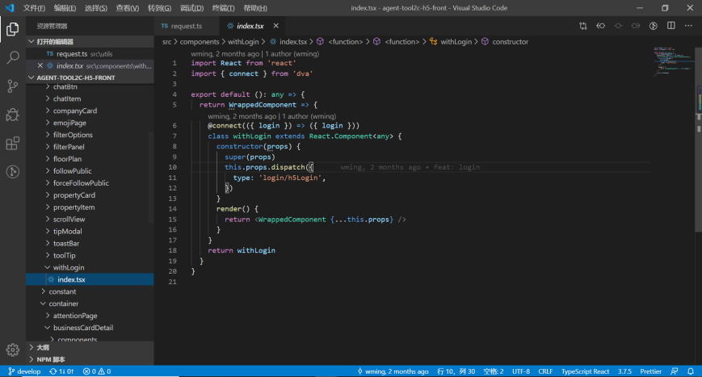
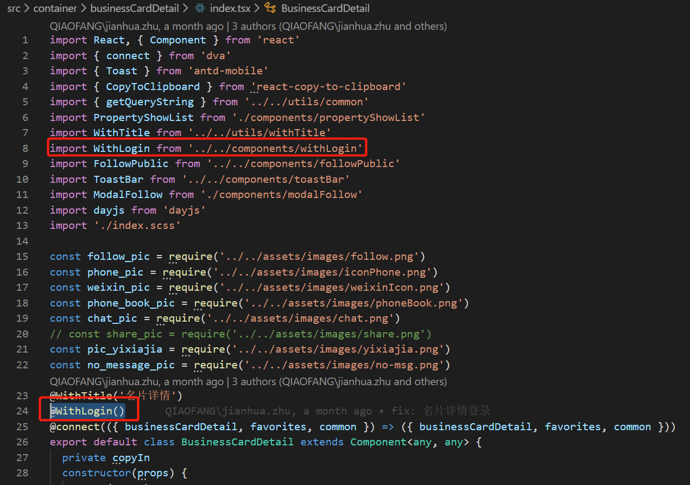

## 是什么
> **定义：**
高阶组件不是一个组件而是一个函数, ==高阶组件是参数为组件，返回值为新组件的函数==。


高阶组件（HOC）是 React 中==用于复用组件逻辑的一种高级技巧==。HOC 自身不是 React API 的一部分，==它是一种基于 React 的组合特性而形成的设计模式==。

```js
const EnhancedComponent = higherOrderComponent(WrappedComponent);
```
==组件是将 props 转换为 UI，而高阶组件是将组件转换为另一个组件==。

HOC 在 React 的第三方库中很常见，例如 Redux 的 connect 和 Relay 的 createFragmentContainer。

在本文档中，我们将讨论为什么高阶组件有用，以及如何编写自己的 HOC 函数。

## 为什么使用：使用高阶组件能解决什么问题
高阶组件能解决的问题可以简单概括成以下三个方面：
- 抽取重复代码，实现组件复用，常见场景：页面复用。
- 条件渲染，控制组件的渲染逻辑（渲染劫持），常见场景：权限控制。
- 捕获/劫持被处理组件的生命周期，常见场景：组件渲染性能追踪、日志打点。


在业务开发中，虽然不掌握高阶组件也可以完成项目的开发，但是如果我们能够灵活地使用高阶组件（加分项 🥰），可以让项目代码变得更加优雅，同时增强代码的复用性和灵活性，提升开发效率。
同时，了解高阶组件对我们理解各种 React.js 第三方库的原理很有帮助。

## 怎么做：实现
通常情况下，实现高阶组件的方式有以下两种:
- 属性代理(Props Proxy)
  - 返回一个无状态（stateless）的函数组件
  - 返回一个 class 组件
- 反向继承(Inheritance Inversion)


高阶组件实现方式的差异性决定了它们各自的应用场景：一个 React 组件包含了 props、state、ref、生命周期方法、static方法和React 元素树几个重要部分，所以我将从以下几个方面对比两种高阶组件实现方式的差异性：
- 原组件能否被包裹
- 原组件是否被继承
- 能否读取/操作原组件的 props
- 能否读取/操作原组件的 state
- 能否通过 ref 访问到原组件的 dom 元素
- 是否影响原组件某些生命周期等方法
- 是否取到原组件 static 方法
- 能否劫持原组件生命周期方法
- 能否渲染劫持


## 使用 HOC 解决横切关注点问题
==组件是 React 中代码复用的基本单元。但你会发现某些模式并不适合传统组件==。

例如，假设有一个 CommentList 组件，它订阅外部数据源，用以渲染评论列表：


CommentList 和 BlogPost 不同 - 它们在 DataSource 上调用不同的方法，且渲染不同的结果。但它们的大部分实现都是一样的：

- 在挂载时，向 DataSource 添加一个更改侦听器。
- 在侦听器内部，当数据源发生变化时，调用 setState。
- 在卸载时，删除侦听器。

你可以想象，==在一个大型应用程序中，这种订阅 DataSource 和调用 setState 的模式将一次又一次地发生。我们需要一个抽象，允许我们在一个地方定义这个逻辑，并在许多组件之间共享它。这正是高阶组件擅长的地方==。

对于订阅了 DataSource 的组件，比如 CommentList 和 BlogPost，我们可以编写一个创建组件函数。该函数将接受一个子组件作为它的其中一个参数，该子组件将订阅数据作为 prop。让我们调用函数 withSubscription：

```js
const CommentListWithSubscription = withSubscription(
  CommentList,
  (DataSource) => DataSource.getComments()
);

const BlogPostWithSubscription = withSubscription(
  BlogPost,
  (DataSource, props) => DataSource.getBlogPost(props.id)
);
```

第一个参数是被包装组件。第二个参数通过 DataSource 和当前的 props 返回我们需要的数据。

当渲染 CommentListWithSubscription 和 BlogPostWithSubscription 时， CommentList 和 BlogPost 将传递一个 data prop，其中包含从 DataSource 检索到的最新数据：

```js
// 此函数接收一个组件...
function withSubscription(WrappedComponent, selectData) {
  // ...并返回另一个组件...
  return class extends React.Component {
    constructor(props) {
      super(props);
      this.handleChange = this.handleChange.bind(this);
      this.state = {
        data: selectData(DataSource, props)
      };
    }

    componentDidMount() {
      // ...负责订阅相关的操作...
      DataSource.addChangeListener(this.handleChange);
    }

    componentWillUnmount() {
      DataSource.removeChangeListener(this.handleChange);
    }

    handleChange() {
      this.setState({
        data: selectData(DataSource, this.props)
      });
    }

    render() {
      // ... 并使用新数据渲染被包装的组件!
      // 请注意，我们可能还会传递其他属性
      return <WrappedComponent data={this.state.data} {...this.props} />;
    }
  };
}
```

请注意，==HOC 不会修改传入的组件，也不会使用继承来复制其行为。相反，HOC 通过将组件包装在容器组件中来组成新组件。HOC 是纯函数，没有副作用==。

被包装组件接收来自容器组件的所有 prop，同时也接收一个新的用于 render 的 data prop。==HOC 不需要关心数据的使用方式或原因，而被包装组件也不需要关心数据是怎么来的==。

因为 withSubscription 是一个普通函数，你可以根据需要对参数进行增添或者删除。例如，您可能希望使 data prop 的名称可配置，以进一步将 HOC 与包装组件隔离开来。或者你可以接受一个配置 shouldComponentUpdate 的参数，或者一个配置数据源的参数。因为 HOC 可以控制组件的定义方式，这一切都变得有可能。

与组件一样，withSubscription 和包装组件之间的契约完全基于之间传递的 props。这种依赖方式使得替换 HOC 变得容易，只要它们为包装的组件提供相同的 prop 即可。例如你需要改用其他库来获取数据的时候，这一点就很有用。

## 不要改变原始组件。使用组合。
不要试图在 HOC 中修改组件原型（或以其他方式改变它）。

```js
function logProps(InputComponent) {
  InputComponent.prototype.componentDidUpdate = function(prevProps) {
    console.log('Current props: ', this.props);
    console.log('Previous props: ', prevProps);
  };
  // 返回原始的 input 组件，暗示它已经被修改。
  return InputComponent;
}

// 每次调用 logProps 时，增强组件都会有 log 输出。
const EnhancedComponent = logProps(InputComponent);
```

这样做会产生一些不良后果。
- 其一是输入组件再也无法像 HOC 增强之前那样使用了。
- 更严重的是，如果你再用另一个同样会修改 componentDidUpdate 的 HOC 增强它，那么前面的 HOC 就会失效！同时，这个 HOC 也无法应用于没有生命周期的函数组件。

修改传入组件的 HOC 是一种糟糕的抽象方式。调用者必须知道他们是如何实现的，以避免与其他 HOC 发生冲突。

==HOC 不应该修改传入组件，而应该使用组合的方式，通过将组件包装在容器组件中实现功能：==

```js
function logProps(WrappedComponent) {
  return class extends React.Component {
    componentDidUpdate(prevProps) {
      console.log('Current props: ', this.props);
      console.log('Previous props: ', prevProps);
    }
    render() {
      // 将 input 组件包装在容器中，而不对其进行修改。Good!
      return <WrappedComponent {...this.props} />;
    }
  }
}
```

该 HOC 与上文中修改传入组件的 HOC 功能相同，同时避免了出现冲突的情况。它同样适用于 class 组件和函数组件。而且因为它是一个纯函数，它可以与其他 HOC 组合，甚至可以与其自身组合。

您可能已经注意到 HOC 与容器组件模式之间有相似之处。容器组件担任分离将高层和低层关注的责任，由容器管理订阅和状态，并将 prop 传递给处理渲染 UI。HOC 使用容器作为其实现的一部分，==你可以将 HOC 视为参数化容器组件==。

## 约定：将不相关的 props 传递给被包裹的组件
HOC 为组件添加特性。自身不应该大幅改变约定。HOC 返回的组件与原组件应保持类似的接口。

HOC 应该透传与自身无关的 props。大多数 HOC 都应该包含一个类似于下面的 render 方法：

```js
render() {
  // 过滤掉非此 HOC 额外的 props，且不要进行透传
  const { extraProp, ...passThroughProps } = this.props;

  // 将 props 注入到被包装的组件中。
  // 通常为 state 的值或者实例方法。
  const injectedProp = someStateOrInstanceMethod;

  // 将 props 传递给被包装组件
  return (
    <WrappedComponent
      injectedProp={injectedProp}
      {...passThroughProps}
    />
  );
}
```

## 约定：最大化可组合性
并不是所有的 HOC 都一样。有时候它仅接受一个参数，也就是被包裹的组件：

```js
const NavbarWithRouter = withRouter(Navbar);
```

HOC 通常可以接收多个参数。比如在 Relay 中，HOC 额外接收了一个配置对象用于指定组件的数据依赖：

```js
const CommentWithRelay = Relay.createContainer(Comment, config);
```

最常见的 HOC 签名如下：
```js
// React Redux 的 `connect` 函数
const ConnectedComment = connect(commentSelector, commentActions)(CommentList);
```

刚刚发生了什么？！如果你把它分开，就会更容易看出发生了什么。
```js
// connect 是一个函数，它的返回值为另外一个函数。
const enhance = connect(commentListSelector, commentListActions);
// 返回值为 HOC，它会返回已经连接 Redux store 的组件
const ConnectedComment = enhance(CommentList);
```

换句话说，connect 是一个返回高阶组件的高阶函数！

这种形式可能看起来令人困惑或不必要，但它有一个有用的属性。 像 connect 函数返回的单参数 HOC 具有签名 ```Component => Component```。 输出类型与输入类型相同的函数很容易组合在一起。

```js
// 而不是这样...
const EnhancedComponent = withRouter(connect(commentSelector)(WrappedComponent))

// ... 你可以编写组合工具函数
// compose(f, g, h) 等同于 (...args) => f(g(h(...args)))
const enhance = compose(
  // 这些都是单参数的 HOC
  withRouter,
  connect(commentSelector)
)
const EnhancedComponent = enhance(WrappedComponent)
```

许多第三方库都提供了 compose 工具函数，包括 lodash （比如 lodash.flowRight）， Redux 和 Ramda。


## 约定：包装显示名称以便轻松调试

HOC 创建的容器组件会与任何其他组件一样，会显示在 `React Developer Tools` 中。为了方便调试，请选择一个显示名称，以表明它是 HOC 的产物。

最常见的方式是用 HOC 包住被包装组件的显示名称。比如高阶组件名为 withSubscription，并且被包装组件的显示名称为 CommentList，显示名称应该为 `WithSubscription(CommentList)`：

```js
function withSubscription(WrappedComponent) {
  class WithSubscription extends React.Component {/* ... */}
  WithSubscription.displayName = `WithSubscription(${getDisplayName(WrappedComponent)})`;
  return WithSubscription;
}

function getDisplayName(WrappedComponent) {
  return WrappedComponent.displayName || WrappedComponent.name || 'Component';
}
```

## 语法格式
例子：Props Proxy 模式 的 HOC 最简参数使用方法。关键在于 HOCFactoryFactory 函数。

```js
function HOCFactoryFactory(...params){
  // do something with params
  return function HOCFactory(WrappedComponent) {
    return class HOC extends React.Component {
      render() {
        return <WrappedComponent {...this.props}/>
      }
    }
  }
}
```
你可以这样用：
```js
HOCFactoryFactory(params)(WrappedComponent)

// 或者

@HOCFatoryFactory(params)
class WrappedComponent extends React.Component{}
```

## 注意事项
高阶组件有一些需要注意的地方，对于 React 新手来说可能并不容易发现。

### 不要在 render 方法中使用 HOC
React 的 diff 算法（称为协调）使用组件标识来确定它是应该更新现有子树还是将其丢弃并挂载新子树。 如果从 render 返回的组件与前一个渲染中的组件相同（===），则 React 通过将子树与新子树进行区分来递归更新子树。 如果它们不相等，则完全卸载前一个子树。

通常，你不需要考虑这点。但对 HOC 来说这一点很重要，因为这代表着你不应在组件的 render 方法中对一个组件应用 HOC：

```js
render() {
  // 每次调用 render 函数都会创建一个新的 EnhancedComponent
  // EnhancedComponent1 !== EnhancedComponent2
  const EnhancedComponent = enhance(MyComponent);
  // 这将导致子树每次渲染都会进行卸载，和重新挂载的操作！
  return <EnhancedComponent />;
}
```

这不仅仅是性能问题 - 重新挂载组件会导致该组件及其所有子组件的状态丢失。

如果在组件之外创建 HOC，这样一来组件只会创建一次。因此，每次 render 时都会是同一个组件。一般来说，这跟你的预期表现是一致的。

在极少数情况下，你需要动态调用 HOC。你可以在组件的生命周期方法或其构造函数中进行调用。


### 务必复制静态方法
有时在 React 组件上定义静态方法很有用。例如，Relay 容器暴露了一个静态方法 getFragment 以方便组合 GraphQL 片段。

但是，当你将 HOC 应用于组件时，原始组件将使用容器组件进行包装。这意味着新组件没有原始组件的任何静态方法。

```js
// 定义静态函数
WrappedComponent.staticMethod = function() {/*...*/}
// 现在使用 HOC
const EnhancedComponent = enhance(WrappedComponent);

// 增强组件没有 staticMethod
typeof EnhancedComponent.staticMethod === 'undefined' // true
```

为了解决这个问题，你可以在返回之前把这些方法拷贝到容器组件上：
```js
function enhance(WrappedComponent) {
  class Enhance extends React.Component {/*...*/}
  // 必须准确知道应该拷贝哪些方法 :(
  Enhance.staticMethod = WrappedComponent.staticMethod;
  return Enhance;
}
```

有非 React 静态方法:
```js
import hoistNonReactStatic from 'hoist-non-react-statics';
function enhance(WrappedComponent) {
  class Enhance extends React.Component {/*...*/}
  hoistNonReactStatic(Enhance, WrappedComponent);
  return Enhance;
}
```

除了导出组件，另一个可行的方案是再额外导出这个静态方法。
```js
// 使用这种方式代替...
MyComponent.someFunction = someFunction;
export default MyComponent;

// ...单独导出该方法...
export { someFunction };

// ...并在要使用的组件中，import 它们
import MyComponent, { someFunction } from './MyComponent.js';
```

### Refs 不会被传递
虽然高阶组件的约定是将所有 props 传递给被包装组件，但这对于 refs 并不适用。那是因为 ref 实际上并不是一个 prop - 就像 key 一样，它是由 React 专门处理的。如果将 ref 添加到 HOC 的返回组件中，则 ref 引用指向容器组件，而不是被包装组件。

这个问题的解决方案是通过使用 React.forwardRef API（React 16.3 中引入）

## 实例

### 实例一：登录高阶组件
withLoginAuth显示被包裹子组件，没登录提示登录

```js
function withLoginAuth(WrappedComponent) {
  return class extends React.Component {
    constructor(props) {
        super(props);
        this.state = {
          isLogin: false
        };
    }
    async componentDidMount() {
        const isLogin = await getLoginStatus();
        this.setState({ isLogin });
    }
    render() {
      if (this.state.isLogin) {
          return <WrappedComponent {...this.props} />;
      }
      return (<div>您还未登录...</div>);
    }
  }
}
```

### 实例二：
```js
import React from 'react'
import { connect } from 'dva'

export default (): any => {
  return WrappedComponent => {
    @connect(({ login }) => ({ login }))
    class withLogin extends React.Component<any> {
      constructor(props) {
        super(props)
        this.props.dispatch({
          type: 'login/h5Login',
        })
      }
      render() {
        return <WrappedComponent {...this.props} />
      }
    }
    return withLogin
  }
}
```





# 参考链接
- [@React高阶组件(HOC)及实践](https://juejin.cn/post/6844904050236850184)
- [hoc、render props、react-hooks的优劣如何？](https://juejin.cn/post/6844903922453200904?share_token=18500bd1-d465-4554-b988-2144939332df#heading-8)