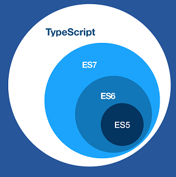

# TS 介绍

## 是什么

> 官方定义：Type is a typed superset of Java that compiles to plain Java。Type 是一个编译到纯 JS 的有类型定义的 JS 超集。<br>

> TypeScript 是由微软开发的一款开源的编程语言，TS**是 JS 的超集（遵循 ECMAScript6 语法），扩展了 JS 的语法，添加了基于类的面向对象编程**。



**TS 作为 JS 很大的一个语法糖，本质上是类似于 css 的 less、sass，都是为了便于开发、维护，最后还是编译成 JS**，只要是 JS 可以运行的地方它都可以运行。

TS 更像后端 java、C#这样的面向对象语言可以让 js 开发大型企业项目。谷歌也在大力支持 Typescript 的推广，谷歌的 angular2.x+就是基于 Typescript 语法。最新的 Vue 、React 也可以集成 TypeScript。

## 为什么要用 TS

> **生命周期较长的复杂 SPA 应用，保障开发效率的同时提升代码的可维护性和线上的运行质量。**

- **开发效率**：虽然我们需要多写一些类型定义的代码，但是 TS 在 VSCode、WebStorm 等 IDE 下可以做到智能提示，智能感知 bug，同时我们项目使用的第三方依赖都有 TS 的类型声明，这在团队协作的效率中可以提升整体的开发效率；
- **可维护性**：生命周期较长的项目往往参与维护开发的人员数量很多，水平也有差异。而软件具有熵的特性，**长期维护迭代总会遇到项目的可维护性逐渐降低的问题**。**有了强类型的约束和静态检查，以及 IDE 的智能提示，能降低软件的腐化速度，提升可维护性**。而且在重构的时候，强类型和静态检查还可以提供很大的帮助，甚至有了类型定义，会不经意间增加重构的频率（更安全、放心）；
- **线上运行时质量**：我们项目很多的 bug 都是由于调用方和被调用方（比如组件间的调用，函数的调用，接口的调用）的**数据格式不匹配引起的**。由于 TS 有编译时的静态检查，**让我们的 bug 尽量消除在编译前**。加上 IDE 有智能提示，开发过程中就能提前感知 bug 的存在，我们的线上运行质量能更加稳定可控。

> 一个复杂软件的常规研发流程，大致分为定义问题、需求分析、规划构建、软件架构、详细设计、编码调试、单元测试、集成测试、集成、系统测试、保障维护。构建活动（主要是编码调试）在中大型项目中的工作量占比大于 50%。同时，一个中大型项目，bug 由构建阶段引起的比例占到 50%~75%，对于一个成功的项目来说，构建活动是必须要做的，而且是工程师更为可控的。【代码大全】

TS 适合大规模 JavaScript 应用，正如他的官方宣传语`JavaScript that scales`。从以下几点可以看到 TS 在**团队协作、可维护性、易读性、稳定性（编译期提前暴露 bug）等方面上有着明显的好处**：

- 加上了类型系统，对于阅读代码的人和编译器都是友好的。对阅读者来说，类型定义加上 IDE 的智能提示，增强了代码的易读型；对于编译器来说，类型定义可以让编译器揪出隐藏的 bug。
- 类型系统+静态分析检查+智能感知/提示，使大规模的应用代码质量更高，运行时 bug 更少，更方便维护。
- 有类似 VSCode 这样配套的 IDE 支持，方便的查看类型推断和引用关系，可以更方便和安全的进行重构，再也不用全局搜索，一个个修改了。
- 给应用配置、应用状态、前后端接口及各种模块定义类型，整个应用都是一个个的类型定义，使协作更为方便、高效和安全。

## TS 相对于 JS 的优势

- 支持 ES6 的规范
- 强大的 IDE 支持
  - **类型检查：为变量指定类型 -> 减少开发阶段产生 bug 的几率**
  - **语法提示：根据上下文，把所可能需要的类、变量方法、关键字都会有提示 -> 提高开发效率**
  - **重构：方便修改变量、方法名、文件名(IDE 会自动修改) -> 提高代码质量和效率**

## TS 能干点什么

### 静态检查

> 这类问题是 ESLint 等工具检测不出来的。

#### 低级错误

```typescript
const peoples = [
  {
    name: "tim",
    age: 20,
  },
  {
    name: "alex",
    age: 22,
  },
];
const sortedPeoples = peoples.sort((a, b) => a.name.localCompare(b.name));
```

执行 TS 编译命令`tsc`，检测到错误：

```plain
error TS2339: Property 'localCompare' does not exist on type 'string'.
```

如果是在支持 TS 的 IDE 中（VS Code、WebStorm 等），则不需等到编译，在 IDE 中就可以非常明显在 localCompare 位置提示出错误信息。

localCompare 这种输入手误（或者手滑不小心删除或添加了字符）时有发生，如果没有编译器静态检查，那有可能就是一个字符引发的血案：埋下了一个`隐藏的`运行时 bug。如果在 SPA 应用中，这个问题需要较长的操作路径才能被发现，一旦用户触发这个地雷，那它就会爆炸：应用直接 crash（在没有页面刷新的 SPA 中问题尤为凸显）。

#### 非空判断

```typescript
let data = {
  list: null,
  success: true,
};
const value = data.list.length;
```

执行`tsc`编译：

```plain
error TS2532: Object is possibly 'null'.
```

`data.list.length`这行直接引用了 data.list 的属性，但 data.list 的数据格式有不是数组的可能性，这种场景在前端处理后端接口返回时经常出现，接口返回的数据层级可能非常深，如果在某一级缺少了非空判断逻辑，那就意味着埋下了一个不知道什么时候就会引爆的炸弹。

#### 类型推断

```javascript
const arr = [];
arr.toUpperCase();

class Cat {
  miao() {}
}

class Dog {
  wang() {}
}
const cat = new Cat();
cat.wang();
```

执行`tsc`编译：

```plain
error TS2339: Property 'toUpperCase' does not exist on type 'any[]'.
error TS2339: Property 'wang' does not exist on type 'Cat'.
```

TS 有类型推断，给不同类型的执行对象调用错误的方法都将被检查出来。

### 面向对象编程增强

#### 访问权限控制

```typescript
class Person {
  protected name: string;
  public age: number;
  constructor(name: string) {
    this.name = name;
  }
}

class Employee extends Person {
  static someAttr = 1;
  private department: string;

  constructor(name: string, department: string) {
    super(name);
    this.department = department;
  }
}
let howard = new Employee("Howard", "Sales");
console.log(howard.name);
```

执行`tsc`编译：

```plain
error TS2445: Property 'name' is protected and only accessible within class 'Person' and its subclasses.
```

Person 中 name 属性是 protected 类型，只能在自己类中或者子类中使用。访问权限控制在面向对象编程中很有用，他能帮忙我们做到信息隐藏，JS 面向对象编程的一个大问题就是没有提供原生支持信息隐藏的方案（很多时候都是通过约定编码方式来做）。信息隐藏有助于更好的管理系统的复杂度，这在软件工程中显得尤为重要。

#### 接口

```typescript
interface Machine {
  move(): void;
}

interface Human {
  run(): void;
}

class Base {}

class Robot extends Base implements Machine, Human {
  run() {
    console.log("run");
  }
  move() {
    console.log("move");
  }
}
```

Robot 类可以继承 Base 类，并实现 Machine 和 Human 接口，这种可以组合继承类和实现接口的方式使面向对象编程更为灵活、可扩展性更好。

#### 泛型

```typescript
class GenericNumber<T> {
  zeroValue: T;
  add: (x: T, y: T) => T;
}

let myGenericNumber = new GenericNumber<number>();
myGenericNumber.zeroValue = 0;
myGenericNumber.add = function (x, y) {
  return x + y;
};
```

定义了一个模板类型 T，实例化 GenericNumber 类时可以传入内置类型或者自定义类型。泛型（模板）在传统面向对象编程语言中是很常见的概念了，在代码逻辑是通用模式化的，参数可以是动态类型的场景下比较有用。

### 类型系统

```typescript
interface SystemConfig {
  attr1: number;
  attr2: string;
  func1(): string;
}

interface ModuleType {
  data: {
    attr1?: string;
    attr2?: number;
  };
  visible: boolean;
}

const config: SystemConfig = {
  attr1: 1,
  attr2: "str",
  func1: () => "",
};

const mod: ModuleType = {
  data: {
    attr1: "1",
  },
  visible: true,
};
```

我们定义了一个系统配置类型`SystemConfig`和一个模块类型`ModuleType`，我们在使用这些类型时就不能随便修改`config`和`mod`的数据了。**每个被调用方负责自己的对外类型展现，调用者只需关心被调用方的类型，不需关心内部细节**，这就是类型约束的好处，这对于多人协作的团队项目非常有帮助。

### 模块系统增强

```typescript
namespace N {
  export namespace NN {
    export function a() {
      console.log("N.a");
    }
  }
}

N.NN.a();
```

TS 除了支持 ES6 的模块系统之外，还支持命名空间。这在管理复杂模块的内部时比较有用。

## 使用 TS 的成本

### 学习成本

理论上学习并应用一门新语言是需要很高成本的，但好在 TS 本身是 JS 的超集，这也意味着他本身是可以支持现有 JS 代码的，至少理论上是这样。学习一下类型系统的相关知识和面向对象的基础知识，应该可以 hold 住 TS，成本不会很高。这里提供一下学习资料：[官方文档](https://www.typescriptlang.org/)、[TypeScript 基础文档（一）](https://www.yuque.com/iyum9i/uur0qi/tibhim)、[TypeScript 基础文档（二）](https://www.yuque.com/iyum9i/uur0qi/awtz5m)、[TypeScript 基础文档（三）](https://www.yuque.com/iyum9i/uur0qi/wx1mor)等。

### 应用成本

#### 老项目

对于老项目（类似于 station）这种有着时代感的项目来说，一次性全部迁移显然是不合适，也不可能完成的任务。所以我们采用兼容的方式，即项目中同时存在 JS + TS，现有的 JS 文件除非进行重构，否则全部不动，维持现状；新增的文件全部使用 TS 进行开发。同时，项目中的公共模块，例如 common 文件夹中的内容，全部使用 TS 进行重构。

对于老项目，由于 TS 兼容 ES 规范，所以可以比较方便的升级现有的 JS（这里指 ES6 及以上）代码，逐渐的加类型注解，渐进式增强代码健壮性。迁移过程：

1. npm 全局安装 typescript 包，并在工程根目录运行`tsc --init`，自动产生`tsconfig.json`文件。
   默认的 3 个配置项：[更多配置项说明](https://www.typescriptlang.org/docs/handbook/compiler-options.html) - `"target":"es5"`: 编译后代码的 ES 版本，还有 es3，es2105 等选项。 - `"module":"commonjs"`:编译后代码的模块化组织方式，还有 amd，umd，es2015 等选项。 - `"strict":true`:严格校验，包含不能有没意义的 any，null 校验等选项。
2. 初始化得到的`tsconfig.json`无需修改，增加`"allowJs": true`选项。
3. 配置 webpack 配置，增加 ts 的 loader，如 awesome-typescript-loader。(如果是基于 atool-build 来构建的项目，则它内置了 ts 编译，这步省略)

   ```jsonplainplainplainplainplainplainplainplainplainplainplainplainplainplainplainplainplainplainplainplain
   loaders: [
   	// All files with a '.ts' or '.tsx' extension will be handled by 'awesome-typescript-loader'.
   	{ test: /\.tsx?$/, loader: "awesome-typescript-loader" }
   ]
   ```

4. 此时你可以写文件名为 ts 和 tsx（React）后缀的代码了，它可以和现有的 ES6 代码共存，VSCode 会自动校验这部分代码，webpack 打包也没问题了。
5. 逐渐的，开始打算重构以前的 ES6 代码为 TS 代码，只需将文件后缀改成 ts(x)就行，就可以享受 TS 及 IDE 智能感知/纠错带来的好处。

更多迁移教程：[官方迁移教程](http://www.typescriptlang.org/docs/handbook/migrating-from-javascript.html)、[官方 React 项目迁移教程](https://github.com/Microsoft/TypeScript-React-Conversion-Guide)、[社区教程 1](https://basarat.gitbooks.io/typescript/content/docs/types/migrating.html)、[社区教程 2](https://medium.com/@clayallsopp/incrementally-migrating-javascript-to-typescript-565020e49c88)。

#### 新项目

- 对于新项目，微软提供了非常棒的一些[Starter 项目](http://www.typescriptlang.org/samples/index.html)，详细介绍了如何用 TS 和其他框架、库配合使用。如果是 React 项目，可以参考这个 Starter：[TypeScript-React-Starter](https://github.com/Microsoft/TypeScript-React-Starter)

### 成本对比

> 星多表示占优

| 成本点                                 | ES    | TS    | 说明                                                                                                                                                                                                                                                                    |
| -------------------------------------- | ----- | ----- | ----------------------------------------------------------------------------------------------------------------------------------------------------------------------------------------------------------------------------------------------------------------------- |
| 学习和踩坑成本                         | ※※※※※ | ※※※   | 虽然是 JS 超集，但还是要学习 TS 本身及面向对象基础知识，开发环境搭建、使用中的问题和坑也需要自己趟，好在 TS 社区比较成熟，网上沉淀的资料很多                                                                                                                            |
| 整体代码量                             | ※※※※※ | ※※※※  | TS 代码增加比较完善的类型定义的话整体代码量比原生 ES 多 5%~10%左右                                                                                                                                                                                                      |
| 原生 JS（标准 ES、浏览器端、服务器端） | ※※※   | ※※※※※ | IDE 内置了详尽的类型声明，可以智能提示方法和参数说明，提升了效率                                                                                                                                                                                                        |
| 依赖外部库（React、Lodash、Antd）      | ※※※   | ※※※※※ | 有 TS 类型声明库，IDE 智能提示和分析，效率提升                                                                                                                                                                                                                          |
| 内部公共库、模块                       | ※※※   | ※※※※  | 团队内部自行编写类型定义文件，有一定工作量，但开发效率可以有一些提升，逐步完善类型定义后，效率进一步提升                                                                                                                                                                |
| 团队协作效率                           | ※※    | ※※※※※ | 对系统配置、外部接口、内部模块做类型定义后，实例对象属性就不能随意改了，每个被调用方负责自己的对外类型展现（可以理解为形状），调用者只需关心被调用方的类型，不需关心内部细节                                                                                            |
| 代码可维护性                           | ※※    | ※※※※  | 由于团队成员水平差异，和软件的**熵**的特质，长期迭代维护的项目总会遇到可维护性的问题，有了强类型约束和静态检查，以及智能 IDE 的帮助下，可以降低软件腐化的速度，提升可维护性，且在**重构**时，强类型和静态类型检查会帮上大忙，甚至有了类型定义，会不经意间增加重构的频率 |
| 运行时稳定性                           | ※※    | ※※※※  | 由于 TS 有静态类型检查，很多 bug 都会被消灭在上线前                                                                                                                                                                                                                     |

### 小结

从上面的对比中可以看到，使用大家都熟悉的 ES 作为开发语言只在学习和踩坑成本以及整体代码量上占优，如果只是短期项目，那用 ES 无可厚非，但我们的项目生命周期持续好几年，是持续迭代升级的，目前 TS 社区已经比较成熟，学习资料也很多，而且 TS 带来的是内部协作开发效率、可维护性、稳定性的提升，所以从长远来看这个代价是值得付出的。而且各种类型声明定义文件的存在，是可以提升开发效率的；而且静态类型检查可以减少 bug 数量和排查 bug 的难度，变相也提升了效率，而且使整个项目相对变得更为稳定可控。

## 社区发展及周边生态

### 趋势

从 Stackoverflow 的[2019 年开发者调查报告](https://insights.stackoverflow.com/survey/2019#most-loved-dreaded-and-wanted)、[Google 趋势](https://trends.google.com/trends/explore?date=today%205-y&q=%2Fm%2F0n50hxv)、[npm 下载量](https://www.npmtrends.com/typescript)上可以到看，TypeScript 社区发展迅速，特别是最近几年。伴随着 VS Code 的诞生（TS 写的，对 TS 支持非常友好），VS Code + TypeScript 的组合使得生产力和规范性得到大幅度提升。

### 社区支持

Google 的 Angular 源码直接使用 TS 编写，微软的 RxJS 也是使用 TS 编写，即将发布的 Vue 3.0 也将使用 TS 进行重构，我们熟知的 UI 组件库例如 Ant Design、Material Design 也是使用 TS 编写，这一定程度上说明了目前前端社区主流的各大开发组织，对 TS 都纷纷表示十分看好。

尽管目前公司技术栈 React 并不是用 TS 编写，但是包含 React 在内的各种著名框架、库都有 TS 类型声明，我们可以通过 `yarn add @types/react` 的方式安装，可以在[这个网站](http://microsoft.github.io/TypeSearch/)找到你想要安装的库的声明文件，也可以给我们带来非常友好的开发体验

### IDE

WebStorm 和 VS Code 等主流 IDE 对 TS 都支持的十分完善，VS Code 甚至本身就是 TS 写的。

# 参考资料

- [[1] 官网](https://www.tslang.cn/docs/handbook/basic-types.html)
- [[2] 蚂蚁数据体验技术团队之 TypeScript 体系调研报告](https://github.com/ProtoTeam/blog/blob/master/002.TypeScript%20%E4%BD%93%E7%B3%BB%E8%B0%83%E7%A0%94%E6%8A%A5%E5%91%8A.md)
- [[3] TypeScript 体系调研报告](https://www.yuque.com/iyum9i/uur0qi/vt45za)
- [[4] TypeScript 概括](https://www.jianshu.com/p/a012c5017ce4)
- [[5] 大地 TS 入门视频教程](https://ts.xcatliu.com/basics/type-of-object-interfaces)
- [[6] TS 入门教程-声明文件](https://ts.xcatliu.com/basics/declaration-files.html#%E7%AC%AC%E4%B8%89%E6%96%B9%E5%A3%B0%E6%98%8E%E6%96%87%E4%BB%B6)
- [[7]打开 TypeSearch，在这里对应的去搜索你想用的库有没有类型插件](https://www.typescriptlang.org/dt/search?search=react)
