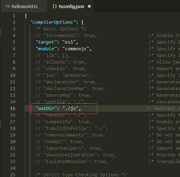

# 全局安装配置`typescript`

**【安装】**：`npm install typescript -g `

> tsc 的全称是 TypeScript Compiler，也就是将 TypeScript 转码为 JavaScript 代码的编译器。

> 目前的主流浏览器还不完全支持 ES6 的语法，所以目前想要在浏览器运行 TS 代码需要 Compiler 编译器来将 TS 代码转换为浏览器支持的 JS 代码

**【编译】**（将 TS 文件 ES6 转为 JS 文件 ES5 代码）：

新建 helloworld.ts 文件后，运行命令: `tsc helloworld.ts` 。即可生成 `helloworld.js` 文件。

现在发现每次写完 TS 代码都需要保存、输入转换命令、编译成 JS 代码，很麻烦，所以需要开发工具自动编译 TS 文件，配置如下：

- `tsc --init ` 生成配置文件 `tsconfig.json`，修改配置文件中的`outdir` 属性（输出目录）；
- VS Code 选择 `任务——运行任务——点击TSC：监视-tsconfig.json`，然后 TS 文件就可以自动编译生成 JS 代码了。



# React+TS 项目安装配置

**【安装`typescript`和`ts-loader`】**
由于我们采用 ts 来开发，所以只要安装 typescript 和 ts-loader 来处理我们的脚本就行了，不再需要 babel-loader 了（如果任然会写一些 JS 或者 JSX 则可任然保留）;

```bash
npm i  typescript ts-loader -D
```

**【生成 `tsconfig.json` 配置文件】**
然后再根目录下执行 `tsc --init` 来生成 `tsconfig.json` 配置文件

```json
{
  "compilerOptions": {
    "target": "es5",
    "jsx": "react", //后面添加react的时候、需要配置这个属性
    "module": "commonjs",
    "allowJs": true,
    "esModuleInterop": true,
    "sourceMap": true
  },
  "include": ["./src/*"],
  "exclude": ["node_modules"]
}
```

**【类型声明文件】**
我们知道 typescript 是通过类型声明来检查代码的！如果没有类型声明文件、将会检查失败！
**对于非 typescript 编写的，或者没有导出类型声明文件的第三方模块。我们都需要自己编写一个类型声明文件**（后面遇到导入`SCSS`和`img`报错找不到模块的问题就是因为这个原因）。

当然，对于 react 来说，我们有现成的，直接使用就好！
使用@types/前缀表示我们额外要获取 React 和 React-DOM 的声明文件。

```bash
npm  i @types/react @types/react-dom -D
```

**【配置`webpack.config.js`如何处理 ts/tsx 文件】**

```js
module.exports = {
  // ...
  module: {
    rules: [
      {
        test: /\.(ts|tsx)$/, // 匹配.ts|x结尾的文件
        exclude: /node_modules/,
        loader: "ts-loader",
      },
    ],
  },
};
```

**【`babelrc` 配置`@babel/preset-typescript`】**

```bash
npm i @babel/preset-typescript -D
```

```json
{
  "presets": [
    [
      "@babel/preset-env",
      {
        "useBuiltIns": "usage", // 只把转换后用到的特性打包进去
        "corejs": 3
      }
    ],
    "@babel/preset-react",
    "@babel/preset-typescript"
  ]
}
```

## ESlint 配置

```json
eslint-plugin-react@latest @typescript-eslint/eslint-plugin@latest @typescript-eslint/parser@latest eslint@latest
```

## 问题

### 配置 TS 后引入`xx.scss`和`xx.jpg`报错

**【报错】：** 找不到模块“./app.scss”或其相应的类型声明。ts(2307)

**【原因】：** 见上方【类型声明文件】

> style.scss 是样式文件，不是一个模块。这个文件里根本没有说明导出什么内容，既然没有导出，你怎么导入呢？
> 所以 import styled from "./styled.scss" 会报错,这是从 styled.scss 这个文件里导入一个叫 styled 的导出内容，而文件里没有，所以肯定报错。
> 而 import "./styled.scss" 不会报错，这只是导入一个文件而已。
> 那个文件里需要定义了导出(export)的变量/方法 等等，import xxx from xxx 才会正常工作。
> 建议你想先看一下 TypeScript 的文档。TypeScript--模块

**【解决方法】：**
`src`下新建 `typings.d.ts`

```ts
// typings.d.ts
declare module "*.css";
declare module "*.less";
declare module "*.scss";
declare module "*.sass";
declare module "*.svg";
declare module "*.png";
declare module "*.jpg";
declare module "*.jpeg";
declare module "*.gif";
```

但是如上配置了之后可以发现文件第一行结尾`;`有 ESLint 报错`Parsing error: Unexpected token, expected "{"`。

[ESLint 报错原因及解决方法]
eslint 默认使用 Espree 进行解析，无法识别 ts 的一些语法，所以需要安装一个 ts 的解析器 `@typescript-eslint/parser`，用它来代替默认的解析器，然后由 `@typescript-eslint/eslint-plugin` 来提供有关 ts 的规则补充。

```json
// .eslintrc.json
{
  "extends": [
    "eslint:recommended",
    "plugin:react/recommended",
    "eslint-config-standard"
    "plugin:@typescript-eslint/recommended", // 新增
  ],
  // "parser": "babel-eslint",
  "parser": "@typescript-eslint/parse", // 修改解析器类型
  // "plugins": ["react"],
  "plugins": ["react", "@typescript-eslint"],
}
```

**【目前情况】：**

```tsx
// app.tsx

// import routes from "@/route";  无法这样引入，会报错// 找不到模块“@/route”或其相应的类型声明。ts(2307)

import routes from "../src/route";
import waterbyside from "../src/assets/images/waterbyside.jpg";
import styles from "./app.scss";
```

如上，可以看到问题解决，能够正常引入`xx.scss`和`xx.jpg`，但是引入文件模块却是用的相对引用，虽然配置了`webpack.resolve.alias`和`tsconfig.json/paths`，但是别名没有生效，无法使用。

**【参考链接】：**

- [为什么 react+typescript 加载 scss 或者 css 会报错，找不到模块](https://segmentfault.com/q/1010000018446035)
- [react 项目报错，‘找不到模块或其相应的类型声明 ’](https://www.jianshu.com/p/9e7fc037fd3d)
- [解决 ts 开发时引入图片报错找不到 xxx 或其相应的类型声明-的问题](https://lequ7.com/guan-yu-reactjs-jie-jue-ts-kai-fa-shi-yin-ru-tu-pian-bao-cuo-zhao-bu-dao-xxx-huo-qi-xiang-ying-de-lei-xing-sheng-ming-de-wen-ti.html)
- [@@@给 React + TS 项目添加 ESLint + Prettier，附注意事项及文档](https://www.jianshu.com/p/873fbbadb07d)

### 配置 TS 后配置`alias`无效

这个问题搞了几个小时，其实就是`paths`字段配错了层级，应该在`compilerOptions`下面的，但是却放在了其同级。

# tsconfig 配置及详解

- [TS 编译配置详解](https://blog.csdn.net/xgangzai/article/details/124811442)

## `files`

files 字段用于指明需要 tsc 编译的一个或多个 ts 文件，例如：

```json
{
  "files": ["index.ts", "global.d.ts"]
}
```

## `include`

include 字段用于指明需要被 tsc 编译的文件或文件夹列表，例如：

```json
{
  "include": ["src", "global.d.ts"]
}
```

## `exclude`

exclude 字段用于排除不需要 tsc 编译的文件或文件夹列表，例如：

```json
{
  "exclude": ["test.ts", "src/test.ts"]
}
```

注意： **exclude 字段中的声明只对 include 字段有排除效果，对 files 字段无影响，即与 include 字段中的值互斥**。

如果 tsconfig.json 文件中 files 和 include 字段都不存在，则默认包含 tsconfig.json 文件所在目录及子目录的所有文件，且排除在 exclude 字段中声明的文件或文件夹。

## `compilerOptions`

### `. baseUrl` & `paths`

baseUrl：设置基本目录以解析非绝对模块名称（定义一个根目录，以此进行绝对文件路径解析）

paths：用于设置模块名或路径映射列表，这样就可以简写项目中自定义模块的文件路径。

```json
{
  "compilerOptions": {
    // 注意：baseUrl 必选，与 paths 成对出现，以 tsconfig.json 文件所在目录开始
    "baseUrl": ".",
    "paths": {
      // 映射列表
      "@/*": [
        "src/*"
      ],
      "moduleA": [
        "src/libs/moduleA"
      ]
    }
  }
}

// 代码里这么写
import Toast from '@/components/Toast.ts' // 模块实际位置: src/components/Toast.ts
import TestModule from 'moduleA/index.js' // 模块实际位置: src/libs/moduleA/index.js
```

# `tsconfig.json`

```json
// tsconfig.json
{
  "compilerOptions": {
    /* Visit https://aka.ms/tsconfig.json to read more about this file */

    /* Basic Options */
    // "incremental": true,                         /* Enable incremental compilation */
    // target：ts被编译成js的版本，一般指定为ES6,默认为ES3。可选的有es2015\es2016\es2018等。
    "target": "es5" /* Specify ECMAScript target version: 'ES3' (default), 'ES5', 'ES2015', 'ES2016', 'ES2017', 'ES2018', 'ES2019', 'ES2020', 'ES2021', or 'ESNEXT'. */,
    // module：module解决方案选择，指定模块化的规范。可选的有commonjs,amd,system,es6,es2015,es2020.
    "module": "commonjs" /* Specify module code generation: 'none', 'commonjs', 'amd', 'system', 'umd', 'es2015', 'es2020', or 'ESNext'. */,
    // "lib": [],                                   /* Specify library files to be included in the compilation. */
    // 允许编译javascript文件。
    // allowJs: 是否对js文件进行编译，默认是false
    "allowJs": true /* Allow javascript files to be compiled. */,
    "checkJs": true /* Report errors in .js files. */,
    "jsx": "react" /* Specify JSX code generation: 'preserve', 'react-native', 'react', 'react-jsx' or 'react-jsxdev'. */,
    // "declaration": true,                         /* Generates corresponding '.d.ts' file. */
    // "declarationMap": true,                      /* Generates a sourcemap for each corresponding '.d.ts' file. */
    "sourceMap": true /* Generates corresponding '.map' file. */,
    // "outFile": "./",                             /* Concatenate and emit output to single file. */
    //outDir: 用于指定编译后的js文件所在的目录，一般单独的创建一个dist文件夹放置
    "outDir": "./dist/" /* Redirect output structure to the directory. */,
    // "rootDir": "./",                             /* Specify the root directory of input files. Use to control the output directory structure with --outDir. */
    // "composite": true,                           /* Enable project compilation */
    // "tsBuildInfoFile": "./",                     /* Specify file to store incremental compilation information */
    // removeComments: 是否移出注释信息，默认为false,注释信息不会被转移到编译完成的js文件中去，
    // "removeComments": true,                      /* Do not emit comments to output. */
    // "noEmit": true,                              /* Do not emit outputs. */
    // "importHelpers": true,                       /* Import emit helpers from 'tslib'. */
    // "downlevelIteration": true,                  /* Provide full support for iterables in 'for-of', spread, and destructuring when targeting 'ES5' or 'ES3'. */
    // "isolatedModules": true,                     /* Transpile each file as a separate module (similar to 'ts.transpileModule'). */

    /* Strict Type-Checking Options */
    // "strict": true /* Enable all strict type-checking options. */,
    // "noImplicitAny": true,                       /* Raise error on expressions and declarations with an implied 'any' type. */
    // "strictNullChecks": true,                    /* Enable strict null checks. */
    // "strictFunctionTypes": true,                 /* Enable strict checking of function types. */
    // "strictBindCallApply": true,                 /* Enable strict 'bind', 'call', and 'apply' methods on functions. */
    // "strictPropertyInitialization": true,        /* Enable strict checking of property initialization in classes. */
    // "noImplicitThis": true,                      /* Raise error on 'this' expressions with an implied 'any' type. */
    // "alwaysStrict": true,                        /* Parse in strict mode and emit "use strict" for each source file. */

    /* Additional Checks */
    // "noUnusedLocals": true,                      /* Report errors on unused locals. */
    // "noUnusedParameters": true,                  /* Report errors on unused parameters. */
    // "noImplicitReturns": true,                   /* Report error when not all code paths in function return a value. */
    // "noFallthroughCasesInSwitch": true,          /* Report errors for fallthrough cases in switch statement. */
    // "noUncheckedIndexedAccess": true,            /* Include 'undefined' in index signature results */
    // "noImplicitOverride": true,                  /* Ensure overriding members in derived classes are marked with an 'override' modifier. */
    // "noPropertyAccessFromIndexSignature": true,  /* Require undeclared properties from index signatures to use element accesses. */

    /* Module Resolution Options */
    // "moduleResolution": "node",                  /* Specify module resolution strategy: 'node' (Node.js) or 'classic' (TypeScript pre-1.6). */
    // 以 baseUrl 作为默认根路径
    "baseUrl": "." /* Base directory to resolve non-absolute module names. default:  */,
    // "paths": {},                                 /* A series of entries which re-map imports to lookup locations relative to the 'baseUrl'. */
    "paths": {
      "@/*": ["./src/*"]
      // "@": ["./src/*"],
      // "@pages/*": ["./src/pages/*"],
      // "@components/*": ["src/components/*"],
      // "@routes/*": ["src/routes/*"],
      // "@assets/*": ["src/assets/*"],
      // "@utils/*": ["src/utils/*"],
      // "@store/*": ["src/store/*"]
    },
    // "rootDirs": [],                              /* List of root folders whose combined content represents the structure of the project at runtime. */
    // "typeRoots": ["./node_modules/@types/", "./src/@types/"],   /* List of folders to include type definitions from. */
    // "types": [],                                 /* Type declaration files to be included in compilation. */
    // "allowSyntheticDefaultImports": true,        /* Allow default imports from modules with no default export. This does not affect code emit, just typechecking. */
    "esModuleInterop": true /* Enables emit interoperability between CommonJS and ES Modules via creation of namespace objects for all imports. Implies 'allowSyntheticDefaultImports'. */,
    // "preserveSymlinks": true,                    /* Do not resolve the real path of symlinks. */
    // "allowUmdGlobalAccess": true,                /* Allow accessing UMD globals from modules. */

    /* Source Map Options */
    // "sourceRoot": "",                            /* Specify the location where debugger should locate TypeScript files instead of source locations. */
    // "mapRoot": "",                               /* Specify the location where debugger should locate map files instead of generated locations. */
    // "inlineSourceMap": true,                     /* Emit a single file with source maps instead of having a separate file. */
    // "inlineSources": true,                       /* Emit the source alongside the sourcemaps within a single file; requires '--inlineSourceMap' or '--sourceMap' to be set. */

    /* Experimental Options */
    // "experimentalDecorators": true,              /* Enables experimental support for ES7 decorators. */
    // "emitDecoratorMetadata": true,               /* Enables experimental support for emitting type metadata for decorators. */

    /* Advanced Options */
    "skipLibCheck": true /* Skip type checking of declaration files. */,
    "forceConsistentCasingInFileNames": true /* Disallow inconsistently-cased references to the same file. */
  },
  // include: 指明需要被 tsc 编译的文件或文件夹列表, **表示任意目录，*表示任意文件
  // "include": ["./src/*"],
  "include": ["./src/**/*"],
  // exclude: 排除不需要 tsc 编译的文件或文件夹列表
  "exclude": ["node_modules"]
  // extends：定义继承的配置文件，当存在多个配置文件的引入其他配置文件信息，
  // "extends": "",
}
```

# Tips

## TS 项目如何新增全局类型声明

**【背景】：**
umi 项目配好 ts 后，如何申明全局类型，然后不通过 import 引入就能直接使用这些全局的类型？

**【解决方法】：**
直接新建 `src/@type` 文件夹，然后新建`.d.ts`类型声明文件，

- 基础/工具型：`global.d.ts`、`base.d.ts`
- 业务型：如`project.d.ts`

**【示例】：**

- 实例一：
  见`TS/guide/generics泛型.md/实例/嵌套泛型`

- 实例二：

```ts
// olympos-project\client\@types\kanban.d.ts

/** 任务类型 */
type ITaskType = "requirement" | "tasks" | "bug";

/** 任务层级 */
type ITaskLevel = "all" | "parent" | "child" | "undone";

/** 任务视图类型 */
type ITaskViewType = "board" | "table" | "collect";

/** 任务视图选项 */
type ITaskViewOption = {
  /** 视图类型 */
  0: { label?: string; showLabel?: string; value: ITaskViewType };
  /** 任务层级 */
  1: { label?: string; showLabel?: string; value: ITaskLevel };
};

/** 需求分类 */
interface TreeNode {
  title: string;
  value: string;
  key: string;
  children: TreeNode[];
}
```

// ?好像加不加 declare 都能正常全局生效

```ts
// olympos-project\client\@types\global.d.ts
declare interface Window {
  TPM?: any;
  csrf?: string;
  isSupportWebp?: string;
  __?: any;
  wx?: any;
}

declare interface IResultData<T> {
  code: string; // 响应码
  result?: T; // 数据
  data?: T;
  success: boolean; // 是否成功(true：成功，false：失败)
  msg?: string; // 错误信息(请求成功时无该字段)
  errorMsg?: string;
  message?: string;
}

declare type IPromiseResultData<T> = Promise<IResultData<T>>;

interface IPagerResult<M> {
  total: number;
  totalHour?: number;
  projectCount?: number;
  content: M[];
}

interface IPagerParams {
  pageIndex: number | undefined;
  limit: number | undefined;
}

interface ISortFieled {
  fieldName?: string;
  sortType?: string;
}

interface IPagination {
  pageSize?: number;
  current?: number;
  total?: number;
}

declare module "*.css";
declare module "*.less";
declare module "*.scss";
declare module "*.sass";
declare module "*.svg";
declare module "*.png";
declare module "*.jpg";
declare module "*.jpeg";
declare module "*.gif";
declare module "*.bmp";
declare module "*.tiff";
```

```ts
// olympos-project\client\ekko\services\project.ts
import { get, post, put, del } from "@/utils/fetch";

export const getProjectDetail = (
  projectId: string
): Promise<IBasicApi<IProjectDetail>> =>
  get(`/api/redline/olympos/project/${projectId}`);

export interface IProjectBasicListProps {
  staffId?: string;
  businessId?: string;
  fuzzyName?: string;
  projectIds?: string[];
}

export const getProjectBasicListByList = (
  data?: IProjectBasicListProps
): Promise<IPromisePageResult<any>> =>
  post("/api/redline/olympos/project/basic", data);
```

## 类型声明注释，悬浮提示相应中文

接口、枚举这样写注释，悬浮到类型的属性上时会提示相应中文

```tsx
interface IResource {
  id: string;
  /** 文件/文件夹的路径 */
  currentPath: IResourcePath[];
  /** 文件类型 */
  contentType: string;
  /** 是否是文件夹 */
  directory?: boolean;
  /** 文件资源 */
  fileId: string;
  /** 文件更新时间 */
  gmtModified: number | null;
  /** 文件名称 */
  name: string;
  /** 顺序 */
  order?: number;
  /** 文件大小 */
  size: string;
  /** 默认版本 */
  version: string;
  /** 其他版本 */
  otherVersions: IResource[] | null;
  /** 子文件/文件夹 */
  subResources: IResource[] | null;
  /** 是否含有子文件（某些场景没有返回 subResources 时，可以尝试使用这个判断） */
  hasSubResources?: boolean;
  tags: ITagItem[];
}
```

# 参考链接

- [React & Webpack 配置](https://www.tslang.cn/docs/handbook/react-&-webpack.html)
- [(2022-02-21)[通过 ts-loader]添加 Reac 和支持 TypeScript](https://juejin.cn/post/7067093307264319519#heading-6)
- [(2022-05-07)[通过 awesome-typescript-loader source-map-loader 支持 TypeScript]](https://juejin.cn/post/7094900059493367845#heading-5) 类似于官网的方式
- [tsconfig.json 配置项解析](https://www.tslang.cn/docs/handbook/compiler-options.html)
- [(2022-05-16)@@TS 编译配置详解](https://blog.csdn.net/xgangzai/article/details/124811442)
- [(2022-04-04)@@前端开发环境安装与配置(React+Webpack5+TS+ESLint+Prettier)](https://juejin.cn/post/7082577266978324488#heading-17)
  - [github](https://github.com/jojowwbb/webpack-react-ts)
- [(2019-07-04)@@在 TS 项目中，如何优雅的使用 ESLint 和 Prettier 构建代码工作流](https://segmentfault.com/a/1190000019661168)
- [(2020-08-04)React + TS 项目添加 ESLint + Prettier，附注意事项及文档](https://www.jianshu.com/p/873fbbadb07d)
- [(2021-10-20)Vue3.0+vite+eslint ts 识别配置的路径别名不生效报错](https://juejin.cn/post/7021084391065518087#heading-2)
- [(2020-04-13)TS(tsconfig) 中路径映射的坑](https://blog.csdn.net/qq_21265915/article/details/105499184)
- [webpack + ts 配置路径别名无死角方法总结](http://www.pingtaimeng.com/article/detail/id/1941045)
- [(2020-11-13) react + ts 路径别名配置不生效。](https://segmentfault.com/q/1010000038155622)
