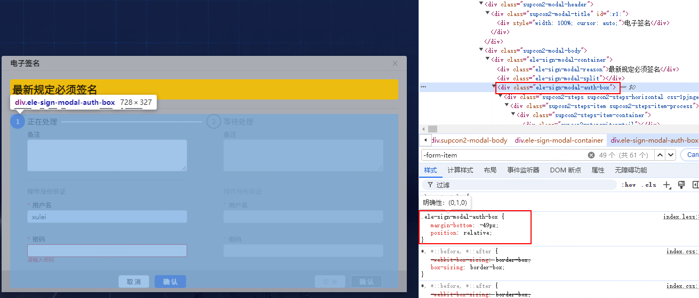
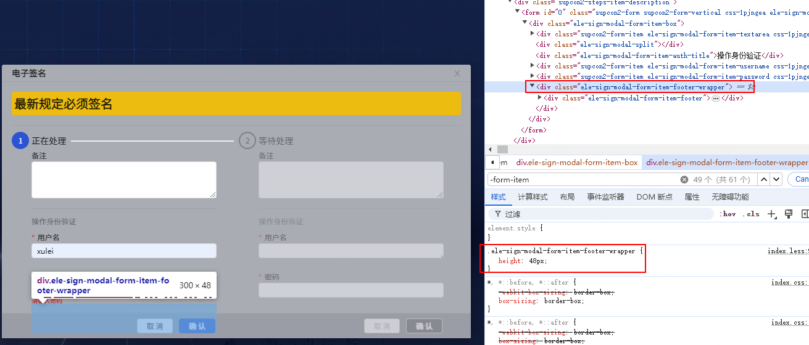
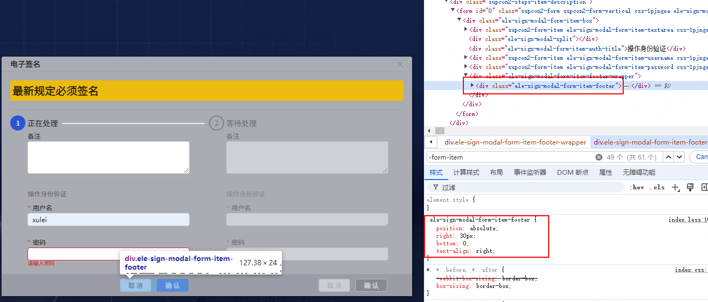

# 出处

`mare-basic-web`项目单签双签组件。

# 问题描述

before 的重叠遮罩效果是通过绝对定位实现的，看起来正常，但是如果表单没有填写就点击确定的话，在当前操作的 `formFiledItem` 下会弹出红色提示，当前操作的 `formFiledItem` 的按钮组位置是正常的，但是其他 `formFiledItem` 因为没有弹出红色提示，会导致其按钮组位置异常。

# before 的效果图

看起来正常，如下图。


如果表单没有填写就点击确定的话，其他 `formFiledItem` 因为没有弹出红色提示，会导致其按钮组位置异常，如下图。


# 最终实现的效果图

最终的重叠遮罩效果是通过`margin-bottom`实现的，效果如下图。


实现的关键是`auth-box`类设置了`margin-bottom`，数值是通过 UI 图计算出来的，并按照实际情况微调了下。

`auth-box`类没有设置`margin-bottom`如下图。


`auth-box`类设置`margin-bottom`后如下图。


---


# 具体实现

```less
.@{prefixCls} {
  .supcon2-modal-content {
    > div {
      background: #aaacb4;
    }
    .supcon2-modal-body {
      z-index: 10;
    }
    .supcon2-modal-footer {
      padding: 0;
    }
  }
  &-auth-box {
    margin-bottom: -49px;
    position: relative;
  }
  &-form-item {
    width: 300px;
    &-footer-wrapper {
      height: 48px;
    }
    &-footer {
      position: absolute;
      right: 30px;
      bottom: 0;
      text-align: right;
    }
  }
  &-footer {
    height: 40px;
    background: #9b9da6;
  }
}
```

```tsx
<Modal
  title="电子签名"
  wrapClassName={`${prefixCls} ${this.props?.modalClassName || ""}`}
  open={modalVisible}
  width={(signLevel || 1) * 400}
  footer={<div className={`${prefixCls}-footer`} />}
>
  <div className={`${prefixCls}-auth-box`}>
    <Form
      className={classNames(`${prefixCls}-form-item`, {
        [`${prefixCls}-form-item-disabled`]: curIndex !== verifyIndex,
      })}
      layout="vertical"
      key={curIndex}
      name={`${curIndex}`}
      ref={curIndex === verifyIndex ? this.formRef : null}
      disabled={curIndex !== verifyIndex}
    >
      <div className={`${prefixCls}-form-item-box`}>
        <div className={`${prefixCls}-form-item-footer`}>
          <Button onClick={this.hideModal}>取消</Button>
          <Button
            type="primary"
            htmlType="submit"
            loading={verifyIndex === curIndex ? confirmBtnLoading : false}
          >
            确认
          </Button>
        </div>
      </div>
    </Form>
  </div>
</Modal>
```
