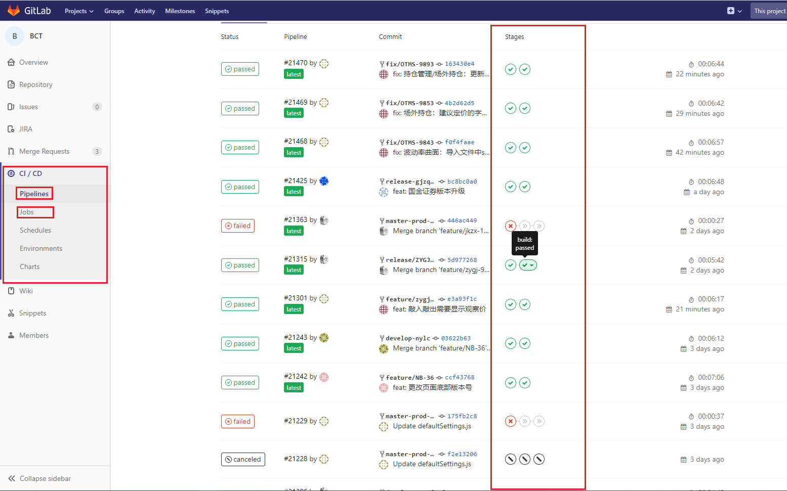
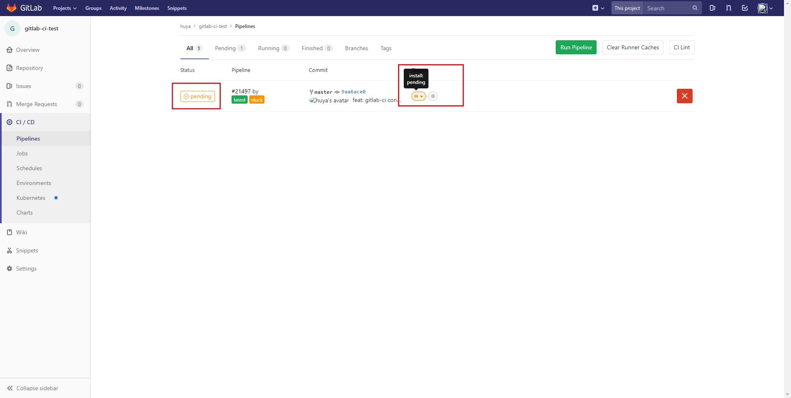
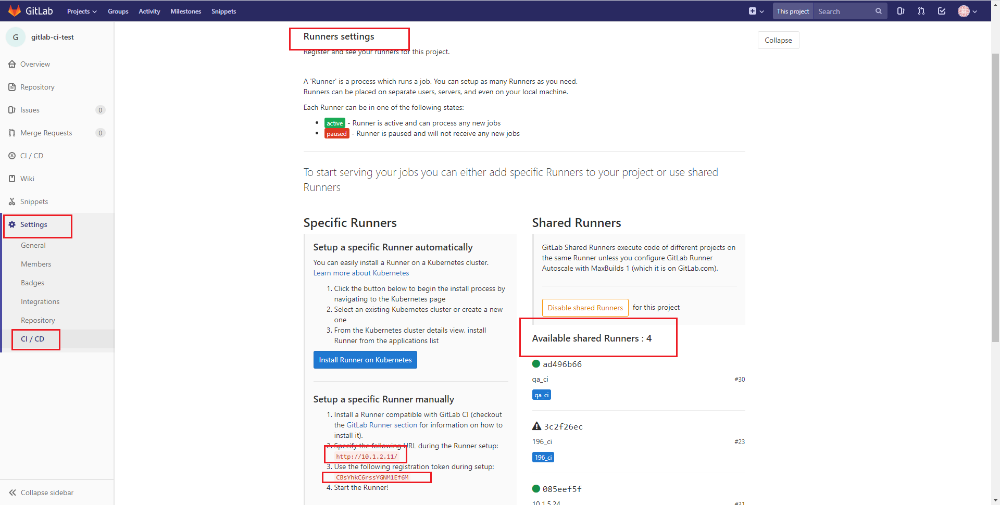
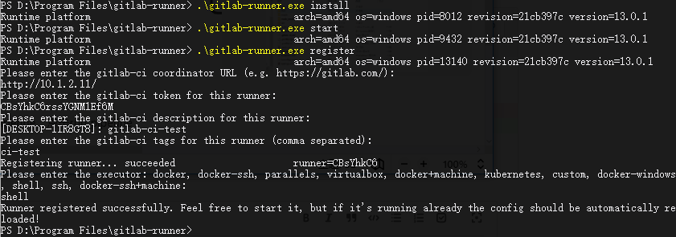
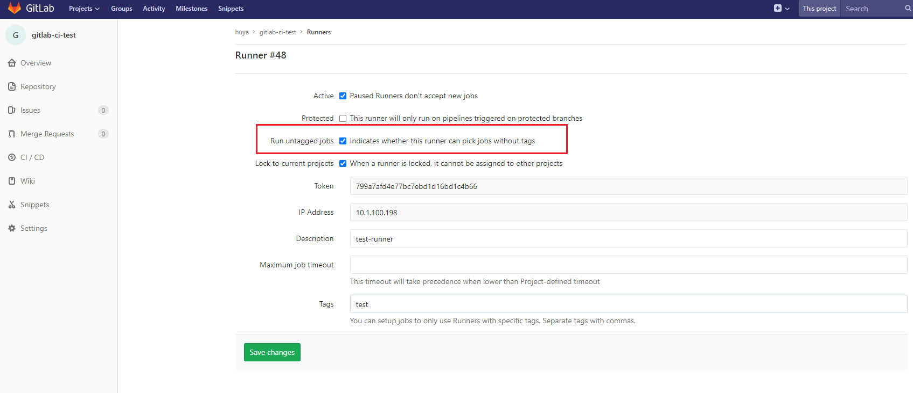
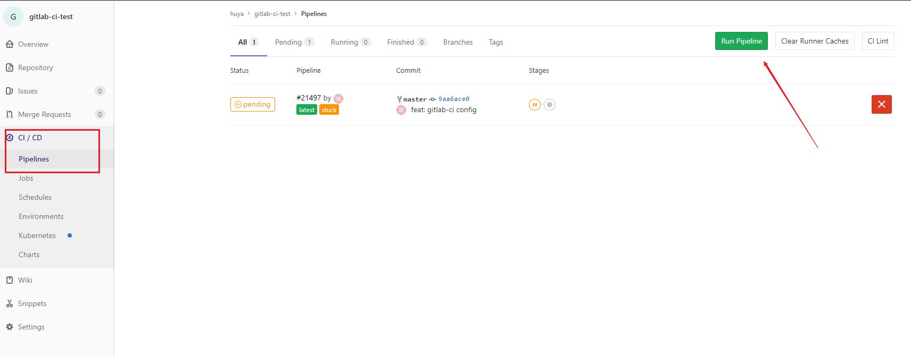
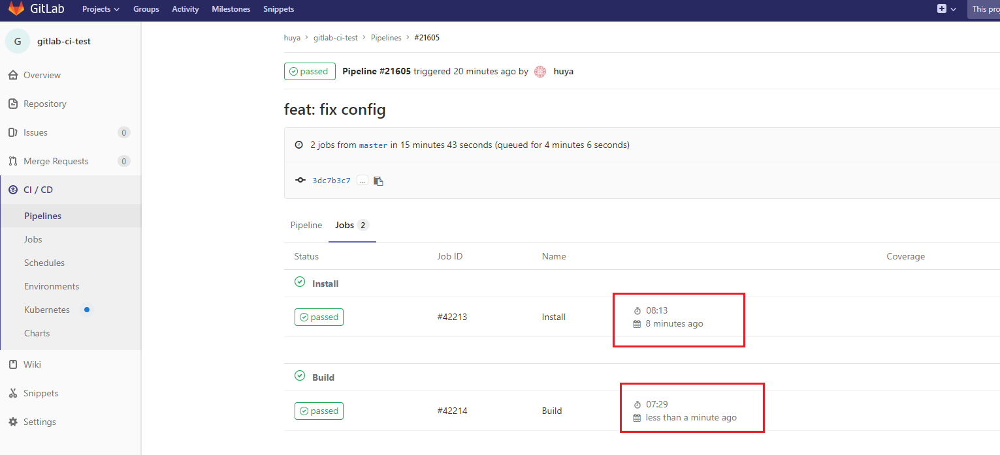
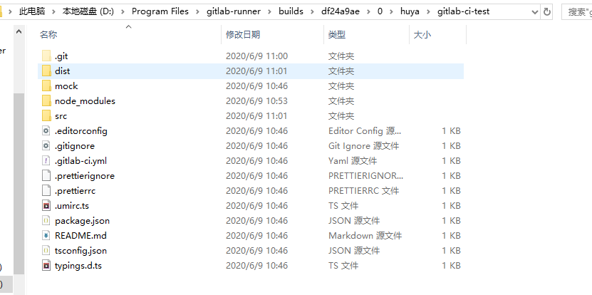

# CI 概念
Continuous integration。中文是持续集成的意思，指的是，==频繁地（一天多次）将代码集成到主干==。


**持续集成的优点：**
- 快速发现错误：每完成一点更新，就集成到主干，可以快速发现错误，定位错误也比较容易。
- 防止分支大幅度偏离主干：如果不是经常集成，主干又在不断更新，会导致以后集成的难度变大，甚至难以集成。

**持续集成的措施：**

每次代码的提交，代码必须通过 build,test 等阶段的执行，完全通过测试，才能够通过本次集成

# gitlab ci 面板及配置

## gitlab CI
1. 在 commit 或者 push 的时候会触发,下图就是一个 commit 信息面板


Pipelines: 流水线
Stages: 阶段

2. 与 CI 相关的一些概念
- pipeline 可以理解为一次 integration
- stages 可以理解为 pipeline 构建的阶段，每个 pipeline 会有多个 stage，常见的比如 build stage, test stage, deploy stage 等
- jobs 一个 stage 可能会有多个 job 构成
3. CI 面板查看
  - 1.pipeline 面板
  pipeline 状态有 success, failed, cancel 等。只要有一个 stage 构建失败，那么整个 piepeline 就会是失败状态



  - 2.jobs 面板


## 如何创建
### 1. 创建一个新的项目，点击 CI/CD 面板


### 2. 按照官方文档进行配置
[Getting started with GitLab CI/CD](http://10.1.2.11/help/ci/quick_start/README)

首先需要在项目根目录新建 .gitlab-ci.yml 文件，并且给这个项目配置一个 runner。这样每次 commit 或者 push 都会触发 gitlab-ci pipeline

### 3. 新建 yml 文件
1.yml 是一种专门用来写配置文件的语言，非常简洁，比 json 格式更方便
[YAML 语言教程](http://www.ruanyifeng.com/blog/2016/07/yaml.html)

一个项目的基础配置
[官方 API](https://docs.gitlab.com/ee/ci/yaml/README.html)

```yml
stages:
  - install
  - build

cache:
  key: ${CI_BUILD_REF_NAME}
  paths:
    - node_modules/

before_script:
  - node -v
  - yarn -v

Install:
  stage: install
  script:
    - yarn install
  only:
    - /master.*/

Build:
  stage: build
  script:
    - yarn run build
  only:
    - /master.*/
```

等价于下面这个 json


### 4. 将改动文件提交至远程
进入 project，因为没有配置 gitlab-runner，所以此时 CI 状态是 pendding 状态，所以接下来需要配置 gitlab runner




### 5. 安装注册 gitlab runner
[文档地址](https://docs.gitlab.com/runner/)

- 1、这里采用的是 windows 安装，创建一个空文件夹，把.exe 可运行文件放到该目录下，执行以下命令，注意要以管理员身份运行
```js
.\gitlab-runner.exe install
.\gitlab-runner.exe start
```

- 2、在项目面板查看 gitlab-ci url 以及 token




- 3、注册 runner

[官方文档](https://docs.gitlab.com/runner/register/)


- 4、查看项目的配置，看到 runner 配置成功


- 5、配置 runner 可以运行 untagged jobs，不配置的话当 yml 文件配置的 jobs 未指定 tag 就无法运行 gitlab-runner


- 6、重新运行 pipeline，发现构建成功


- 7、在面板查看本次 piepeline 的情况



- 8、构建后的文件及目录可以在 gitlab-runner 的安装目录查看


# CD 的概念
**CD：**
CD 在 CI 之后，CD 包含两个概念，continuous delivery 和 continuous deployment，即持续交付与持续部署。越往后，就会越接近生产环境

[详解 CI&CD](http://www.ttlsa.com/news/ci-cd-cd/)

**持续交付：**
持续交付就是我们的应用发布出去的流程，这个过程可以确保我们能尽可能快的实现交付。这意味着除了自动化测试，我们还需要自动化的发布流。以及通过一个按钮就可以随时随地实现应用的部署

**持续部署：**
持续部署就更加深入了，意味着当开发人员在主分支的一次提交，就会被构建，测试，如果一切顺利，就会直接部署到生产环境。

## 思考
- 使用 CI 的目的
- gitlab-ci pipeline stages jobs 有什么区别与联系