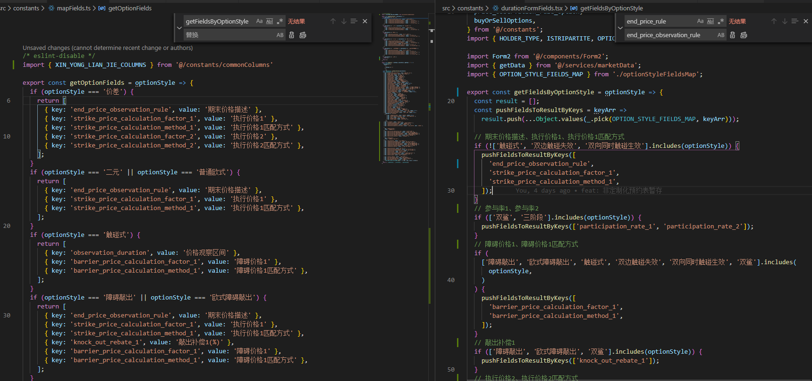
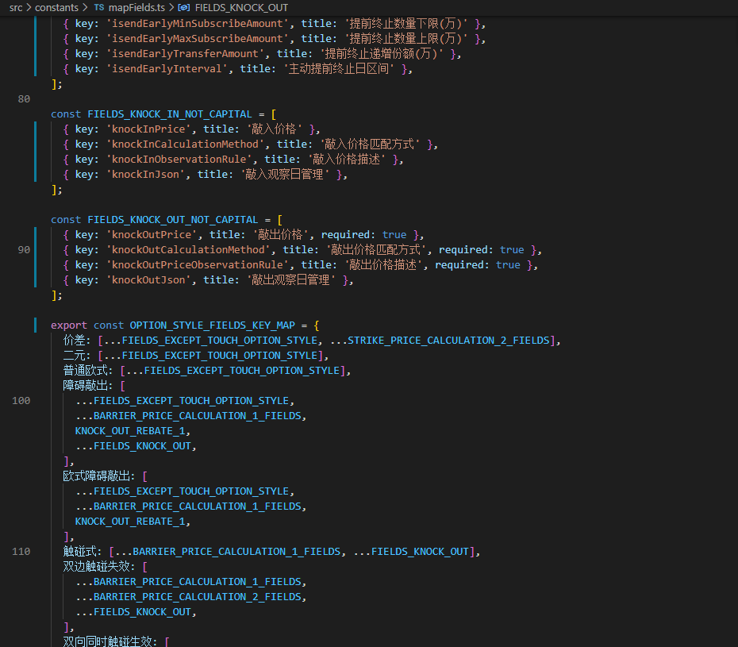

## 抽离常量

如表格的列

### 注意

@抽离数组，使用的时候要注意引用数据问题

如需要改变数组的时候，

```js
import { defaultColumns as DefColumns } from "./modalField";

const defaultColumns = [...DefColumns];
// const defaultColumns = DefColumns; 错误，因为下面改变了defaultColumns
checkedList.map((item) => defaultColumns.push(columns[item]));
```

### 实例

#### 字典数据抽离
##### 实例1

```js
// 写法一：建议使用这个

export const TRIPARTITE_KEY_MAP = {
  NOT_TRIPARTITE: "NOT_TRIPARTITE",
  TRIPARTITE: "TRIPARTITE",
  QUOTATION: "QUOTATION",
};
export const TRIPARTITE_ZHCH_MAP = {
  [TRIPARTITE_KEY_MAP.NOT_TRIPARTITE]: "柜台非三方存管",
  [TRIPARTITE_KEY_MAP.TRIPARTITE]: "柜台三方存管",
  [TRIPARTITE_KEY_MAP.QUOTATION]: "报价系统",
};

// 供select的options属性使用
export const convertOptions = (maps, zhcn) => {
  return Object.keys(maps).map((key) => ({
    label: zhcn[key],
    value: maps[key],
  }));
};
export const TRIPARTITE_OPTIONS = convertOptions(
  TRIPARTITE_KEY_MA,
  TRIPARTITE_ZHCH_MAP
);

// 写法二
export const convertMapToOptions = (map) =>
  Object.entries(map).map(([key, value]) => ({
    label: value,
    value: key,
  }));

export const TRIPARTITE_OPTIONS = convertMapToOptions(TRIPARTITE_ZHCH_MAPP);
```

为何要写个字典 key 的 Map 呢，不写也是可以用的，就需要自己写字符串了，但很可能写错

- 好处：
  - KEY_MAP 直接.的话会有 key 的提示，且如果 key 写错会有报错提示（TS 才会有 JS 没有）。
  - 便于管理
- 坏处：
  - 太长了，之前是直接’key’ , 现在是 map.key 且还需要 import map

为啥 KEY_MAP 不用这种写法呢? : 用可以，但是这样 TRIPARTITE_MAP.属性的时候就没有静态提醒了

```js
export const TRIPARTITE_KEY_MAP = Object.keys(TRIPARTITE_MAP).reduce((t, v) => {
  return {
    ...t,
    [v]: v,
  };
}, {});
```
##### 实例2
```js
export enum EProjectStatus {
  NORMAL = 1,
  RISKY = 2,
  URGENT = 3,
}

export const ProjectStatusMap = {
  [EProjectStatus.NORMAL]: '进度正常',
  [EProjectStatus.RISKY]: '存在风险',
  [EProjectStatus.URGENT]: '进度失控',
}
```

##### 实例3
```js
export const ApprovalResultMap = {
  PASS: '审批通过',
  NO_PASS: '审批不通过',
  REFERRAL: '已转审',
}
```
#### 实例一：表格列

抽离出来的是对象或者数组，若用到其它变量和方法，可以通过箭头函数传入，如下：

```js
// 如：抽离table的column到constants.ts文件，
const getColumns = (handleRemove) => [
  {
    title: "操作",
    dataIndex: "operation",
    render: (text, record, index) => (
      <a onClick={handleRemove(record[OB_DAY_STRING_FIELD])}>
                  删除                 
      </a>
    ),
  },
];
```

#### 实例三：表单控件根据不同期权结构配置

- 公共控件（大多数期权结构公共）复用
- 少数几个期权结构没有的，从`公共控件中filter`
- 少数几个期权结构有的，单独加到最后面


实践：根据期权结构返回对应期权结构的控件（期权结构只用写一次，联动显示控件写多次）



## 项目目录

- services

  以后端服务分类来命名文件

```js
// marketData.js
export async function getInstrumentInfo(params) {
  return requestFetch(`${HOST_TEST}market-data-service/api/rpc`, {
    method: "POST",
    body: {
      method: "mktInstrumentInfoGetByWindCode",
      params,
    },
  });
}
```

## 巧妙方法

TY Form2 中控件是按对象存放的，一个控件的值改变，根据类型控制另一个控件是否必填。

```js
const COUNTER_PARTY_OPTIONS = [];

const counterparty = {
  title: "交易对手",
  dataIndex: "counterparty",
  render: (val, record, index, { form }) => (
    <FormItem>
      {form.getFieldDecorator({
        rules: [{ required: true, message: "必须填写交易对手" }],
      })(
        <Select
          placeholder="请输入内容搜索"
          fetchOptionsOnSearch
          options={async (value: string = "") => {
            const { data, error } = await trdCounterPartyList4DraftOptionsLike({
              counterParty: value,
            });
            if (error) return [];
            COUNTER_PARTY_OPTIONS = data || [];
            return data
              .sort((a, b) => a.localeCompare(b))
              .map((item) => ({
                label: item.name,
                value: item.name,
              }));
          }}
        ></Select>
      )}
    </FormItem>
  ),
};

const outerOptionCode = {
  title: "外部交易编码",
  dataIndex: "outerOptionCode",
  render: (val, record, index, { form }) => {
    const getRules = () => {
      const data = Form2.getFieldsValue(record);
      const party = COUNTER_PARTY_OPTIONS.find(
        (item) => item.name === data.counterParty
      );
      // 当counterPartyType===1是，即外部交易对手时，才是必填
      if (party && String(party.type) === "1") {
        return [{ required: true, message: "必须填写外部交易编码" }];
      }
      return [];
    };
    return (
      <FormItem>
        {form.getFieldDecorator({ rules: getRules() })(<Input></Input>)}
      </FormItem>
    );
  },
};
```