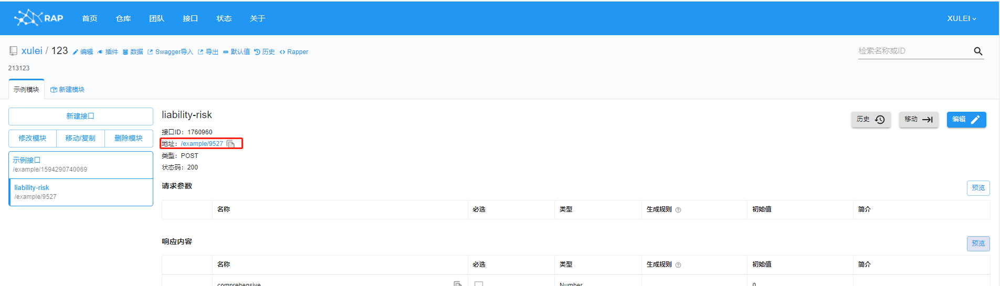
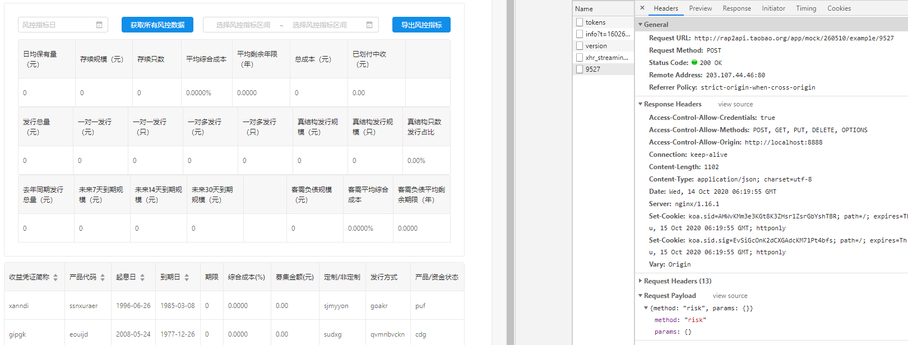
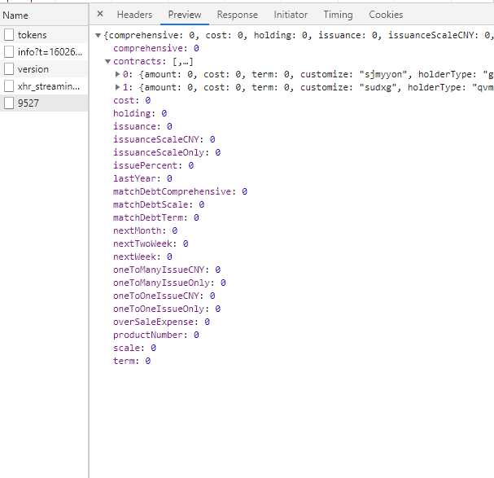

<!--
 * @Author: xulei
 * @Date: 2020-11-01 09:37:06
 * @LastEditors: xulei
 * @LastEditTime: 2020-11-01 11:59:12
 * @FilePath: \markDown\web前端\实战\联调\index.md
-->

## 自测

### 多点

只要是改动代码的地方，能点的地方都要多点几遍，bug 就在一次一次的点击中发现的，代码质量也是一次一次点击出来的

## 联调

- 尽量让后端部署在测试环境，连本地需要换成一个 wifi 下且可能有问题

### 接口传参

- post 请求时，值为 undefined 的属性不可以传（传了但请求头的参数里没有），值为 null 的属性可以传
- get 请求时，值为 undefined 的属性应该是可以传过去的

### 接口报错

```js
const codeMessage = {
  200: "服务器成功返回请求的数据。",
  201: "新建或修改数据成功。",
  202: "一个请求已经进入后台排队（异步任务）。",
  204: "删除数据成功。",
  400: "发出的请求有错误，服务器没有进行新建或修改数据的操作。",
  401: "用户没有权限（令牌、用户名、密码错误）。",
  403: "用户得到授权，但是访问是被禁止的。",
  404: "发出的请求针对的是不存在的记录，服务器没有进行操作。",
  405: "请求的格式不可得。", // Not Allowed
  406: "请求的格式不可得。",
  410: "请求的资源被永久删除，且不会再得到的。",
  422: "当创建一个对象时，发生一个验证错误。",
  500: "服务器发生错误，请检查服务器。",
  502: "网关错误。",
  503: "服务不可用，服务器暂时过载或维护。",
  504: "网关超时。",
};
```

排查问题步骤：

- 先检查 url、入参
- 再询问后端 postman 接口测试是否正常
- 再把参数发给后端通过 postman 测试是否成功

#### 404 Not Found

可能原因：

- url 不对
- 接口请求的参数中时间跨度太大 pending 太久导致返回 404
- 端口不对
  `target: 'http://192.168.3.108:16016/'`

- ping 的通，但是报 404
  后端 Nginx 没有开

#### 503

可能原因：

- 前端网关问题导致 503，请求 URL 域名没有带上`/api`

#### 504 Gateway Timeout

接口报错：504 Gateway Timeout。

可能原因： 如果从 wifi 换成 插上网线再连上，会重新分配 ip 地址，所以 ip 会变

```js
'/api': {
  target: 'http://192.168.3.108:16016/',
  changeOrigin: true,
  pathRewrite: { '^/api': '' },
},
```

#### ERR_SSL_PROTOCOL_ERROR

“ERR_SSL_PROTOCOL_ERROR”是因为服务器端 HTTPS 配置有误造成的。
很有可能就是 http 多了个 s 少了个 s 造成的。

### 点击下载报错

先控制台选择 element，查看链接 href 对不对

### 文件下载

[web 页面实现文件下载的几种方式](https://www.jianshu.com/p/bf0a4e3926a4)

```js
const getExcel = '/api/certificate/lifecycle/liabilities/cash/getexcel',
const result = '/home/sfms/bin/document-service/收益凭证列表.xls'

// node版
window.open(`${getExcel}?filePath=${decodeURI(result)}`, "_self");

// java版
window.open(
  `${HOST_TEST}document-service/bct/download/document?path=${data}&fileName=收益凭证列表.xls`,s
  '_self',
);

render: (text, record) => (
  // text: "document-service/4471be7c0e3e4eae985fedc3cf6d538c"
  // record.attachmentName: 国泰君安股份有限公司睿博系列收益凭证风险揭示书-2020.1.13.docx
  <Button style={{ fontSize: '14px' }} size="large" type="ghost">
    <a
      href={`${HOST_TEST}document-service/bct/download/document?path=${text}&fileName=${record.attachmentName}`}
    >
      下载
    </a>
  </Button>
),
```

#### 下载 excel 文件流

```js
handleExportExcel = async () => {
  const asyncRes = await fetch[
    "POST/capital-service/api/rpc/method=capDepositRecordExport"
  ](
    {
      request: this.handleSearchForm(),
    },
    {
      // responseType: 'application/vnd.ms-excel',
      // responseType: 'arraybuffer',
    }
  );
  const {
    data: { result },
    data,
  } = asyncRes;
  const { fileName, fileExtension, file } = result;

  /*
    // 方法一：暂时无效
    //  用返回二进制数据创建一个Blob实例
    const blob = new Blob([file], {
      // type: 'application/vnd.ms-excel',
      type: 'application/vnd.openxmlformats-officedocument.spreadsheetml.sheet',
    }); // for .xlsx files
    // 通过URL.createObjectURL生成文件路径
    const url = window.URL.createObjectURL(blob);

    // 创建a标签
    const aLink = document.createElement('a');
    aLink.style.display = 'none';

    // 设置href属性为文件路径，download属性可以设置文件名称
    aLink.href = url;
    aLink.download = '测试文件';

    // 将a标签添加到页面并模拟点击
    document.querySelectorAll('body')[0].appendChild(aLink);
    aLink.click();

    // 移除a标签
    aLink.remove(); */

  // 方法二
  console.log(`result`, result);
  const aLink = document.createElement("a");
  aLink.download = `${fileName}.${fileExtension}`;
  const byteCharacters = window.atob(file);
  // atob() 方法用于解码使用 base-64 编码的字符串。 base-64 编码使用方法是 btoa() 。

  const byteNumbers = new Array(byteCharacters.length);
  for (let i = 0; i < byteCharacters.length; i++) {
    byteNumbers[i] = byteCharacters.charCodeAt(i);
  }
  const byteArray = new Uint8Array(byteNumbers);
  const blob = new window.Blob([byteArray], {
    type: "application/octet-stream",
  });
  aLink.href = window.URL.createObjectURL(blob);
  aLink.click();
  window.URL.revokeObjectURL(blob);
};
```

```js
// 导出接口返回值
id: "1";
jsonrpc: "2.0";
result: {
  file: "UEsDBBQACAgIAK6Tl1IAAAAAAAAAAAAAAAATAAAAW0NvbnRlbnRfVHlwZXNdLnhtbLVTy27CMBD8lcjXKjb0UFUVgUMfxxap9ANce5NY+h9hY8YNwxRx5a09MoQQYkGtOgFbupPGn3L9CWn6GsLyef3EY9n/ZDyCKYRkfcojhe0+/AVBLBwh6lMpxOwEAABwEAABQSwMEFAAICAgA==";
  fileExtension: "xlsx";
  fileName: "财务出入金";
}
```

## 页面访问报错

### 请求状态 status:failed + ERR_NAME_NOT_RESOLVED

[参考链接](https://caihongtengxu.github.io/2018/20181203/index.html)

今天公司项目发了个小版本，发到线上后我看了一眼发现主页加载不全（应该是 HTML 文件），看了下控制台有几个接口请求报错了，而且不是服务器出错，都是请求状态 failed + ERR_NAME_NOT_RESOLVED 连忙问了下别的同事，他们请求都是正常加载的，只有我的 Chrome 下会有这个问题。后面我切换 Firefox 后一切正常 然后找了一圈解决办法 又折腾。

> **原因**
> 基本上，都是的 DNS 地址问题导致 ERR_NAME_NOT_RESOLVED 错误。

由于各种原因，您的 Internet DNS 地址被阻止，因此发生此 ERR_NAME_NOT_RESOLVED 错误。

> **解决办法如下**

- 清除 Chrome 缓存

浏览器 Cookie 可能会阻止您的 Internet DNS，然后导致 ERR_NAME_NOT_RESOLVED 错误。 您可以尝试清除浏览器 cookie 以修复此错误。

在 Chrome 下使用快捷键 Ctrl + Shift + Delete 或者 在地址栏输入 chrome://settings/clearBrowserData 然后选择 高级 清除数据即可

- 清除 Chrome-DNS 缓存

当更改了操作系统的 DNS 设置时，如果只清除操作系统的 DNS 缓存不一定会修复 Chrome 的连接问题，手动刷新 Chrome DNS 缓存会比较有用。

浏览器 DNS 缓存通常用于存储你访问的每个网站的域名所对应的服务器 IP 地址数据库，这个小数据库本质上可以加快访问网站的速度。但是，当一个网站更换了新 IP 地址时，再通过 Chrome DNS 缓存中的 IP 来访问时就会遇到访问错误。此种情况下，刷新清除 Chrome DNS 缓存可以帮助解决连接错误。

在 Chrome 地址栏 输入 chrome://net-internals/#dns 即可打开页面 然后全部清除即可

## 前端 mock 数据

使用 RAP2



如上，点击地址后的链接将跳转到数据的地址，地址栏里的地址就是数据接口，替换代码中的 URL

```js
export async function getRiskList(params) {
  return request({
    url: "http://rap2api.taobao.org/app/mock/260510/example/9527",
    method: "post",
    data: params,
  });
}
```

> **效果如下**：





## 问题

### 特殊域名需配置代理 proxy

- 之前接口都是`/Api/`开头的，现在要掉一个直接`/Auth`的接口，调通了返回 200，但是`response`中没有正常格式的数据，而是一个`html文档`。

```js
/**
 * 在生产环境 代理是无法生效的，所以这里没有生产环境的配置
 * The agent cannot take effect in the production environment
 * so there is no configuration of the production environment
 * For details, please see
 * https://pro.ant.design/docs/deploy
 */
const proxyUrl = "http://192.168.1.262:8006";
export default {
  "/Api/": {
    target: proxyUrl,
    changeOrigin: false,
    pathRewrite: { "^": "" },
  },
  // '/Authenticate': {
  //   target: proxyUrl,
  //   changeOrigin: false,
  //   pathRewrite: { '^': '' },
  // },
  "/DogServ": {
    target: proxyUrl,
    changeOrigin: false,
    pathRewrite: { "^": "" },
  },
  "/Auth": {
    target: proxyUrl,
    changeOrigin: false,
    pathRewrite: { "^": "" },
  },
};
```


## 业务常识

**数字型**

- 只要是数字，存在库里都是真实值
- 百分比字段，后端存真实值，前端显示是： 真实值 \* 100，传递给后端时：真实值
- (万、万元)字段，后端存真实值，前端显示是： 真实值 / 10000，传递给后端时：真实值
- 【百分比、数字】字段 `值存在 || 值 === 0 ? 处理显示 : ''`
- 百分比字段显示如下：

  ```js
  {
  title: '固定利率(%)',
  dataIndex: 'nominalInterestRate',
  key: 'nominalInterestRate',
  render: val => {
      return val || val === 0 ? formatNumber(val * 100, 4) : '';
    },
  };
  // render: getPercentFieldsRenderFour, 使用这种没有效果

  /* export const getPercentFieldsRenderFour = val => {
    return val || val === 0 ? formatNumber(val * 100, 4) : '';
  }; */
  ```

## 前端 bug

- 很简单的代码逻辑但是效果还是不对，很有可能是最基本的错误，如
  - 字符串【拼错、大小写错误】

## Tips


- 接口循环调用 慎重
  新建迭代时候
- 功能开发好或者联调时候，测试功能时完全站在一个用户的角度，就是去抠细节、抠各种情况，这样下来对应的代码才是高质量的

## 参考

- [前端 mock 数据](https://zhuanlan.zhihu.com/p/77199413)
- [Easy Mock](https://easy-mock.com/docs)
- [RAP2](http://rap2.taobao.org/repository/joined?user=177457)
- [关于使用 rap2 接口模拟数据](https://blog.csdn.net/WillRing/article/details/104465616)
