# CI 概念

Continuous integration。中文是持续集成的意思，指的是，==频繁地（一天多次）将代码集成到主干==。


**持续集成的优点：**

- 快速发现错误：每完成一点更新，就集成到主干，可以快速发现错误，定位错误也比较容易。
- 防止分支大幅度偏离主干：如果不是经常集成，主干又在不断更新，会导致以后集成的难度变大，甚至难以集成。

**持续集成的措施：**

每次代码的提交，代码必须通过 build,test 等阶段的执行，完全通过测试，才能够通过本次集成

# Gitlab CI/CD 是如何工作的

为了使用 Gitlab CI/CD，你需要一个托管在 GitLab 上的应用程序代码库（项目），并且在项目根目录中的`.gitlab-ci.yml`文件中指定构建、测试和部署的脚本。

在这个文件中，你可以定义要运行的脚本，定义包含的依赖项，选择要按顺序运行的命令和要并行运行的命令，定义要在何处部署应用程序，以及指定是否 要自动运行脚本或手动触发脚本。

为了可视化处理过程，假设添加到配置文件中的所有脚本与在计算机的终端上运行的命令相同。

一旦你已经添加了`.gitlab-ci.yml`到仓库中，Gitlab 将检测到该文件，并使用名为 GitLab Runner 的工具运行你的脚本。该工具的操作与终端类似。

xxxx

GitLab CI/CD 不仅可以执行你设置的 job，还可以显示执行期间发生的情况，正如你在终端看到的那样。

`.gitlab-ci.yml`文件告诉 Gitlab Runner 要做什么，一个简单的 Pipeline（管道）通常包含三个阶段：build、test、deploy。

（来自----使用 Gitlab 实现 CI/CD）

# Gitlab CI 中的一些概念

**【Pipeline】：构建任务**

- 一次 Pipeline 其实相当于一次构建任务，里面可以包含多个流程，比如自动构建、自动进行单元测试、自动进行代码检查等流程。
- 任何提交或者 Merge Request 的合并（都是 Master 主分支上？）都可以触发 Pipeline，

**【stages】：构建流程**

- stages 表示构建阶段，就是上面提到的流程
- 一次 Pipeline 中可以定义多个 stages
- stages 有如下特点
  - 所有 stages 会按照顺序运行，即当一个 stage 完成后，下一个 stage 才会开始
  - 只有当所有 stages 成功完成后，该构建任务（Pipeline）才算成功
  - 如果任何一个 stage 失败，那么后面的 stages 不会执行，该构建任务（Pipeline）失败

**【jobs】：构建工作**

- job 表示构建工作，表示某个 stage 里面执行的工作
- 一个 stage 里面可以定义多个 jobs
- jobs 有如下特点
  - 相同 stage 中的 jobs 会并行执行
  - 相同 stage 中的 jobs 都执行成功时，改 state 才会成功
  - 如果任何一个 job 失败，那么该 stage 失败，即该构建任务（Pipeline）失败

**【gitlab runner】：执行构建任务的服务**

# gitlab ci 面板及配置

## gitlab CI

1. 在 commit 或者 push 的时候会触发,下图就是一个 commit 信息面板

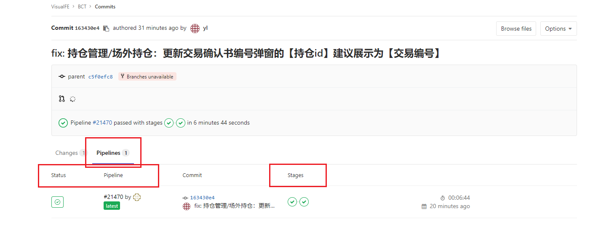

Pipelines: 流水线
Stages: 阶段

2. 与 CI 相关的一些概念

- pipeline：可以理解为一次 integration
- stages：可以理解为 pipeline 构建的阶段，每个 pipeline 会有多个 stage，常见的比如 build stage, test stage, deploy stage 等
- jobs： 一个 stage 可能会有多个 job 构成

3. CI 面板查看

- 1.pipeline 面板
  pipeline 状态有 success, failed, cancel 等。只要有一个 stage 构建失败，那么整个 piepeline 就会是失败状态

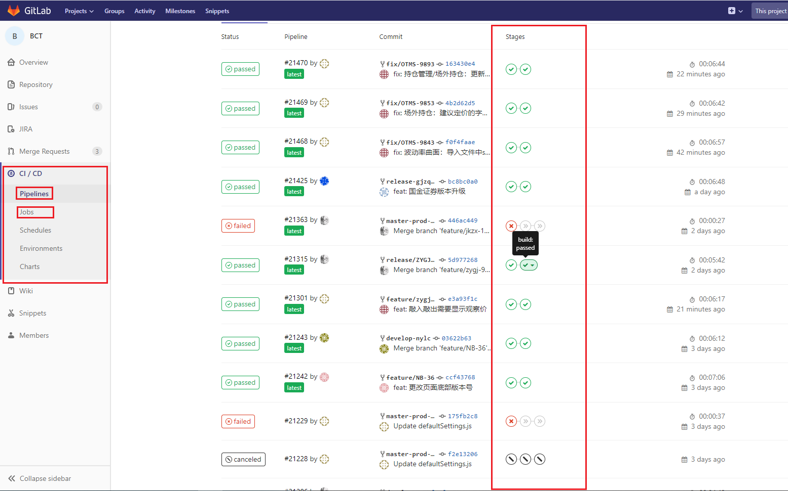

- 2.jobs 面板
  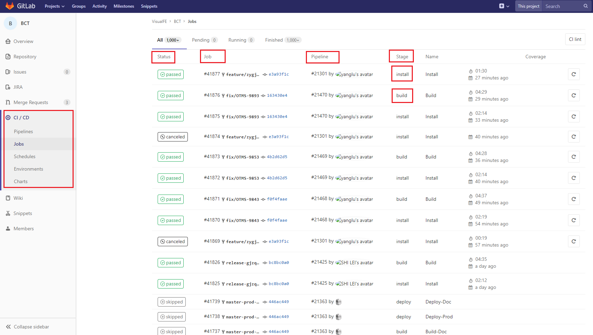

## 如何创建

### 1. 创建一个新的项目，点击 CI/CD 面板

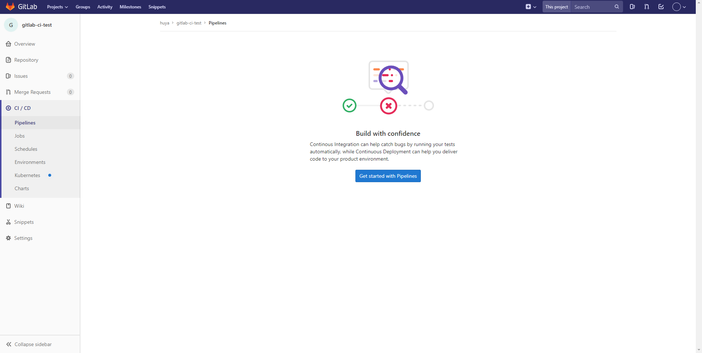

### 2. 按照官方文档进行配置

[Getting started with GitLab CI/CD](http://10.1.2.11/help/ci/quick_start/README)

首先需要在项目根目录新建 .gitlab-ci.yml 文件，并且给这个项目配置一个 runner。这样每次 commit 或者 push 都会触发 gitlab-ci pipeline

### 3. 新建 yml 文件

1.yml 是一种专门用来写配置文件的语言，非常简洁，比 json 格式更方便
[YAML 语言教程](http://www.ruanyifeng.com/blog/2016/07/yaml.html)

一个项目的基础配置
[官方 API](https://docs.gitlab.com/ee/ci/yaml/README.html)

```yml
stages:
  - install
  - build

cache:
  key: ${CI_BUILD_REF_NAME}
  paths:
    - node_modules/

before_script:
  - node -v
  - yarn -v

Install:
  stage: install
  script:
    - yarn install
  only:
    - /master.*/

Build:
  stage: build
  script:
    - yarn run build
  only:
    - /master.*/
```

等价于下面这个 json

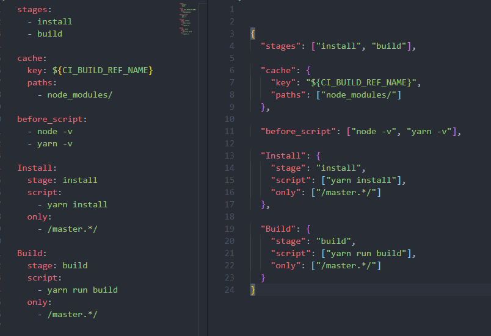

### 4. 将改动文件提交至远程

进入 project，因为没有配置 gitlab-runner，所以此时 CI 状态是 pendding 状态，所以接下来需要配置 gitlab runner

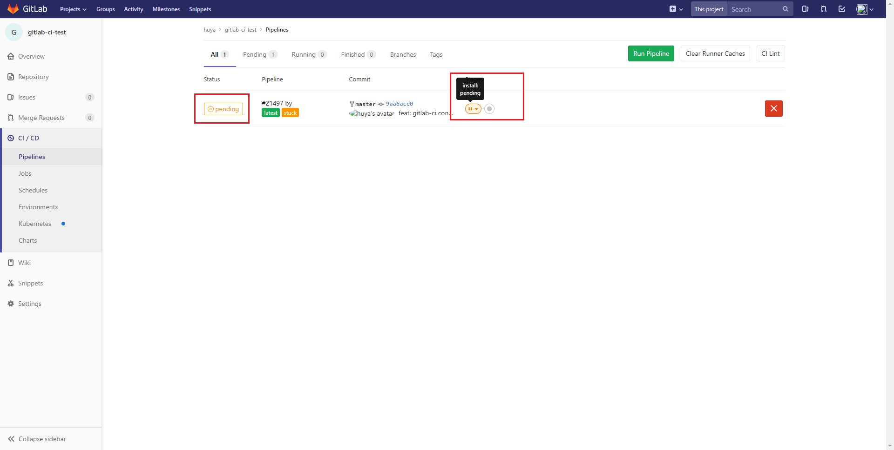

### 5. 安装注册 gitlab runner

[文档地址](https://docs.gitlab.com/runner/)

- 1、这里采用的是 windows 安装，创建一个空文件夹，把.exe 可运行文件放到该目录下，执行以下命令，注意要以管理员身份运行

```js
.\gitlab-runner.exe install
.\gitlab-runner.exe start
```

- 2、在项目面板查看 gitlab-ci url 以及 token

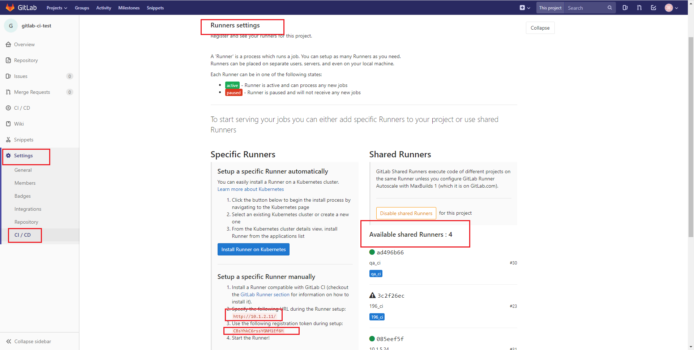

- 3、注册 runner
  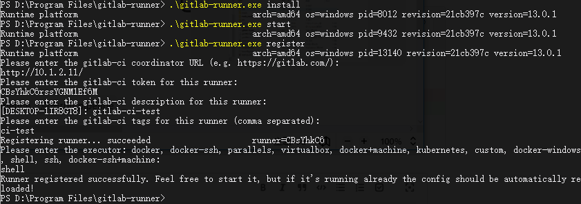
  [官方文档](https://docs.gitlab.com/runner/register/)

- 4、查看项目的配置，看到 runner 配置成功
  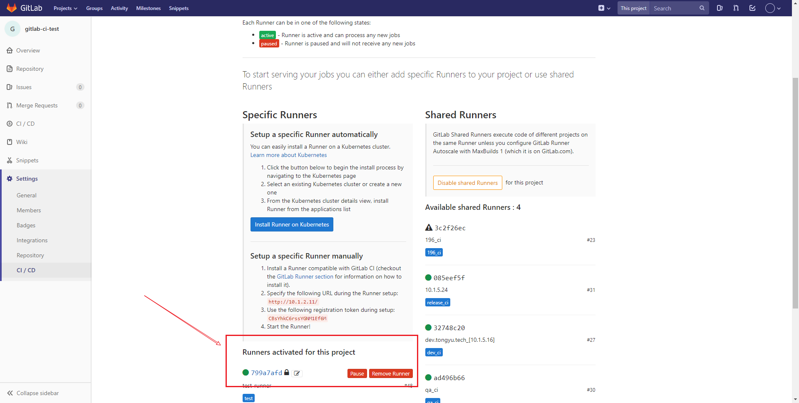

- 5、配置 runner 可以运行 untagged jobs，不配置的话当 yml 文件配置的 jobs 未指定 tag 就无法运行 gitlab-runner
  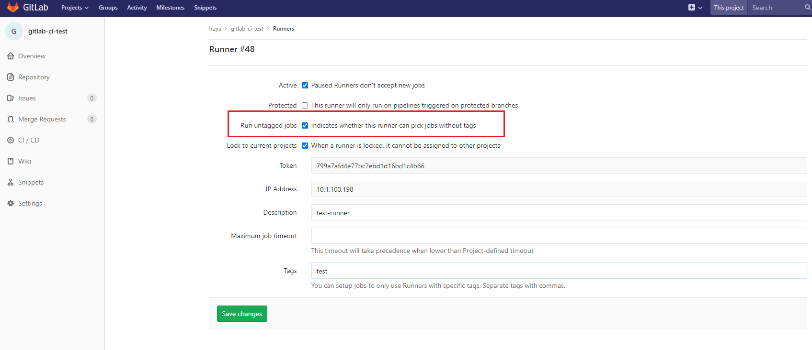

- 6、重新运行 pipeline，发现构建成功
  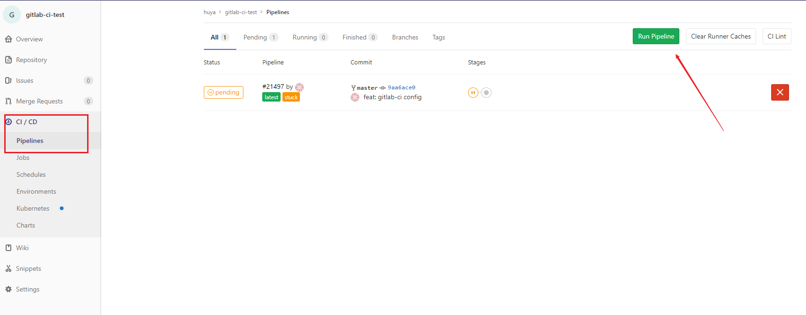

- 7、在面板查看本次 piepeline 的情况
  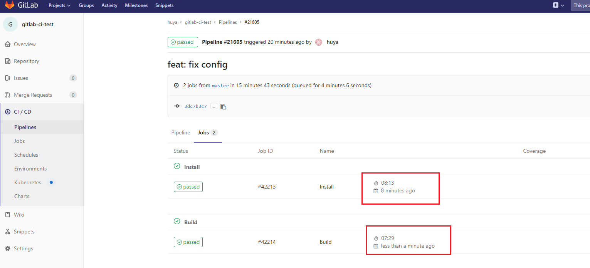

- 8、构建后的文件及目录可以在 gitlab-runner 的安装目录查看
  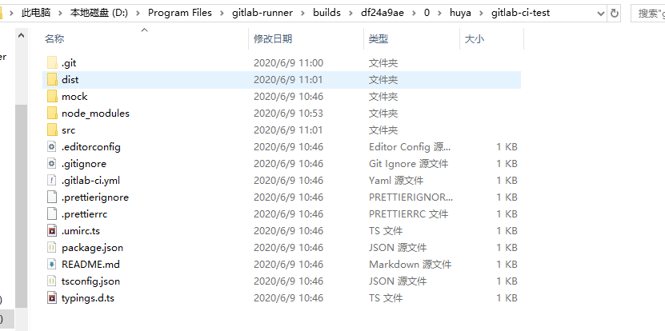

# CD 的概念

**CD：**
CD 在 CI 之后，CD 包含两个概念，continuous delivery 和 continuous deployment，即持续交付与持续部署。越往后，就会越接近生产环境

[详解 CI&CD](http://www.ttlsa.com/news/ci-cd-cd/)

**持续交付：**
持续交付就是我们的应用发布出去的流程，这个过程可以确保我们能尽可能快的实现交付。这意味着除了自动化测试，我们还需要自动化的发布流。以及通过一个按钮就可以随时随地实现应用的部署

**持续部署：**
持续部署就更加深入了，意味着当开发人员在主分支的一次提交，就会被构建，测试，如果一切顺利，就会直接部署到生产环境。

## 思考

- 使用 CI 的目的
- gitlab-ci pipeline stages jobs 有什么区别与联系

# 实例

## `SFC CI/CD pipeline`

- stage: 构建流程
  - start_install：安装依赖
    - `yarn install --cache-folder D:\\yarn_cache` 从指定缓存目录安装依赖
  - eslint：eslint 检查代码
    - `yarn lint`
  - build_package：打包并发布
    - `yarn build`
    - `npm publish --registry "${PUBLISH_REGISTRY}"`
  - build_doc：发布文档
    - `yarn docs:build`
    - `yarn docs:deploy "$DOC_DEPLOY_PATH"`

# 问题

## Pipelines 的某个 stage：`build_package: failed`

**【问题描述】**：

当时的`build_plugin`命令执行到下面这两行，后续打包完成但是发包报错了。特地新增`echo "$PUBLISH_REGISTRY"`期望打印出变量的值，即发布到的仓库地址，但是没有打印

```bash
$ echo "$PUBLISH_REGISTRY"
$ npm publish --registry "$PUBLISH_REGISTRY"
npm WARN invalid config registry=true

# 有这个警告说明变量值根本没有获取到
npm WARN invalid config Must be a full url with 'http://'
```

**【解决方案】**：
CB 修改了我配置的`Setting-CI/CD-Variables`中配置的变量的某个属性，把`Protected`属性给关闭了。

- `Export variable to pipelines running on protected branches and tags only.`

```bash
# 成功打印出变量值
$ echo "registry url ==>${PUBLISH_REGISTRY}"
registry url ==>http://192.168.1.131:4873/
$ npm publish --registry "${PUBLISH_REGISTRY}"
```
