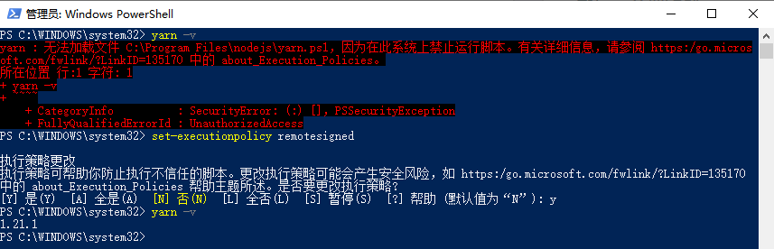
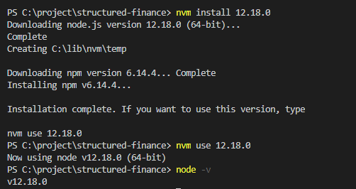

# Node

```bash
# 查看node安装路径
which node

# 显示版本，检查npm 是否正确安装。
npm -v

```

## process.env

**【ask gpt】**

Q: 下面这行代码是干嘛的？

```tsx
const { NODE_ENV } = process.env;
```

A:

这行代码是将 Node.js 进程环境变量 process.env 中的 NODE_ENV 属性解构出来，并将其赋值给常量 NODE_ENV。在 Node.js 中，process.env 对象包含了所有的进程环境变量，例如操作系统类型、当前用户、路径等信息。而 NODE_ENV 环境变量通常用于指定应用程序的运行环境，例如 "development"（开发环境）、"production"（生产环境）或者 "test"（测试环境）。在应用程序中，可以根据不同的 NODE_ENV 值来加载不同的配置文件、执行不同的逻辑等，以实现不同环境下的运行效果。

## nodejs 如何升级版本

**方法一：用 n 升级 nodejs** （测试了没成功）

```bash
# 全局安装n
$ npm install -g n

# 升级到最新稳定版
$ n stable

# 升级到最新版
$ n latest

# 升级到定制版
$ n v7.10.0

# 切换使用版本
$ n 7.10.0 (ENTER)

# 删除指定版本
$ n rm 7.10.0

# 用指定的版本执行脚本
$ n use 7.10.0 some.js
```

输入`n stable`报错，查询 n 的版本也是如下报错。

```bash
PS C:\Windows\system32> n -version

& : 无法将“bash.exe”项识别为 cmdlet、函数、脚本文件或可运行程序的名称。请检查名称的拼写，如果包括路径，请确保 路径正确
，然后再试一次。
所在位置 C:\Users\XL\AppData\Roaming\npm\n.ps1:15 字符: 5
+   & "bash$exe"  "$basedir/node_modules/n/bin/n" $args
+     ~~~~~~~~~~
    + CategoryInfo          : ObjectNotFound: (bash.exe:String) [], CommandNotFoundException
    + FullyQualifiedErrorId : CommandNotFoundException
```

```bash
PS C:\Windows\system32> Get-ExecutionPolicy -List

        Scope ExecutionPolicy
        ----- ---------------
MachinePolicy       Undefined
   UserPolicy       Undefined
      Process       Undefined
  CurrentUser       Undefined
 LocalMachine    RemoteSigned
```

```bash
PS C:\Windows\system32> Set-ExecutionPolicy RemoteSigned -Scope CurrentUser

执行策略更改
执行策略可帮助你防止执行不信任的脚本。更改执行策略可能会产生安全风险，如
https:/go.microsoft.com/fwlink/?LinkID=135170 中的 about_Execution_Policies 帮助主题所述。是否要更改执行策略?
[Y] 是(Y)  [A] 全是(A)  [N] 否(N)  [L] 全否(L)  [S] 暂停(S)  [?] 帮助 (默认值为“N”): Y
```

重启后再次查询如下。重新试之前的 n 相关命令还是一样报错没变化。

```bash
PS C:\Windows\system32> Get-ExecutionPolicy -List

        Scope ExecutionPolicy
        ----- ---------------
MachinePolicy       Undefined
   UserPolicy       Undefined
      Process       Undefined
  CurrentUser    RemoteSigned
 LocalMachine    RemoteSigned
```

> 参考链接

- [npm install -g n 运行错误](https://blog.csdn.net/qq_42709302/article/details/120188538)
- [无法将“XXX”项识别为 cmdlet、函数、脚本文件或可运行程序的名称。 对这个问题的解决方法](https://blog.csdn.net/sxeric/article/details/122403591)

**方法二：用 nvm 来管理 nodejs 版本**

```bash
# v14.15.3  2022/07/04之前都是这个版本，然后准备用nvm管理node版本

# 删除本机的node（应该看下`C:\Program Files\nodejs\node_modules`里面全局安装的依赖的）

# 下载的是nvm链接里面的`nvm-setup.exe`:4.63M

# 验证nvm是否安装成功
PS C:\Windows\system32> nvm -v

Running version 1.1.9.


# nvm安装node最新稳定版v16.15.1

PS C:\Windows\system32> nvm install 16.15.1
Downloading node.js version 16.15.1 (64-bit)...
Extracting...
Complete


Installation complete. If you want to use this version, type

nvm use 16.15.1

# nvm使用指定版本node
PS C:\Windows\system32> nvm use 16.15.1
Now using node v16.15.1 (64-bit)
PS C:\Windows\system32> node -v
v16.15.1

# npm 全局安装yarn
PS C:\Windows\system32> npm i yarn -g
PS C:\Windows\system32> yarn -v
1.22.19

# npm 全局安装clean-mark 也测试成功了
```

# 问题

## 1. nvm install 失败

报错：`Could not retrieve https://nodejs.org/dist/latest/SHASUMS256.txt.`

&emsp;&emsp;

解决方法：

1. 在 nvm 安装目录(找不到可通过环境变量)下找到`settings.txt`，打开在最后添加下面内容：
   ```js
   node_mirror:npm.taobao.org/mirrors/node/
   npm_mirror:npm.taobao.org/mirrors/npm/yarnInstallError
   ```
   &emsp;&emsp;
   

参考资料：[使用 nvm-windows 安装 NodeJs 遇到的问题](https://blog.csdn.net/lisa2017_/article/details/107105016)

## 2. npm i yarn -g 失败

&emsp;&emsp;

解决方法：网络改成手机热点

> **mac 上同样报错如下**

- 报错：`npm WARN checkPermissions Missing write access to /usr/local/lib/node_modules`
- 解决方法： 命令前加上`sudo`

## 3. 报错：无法加载文件 xxxx，因为在此系统上禁止运行脚本

报错：`无法加载文件 C:\Program Files\nodejs\npm.ps1，因为在此系统上禁止运行脚本。`

原因：现用执行策略是 Restricted（默认设置）

> 发现是在计算机上启动 Windows PowerShell 时，执行策略很可能是 Restricted（默认设置）。
> Restricted 执行策略不允许任何脚本运行。
> AllSigned 和 RemoteSigned 执行策略可防止 Windows PowerShell 运行没有数字签名的脚本。

> 为什么要弄这么一个执行策略呢，**因为 powershell 能做的事情太多了，为了避免一些恶意脚本直接运行，一般家用的 windows 系统默认将执行策略设置成了“Restricted”，即受限制的**




解决方法：

1. 以管理员身份运行 PowerShell
2. 执行：get-ExecutionPolicy，回复 Restricted，表示状态是禁止的
3. 执行：set-ExecutionPolicy RemoteSigned 即可，更改执行策略

   注意：一定要以管理员的身份运行 PowerShell，不是 cmd 窗口！

```bash
set-executionpolicy remotesigned # 输入y同意
```

**问题：** win

**参考：**

- [Powershell 执行策略限制相关](https://www.cnblogs.com/luckyuns/p/12851317.html)
- [无法加载文件 xxxx，因为在此系统上禁止运行脚本](https://blog.csdn.net/mehnr/article/details/104497019/)

## 4. yarn install 失败

报错：Fetching packages...`Three appears to be trouble with your network connection, Retrying...`
&emsp;&emsp;

解决方法：网络由手机热点改成网线/wifi

## 5. tyarn start 报错

```bash
tyarn start
   $ yarn run v1.22.4
   $ yarn check-env && yarn dev
   $ env-doctor check
   'env-doctor' 不是内部或外部命令，也不是可运行的程序
```

解决方法：先 tyarn 一下就好了

## 6. 后端本地联调时 ping 不通

可能是防火墙未关闭

# nvm

**简介:** node 的版本管理工具 nvm

> 我们可能同时在进行多个个项目，而多个不同的项目所使用的 node 版本又是不一样的，或者是要用更新的 node 版本进行试验和学习。这种情况下，对于**维护多个版本的 node**将会是一件非常麻烦的事情，而 nvm 就是为解决这个问题而产生的，他可以**方便的在同一台设备上进行多个 node 版本之间切换**，而这个正是 nvm 的价值所在，详情可以查看官网 NVM 官网。

**安装:**

1. 下载 nvm
   如果已经单独安装了 node，建议卸载，然后继续向下看。直接进入[安装包下载地址](https://github.com/coreybutler/nvm-windows/releases)。选择 nvm-setup.zip，下载后直接安装。

2. 配置环境变量
   正常安装完毕，环境变量无需配置，可以进行查看，如果没有自动配置成功，需要手动进行配置。

3. 验证是否安装成功
   执行`nvm -v`，出现下图提示说明安装成功
   &emsp;&emsp; 

**使用:**

```js
nvm list/ls     // 本机中所有的node的版本列表
nvm install latest  // 安装最新版本
nvm install 4.8.4  // 安装指定版本node
nvm use 10.8.0  // 使用指定node版本
```



**参考:**

- [nvm，nrm 介绍及使用](https://www.jianshu.com/p/ab63d08cced4)
- [教你如何使用 nvm](https://www.jianshu.com/p/f8e175403dfb)

# NPM

### 设置 NPM 镜像源

```bash
Usage:
  npm config set <key> <value>
  npm config get [<key>]
  npm config delete <key>
  npm config list [--json]
  npm config edit
  npm set <key> <value>
  npm get [<key>]
```

```bash
npm config set registry http://xx.xx.xx.xx:8888/repository/npm-group

/npm i -g yarn// 以上是安装yarn

yarn config set registry http://xx.xx.xx.xx:8888/repository/npm-group
```
