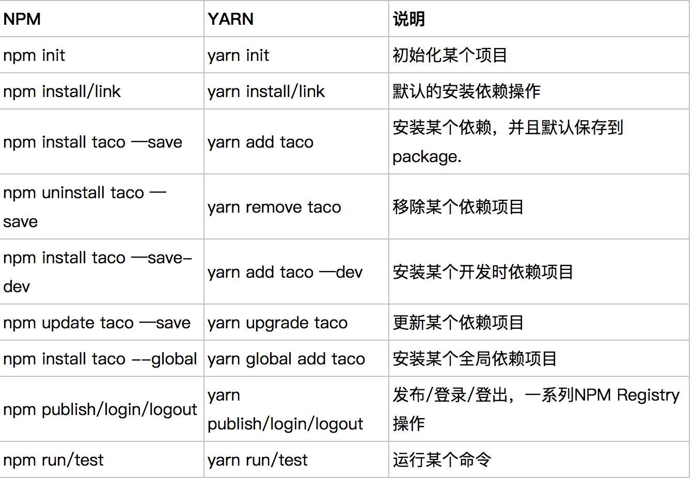
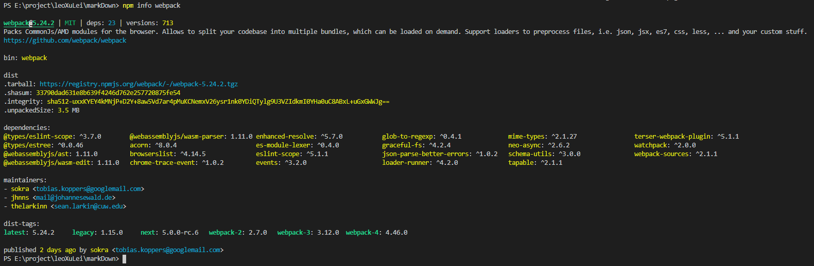
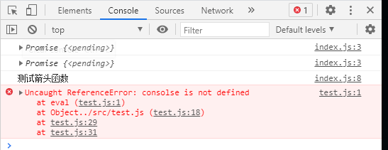
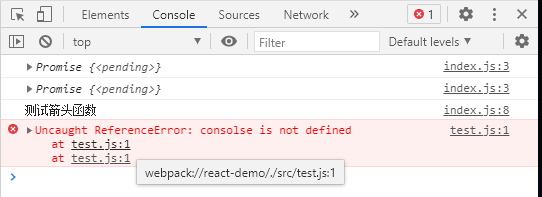
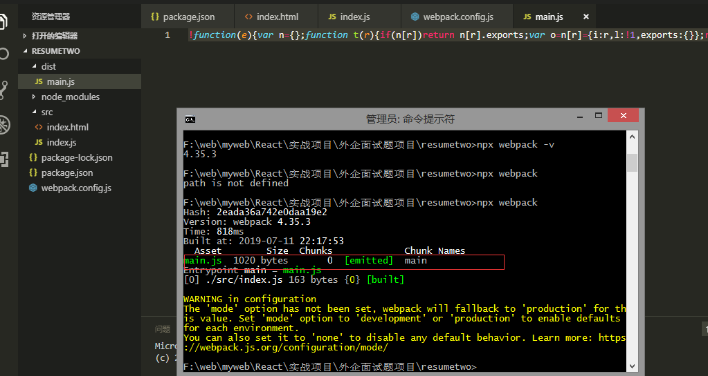
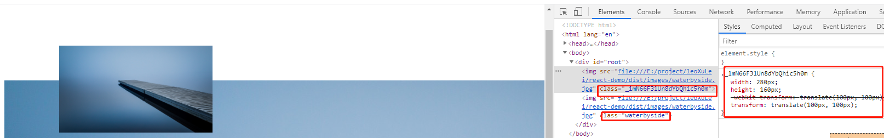
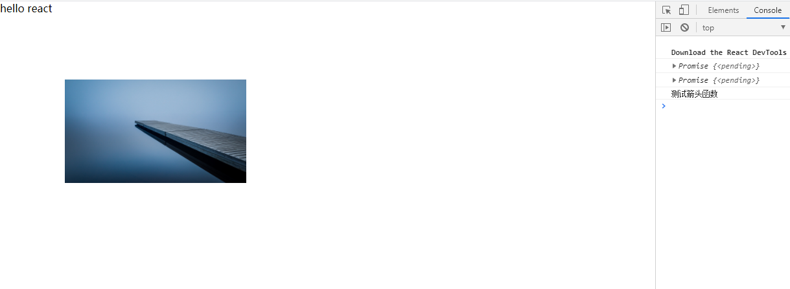

# **基本**

## 为什么学习 webpack

> 还需要对应用进行打包、压缩和编译成浏览器能够理解的代码

随着前端项目越来越复杂，单独建几个文件 HTML，JS，CSS 来写业务代码，==这样的方式已经无法保证项目的可维护性了==。

==所以就需要将不同的业务场景拆成模块==，然后去分开引入这些模块，每个模块自己做自己的事情，这样就可以保证项目的可维护性和可扩展性了，

但是，假如你有几千个模块，那能在页面上引入几千个 js 文件嘛？所以当项目大到这个程度的时候，==就得借助工具来管理这些模块了。Webpack 就是这样的一种工具，帮助我们管理复杂项目的一个工具==。

与 webpack 类似，还有很多相似的工具。如 gulp、grunt、browserify. 但是这两年 Webpack 的使用率直线上升，==比如三大框架的脚手架工具都开始使用 webpack 来做底层代码的构建==。这得益于 webpack 可以提供其他工具无法实现的特性。比如：Tree Shaking，代码懒加载，代码分割。。。

如果你不会使用 webpack，写业务代码没有问题，但是如果你学会了 webpack，==你会从更深层去思考前端工程化的内容，也能发现在代码的背后，别有洞天。使用 webpack 将极大的扩展你的前端开发视野==。

Webpack4 相对于之前的版本，有了较多的变化，

- 它的速度更快了，在大型项目的构建过程中，webpack4 甚至可以节约 90%的构建时间。
- 内置了跟多的默认配置，变更了许多 API。

## 常用命令



**其它命令：**

- yarn 查看所有版本
  `npm view yarn versions`

- yarn 更新到最新版
  `npm install yarn@latest -g`

- yarn 升级指定版本
  `yarn upgrade v1.21.3`

- `npm install / yarn`: 安装依赖
  删除 node_modules 文件夹后，重新安装依赖包

## 常用简写

- `npm install = npm i`
  在 git clone 项目的时候，项目文件中并没有 node_modules 文件夹，项目的依赖文件可能很大。直接执行，npm 会根据 package.json 配置文件中的依赖配置下载安装。

- `-global = -g`
  全局安装，安装后的包位于系统预设目录下

- `--save = -S`
  安装的包将写入 package.json 里面的 dependencies，
  ==dependencies：生产环境需要依赖的库==，dependencies 中记录的都是项目在线上运行时需要的文件
- `--save-dev = -D`
  安装的包将写入 packege.json 里面的 devDependencies，
  ==devdependencies：只有开发环境下需要依赖的库==, devDependencies 中记录的是项目在开发过程中需要使用的一些文件，在项目最终运行时是不需要的

## 安装指定版本包

```powershell
npm install --save-dev webpack@<version>
```

- taro 安装实例
  如下，taro 全局安装后 `npm install -g @tarojs/cli`。发现版本不对，就先卸载包，再装指定版本

```powershell
npm uninstall @tarojs/cli -g
npm install @tarojs/cli@1.3.11 -g
```

- 新项目内安装老版本的 webpack，如 webpack4.16.5，
  ==这种项目内安装 webpack 的方式使得我们实现了在不同项目中使用不同的 webpack 版本==

```powershell
npm install webpack@4.16.5 webpack-cli -D
```

## 其它

### 1、查 webpack 版本号

```powershell
npm info webpack
```



输入`webpack-v` 是到全局里去找，然而我是安装在项目里面，所以找不到这个命令，但是没关系，node 提供了 npx 来运行 webpack，即 `npx webpack -v`（npx 命令会在当前文件夹下的 node_modules 文件夹下找 webpack）

```js
$ E:\project\leoXuLei\ReactDemoProject> npx webpack -v
4.46.0
```

### 2、全局安装 webpack

```powershell
# 全局安装webpack 和webpack-cli
npm install webpack webpack-cli -g
```

> **不推荐全局安装 webpack：**
> 这会将你项目中的 webpack 锁定到指定版本，并且在使用不同的 webpack 版本的项目中，可能会导致构建失败。

### 3、项目内安装 webpack

首先把全局安装的 webpack 卸载掉，`npm uninstall webpack webpack-cli -g`

cmd 管理员权限，进入项目目录里面，
`npm install webpack webpack-cli --save-dev`(--save-dev 等价于 -D)

安装好了之后就会多出来`node_modules`目录（webpack 依赖的包）和`package-lock.json`，也会更新`package.json`。

这种项目内安装 webpack 的方式使得我们实现了在不同项目中使用不同的 webpack 版本

### 4、执行打包命令

还记得安装`webpack`的时候也要安装这个`webpack-cli`嘛，它的作用就是让我们能在命令行里面正确运行 webpack 这条命令，如果不安装就无法正确在命令行里运行`webpack`或者`npx webpack`

打包的命令目前有这几种：本质都是运行 webpack 这条命令

```powerShell
npx webpack index.js     // index.js为指定打包的入口文件(让webpack去翻译index.js)
npx webpack          // 按照配置文件webpack.config.js去打包
npm run bundle ->webpack   // 用npmScript简化我们的打包代码

<#
  "scripts": {
    "bundle": "webpack"
  },
#>
```

# **基本概念**

## **概念**

### 【一】webpack 是什么：模块打包工具

> 本质上，webpack 是一个现代 JavaScript 应用程序的静态模块打包器(module bundler)。当 webpack 处理应用程序时，它会递归地构建一个依赖关系图(dependency graph)，其中包含应用程序需要的每个模块，然后将所有这些模块打包成一个或多个 bundle。

是一个模块打包工具，如下，分别是引入三个模块，webpack 能够把你引入的这些模块，打包到一起，生成一个最终的 js 文件。所以它是一个模块打包工具。（import 表示引入了一个模块）

```js
import Header from "./header.js";
import Sidebar from "./sidebar.js";
import Content from "./content.js";
```

除了 ES module 模块引入方式，还有别的模块引入方式，如 Common JS 模块引入规范，CMD，AMD。Webpack 一样可以识别。

### 【二】entry 和 output

- entry
  > 入口起点(entry point)：指示 webpack 应该使用哪个模块，来作为构建其内部依赖图的开始。进入入口起点后，webpack 会找出有哪些模块和库是入口起点（直接和间接）依赖的。每个依赖项随即被处理，最后输出到称之为 bundles 的文件中

可以通过在 webpack 配置中配置 entry 属性，来指定一个入口起点（或多个入口起点）。默认值为 ./src。

```js
module.exports = {
  entry: "./path/to/my/entry/file.js",
};
```

- output
  > output 属性告诉 webpack 在哪里输出它所创建的 bundles，以及如何命名这些文件，默认值为 ./dist。基本上，整个应用程序结构，都会被编译到你指定的输出路径的文件夹中。

你可以通过在配置中指定一个 output 字段，来配置这些处理过程：

```js
const path = require("path");

module.exports = {
  entry: "./path/to/my/entry/file.js",
  output: {
    path: path.resolve(__dirname, "dist"),
    filename: "my-first-webpack.bundle.js",
  },
};
```

在上面的示例中，我们通过 output.filename 和 output.path 属性，==来告诉 webpack bundle 的名称，以及我们想要 bundle 生成(emit)到哪里==。可能你想要了解在代码最上面导入的 path 模块是什么，它是一个 Node.js 核心模块，用于操作文件路径。

### 【三】loader：模块打包的方案

> **作用：**
> ==loader 让 webpack 能够去处理那些非 JavaScript 文件（webpack 自身只理解 JavaScript）。loader 可以将所有类型的文件转换为 webpack 能够处理的有效模块==，然后你就可以利用 webpack 的打包能力，对它们进行处理。

> **通俗理解作用：**
> (webpack 默认知道如何打包 js 文件，但是对于别的类型文件，如.jpg/.css/.png 等等，就不知道怎么打包了，所以我们就得在配置文件里面告诉 webpack)

> **本质：**
> 是一个模块打包的方案，完成不同类型文件的打包

> **注意：**
> 在 webpack 配置中，loader 是有先后顺序的，是从下到上，从右到左，（写法也按照这个顺序）

本质上，webpack loader 将所有类型的文件，转换为应用程序的依赖图（和最终的 bundle）可以直接引用的模块。

在更高层面，在 webpack 的配置中 loader 有两个目标：

- test 属性，用于标识出应该被对应的 loader 进行转换的某个或某些文件。
- use 属性，表示进行转换时，应该使用哪个 loader。

```js
const path = require("path");

const config = {
  output: {
    filename: "my-first-webpack.bundle.js",
  },
  module: {
    rules: [{ test: /\.txt$/, use: "raw-loader" }],
  },
};

module.exports = config;
```

> “嘿，webpack 编译器，当你碰到「在 require()/import 语句中被解析为 '.txt' 的路径」时，在你对它打包之前，先使用 raw-loader 转换一下。

#### 文件

- file-loader：将文件发送到输出文件夹，并返回（相对）URL
- url-loader：像 file loader 一样工作，但如果文件小于限制，可以返回 data URL

url-loader  功能类似于  `file-loader`，但是在文件大小（单位 byte）低于指定的限制时，可以返回一个 DataURL。会把图片转化成一个 base64 的图片，直接放到 bundle.js 里面，而不是按照配置生成 image 文件夹

> **最佳实践：**
> 如果图片非常小，用 url-loader 打包到 js 里面是非常好的选择，没有必要让 12kb 的图片再发一次 http 请求，浪费时间，如果这个图片很大，就应该用 file-loader，单独请求图片放到 images 文件夹下。

#### 样式

在 webpack 配置中，loader 是有先后顺序的，是从下到上，从右到左。

|                  | 作用                                                                                       |
| ---------------- | ------------------------------------------------------------------------------------------ |
| style-loader     | 将模块的导出（css-loader 解析的结果）作为样式添加到 DOM 中（通过 style 标签）              |
| css -loader      | 负责解析 CSS 代码，主要是为了处理 CSS 中的依赖，例如 @import 和 url() 等引用外部文件的声明 |
| sass-loader      | 将 sass/scss 代码转译成 css 代码                                                           |
| postercss-loader | 实现自动添加样式厂商前缀功能                                                               |

#### 转换编译

(Transpiling)

- babel-loader：加载 ES2015+ 代码，然后使用 Babel 转译为 ES5

### 【四】插件(plugins)：使打包更便捷

> **作用：**
> loader 被用于转换某些类型的模块，而插件则可以用于执行范围更广的任务。插件的范围包括，从打包优化和压缩，一直到重新定义环境中的变量。插件接口功能极其强大，可以用来处理各种各样的任务。（==可以再 webpack 运行到某个时刻的时候，帮你做一些事情，像是 react 中的生命周期函数==）

想要使用一个插件，你只需要 require() 它，然后把它添加到 plugins 数组中。多数插件可以通过选项(option)自定义。你也可以在一个配置文件中因为不同目的而多次使用同一个插件，这时需要通过使用 new 操作符来创建它的一个实例。

> **分类：**

- `clean-webpack-plugin`：在打包前自动删除 dist 文件夹

- `html-Webpack-Plugin`: 会在打包结束后，根据 HTML 模板文件自动生成一个 html 文件，并把打包生成的 js 自动引入到这个 html 文件中

```js
var HtmlWebpackPlugin = require("html-webpack-plugin");
var path = require("path");

var webpackConfig = {
  entry: "index.js",
  output: {
    path: path.resolve(__dirname, "./dist"),
    filename: "index_bundle.js",
  },
  plugins: [
    new HtmlWebpackPlugin({
      template: "./src/index.html",
    }),
  ],
};
```

- `webpack-bundle-analyzer`：webpack 打包体积优化
  [参考链接](https://www.jianshu.com/p/eadd2fb68d48)
  [webpack-libs-optimizations 依赖包优化](https://github.com/GoogleChromeLabs/webpack-libs-optimizations)
  `npm install --save-dev webpack-bundle-analyzer`
  ```js
  const BundleAnalyzerPlugin =
    require("webpack-bundle-analyzer").BundleAnalyzerPlugin;
  module.exports = {
    plugins: [new BundleAnalyzerPlugin()],
  };
  ```
  在 项目的 `package.json` 文件中注入如下命令，以方便运行她(npm run analyz)，默认会打开http://127.0.0.1:8888作为展示。
  `'analyz': 'NODE_ENV=production npm_config_report=true npm run build'`
  这样运行 npm run build 后浏览器会自动打开 127.0.0.1:8888 展示如下页面：

### 【五】模式

通过选择 development 或 production 之中的一个，来设置 mode 参数，你可以启用相应模式下的 webpack 内置的优化

- 默认生产模式，代码压缩，开发模式代码不压缩。

```js
module.exports = {
  mode: "production",
};
```

实例对比可见 `实战流程 - 安装配置 webpack`

### 【六】Babel

因为 chrome 和搜狗浏览器比较与时俱进，ES6 规范中的都用了一些实现，所以 ES6 代码能够正确识别执行。但是如果在一些低版本的浏览器（如 IE）打开页面，就会报错，因为不支持 ES6。所以需要借助 babel，实现在 webpack 打包的时候把 ES6 代码转成 ES5 代码。

- **【1】了解 Babel 及生态**

  > **转译**
  > 现代 Javascript 主要是用 ES6 编写的。但并非每个浏览器都知道如何处理 ES6。 我们需要某种转换，这个转换步骤称为 transpiling(转译)。transpiling(转译) 是指将 ES6 语法，转译为旧浏览器可以理解的语法。

  > Ecmascript 的代码一直在更新 但是浏览器的兼容却没有根上，babel 就实现了利用服务端 node 的 导入导出特性，==实现了 js 代码的渐进增强、平稳退化。让我们可以随意使用新语法而不用考虑浏览器的兼容性问题==

要开始使用 loader ，我们需要安装一堆依赖项，以下已 Babel7 为主，

- ==babel-loader==: 加载 ES2015+ 代码，然后使用 Babel 转译为 ES5
- ==@babel/core==：babel 的核心库
- ==@babel/preset-env==：包含 ES6 及以上版本的语法转化为 ES5 语法的规则。
  (**为什么安装**：使用 babel-loader 处理 js 文件的时候，babel-loader 实际上只是 webpack 与 babel 之间通信的一个桥梁，只是做了打通，但实际上 babel-loader 并不会把代码里 ES6 语法翻译成 ES5 语法，要想实现代码 ES6 语法翻译成 ES5 语法，还得借助其他模块，`@babel/preset-env` 就是这样的一个模块)
- ==@babel/polyfill==: ES6 内置方法和函数转化垫片(@babel/preset-env 只翻译了部分，没翻译完全)
- ==@babel/plugin-transform-runtime==: 避免 polyfill 污染全局变量，减小打包体积

- ==@babel/preset-react==：帮助我们解析 React 里面的 jsx 语法，使用之后就可以在代码里面编写 React 的语法结构了
- ==@babel/cli== 从终端运行 Babel

> 如果是用 babel7 来转译，需要安装 @babel/core、@babel/preset-env 和 @babel/plugin-transform-runtime，而不是 babel-core、babel-preset-env 和 babel-plugin-transform-runtime，它们是用于 babel6 的

> 使用 @babel/plugin-transform-runtime 的原因：Babel 使用非常小的助手来完成常见功能。默认情况下，这将添加到需要它的每个文件中。这种重复有时是不必要的，尤其是当你的应用程序分布在多个文件上的时候。 transform-runtime 可以重复使用 Babel 注入的程序代码来节省代码，减小体积。

> 使用 @babel/polyfill 的原因：Babel 默认只转换新的 JavaScript 句法（syntax），而不转换新的 API，比如 Iterator、Generator、Set、Maps、Proxy、Reflect、Symbol、Promise 等全局对象，以及一些定义在全局对象上的方法（比如 Object.assign）都不会转码。必须使用 @babel/polyfill，为当前环境提供一个垫片(==即只翻译了部分，没翻译完全，如上面的 promise 等)。 所谓垫片也就是垫平不同浏览器或者不同环境下的差异==

### 【七】browserslist

[webpack4.0 核心概念（五） browserslist](https://blog.csdn.net/qq_37899792/article/details/108747116)

### 【八】实现 HMR：模块热更新

Hot Module Replacement 模块热更新

> **什么是模块热更新：**
> 模块热替换是指在应用程序运行过程中，替换、添加、删除模块，而无需重新刷新整个页面。

> **HMR 通过如下几种方式，来提高开发的速度**

- 不重新加载整个页面，这样可以保留某些应用程序的状态不丢失；
- 只需更新需要变化的内容，节省开发时间
- 修改了 css、js 源代码，会立即在浏览器更新，相当于直接在浏览器的 devtools 中直接修改样式。

> **如何配置**

```js
target: "web", // webpack5 必须加个target属性 否则无法修改代码后自动刷新整个页面
// 当时为了解决整个问题，搞了3H也没解决，最终解决是重新整理了问题描述，就搜到了：webpack5.0 使用webpack-dev-server时，无法自动刷新页面。
```

配置后修改代码可以看到界面自动刷新

```js
[WDS] Live Reloading enabled.

// webpack://react-demo/node_modules/webpack-dev-server/client/index.js
```

> **如何使用 HMR？**
> 三步骤

- 1. 默认情况下，webpack-dev-server 已经支持 HMR，只需要开启即可。需要加个 `hot: true`
- 2. 然后引入一个`new webpack.HotModuleReplacementPlugin()` webpack 自带插件
- 3. 最后还得在需要设置热更新的 JS 模块处手动定义使用 HMR 的模块。如果是 CSS 的 HMR 则不需要手动定义配置，因为 css 的 loader 已经做了，自搭建项目 JS 的 HMR 就得如下定义，但是 React 脚手架项目则不需要开发者手动做，脚手架等底层会把 HMR 的代码做好。

```js
if (module.hot) {
  module.hot.accept("./number", () => {
    document.body.removeChild(document.getElementById("number"));
    number(); //
  });
}
```

- 另外一种配置方法(见参考链接)：
  > 值得一提的是，在上面的配置中并没有配置 HotModuleReplacementPlugin，原因在于当我们设置 devServer.hot 为 true 后，并且在 package.json 文件中添加如下的 script 脚本：
  > "start": "webpack-dev-server --hot --open"
  > **添加 —hot 配置项后，devServer 会告诉 webpack 自动引入 HotModuleReplacementPlugin 插件**，而不用我们再手动引入了。

> **HMR 效果：**

CSS 的 HMR 实现效果如下


> **其它：**

HMR 开头的信息提示由 webpack/hot/dev-server 模块产生

总结：js 里实现代码 HMR，稍微复杂一点，需要监听对应的模块是否发生变化，再去重新执行这个模块，

问题：为啥 cssHMR 的时候不需要去监听，手写一些代码呢，因为 css-loader 里面已经帮你做了这个事情，所以自己就不用再写一遍了。

**参考链接：**

- [Webpack DevServer 和 HMR 原理 - 前端 LeBron 的文章 - 知乎
  ](https://zhuanlan.zhihu.com/p/375264720)

- [Webpack HMR 原理解析 - 冉四夕的文章 - 知乎](https://zhuanlan.zhihu.com/p/30669007)
- [启用 Webpack 服务使用热更新](http://ljylk.cn/?p=713)

### 【九】Tree Shaking

tree shaking 是一个术语，通常用于描述移除 JavaScript 上下文中的未引用代码(dead-code)

你可以将应用程序（导出模块的地方）想象成一棵树。绿色表示实际用到的源码和 library，是树上活的树叶。灰色表示无用的代码，是秋天树上枯萎的树叶。为了除去死去的树叶，你必须摇动这棵树，使它们落下。

treeShakeing 只支持 ES module 模块引入方式。

需要配置，如下：
Webpack.config.js 配置如下

```js
// webpack.config.js
optimization: {
  usedExports: true
},


// package.json
{
...
"sideEffects": false,
  // "sideEffects": ["@babel/polly-fill"],
  // "sideEffects": [ "*.css" ]
...
}
```

### 【十】code split 代码分割

代码分离是 webpack 中最引人注目的特性之一。此特性能够把代码分离到不同的 bundle 中，然后可以按需加载或并行加载这些文件。代码分离可以用于获取更小的 bundle，以及控制资源加载优先级，如果使用合理，会极大影响加载时间。
有三种常用的代码分离方法：

- 入口起点：使用  entry  配置手动地分离代码。
- 防止重复：使用  CommonsChunkPlugin  去重和分离 chunk。
- 动态导入：通过模块的内联函数调用来分离代码。

没有 code splitting，代码没有问题；但是有了合理的代码分割之后，通过对代码进行拆分，就能减少请求的大小、次数，提升了性能，用户体验更好一些，

### 【十一】懒加载

懒加载其实前两节代码分割就已经涉及到了，只是没有提炼总结出来：通过 import 来异步加载一个模块 由某个事件触发，触发后加载相应模块代码。框架代码中根据不同路由来加载相应模块代码（如首页、列表页、详情页）。

定义
定义：懒加载或者按需加载，是一种很好的优化网页或应用的方式。这种方式实际上是先把你的代码在一些逻辑断点处分离开，然后在一些代码块中完成某些操作后，立即引用或即将引用另外一些新的代码块。这样加快了应用的初始加载速度，减轻了它的总体体积，因为某些代码块可能永远不会被加载。

# **指南**

## 【一】开发

### 使用 source map

> **背景：**
> 当 webpack 打包源代码时，可能会很难追踪到错误和警告在源代码中的原始位置。例如，如果将三个源文件（a.js, b.js 和 c.js）打包到一个 bundle（bundle.js）中，而其中一个源文件包含一个错误，那么堆栈跟踪就会简单地指向到 bundle.js。这并通常没有太多帮助，因为你可能需要准确地知道错误来自于哪个源文件。所以需要使用 sourcemap，来做一个源代码和打包生成代码之间的映射关系。
> **作用：**
> ==为了更容易地追踪错误和警告，JavaScript 提供了 source map 功能，将编译后的代码映射回原始源代码（来做一个源代码和打包生成代码之间的映射关系。）==。如果一个错误来自于 b.js，source map 就会明确的告诉你。

> **最佳实践：**

`devtool` 此选项控制是否生成，以及如何生成 source map。
选择一种 source map 格式来增强调试过程。不同的值会明显影响到构建(build)和重新构建(rebuild)的速度。
`// devtool: 'cheap-eval-source-map'`, 开发模式下自动会配置

```js
devtool: 'cheap-module-eval-source-map' // development开发：
devtool：'cheap-module-source-map' // production生产：
```

> **实例：**

```js
// ./src/test.js
consolse.log("测试箭头函数");
```

下图是未开启 devtool source-map 时的报错


下图是开启 devtool source-map 时的报错
`devtool: "inline-source-map"`


### 选择一个开发工具: webpack-dev-server

> **背景：**
> 每次修改 src 下面源代码之后，要保存手动输入`npm run bundle`打包，然后再手动打开打包生成的 dist 文件夹下的 index.html， 这样太麻烦了！

> 所以希望修改 src 目录下的源代码保存之后，会自动重新打包，这样再去页面上看效果就简单多了，就不用每次再手动输入`npm run bundle`了

webpack 中有几个不同的选项，可以帮助你在代码发生变化后自动编译代码（修改源码自动打包功能）：

- webpack's Watch Mode
- webpack-dev-server
- webpack-dev-middleware

多数场景中，你可能需要使用 webpack-dev-server

> **使用 webpackDevServer**

**好处**：

- 希望输入`npm run start`之后能自动打开浏览器
- 能够模拟服务器上的一些特性（本地开启一个服务器）
  之前手动打开 dist 下的`index.html`文件，是通过`file/::`文件的形式打开，这种方式就没法在页面上发起 ajax 请求，所以要想发 ajax 请求，必须得在服务器上以 http 协议打开。
- 后面修改源码也能自动从新打包且能自动刷新浏览器中打开的页面。

**安装**： `npm install webpack-dev-server -D`
**配置**：

```js
"scripts": {
  "start": "webpack-dev-server --open" // 添加一个 script 脚本，可以直接运行开发服务器(dev server)
},
```

```js


devServer: {
  contentBase: path.join(__dirname, "./dist"), // 告诉服务器在哪里查找文件
  port: 8080, // 端口号
  open: "chrome", // 自动启服务器
  // hot: true, // 启用 webpack 的模块热替换特性
  // hotOnly: true  注释之后 报错代码后页面自动刷新
  // overlay: true, // 代码出错弹出浮动层
},
// 以上配置告知 webpack-dev-server，在 localhost:8080 下建立服务，将 dist 目录下的文件，作为可访问文件。

```

现在，我们可以在命令行中运行 npm start，就会看到浏览器自动加载页面。如果现在修改和保存任意源文件，web 服务器就会自动重新加载编译后的代码(即 ==实时重新加载(live reloading)==。试一下！

- 默认的，webpack-dev-server 的 hot 值为 false，这时，webpack-dev-server 会在文件修改后刷新页面，这是冷更新。

```js
// 配置好修改源码页面自动整体刷新后console如下
[HMR] Waiting for update signal from WDS...
index.js:48 [WDS] Hot Module Replacement enabled.
index.js:52 [WDS] Live Reloading enabled.
```

**其它**：
Proxy:配置是干嘛的
是帮我们做跨域的接口模拟时候要用的接口代理，为什么在 vue 和 React 中可以使用接口代理呢，是因为 vue 和 React 脚手架的底层都使用了 `webpack-dev-server`

# **插件**

## CopyWebpackPlugin

> **作用**
> 将单个文件或整个目录复制到构建目录

```js
const CopyWebpackPlugin = require("copy-webpack-plugin"); // 静态资源拷贝：将单个文件或整个目录复制到构建目录

module.exports = {
  plugins: [
    new CopyWebpackPlugin({
      patterns: [
        {
          from: "src/static/*.js",
          to: `${path.resolve(__dirname, "dist", "js")}/[name][ext]`, // 输出到 dist/js/[name][ext]
        },
        // 还可以继续配置其它要拷贝的文件
      ],
    }),
  ],
};
```

# **实战流程**

## 【一】新建项目

````powershell
1. mkdir xxx  # 新建文件夹
2. cd xxx  # 进入文件夹
3. npm init -y   # 初始化项目（加上-y的话就不会询问填信息，直接默认生成）

4. # 修改package.json
    - 新增 "private": true
    - 新增 "author": "xulei"

5. # 新建src目录及如下文件
    # src/index.html !快捷键生成html模板
        ```html
        ...
        <script src="./index.js"></script>
        ...
        ```

    # src/index.js
        ```js
        const arr = [new Promise(() => {}), new Promise(() => {})];
        arr.forEach((v) => console.log(v));
        let a = () => {
        return "测试箭头函数";
        };
        console.log(a());

        ```
6. 浏览器中打开`index.html`，预览
````

- **npm init**
  npm 是 node 的一个包管理工具，可以帮助我们以 node 规范的形式创建一个项目或者 node 的包文件，要想用 webpack 管理项目，首先得让你的项目符合 node 的规范，所以使用 npm init 即去初始项目。
  如下，`npm init`之后即在目录下生成了一个 package.json 文件，来描述 node 项目或者 node 包里面的信息。

  ```js
  {
  "name": "react-demo",
  "version": "1.0.0",
  "description": "",
  "main": "index.js",
  "private":true,
  "scripts": {
    "test": "echo \"Error: no test specified\" && exit 1"
  },
  "keywords": [],
  "author": "xulei",
  "license": "ISC"
  }

  ```

- **修改 package.json**
  - private: true，意思是这个项目是私有项目，不会被发布到 npm 的线上仓库里。
  - 可以把 main 这个配置项去掉，因为我们这个项目不会被外部引用，只是自己来用，没有必要向外暴露一个 js 文件，所以去掉，
  - scripts 这个配置项的值也可以去掉，
  - Author 配置项可以写成自己的名字
  - License 配置项，如果你想开源，可以写成 mit，ISC 也是可以的

## 【二】安装配置 webpack

- 项目内安装 webpack
  `npm install webpack webpack-cli -D`
  安装完成后打开`package.json`检查，并输入`npx webpack -v`确认

  ```js
  $ npx webpack -v
  webpack 5.24.2
  webpack-cli 4.5.0
  ```

- 新建并配置`webpack.config.js`
  ```js
  const path = require("path");
  module.exports = {
    // mode: 'development', // 开发环境
    entry: {
      main: "./src/index.js", // 入口文件
    },
    output: {
      filename: "[name].js", // 打包出来的文件名
      path: path.resolve(__dirname, "dist"), // 出口目录: dist文件夹
      // publicPath: 'http://cdn.com.cn' // 引入打包出来的js文件名称前加上cdn前缀
    },
  };
  ```
- `npx webpack`测试开发和生产环境打包是否正常

  如下，修改 index.html 中引用的 路径为 dist 下的 js 文件，测试正常
  | | 开发环境 | 生产环境
  | -- | -- | --
  | `asset main.js` 大小| 1.37k | 109 bytes |

  - 开发环境下

    ```js
    $..\react-demo> npx webpack
    asset main.js 1.37 KiB [emitted] (name: main)
    ./src/index.js 174 bytes [built] [code generated]
    webpack 5.24.2 compiled successfully in 75 ms
    ```

    ```js
    // ./dist/main.js

    /******/ (() => {
      // webpackBootstrap
      /******/ var __webpack_modules__ = {
        /***/ "./src/index.js":
          /*!**********************!*\
    !*** ./src/index.js ***!
    \**********************/
          /***/ () => {
            eval(
              'const arr = [new Promise(() => {}), new Promise(() => {})];\r\n\r\narr.forEach((v) => console.log(v));\r\n\r\nlet a = () => {\r\n  return "测试箭头函数";\r\n};\r\nconsole.log(a());\r\n\n\n//# sourceURL=webpack://react-demo/./src/index.js?'
            );

            /***/
          },

        /******/
      }; // startup // Load entry module and return exports // This entry module can't be inlined because the eval devtool is used.
      /************************************************************************/
      /******/
      /******/ /******/ /******/ /******/ var __webpack_exports__ = {};
      /******/ __webpack_modules__["./src/index.js"]();
      /******/
      /******/
    })();
    ```

  - 生产环境下

    ```js
    $..\react-demo> npx webpack
    asset main.js 109 bytes [compared for emit] [minimized] (name: main)
    ./src/index.js 174 bytes [built] [code generated]
    webpack 5.24.2 compiled successfully in 189 ms
    ```

    ```js
    // ./dist/main.js
    [new Promise(() => {}), new Promise(() => {})].forEach((o) =>
      console.log(o)
    ),
      console.log("测试箭头函数");
    ```

  - 老版本 webpack 打包图片如下
    

## 【三】插件：清空 dist、自动输出 HTML

安装：`npm install clean-webpack-plugin -D`

```js
// 抛错原写法
const CleanWebpackPlugin = require("clean-webpack-plugin");
plugins: [new CleanWebpackPlugin(["dist"])];
// 另一种错误写法
plugins: [
  new CleanWebpackPlugin(["dist"], {
    root: path.resolve(__dirname, "../"),
  }),
];

// 正确写法
const { CleanWebpackPlugin } = require("clean-webpack-plugin");
plugins: [new CleanWebpackPlugin()];
```

安装：`npm install html-webpack-plugin -D`

```js
const HtmlWebpackPlugin = require("html-webpack-plugin");
plugins: [
  new CleanWebpackPlugin(),
  new HtmlWebpackPlugin({
    // 打包输出html配置
    title: "resumeTwo", //
    // 压缩 HTML 文件
    // minify: {
    //   removeComments: true, // 移除 HTML 中的注释
    //   collapseWhitespace: true, // 删除空白符与换行符
    //   minifyCSS: true, // 压缩内联 css
    // },
    // filename: 'index.html', // 生成后的文件名
    template: "src/index.html", // 根据此模版生成 HTML 文件
  }),
];
```

## 【四】 配置开发服务器

见【指南 - 开发 - 开发工具】 `使用 webpackDevServer`

## 【五】 `devtool：sourceMap`的配置

见【指南 - 开发 - 使用 sourceMap】 `使用 webpackDevServer`

## 【六】Babel 转码

### ① 安装依赖并配置

```powerShell
npm install babel-loader @babel/core @babel/preset-env -D
```

见`Babel官网\设置\选择webpack查看相应配置`，配置如下：

```js
module: {
    rules: [
      {
        test: /\.js$/, // 匹配.js结尾的文件
        exclude: /node_modules/, // 排除依赖包文件夹，，因为node-module包里面是第三方的代码，里面ES6装ES5的工作早就做好了，没必要再做一遍
        // loader: "babel-loader", // 使用babel-loader，配置在.babelrc
        use: {
          loader: "babel-loader", // 如果检测到文件是js文件的话，来用babel-loader来做语义上的分析
          options: {
            presets: ["@babel/preset-env"],
          },
        },
      },
    ],
  },
```

配置 Babel 前后打包文件对比。

```js
// 配置Babel前

/******/ (() => {
  // webpackBootstrap
  var __webpack_exports__ = {};
  /*!**********************!*\
  !*** ./src/index.js ***!
  \**********************/
  const arr = [new Promise(() => {}), new Promise(() => {})];

  arr.forEach((v) => console.log(v));

  let a = () => {
    return "测试箭头函数";
  };
  console.log(a());

  /******/
})()(
  // 配置Babel后

  /******/ () => {
    // webpackBootstrap
    var __webpack_exports__ = {};
    /*!**********************!*\
  !*** ./src/index.js ***!
  \**********************/
    var arr = [new Promise(function () {}), new Promise(function () {})];
    arr.forEach(function (v) {
      return console.log(v);
    });

    var a = function a() {
      return "测试箭头函数";
    };

    console.log(a());
    /******/
  }
)();
```

如上，可以看到 `const` 已经转成了 `var`，箭头函数已经转成了正常的 `function`。这个时候只能转换一些简单的 ES6 特性。但是如 `promise` 对象和数组的 `map` 方法，在低版本浏览器里面还是不存在的，虽然做了翻译，但是只翻译了一部分，还有很多特性在低版本浏览器还是不能识别。需要借助`@babel/polyfill`

### ②`@babel/polyfill`

```powerShell
npm install  @babel/polyfill -S
```

```js
// 警告如下
npm WARN deprecated @babel/polyfill@7.12.1: 🚨 This package has been deprecated in favor of separate inclusion of a polyfill and regenerator-runtime (when needed). See the @babel/polyfill docs (https://babeljs.io/docs/en/babel-polyfill) for more information.
npm WARN deprecated core-js@2.6.12: core-js@<3 is no longer maintained and not recommended for usage due to the number of issues. Please, upgrade your dependencies to the actual version of core-js@3.
```

```js
// 安装完成之后需要在所有代码运行之前设置如下，
// 即放到src/index.js最顶部，即业务代码最顶部，例子：顶点标准版里src/index.js中也用到了这个
import "@babel/polyfill";

// 安装@babel/polyfill前后对比
// 前
asset main.js 1.33 KiB [emitted] (name: main)
asset index.html 319 bytes [emitted]
./src/index.js 202 bytes [built] [code generated]
webpack 5.24.2 compiled successfully in 859 ms

// 后
asset main.js 831 KiB [emitted] (name: main)
asset index.html 319 bytes [emitted]
runtime modules 937 bytes 4 modules
...
webpack 5.24.2 compiled successfully in 1612 ms

```

如上对比，全局引入 @babel/polyfill 的这种方式可能会导入代码中不需要的 polyfill，从而使打包体积更大。==可以看到因为`@babel/polyfill` 要去弥补一些低版本浏览器不存在的一些内容，所以他要自己去做 promise 的实现，数组 map 方法的实现==，然后再把这些实现放到 main.js 里面，所以 main.js 就会变得特别的大。

但是我们源码里面其实只用到了 promise 和 map 语法 ，还有很多其他没有用的语法都被打包到 main.js 里面了，但是实际上我不需要这些没使用到的语法被打包，即 main.js 不需要八百多 k 这么大，我们可以使用一个非常简单的配置，优化这个性能，如下。

- `useBuiltIns: 'usage'` 优化性能（只转译源代码中使用到的）

```js
module: {
    rules: [
      {
        test: /\.js$/, // 匹配.js结尾的文件
        exclude: /node_modules/, // 排除依赖包文件夹
        // loader: "babel-loader", // 使用babel-loader，配置在.babelrc
        use: {
          loader: "babel-loader",
          options: {
            presets: [
              [
                "@babel/preset-env",
                {
                  useBuiltIns: "usage", // 只把转换后用到的特性打包进去
                },
              ],
            ],
          },
        },
      },
    ],
  },
```

重新打包发现`dist/main.js`从八千多行变成了一千多行，优化了很多。如下

```js
asset main.js 126 KiB [emitted] (name: main)
asset index.html 319 bytes [emitted]
runtime modules 937 bytes 4 modules
modules by path ./node_modules/core-js/modules/*.js 32.5 KiB 56 modules
./src/index.js 341 bytes [built] [code generated]
webpack 5.24.2 compiled successfully in 1088 ms
```

### ③`@babel/plugin-transform-runtime`

> **总结：**
>
> - 如果写的是业务代码，配置 preset 同时引入@babel/polyfill 就行了，
> - 如果写的是一个库项目代码，就要使用@babel/plugin-transform-runtime 这个插件，好处是可避免@babel/polyfill 带来的问题（会污染全局环境），这个插件会以闭包注入或者间接的帮助组件引入对应的内容，它不存在全局污染这样一个概念，是个更好的方案

开发第三方模块/UI 组件库/类库的时候用`@babel/polyfill` 这种方案是有问题的，==因为它在注入 promise 或者这种 map 方法的时候，会通过全局变量来注入，会污染全局环境==，所以要换一种打包的方式。

```powerShell
npm install @babel/plugin-transform-runtime -D
npm install @babel/runtime -S
```

然后注释掉 preset 的配置了，取而代之加一个 plugin，如下：并接收参数做配置

```powerShell
npm install core-js@3 -S
```

............
直接在`webpack.config.js`中配置还是报错，直接看在`.babelrc`如何配置就好

### ④ 创建`.babelrc` 文件来配置 Babel

Babel 的配置项特别多，导致 options 里面的配置项非常长，如何解决？在根目录下新建.babelrc 文件，然后将 options 对象的配置拿出来，放到`.babelrc` 里面去，注意里面不能写注释。

```powerShell
# webpack.config.js
module: {
    rules: [
      {
        test: /\.js$/, // 匹配.js结尾的文件
        exclude: /node_modules/, // 排除依赖包文件夹
        loader: "babel-loader", // 使用babel-loader，配置在.babelrc
      },
    ],
  },
```

```powerShell
# .babelrc
{
  "presets": [
    [
      "@babel/preset-env",
      {
        "useBuiltIns": "usage", // 只把转换后用到的特性打包进去
        "corejs": 3
      }
    ]
  ],
  "plugins": ["@babel/plugin-transform-runtime"]
}

```

注意将`src/index.js`顶部的`import "@babel/polyfill";`去掉。

```powerShell
# 打包结果如下
asset main.js 215 KiB [emitted] (name: main)
asset index.html 319 bytes [emitted]
runtime modules 1.13 KiB 5 modules
modules by path ./node_modules/core-js/internals/*.js 42.9 KiB 82 modules
modules by path ./node_modules/core-js/modules/*.js 14.6 KiB
  ./node_modules/core-js/modules/es.promise.js 13.2 KiB [built] [code generated]
  ./node_modules/core-js/modules/es.object.to-string.js 380 bytes [built] [code generated]
  ./node_modules/core-js/modules/es.array.for-each.js 293 bytes [built] [code generated]
  ./node_modules/core-js/modules/web.dom-collections.for-each.js 691 bytes [built] [code generated]
./src/index.js 396 bytes [built] [code generated]
webpack 5.24.2 compiled successfully in 1110 ms
```

打包发现`dist/main.js`为 2600 行

## 【七】处理静态资源：图片

```powerShell
npm install file-loader url-loader -D
```

- 【file-loader】：解决 CSS 等文件引入图片路径的问题【file-loader 是解析图片地址，把图片从源文件拷贝到目标文件，并且可以修改源文件名称，可以处理二进制、bootstrap 里面的字体】

- 【Url-loader】：当图片较小时会把图片 BASE64 编码（减少图片 http 请求），大于 limit 参数时候还是使用 file-loader 进行拷贝（图片很大时用 url，打包的 js 文件就会很大，加载速度就变慢即一开始页面不显示），limit 参数单位是字节，1024 字节=1k

**配置如下：**

```js
module: {
    rules: [
      {
        test: /\.(jpg|png|gif|jpeg|svg)$/, // 匹配图片文件
        use: {
          loader: "url-loader",
          options: {
            name: "[name].[ext]",
            outputPath: "images/", // 图片输出路径，在/dist下
            limit: 1024 * 10, // 超过10k用file-loader，反之用url-loader
          },
        },
      },
    ],
  },
  resolve: {
    extensions: [".tsx", ".ts", ".js", ".jsx", ".mdx"],
    alias: {
      "@": path.resolve(__dirname, "src"), // 设置@为src目录的别名
    },
  },
```

**测试如下：**
重新打包发现图片加载正常

```js
// src/index.js
import waterbyside from "@/assets/images/waterbyside.jpg";

const waterImg = document.createElement("img");
// const waterImg = new Image();
waterImg.src = waterbyside;
waterImg.width = 500;
waterImg.heigth = 200;
const root = document.getElementById("root");
root.appendChild(waterImg);
```

## 【八】处理静态资源：样式

将上一节图片的样式从 js 中移到 css 中：新建 index.css 样式文件并引入样式并给 img 添加样式类。

此时直接打包肯定会报无法识别 `inde.css` 文件，跟 babel 一样，webpack 不知道将 CSS 提取到文件中。需要使用 loader 来加载对应的文件。所以需要在 `webpack.config.js` 里面的 module 中的 rules 中新建一个规则，来配置如何打包 css 文件。

> **背景：**

CSS 在 HTML 中的常用引入方法有 `<link>` 标签和 `<style>` 标签两种，所以这次就是结合 webpack 特点实现以下功能：

- 将 css 通过 link 标签引入
  如果需要单独把 CSS 文件分离出来通过 link 标签引入，我们需要使用  `mini-css-extract-plugin`  插件。
- 将 css 放在 style 标签里

### 处理 css 文件（通过 style 标签）

```js
// src/index.js
import waterbyside from "@/assets/images/waterbyside.jpg";
import "./index.css";

const waterImg = document.createElement("img");
// const waterImg = new Image();
waterImg.src = waterbyside;
waterImg.classList.add("waterbyside");

const root = document.getElementById("root");
root.appendChild(waterImg);
```

```css
/* index.css */
@import "./waterbyside.css";

/* waterbyside.css */
.waterbyside {
  width: 280px;
  height: 160px;
}
```

> **安装：**

```powerShell
npm install css-loader style-loader -D
```

重新打包就发现样式生效，可以发现并没有生成 CSS 文件，但是打开 index.html 是有样式的，因为 css 放在了 style 标签里面。

打包过程中，两个 loader 配合起来使用。`css-loader`会分析出几个 css 文件 之间的关系，最终将多个 css 文件合成一个 css，`style-loader` 在得到 `css-loader` 生成的 css 之后，会把 css 挂载到 `<head></head>`里面的`<style></style>`中。

### 处理 css 文件（通过 link 标签）

```powerShell
npm i mini-css-extract-plugin -D
```

```js
const MiniCssExtractPlugin = require("mini-css-extract-plugin"); // 将 css 单独打包成文件通过link方式引入
```

此种方式处理会将所有 css 文件打包成一个 css 文件，但是没有压缩，使用`optimize-css-assets-webpack-plugin`插件来实现 css 压缩。

```powerShell
npm i optimize-css-assets-webpack-plugin -D
```

> **配置如下：**

```js

const MiniCssExtractPlugin = require("mini-css-extract-plugin"); // 将 css 单独打包成文件通过link方式引入
const OptimizeCssAssetsPlugin = require("optimize-css-assets-webpack-plugin"); // 压缩 css

module: {
    rules: [
      ...
      {
        test: /\.(sa|sc|c)ss$/,
        use: [
          {
            loader: MiniCssExtractPlugin.loader, // 将css用link的方式引入就不再需要style-loader了
          },
          {
            loader: "css-loader",
            options: {
              importLoaders: 2, // 配置「css-loader 作用于 @import 的资源之前」有多少个 loader。
              modules: true, // 启用 CSS 模块化规范
            },
          },
          "postcss-loader",
          "sass-loader",
        ],
      },
    ],
  },
  plugins: [
    ...
    new MiniCssExtractPlugin({
      filename: "./css/[name].css", // 前面加上目录
      chunkFilename: "[id].css",
    }),
    new OptimizeCssAssetsPlugin({
      assetNameRegExp: /\.css$/g,
      cssProcessor: require("cssnano"), //用于优化\最小化 CSS 的 CSS 处理器，默认为 cssnano
      cssProcessorOptions: { safe: true, discardComments: { removeAll: true } }, //传递给 cssProcessor 的选项，默认为{}
      canPrint: true, //布尔值，指示插件是否可以将消息打印到控制台，默认为 true
    }),
  ],
```

#### 单独分离多个 CSS 文件

这里需要说的细一点,上面我们所用到的 mini-css-extract-plugin 会将所有的 css 样式合并为一个 css 文件。如果你想拆分为一一对应的多个 css 文件,我们需要使用到 extract-text-webpack-plugin，而目前 mini-css-extract-plugin 还不支持此功能。我们需要安装@next 版本的 extract-text-webpack-plugin

### 处理 `scss/less` 文件

修改`index.css`文件为`index.scss`，如下

```css
$bgColor: #2086d7 !default;
body {
  .waterbyside {
    width: 280px;
    height: 160px;
  }
  background-color: $bgColor;
}
```

> **安装：**

```powerShell
npm install node-sass sass-loader -D
```

重新打包发现样式生效。

### 为 CSS 加上浏览器前缀
> **以下是最新设置（2022/05/11）**
```json
{
  "postcss": "^8.4.13",
  "postcss-loader": "^6.2.1",
  "postcss-preset-env": "^7.5.0"
}
```

> **以下是`"postcss-loader": "^5.3.0"`旧版本的设置**

> 想给样式加一些前缀，如`-webkit-transform`，如何实现呢？
> 自己手动写会很麻烦，但是有 loader 可以实现这种自动添加厂商前缀的功能。即： `postcss-loader` 和 `autoprefixer`

```powerShell
npm install postcss-loader autoprefixer -D
```

```css
body {
  .waterbyside {
    width: 280px;
    height: 160px;
    transform: translate(100px, 100px);
  }
}
```

**配置方式一：**
直接写在 webpack.config.js 中

此次通过这种方式失败，原因是 postcss-loader 这个版本不支持在 webpack.config.js 文件中这么写，换另一种配置方式即可。

```js
{
        test: /\.(sa|sc|c)ss$/,
        use: [
          "style-loader",
          "css-loader",
          {
            loader: "postcss-loader",
            options: {
              ident: "postcss",
              plugins: (loader) => [
                require("postcss-import")({ root: loader.resourcePath }),
                require("postcss-cssnext")(),
                require("autoprefixer")(),
                require("cssnano")(),
              ],
            },
          },
          "sass-loader",
        ],
      },
```

**配置方式二：**
在 webpack.config.js 同级目录下，新建 postcss.config.js 配置文件，通过 postcss-loader 里的插件：autoprefixer 帮我们添加厂商前缀。

> autoprefixer 需要搭配 Browserslist,提供了两种方式去配置 Browserslist，
>
> - （官网推荐使用这种方式）在根目录下创建一个.-browserslistrc 文件，再写进去相关的配置，
> - 或者在 package.json 中进行配置
> - 其他的配置如 babel-preset-env 和 Stylelint 可以共享这份规则

```js
// postcss.config.js
module.exports = {
  plugins: [require("autoprefixer")],
};
```

重新打包，可以发现样式加上了厂商前缀。

```css
body .waterbyside {
  width: 280px;
  height: 160px;
  -webkit-transform: translate(100px, 100px);
  transform: translate(100px, 100px);
}
```

### css-loader 中使用 `importLoaders` 属性

```js
{
  test: /\.(sa|sc|c)ss$/,
  use: [
    "style-loader",
    {
      loader: "css-loader",
      options: {
        importLoaders: 2,
      },
    },
    "postcss-loader",
    "sass-loader",
  ],
},
```

importLoaders: 2 表示：在一个 css/scss 中引入了（@import）另一个 css/scss，也会依次执行之前两个 loader，即 `postcss-loader` 和 `sass-loader`。

### CSS 模块化

将 index.js 中引入图片并插入 root 节点的代码复制到一个 js 文件并封装成函数，在 index.js 引入并执行，从新打包，可以发现出现两张图片且样式一样，如下。

```js
import waterbyside from "@/assets/images/waterbyside.jpg";
import "./index.scss";
import getWaterSidePicFun from "./getWaterSidePic";

...

const waterImg = document.createElement("img");
// const waterImg = new Image();
waterImg.src = waterbyside;
waterImg.classList.add("waterbyside");

const root = document.getElementById("root");
root.appendChild(waterImg);

getWaterSidePicFun();

```


原因是 index.js 中引入样式是这么写的：`import "./index.scss";` 所以当前文件中所有用了 index.scss 中样式类的元素都会有效果。即使在封装成引入图片函数的 js 文件中并没有引入样式。即：==一个文件里的样式，影响到了另外一个文件里的样式，虽然是引用的，但是等于是设置了全局的样式。全局共享，即被污染了==，这么写代码会产生问题，如一不小心改一个文件里的样式，会把另一个文件里的样式也给改了，出现样式冲突的问题。

所以引入了一个 CSSmodule 的概念，也就是模块化的 css，==即引入的 css 只在引入地方内有效，好处是：这个文件或者模块里的样式和其它文件/模块里的样式不会有任何的耦合和冲突，写样式的时候变得很独立，可以避免很多的问题==。

> **实现 css 模块化：**

配置 css-loader，新增个属性 `modules：true`。然后引入样式的方式也需要变更。`import './index.scss'` 改为 `import styles from './index.scss'`，应用样式用 `styles.类名`;

```js
import waterbyside from "@/assets/images/waterbyside.jpg";
import styles from "./index.scss";
import getWaterSidePicFun from "./getWaterSidePic";

...

const waterImg = document.createElement("img");
// const waterImg = new Image();
waterImg.src = waterbyside;
waterImg.classList.add(styles.waterbyside);

const root = document.getElementById("root");
root.appendChild(waterImg);

getWaterSidePicFun();
```



如上，可以发现，loader 会用唯一的标识符(identifier)来替换局部选择器：即类名。模块化生效。

### 如何打包字体文件：iconfont

### 样式 loader 总结

- `css-loader`：负责解析 CSS 代码，主要是为了处理 CSS 中的依赖，例如 @import 和 url() 等引用外部文件的声明

- `style-loader`：会将 css-loader 解析的结果转变成 JS 代码，运行时**动态插入 style 标签**来让 CSS 代码生效。

- `sass-loader`：来对 sass 代码进行翻译，翻译成 css 代码

- `postcss-loader`: (css 自动加上前缀)

> 注意!!!
> module.rules.use 数组中，loader 的位置。根据 webpack 规则：放在最后的 loader 首先被执行，从上往下写的话是下面先执行，从左往右写的话是右边先执行。
> `['style-loader', 'css-loader', 'sass-loader'] `
> 执行顺序为 sass-loader --> css-loader --> style-loader
> 首先应该利用 sass-loader 将 scss 编译为 css，剩下的配置和处理 css 文件相同。

```js
module: {
  rules: [
    {
      test: /\.scss$/,
      use: [
        {
          loader: "style-loader", // 将 JS 字符串生成为 style 节点
        },
        {
          loader: "css-loader", // 将 CSS 转化成 CommonJS 模块
        },
        {
          loader: "sass-loader", // 将 Sass 编译成 CSS
        },
      ],
    },
  ];
}
```

## 【九】配置 React

Babel 官网里面左侧的`预设（Presets）`下有个 react，点开。

```js
npm i react react-dom -S
npm i @babel/preset-react -D
```

配置如下：

```js
module: {
  rules: [
    {
      test: /(\.js)|(\.jsx)$/, // 匹配.js|x结尾的文件
      exclude: /node_modules/, // 排除依赖包文件夹
      loader: "babel-loader", // 使用babel-loader，配置在.babelrc
    },
  ];
}
```

```js
{
    "presets": [
    [
      "@babel/preset-env",
      {
        "useBuiltIns": "usage", // 只把转换后用到的特性打包进去
        "corejs": 3
      }
    ],
    "@babel/preset-react"
  ],
}
```

测试代码如下：

```js
// index.js
import React from "react";
import ReactDOM from "react-dom";
import App from "./app";

ReactDOM.render(<App />, document.getElementById("root"));
```

```js
// app.jsx
import React from "react";
import waterbyside from "@/assets/images/waterbyside.jpg";
import styles from "@/css/index.scss";
import "./app.scss";

class App extends React.Component {
  componentDidMount() {
    const arr = [new Promise(() => {}), new Promise(() => {})];
    arr.forEach((v) => console.log(v));
    let a = () => {
      return "测试箭头函数";
    };
    console.log(a());
  }
  render() {
    return (
      <>
        <div>hello react</div>
        
      </>
    );
  }
}

export default App;
```

如下，`npm start`运行正常，打包也正常。


```js
// 配置React前打包大小

assets by chunk 222 KiB (name: main)
  asset main.js 221 KiB [emitted] (name: main)
  asset ./css/main.css 877 bytes [emitted] (name: main)
asset images/waterbyside.jpg 134 KiB [emitted] [from: src/assets/images/waterbyside.jpg] (auxiliary name: main)
asset index.html 395 bytes [emitted]

/* 然后 devtool: "cheap-module-source-map" */

// 配置React后
assets by chunk 1.08 MiB (name: main)
  asset main.js 1.08 MiB [emitted] (name: main) 1 related asset
  asset ./css/main.css 1.28 KiB [emitted] (name: main) 1 related asset
asset images/waterbyside.jpg 134 KiB [emitted] [from: src/assets/images/waterbyside.jpg] (auxiliary name: main)
asset index.html 395 bytes [emitted]

// 配置React后(生产)
assets by chunk 153 KiB (name: main)
  asset main.js 152 KiB [emitted] [minimized] (name: main) 2 related assets
  asset ./css/main.css 948 bytes [emitted] (name: main) 1 related asset
asset images/waterbyside.jpg 134 KiB [emitted] [from: src/assets/images/waterbyside.jpg] (auxiliary name: main)
asset index.html 345 bytes [emitted]
```

## 【十】配置路由及 Antd

```powerShell
npm i react-router-dom -S
```

antd 安装配置见`React/工程化`。
并关闭 css 模块化。

```js
// src\app.js
import React from "react";
import { HashRouter as Router, Route, Link } from "react-router-dom";
import { Layout } from "antd";
import routes from "@/route";
import waterbyside from "@/assets/images/waterbyside.jpg";
import "@/app.scss";

const { Header, Content } = Layout;

class App extends React.Component {
  componentDidMount() {
    const arr = [new Promise(() => {}), new Promise(() => {})];
    arr.forEach((v) => console.log(v));
    let a = () => {
      return "测试箭头函数";
    };
    console.log(a());
  }
  render() {
    return (
      <>
        {
          <Router>
            <Layout>
              <Header className="header">
                {routes.map((v) => (
                  <Link to={v.path} key={v.title} className="link">
                    {v.title}
                  </Link>
                ))}
                
              </Header>
              <Content>
                {routes.map((v) => {
                  if (v.exact) {
                    return (
                      <Route
                        exact
                        key={v.path}
                        path={v.path}
                        component={v.component}
                      />
                    );
                  }
                  return (
                    <Route key={v.path} path={v.path} component={v.component} />
                  );
                })}
              </Content>
            </Layout>
          </Router>
        }
      </>
    );
  }
}

export default App;
```

```css
/* src/app.scss */
body,
div,
dl,
dd,
dt,
ul,
li,
ol,
h1,
h2,
h3,
h4,
h5,
h6,
form,
fieldset,
table,
td,
img,
input,
a,
p,
textarea {
  margin: 0;
  padding: 0;
  /*font-family: "Helvetica Neue", Helvetica, Arial, sans-serif;*/
}
body {
  font-size: 16px;
}
ul,
ol,
li {
  list-style: none;
}
img {
  border: none;
}
a {
  text-decoration: none;
  color: #656565;
}

/*清楚浮动*/
.clearfloat:after {
  content: "";
  height: 0;
  display: block;
  visibility: hidden;
  overflow: hidden;
  clear: both;
}
.clearfloat {
  zoom: 1;
}
.fl {
  float: left;
}
.fr {
  float: right;
}

/* header */
.header {
  background: #1890ff;
  display: flex;
  align-items: center;
  .link {
    color: #fff;
    font-size: 18px;
    display: inline-block;
    padding: 0 20px;
    transition: all 0.3s ease-in;
    &:hover {
      color: #1890ff;
      background: #fff;
      transition: all 0.1s ease-in;
    }
  }
}

.waterbyside {
  width: 112px;
  height: 64px;
}
```

```js
// src/route.js
import Resume from "@/pages/resume";
import Project from "@/pages/project";
import TableAndCharts from "@/pages/tableAndCharts";
const routes = [
  {
    path: "/",
    title: "resume",
    component: Resume,
    exact: true,
  },
  {
    path: "/project",
    title: "project",
    component: Project,
  },
  {
    path: "/tableAndCharts",
    title: "tableAndCharts",
    component: TableAndCharts,
  },
];
export default routes;
```

打包如下。

```js
assets by chunk 1.41 MiB (name: main)
  asset main.js 1.36 MiB [emitted] (name: main) 1 related asset
  asset ./css/main.css 43.7 KiB [emitted] (name: main) 1 related asset
asset images/waterbyside.jpg 134 KiB [emitted] [from: src/assets/images/waterbyside.jpg] (auxiliary name: main)
asset index.html 395 bytes [emitted]
Entrypoint main 1.41 MiB (1.64 MiB) = ./css/main.css 43.7 KiB main.js 1.36 MiB 3 auxiliary assets
orphan modules 257 KiB [orphan] 78 modules
runtime modules 2.04 KiB 6 modules
modules by path ./node_modules/ 1.21 MiB (javascript) 42.4 KiB (css/mini-extract)
```

## 【十一】配置 Eslint

详见[./工程化/依赖/eslint.md]()

## 【十一】配置 TS

详见[./TS/intro/安装配置]()

# **Tips**

## 设置绝对路径

设置绝对路径如下

```js
const path = require("path");
// path: path.resolve(__dirname, 'dist') 路径是当前文件位置同级的dist文件夹
path: path.resolve(__dirname, "../dist"); // 路径是当前文件位置上一级的dist文件夹
```

## 判断生产/开发环境

```js
const isDevMode = process.env.NODE_ENV !== "production";


module: {
    rules: [
      {
        test: /\.(sa|sc|c)ss$/,
        use: [
          isDevMode ? 'style-loader' : MiniCssExtractPlugin.loader,
          'css-loader',
          'postcss-loader',
          'sass-loader',
        ],
      },
    ],
  }
```

## 静态资源拷贝

[参考链接](https://juejin.cn/post/6844904084927938567)

有些时候，我们需要使用已有的 JS 文件、CSS 文件（本地文件），但是不需要 webpack 编译。例如，我们在 `public/index.html` 中引入了 public 目录下的 js 或 css 文件。这个时候，如果直接打包，那么在构建出来之后，肯定是找不到对应的 js / css 了。

```js
├── public
│   ├── config.js
│   ├── index.html
│   ├── js
│   │   ├── base.js
│   │   └── other.js
│   └── login.html
```

现在，我们在 index.html 中引入了 ./js/base.js。

```js
<!-- index.html -->
<script src="./js/base.js"></script>
```

这时候，我们 npm run dev，会发现有找不到该资源文件的报错信息。

对于这个问题，==我们可以手动将其拷贝至构建目录，然后在配置 CleanWebpackPlugin 时，注意不要清空对应的文件或文件夹即可，但是如若这个静态文件时不时的还会修改下，那么依赖于手动拷贝，是很容易出问题的==。

幸运的是，webpack 为我们这些记性不好又爱偷懒的人提供了好用的插件。CopyWebpackPlugin，==它的作用就是将单个文件或整个目录复制到构建目录==。

- > **安装依赖**

```powerShell
npm install copy-webpack-plugin -D
```

- > 修改配置(当前，需要做的是将 public/js 目录拷贝至 dist/js 目录)：

```js
//webpack.config.js
const CopyWebpackPlugin = require("copy-webpack-plugin");
module.exports = {
  //...
  plugins: [
    new CopyWebpackPlugin({
      patterns: [
        {
          from: "src/static/*.js",
          to: `${path.resolve(__dirname, "dist", "js")}/[name][ext]`, // 输出到 dist/js/[name][ext]
          // to: path.resolve(__dirname, "dist", "js"), // 输出到 dist/js/src/static/[name][ext]: 即会把输入的路径带上
        },
        // 还可以继续配置其它要拷贝的文件
      ],
    }),
  ],
};
```

此时，重新执行 npm run dev，报错信息已经消失。
这里说一下 flatten 这个参数，设置为 true，那么它只会拷贝文件，而不会把文件夹路径都拷贝上，大家可以不设置 flatten 时，看下构建结果。
另外，如果我们要拷贝一个目录下的很多文件，但是想过滤掉某个或某些文件，那么 CopyWebpackPlugin 还为我们提供了 ignore 参数。

```js
// 旧版本写法已经失效，上面实例就可以实现这种需求
//webpack.config.js
const CopyWebpackPlugin = require("copy-webpack-plugin");
module.exports = {
  //...
  plugins: [
    new CopyWebpackPlugin(
      [
        {
          from: "public/js/*.js",
          to: path.resolve(__dirname, "dist", "js"),
          flatten: true,
        },
      ],
      {
        ignore: ["other.js"],
      }
    ),
  ],
};
```

例如，这里我们忽略掉 js 目录下的 other.js 文件，使用 npm run build 构建，可以看到 dist/js 下不会出现 other.js 文件。 CopyWebpackPlugin 还提供了很多其它的参数，如果当前的配置不能满足你，可以查阅文档进一步修改配置。

# 参考链接

- [webpack 官网](https://www.webpackjs.com/concepts/)
- [webpack 中文](https://webpack.docschina.org/configuration/dev-server/#root)
- [npm 官网查看安装的依赖](https://www.npmjs.com/package/copy-webpack-plugin)

- [！！！24 个实例入门并掌握「Webpack4」(一)](https://juejin.cn/post/6844903817322954759#heading-5)
- [24 个实例入门并掌握「Webpack4」博客](https://itxiaohao.github.io/passages/webpack4-learn-introduction/)
- [Webpack+Babel 手把手带你搭建开发环境(内附配置文件)](https://cloud.tencent.com/developer/article/1665658)
- [webpack 配置 react+antd+ts](https://blog.csdn.net/besttoby01/article/details/106615678)
- [使用 webpack5 从 0 到 1 搭建一个 react 项目的实现步骤](https://www.jb51.net/article/202257.htm)
- [带你深度解锁 Webpack 系列(进阶篇)](https://juejin.cn/post/6844904084927938567)
