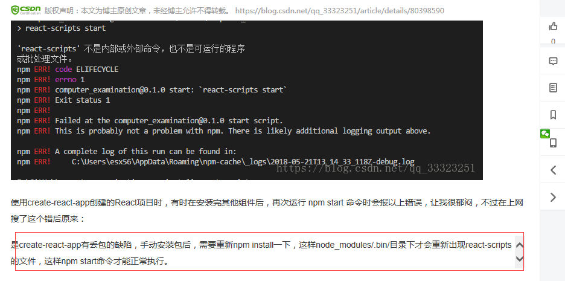
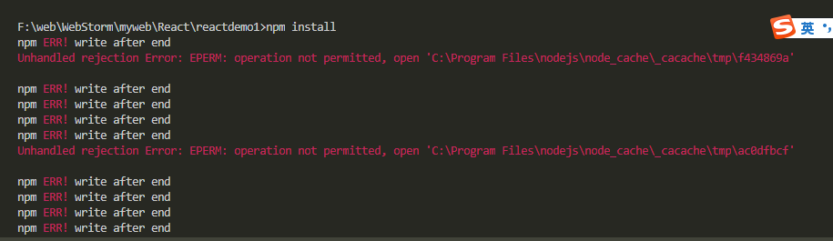

# npm start 报错

> **【解决方案】**

- npm install react-scripts
- npm install 安装完成后再次运行 npm start 即可

create-react-app 脚手架新建项目后 执行 npm install react-router-dom --save （安装 react-router）后报错，且 npm start 也会报错

直接在 vscode 中 npm install 也会报如下图错误，转到管理员权限下的 cmd 进入项目目录再 npm install 就好了

