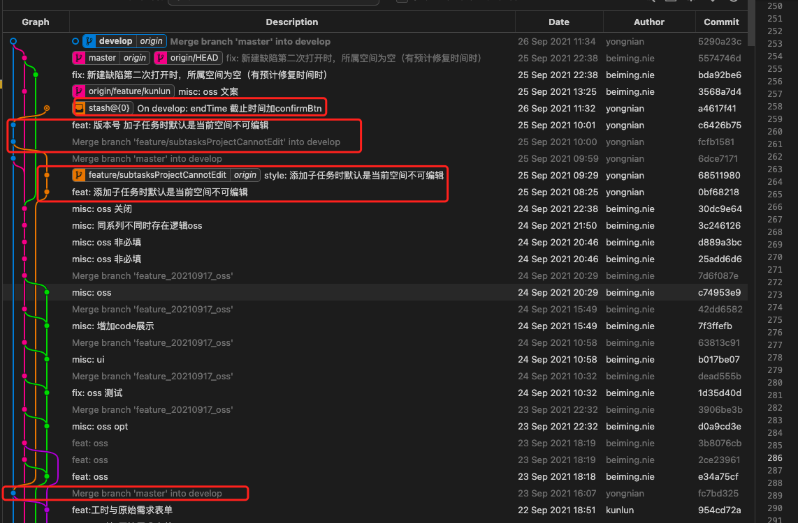
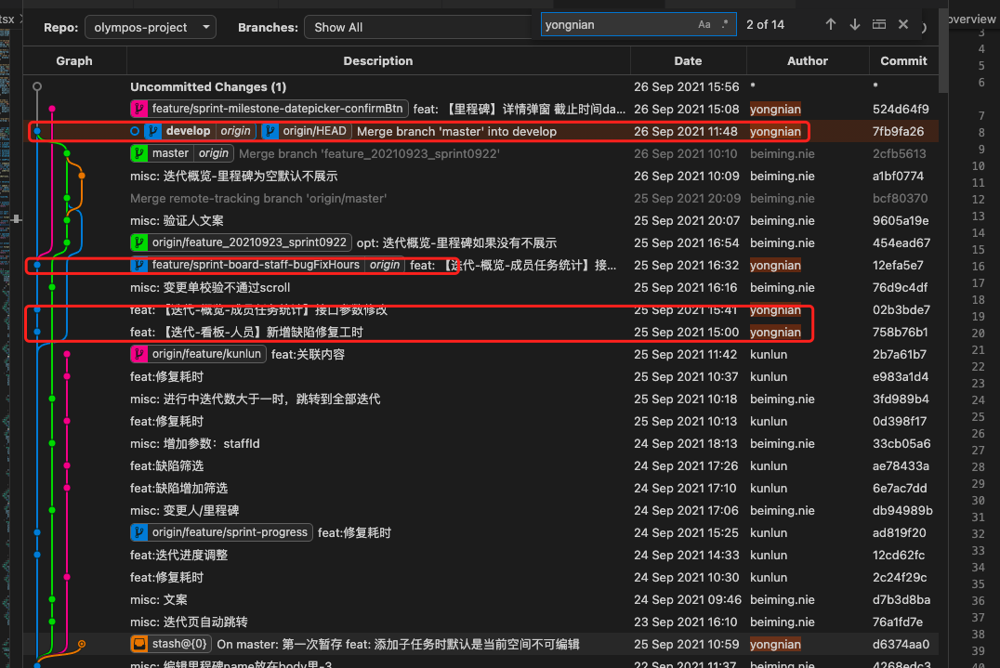
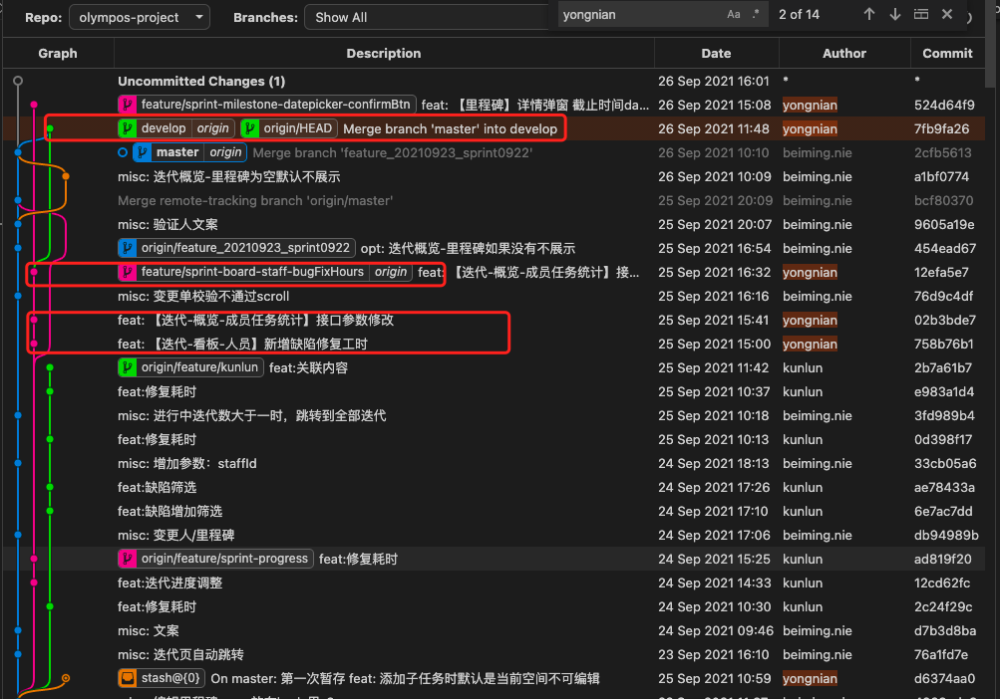
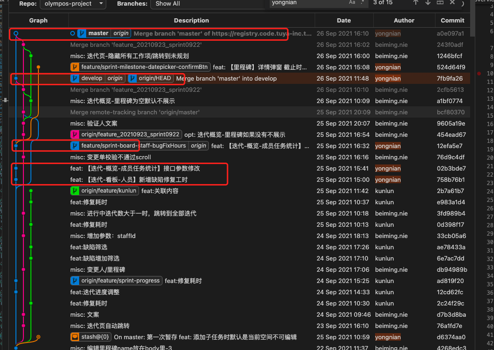

# 分支管理

- master 是线上稳定分支、develop 是开发分支
- 日常需求都是以 develop 为基准分支新建需求分支，==开发自测时（用需求分支部署 或 只将需求分支合并到 develop，develop 不合并到需求分支因为 develop 不干净有别人开发测试的东西，==）
  验收后可以上线了，两种做法：

  - （==最好这种==）切换到 master 分支，拉取远程最新代码、再回到需求分支在需求分支合并 master 代码`merge master`，有冲突解决冲突，然后再回到 master 分支，在 master 分支合并需求分支代码`merge feature/xxx`, 推送远程。
  - 切换到 develop 拉取远程最新代码，在 develop 分支合并需求分支代码`merge feature/xxx`, 有冲突则解决冲突，推送远程部署测试，注意在开发分支不要拉 dev 的代码，原因如上。

  - 参考链接
    - [git 分支管理方式对比](https://mp.weixin.qq.com/s/vqiN1pR6cKdkO_6smFIPew)

## git log 分支图

- 实例一：从下往上看
  - 【1】从 dev 切开发分支之前先从 master 拉取最新代码: git merge master
  - 【2】开发分支上提交两次
  - 【3】开发完毕合并到 dev，并在 dev 上新增一个 commit：版本号更新
  - 【4】dev 上 stash 暂存的代码也能从图上看（而且能看到暂存的文件及其改动）



- 实例二：从下往上看

  - 需求分支开发完毕合并到 dev 之后，拉取最新 master 代码到 dev，如下图 1-dev 分支的视角
  - 切换分支到 master，如下图 2-master 分支的视角
  - merge dev 到 master，如下图 3-master 分支的视角

  
  
  


# 开发

- `commit hook`钩子中规定的 commit 信息中的类型

```bash
type must be one of
[
  bug,
  feat,
  fix,
  docs,
  style,
  refactor, # 重构
  test,
  chore, # 杂活
  revert,
  merge,
  cid,
  del,
  pub
] [type-enum]
```

# ssh

- [git - Mac 生成 SSH key(示例代码)](https://www.136.la/shida/show-392932.html)

# .gitignore

## 规则

- 以斜杠 / 开头表示目录
- 以星号 \* 通配多个字符
- 以问号？通配单个字符
- 以方括号 [] 包含单个字符的匹配列表
- 以叹号！表示不忽略 (跟踪) 匹配到的文件或目录

## 在已忽略文件夹中不忽略指定文件/文件夹

**在已忽略文件夹中不忽略指定文件夹：**

```bash
/node_modules/*
!/node_modules/layer/

【注意】要忽略的文件夹一定要结尾 /* ，否则不忽略规则将无法生效
```

**在已忽略文件夹中不忽略指定文件：**

```bash
/node_modules/*
!/node_modules/layer/layer.js
```

**忽略所有 .a 结尾的文件：**

```bash
*.a
```

**忽略所有以 .o 或 .a 结尾的文件：**

```bash
*.[oa]
```

**忽略所有 .b 和 .B 结尾的文件，lib.b 除外：**

```bash
*.[bB]
!lib.b
```

**忽略 node_modules 文件和 node_modules 目录：**

```bash
node_modules
```

**只忽略 node_modules 目录，不忽略 node_modules 文件：**

```bash
node_modules/
```

**只忽略 node_modules 文件，不忽略 node_modules 目录：**

```bash
node_modules
!node_modules/
```

**忽略 doc/notes.txt 但不包括 doc/server/arch.txt：**

```bash
doc/*.txt
```

**仅忽略当前目录下的 TODO 文件，不包含 subdir/TODO：**

```bash
/TODO
```

## 参考

- [.gitignore 在已忽略文件夹中不忽略指定文件、文件夹...](https://learnku.com/articles/18380)

# 问题

- **Git: error Command "husky-run" not found**

  - 解决方法：重新安装一下 husky 依赖

- **OpenSSL SSL_connect: Connection was reset in connection to github.com:443**
  - 解決方法：[链接](https://blog.csdn.net/qq_37555071/article/details/114260533)
  - 若不行，关闭 vpn，再 push。
- **OpenSSL SSL_read: Connection was reset, errno 10054**
  - 解決方法：执行 git 命令脚本：修改设置，解除 ssl 验证。`git config --global http.sslVerify "false"`

## git clone 报错

若开 VPN 且用 git 桌面端 clone 仓库会很快，十几 M/s

- windows 上面 git 克隆 clone 的时候报错 warning:Clone succeeded,but checkout failed
  解决办法：根据提示的路径将包含了空格的目录重新修改，将空格删除了就可以了。

## git push 报错 429

**【报错如下】：**
在 vscode 终端中多次 `git push` 都不行，任然报错如下。

```bash
fatal: unable to access 'https://github.com/leoXuLei/markDown.git/':
The requested URL returned error: 429
```

**【解决方法】：**
`WPH`管理员打开，继续`git push`，多试几次就行。

# macbook

- [MAC 上 Git 安装与 GitHub 基本使用](https://www.jianshu.com/p/7edb6b838a2e)

# 其它

## 提交代码不走 precommit 校验

```powerShell
git commit -m '' --no-verify
# yarn run precommit // 这是手动运行precmomit
```

# 工具

- [vscode 代码管理菜单含义](https://segmentfault.com/q/1010000020782287)

# 参考链接

- [git 官网中文](https://git-scm.com/book/zh/v2)
- [git 工作流程](https://www.ruanyifeng.com/blog/2015/12/git-workflow.html)
