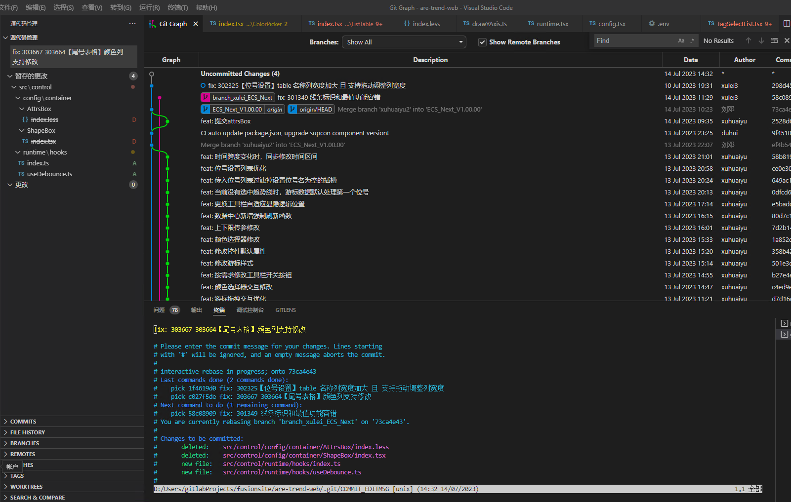
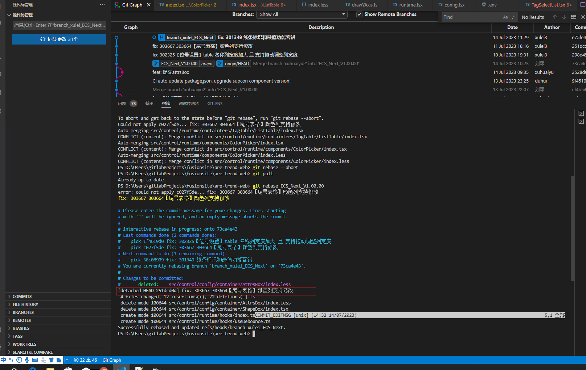
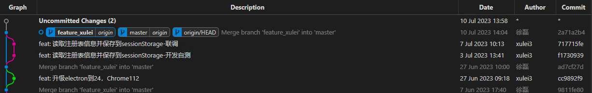

# git rebase 变基

```bash
git checkout bugFix
# git rebase 之前如果有 `unstaged changes` 需要comit or stash them。否则没法git rebase
git rebase master

# 如果有多个冲突，多次执行 git rebase --continue
git rebase --continue
# 恢复到执行 git rebase 前的状态
git rebase --abort


# 下面两步，正常是在gitlab提个MR，而不是在本地操作master（一般也操作不了）
git checkout master
git merge bugFix
```

## 一直使用`git merge`的开发分支改用`git rebase`后本地分支和远程分支在两条线上了

**【问题描述】**

由于自己的开发分支之前都是执行 `git merge`，所以改成用 `git rebase` 后，会出现本地的`branch_xulei`分支已经变基成功，但是远程的`branch_xulei`分支还在原本的分支线上，此时没法直接 push 到远程，必须要同步才行。此时本地的`branch_xulei`分支变基成功后确实是干净了，但是远程的`branch_xulei`分支之前的提交历史都在，此时如果同步，不就把历史都带过来了嘛，跟我用`git rebase`的初衷有违背。

**【解决方法】**

先删除远程的`branch_xulei`分支，然后直接推送本地的`branch_xulei`分支，同时会新建同名远程分支，此时`branch_xulei`分支完全就是干净的提交记录了。

**【操作记录】**

1. 下图是刚在`branch_xulei`分支，执行完`git rebase mster`后的`git Graph`图。
   

2. 然后发现不小心执行了`git pull`命令，拉取了远程的`origin/branch_xulei`分支，即目前的`branch_xulei`分支有了 rebase 前后两份需求的提交 commit（如下图中的`45cc6f0c`提交和`19bfe7c3`提交）。如下图。


3. 所以继续执行`git reset HEAD^ # 恢复成上次提交的版本`，回退刚刚的`git pull`操作。如下图。
   

4. 然后删除远程`origin/branch_xulei`分支，然后直接推送本地的`branch_xulei`分支，同时会新建同名远程分支。
5. 然后提个`MR`到主分支。`MR`合并后，拉取最新代码，此时`git Graph`图如下图。
   
6. 然后命令行输入`git merge 主分支`，`branch_xulei`分支即可跟主分支在同一个 commit 位置了，然后就可以开始下一次需求的开发提交了。

PS：处理后，后续每次需求完成后提交代码 rebase 应该都会正常了。

## `git rebase` 遇到冲突

1. 如下图，开发分支`branch_xulei`分支上有三次 commmit。
   
2. 如下图，执行`git rebase 主分支`命令后，根据`get Graph`图可以看到，`apply 第一个commit 1f4619d0`已经成功，然后提示在 `apply commit c027f5de` 时有三个文件冲突，三个冲突文件在`合并更改`Tab 下。
   

3. 解决完三个冲突文件的冲突后点击暂存后，如下图。


4. 当时没有注意到`更改`Tab 下有两个删除的文件，也直接点击暂存了，如下图。
   

5. 提交暂存文件时，没有提交成功，而是命令行出现下图界面，

   - `interactive rebase in process; onto 73ca4e43`：（正在进行交互式变基；到 73ca4e43 commit：即主分支）。
   - `Last commands done (2 commits done)`：最后完成的命令(完成 2 次提交)
   - `Next command to do (1 remaining command)`：下一个要执行的命令(剩下的 1 个命令)
   - `changes to be committed`：要提交的更改。 - 两个删除文件和两个新增文件。
     

6. 结束后，确实`rebase`成功了，但是发现 4 中提到的合并冲突中的两个被删除的文件，本来是不该删除的，所以执行命令`git rebase --abort (恢复到执行 git rebase 前的状态)`，从头开始重新`git rebase`，即保留那两个被删除的文件。

- 但是不知道咋操作成如下图了？



## `git merge` 和 `git rebase` 对比

如下图，可以发现：

- 红色提交线：如果`branch_xulei`分支一直采用`git merge`方式拉取合并基准分支的代码，
  - `Git Graph`图中会出现两条线并行的情况，`branch_xulei`分支是一条无限长的直线（一直有新需求开发的情况下），每次需求开发完成会发现，基准分支会合并到开发分支一次（本地执行`git merge master`），基准分支会合并到开发分支一次（gitlab 提 MR：Merge requests），即一次需求开发两条并行线之间有两条连接线，一条接入一条接出。
- 绿色提交线：如果`branch_xulei`分支一直采用`git rebase`方式拉取合并基准分支的代码，
  - `Git Graph`图中，基准分支是一条无限长的直线，而`branch_xulei`分支每做一次需求，有多少次 commit，`branch_xulei`分支的分叉线就有多长，然后会再合并到基准分支。


## `git rebase` 正确使用

- 从基准分支新建`feature_xulei`开发分支。
- 需求完成后，先`git pull`拉取最新基准分支代码，然后`git rebase`，有冲突解决冲突。
- 然后去 gitlab 提 MR，从`feature_xulei`开发分支到基准分支。此时本地最新`Git Graph`如下图一。
- a：此时在`Git Graph`基准分支上右键，有两个选项。

  - `Merge into current branch`，点击后有三个 checkbox 选项
    - [ ] `Create a new commit even if fast-forward is possible`。若勾选，**即使可以快速合并也会有个新的 commit**。不勾选如果没有额外的提交则会快速合并。**因此不建议勾选**。
    - [ ] `Squash Commits`
    - [ ] `No Commit`
  - `Rebase current branch on branch..`
    - Are you sure you want to rebase feature_xulei (the current branch) on branch master?

- b: 直接在命令行输入：`git merge master`，相当于快进合并（`fast-forward merge`）
- c: 直接在命令行输入：`git rebase master`，也相当于快进合并

  - `Successfully rebased and updated refs/heads/feature_xulei.`

- 总结：**a 不勾选`Create a new commit even if fast-forward is possible` 和 b 和 c 之后效果一样。提交记录是清晰的**，如下图。

- 然后再推送到远程，此时基准分支和开发分支在同一个 commit 节点。




### 解释

`Create a new commit even if fast-forward is possible`:

意思是即使可以使用快进（`fast-forward`）方式，也要创建一个新的提交。

在 Git 中，当你将分支合并到目标分支时，如果目标分支没有额外的提交，Git 可以简单地将目标分支指向被合并分支的提交，这个过程称为快进合并（`fast-forward merge`）。这种情况下，不会创建新的提交节点，只是移动了分支指针。

然而，如果设置了"Create a new commit even if fast-forward is possible"的选项，**即使可以使用快进合并，Git 也会强制创建一个新的提交。这样做可以保持合并历史的一致性，确保每次合并都生成一个新的提交节点，无论是否发生了快进合并**。

这个选项通常用于需要明确跟踪每次合并操作的情况，或者在工作流中需要保留合并历史的完整性时。

# 分支管理

- master 是线上稳定分支、develop 是开发分支
- 日常需求都是以 develop 为基准分支新建需求分支，==开发自测时（用需求分支部署 或 只将需求分支合并到 develop，develop 不合并到需求分支因为 develop 不干净有别人开发测试的东西，==）
  验收后可以上线了，两种做法：

  - （==最好这种==）切换到 master 分支，拉取远程最新代码、再回到需求分支在需求分支合并 master 代码`merge master`，有冲突解决冲突，然后再回到 master 分支，在 master 分支合并需求分支代码`merge feature/xxx`, 推送远程。
  - 切换到 develop 拉取远程最新代码，在 develop 分支合并需求分支代码`merge feature/xxx`, 有冲突则解决冲突，推送远程部署测试，注意在开发分支不要拉 dev 的代码，原因如上。

  - 参考链接
    - [git 分支管理方式对比](https://mp.weixin.qq.com/s/vqiN1pR6cKdkO_6smFIPew)

## git log 分支图

- 实例一：从下往上看
  - 【1】从 dev 切开发分支之前先从 master 拉取最新代码: git merge master
  - 【2】开发分支上提交两次
  - 【3】开发完毕合并到 dev，并在 dev 上新增一个 commit：版本号更新
  - 【4】dev 上 stash 暂存的代码也能从图上看（而且能看到暂存的文件及其改动）


- 实例二：从下往上看

  - 需求分支开发完毕合并到 dev 之后，拉取最新 master 代码到 dev，如下图 1-dev 分支的视角
  - 切换分支到 master，如下图 2-master 分支的视角
  - merge dev 到 master，如下图 3-master 分支的视角

  
  
  


# .gitignore

## 规则

- 以斜杠 / 开头表示目录
- 以星号 \* 通配多个字符
- 以问号？通配单个字符
- 以方括号 [] 包含单个字符的匹配列表
- 以叹号！表示不忽略 (跟踪) 匹配到的文件或目录

## 在已忽略文件夹中不忽略指定文件/文件夹

**在已忽略文件夹中不忽略指定文件夹：**

```bash
/node_modules/*
!/node_modules/layer/

【注意】要忽略的文件夹一定要结尾 /* ，否则不忽略规则将无法生效
```

**在已忽略文件夹中不忽略指定文件：**

```bash
/node_modules/*
!/node_modules/layer/layer.js
```

**忽略所有 .a 结尾的文件：**

```bash
*.a
```

**忽略所有以 .o 或 .a 结尾的文件：**

```bash
*.[oa]
```

**忽略所有 .b 和 .B 结尾的文件，lib.b 除外：**

```bash
*.[bB]
!lib.b
```

**忽略 node_modules 文件和 node_modules 目录：**

```bash
node_modules
```

**只忽略 node_modules 目录，不忽略 node_modules 文件：**

```bash
node_modules/
```

**只忽略 node_modules 文件，不忽略 node_modules 目录：**

```bash
node_modules
!node_modules/
```

**忽略 doc/notes.txt 但不包括 doc/server/arch.txt：**

```bash
doc/*.txt
```

**仅忽略当前目录下的 TODO 文件，不包含 subdir/TODO：**

```bash
/TODO
```

## 参考

- [.gitignore 在已忽略文件夹中不忽略指定文件、文件夹...](https://learnku.com/articles/18380)

# 问题

- **Git: error Command "husky-run" not found**

  - 解决方法：重新安装一下 husky 依赖

- **OpenSSL SSL_connect: Connection was reset in connection to github.com:443**
  - 解決方法：[链接](https://blog.csdn.net/qq_37555071/article/details/114260533)
  - 若不行，关闭 vpn，再 push。
- **OpenSSL SSL_read: Connection was reset, errno 10054**
  - 解決方法：执行 git 命令脚本：修改设置，解除 ssl 验证。`git config --global http.sslVerify "false"`

## git clone 报错

若开 VPN 且用 git 桌面端 clone 仓库会很快，十几 M/s

- windows 上面 git 克隆 clone 的时候报错 warning:Clone succeeded,but checkout failed
  解决办法：根据提示的路径将包含了空格的目录重新修改，将空格删除了就可以了。

## git push 报错 429

**【报错如下】：**
在 vscode 终端中多次 `git push` 都不行，任然报错如下。

```bash
fatal: unable to access 'https://github.com/leoXuLei/markDown.git/':
The requested URL returned error: 429
```

**【解决方法】：**
`WPH`管理员打开，继续`git push`，多试几次就行。

## 新 clone 的项目大量文件报 Warn`Delete CR`

**【问题描述】**

```bash
Delete `␍`eslint (prettier/prettier)
```

**【产生原因】**

`git config --system` 中有个默认配置`core.autocrlf: true`。

windows 电脑`git clone`代码的时候，autocrlf 选项默认为 true，克隆下来的文件每行会被自动转成以 CRLF 结尾，若对文件不做任何修改，commit 执行 eslint 的时候就会提示你删除 CR。

因此最根本的办法就是对 git 的 autocrlf 配置属性进行修改。在命令行中运行以下代码：

```bash
git config --global core.autocrlf false
```

现在 VScode，Notepad++编辑器都能够自动识别文件的换行符是 LF 还是 CRLF。 如果你用的是 windows，文件编码是 UTF-8 且包含中文，最好全局将 autocrlf 设置为 false。

**【解决方法】**

对 git 的 autocrlf 配置属性进行修改。

```bash
git config --global core.autocrlf false
```

然后`git config --global --list`查看，确认是否修改成功。

然后删除刚刚 clone 的项目，重新 clone，发现问题解决。

**【参考链接】**

- [Delete `␍`eslint(prettier/prettier) 错误的解决方案](https://juejin.cn/post/6844904069304156168#comment)
- [解决 Delete `␍`eslint(prettier/prettier)问题](https://juejin.cn/post/7094832364055969822)
- [解决 VSCode 报 Delete `␍`eslint(prettier/prettier)问题](https://juejin.cn/post/6979958982291292190#heading-5)

## `git rebase`时提示Permission denied

**【提示如下】**

```bash
git rebase Next_V1
error: unable to create file package.json: Permission denied
```

**【解决方法】**
- `git rebase --abort`撤销rebase
- 然后在`Windows PowerShell(管理员)`中重新rebase。提示成功
  - `Successfully rebased and updated refs/heads/branch_xulei_ECS_Next.`

# macbook

- [MAC 上 Git 安装与 GitHub 基本使用](https://www.jianshu.com/p/7edb6b838a2e)

- [git - Mac 生成 SSH key(示例代码)](https://www.136.la/shida/show-392932.html)

# 其它

## commit 提交信息格式

- `commit hook`钩子中规定的 commit 信息中的类型

```bash
type must be one of
[
  bug,
  feat,
  fix,
  docs,
  style,
  refactor, # 重构
  test,
  chore, # 杂活
  revert,
  merge,
  cid,
  del,
  pub
] [type-enum]
```

## 提交代码不走 precommit 校验

```powerShell
git commit -m '' --no-verify
# yarn run precommit // 这是手动运行precmomit
```

## 通过HTTP方式clone的项目如何改为SSH方式

clone with HTTP 方式如何修改为 clone with SSH


```bash
git remote set-url origin 远程仓库地址（SSH地址） # 也可以先删除origin后再添加
```

# 工具

- [vscode 代码管理菜单含义](https://segmentfault.com/q/1010000020782287)

# 参考链接

- [git 官网中文](https://git-scm.com/book/zh/v2)
- [git 工作流程](https://www.ruanyifeng.com/blog/2015/12/git-workflow.html)
