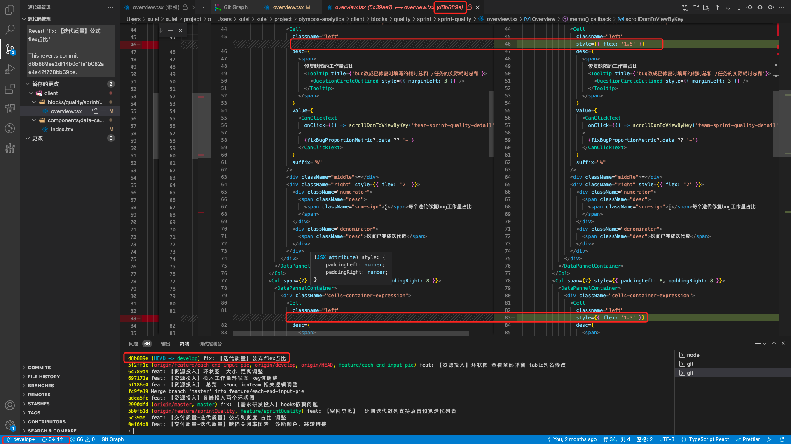
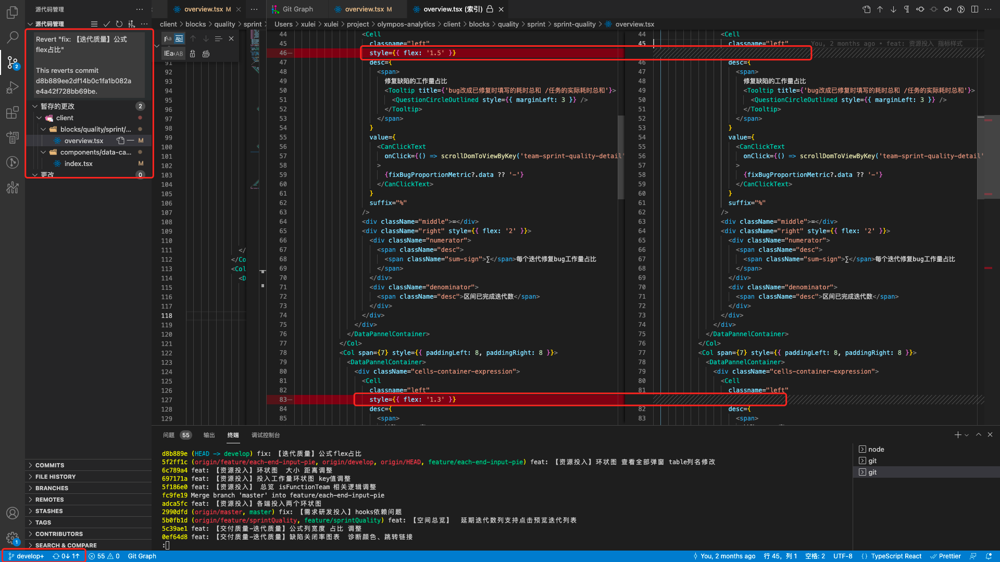
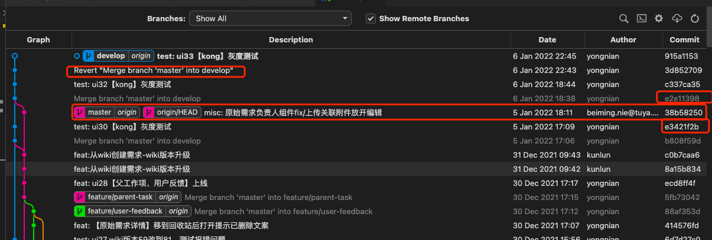

**概述**：

接触 Git 也些年头了，对于 Git 的使用也算是略有心得，想着出于自己日后回顾，也便于他人查阅学习的目的，遂有此文，相信看完此文你的 Git 使用会更进一步，谢谢~

PS：有些童鞋曾私信问我为什么有图形化的 Git 工具还要学命令行，原因挺多的，我觉得最主要的原因有三点：

>

- 1.减少跨平台使用 Git 成本，不用另外花时间去熟悉各种工具；
- 2.知道原理，出问题的时候不会一脸懵逼；
- 3.装逼，敲起来命令噼里啪啦，不知道还以为你真的是大神；

**在线版**（排版更佳，优先更新）：[https://www.zybuluo.com/coder-pig/note/581320](https://www.zybuluo.com/coder-pig/note/581320)

# 安装配置与文档

## 1.下载安装

- **Windows 系统**：到[Git For Windows](https://git-scm.com/download/win) 或[git-for-windows.github.io](https://git-for-windows.github.io/)下载，傻瓜式下一步。
- **Linux 系统**：到[Download for Linux and Unix](http://git-scm.com/download/linux) 下载，如果是 Ubuntu 的话，直接 Terminal 键入：
  **sudo apt-get install git** 安装。
- **Mac 系统**：到[Installing on Mac](http://git-scm.com/download/mac) 下载，不过新系统貌似默认已经带有 Git 了，另外如果安装了
  Homebrew 的话可以直接命令行键入： **brew install git** 进行安装。

## 2.文档教程相关

- **Pro Git(官方)**：[https://git-scm.com/book/zh/v2](https://git-scm.com/book/zh/v2)
- **Pro Git 中文版(oschina)**：[http://git.oschina.net/progit/index.html](http://git.oschina.net/progit/index.html)
- **廖雪峰的 Git 教程**：
  [http://www.liaoxuefeng.com/wiki/0013739516305929606dd18361248578c67b8067c8c017b000](http://www.liaoxuefeng.com/wiki/0013739516305929606dd18361248578c67b8067c8c017b000)
- **猴子都看得懂的 Git 入门**：[http://www.backlogtool.com/git-guide/cn/](http://www.backlogtool.com/git-guide/cn/)
- **Git Community Book 中文**版：[http://gitbook.liuhui998.com/index.html](http://gitbook.liuhui998.com/index.html)
- **沉浸式学 Git**：[http://igit.linuxtoy.org/contents.html](http://igit.linuxtoy.org/contents.html)
- **.gitignore 文件模板**：[https://github.com/github/gitignore](https://github.com/github/gitignore)
- **git log --pretty 输出格式定制**：[https://git-scm.com/book/en/v2/Git-Basics-Viewing-the-Commit-History](https://git-scm.com/book/en/v2/Git-Basics-Viewing-the-Commit-History)
- **Git Cheat Sheet: Useful Commands, Tips and Tricks**：
  [https://sentheon.com/blog/git-cheat-sheet.html](https://sentheon.com/blog/git-cheat-sheet.html)

# 【一：概念】

## 1.Git 的四个组成部分


## 2.文件的几个状态

**按大类划分**，分为两种状态： **Tracked**(已跟踪)和 **Untracked**(未跟踪)，依据是： **该文件是否已加入版本控制**？

流程简述：

> 假设某个项目已加入版本控制系统

- 1.新建一个文件，该文件处于 **Untracked** 状态；
- 2.通过 **git add**命令添加到缓存区，此时文件处于 **Tracked**状态又或者说
  此时这个文件已经被版本控制系统所跟踪，而且他处于 **Staged(暂存)**状态；
- 3.通过 **git commit**命令把暂存区的文件提交提交到本地仓库，此时文件
  处于 **Unmodified(未修改)**状态；
- 4.此时如果去编辑这个文件，文件又会变成 **Modified(修改)**状态；

## 3.Git 与 SVN 版本版本控制存储差异

Git 关心的是： **文件整体**是否发生变化，而 SVN 关心的是： **文件内容**的具体差异！
SVN 每次提交记录的是： **哪些文件进行了修改，以及修改了哪些行的哪些内容**


如图：版本 2 中记录的是文件 A 和 C 的变化，而版本 3 中记录文件 C 的变化，以此类推；
而 Git 中，并不保存这些前后变化的差异数据，而是保证整个缓存区中的所有文件，
又叫快照， **有变化的文件保存**， **没变化的文件不保存**， **而是**对上一次的保存的快照
做一个 **链接**！因为这种不同的保存方式，Git 切换分支的速度比 SVN 快很多！


## 4.每次 Commit 时仓库中的数据结构

分为四个对象：

**blob 对象**：存放文件数据；
**tree 对象**：目录，内容为 blob 对象的指针或其他 tree 对象的指针
**commit 对象**：快照，包含指向前一次提交对象的指针，commit 相关的信
通过索引找到文件快照。
**tag 对象**：一种特殊的 commit 对象，一般对某次重要的 commit 加 TAG，以示重要(方便找)


# 【二：本地操作命令】

## 1.【git config】相关配置

区分 **global** 和 **local**，前者代表 **全局设置**，就是设置了在整个系统中，所有的带 Git 版本管理的项目都是这样的配置；后者代表 **本地设置**即在某个项目中 **独立的设置**，后者优先级高于前者。比如全局设置的用户名是"Coder-pig"，本地设置的是"Jay"，commit 的时候 author 就是 Jay 而不是 Coder-pig。除了通过命令行修改，还可以直接修改
对应文件：

**全局配置文件：etc/gitconfig** (Mac 下是隐藏文件， **用户/.gitconfig**)
**本地配置文件：当前仓库/.git/config**

```bash
# 安装完Git后第一件要做的事，设置用户信息(global可换成local在单独项目生效)：
git config --global user.name "用户名" # 设置用户名
git config --global user.email "用户邮箱" # 设置邮箱
git config --global user.name # 查看用户名是否配置成功
git config --global user.email # 查看邮箱是否配置
# 其他查看配置相关
git config --global--list  # 查看全局设置相关参数列表
git config --local--list # 查看本地设置相关参数列表
git config --system --list # 查看系统配置参数列表
git config --list  # 查看所有Git的配置(全局+本地+系统)
```

## 2.【git help】获取帮助

```
git help 命令# 如：git help init
```

## 3.【git init】创建本地仓库

```
git init 仓库名# 创建一个新的带Git仓库的项目git init # 为已存在的项目生成一个Git仓库
```

## 4.【git add】添加文件到暂存区/文件跟踪标记

可以使用 **git add 文件名**，将工作空间的文件添加到暂存区，或批量添加文件

```bash
git add 文件名 # 将工作区的某个文件添加到暂存区
git add -u # 添加所有被tracked文件中被修改或删除的文件信息到暂存区，不处理untracked的文件
git add -A # 添加所有被tracked文件中被修改或删除的文件信息到暂存区，包括untracked的文件
git add . # 将当前工作区的所有文件都加入暂存区
git add -i # 进入交互界面模式，按需添加文件到缓存区
```

附：交互界面模式示例


上图流程：

> 1.先在 GitForTest 的文件夹里创建了两个文件 2.键入 git add -i，进入后，键入 4，选择添加 untracked 的文件 3.他给我们列出了 untracked 的文件，然后我们根据序号来添加文件 4.输入?会弹出相关提示，然后直接回车，结束选择！ 5.然后再次输入 git add -i，输入 4，可以看到已不存在 untacked 的文件了！

## 5.【.gitignore 文件配置】让 Git 不 Tracked 特定文件

将未 tracked 的文件添加到缓存区后，Git 就会开始跟踪这个文件了！对于一些比如： **自动生成的文件**， **日志**， **临时编译文件等**，就没必要进行跟踪了，这个时候可以编写 **.gitignore 文件**，在里面把不需要跟踪的文件或文件夹都写上，git 就不会对这些文件进行跟踪！
另外 **.gitignore 文件与.git 文件夹在同级目录下**！

如果不想自己写，可以直接到：[https://github.com/github/gitignore](https://github.com/github/gitignore) 复制粘贴！
也可以自行编写，支持简化了的正则表达式(规范与示例模板摘自：[Git 王者超神之路](http://www.jianshu.com/p/f4cd5f2d1a5f))

>

- **\*** ： 匹配零个或多个任意字符
- **[abc]**：只匹配括号内中的任意一个字符
- **[0-9]**：- 代表范围，匹配 0-9 之间的任何字符
- **?**：匹配任意一个字符
- **\*\***：匹配任意的中间目录，例如 a/\*\*/z 可以匹配:a/z,a/b/z,a/b/c/z 等

**示例模板**：

```bash
# 忽略所有以 .c结尾的文件
*.c

# 但是 stream.c 会被git追踪
!stream.c

# 只忽略当前文件夹下的TODO文件, 不包括其他文件夹下的TODO例如: subdir/TODO
/TODO

# 忽略所有在build文件夹下的文件
build/

# 忽略 doc/notes.txt, 但不包括多层下.txt例如: doc/server/arch.txt

doc/*.txt

# 忽略所有在doc目录下的.pdf文件
doc/**/*.pdf
```

！！！ **特别要注意一点**！！！：

配置.gitignore 只对那些 **没有添加到版本控制系统**的文件生效(**未 Tracked 的文件**)！

举个例子：

有 A，B 两个文件，你先把他两个 add 了，然后在.gitignore 文件中配置了不跟踪这两个文件，但是你会发现根本不会生效。

```bash
git add Agit add B# 配置不跟踪A和Bgit add .gitignore
```

所以，最好的做法就是在项目刚开始的时候，先添加.gitignore 文件。当然，即使是发生了，还是有解决方法的，可以键入下述命令清除标记状态，然后先添加.gitignore，再添加文件即可：

```bash
git rm -r --cached . # 清除版本控制标记，.代表所有文件，也可指定具体文件
```

还有，如果你用的是 IDEA 的编辑器的话，可以下一个 **.ignore**的插件，可以手动直接勾选不需要跟踪的文件。

## 6.【git commit】将暂存区内容提交到本地仓库

```bash
git commit -m "提交说明" # 将暂存区内容提交到本地仓库
git commit -a -m "提交说明" # 跳过缓存区操作，直接把工作区内容提交到本地仓库
```

如果不加 **-m "提交说明"**，git 会让用你让默认编辑器(如 vi)来编写提交说明，可能有些朋友用不惯 vi，要么别漏掉 **-m "提交说明"**，要么自己设置编译器：

```
git config --global core.edit 喜欢的编辑器
```

除此之外，有时可能需要修改上次提交的内容，比如修改提交说明，或者修改文件等：

```bash
# 合并暂存区和最近的一次commit，生成新的commit并替换掉老的
# 如果缓存区没内容，利用amend可以修改上次commit的提交说明
# 注：因为amend后生成的commit是一个全新的commit，旧的会被
# 删除，所以别在公共的commit上使用amend！切记！！！

git commit --amend
git commit --amend --no-edit # 沿用上次commit的提交说明
```

## 7.【git status】查看工作区与缓存区的状态

```bash
git status # 查看工作区与暂存区的当前情况
git status -s # 让结果以更简短的形式输出
```

## 8.【git diff】差异对比(内容变化)

```bash
git diff # 工作区与缓存区的差异
git diff 分支名 #工作区与某分支的差异，远程分支这样写：remotes/origin/分支名
git diff HEAD  # 工作区与HEAD指针指向的内容差异
git diff 提交id 文件路径 # 工作区某文件当前版本与历史版本的差异
git diff --stage # 工作区文件与上次提交的差异(1.6 版本前用 --cached)
git diff 版本TAG # 查看从某个版本后都改动内容git
diff 分支A 分支B # 比较从分支A和分支B的差异(也支持比较两个TAG)
git diff 分支A...分支B # 比较两分支在分开后各自的改动
# 另外：如果只想统计哪些文件被改动，多少行被改动，可以添加 --stat 参数
```

## 9.【git log】查看历史提交记录

```bash
git log # 查看所有commit记录(SHA-A校验和，作者名称，邮箱，提交时间，提交说明)
git log -p -次数 # 查看最近多少次的提交记录
git log --stat # 简略显示每次提交的内容更改
git log --name-only # 仅显示已修改的文件清单
git log --name-status # 显示新增，修改，删除的文件清单
git log --oneline # 让提交记录以精简的一行输出
git log –graph –all --online # 图形展示分支的合并历史
git log --author=作者 # 查询作者的提交记录(和grep同时使用要加一个--all--match参数)
git log --grep=过滤信息 # 列出提交信息中包含过滤信息的提交记录
git log -S查询内容 # 和--grep类似，S和查询内容间没有空格
git log fileName # 查看某文件的修改记录，找背锅专用
```

除此之外，还可以通过 **--pretty** 对提交信息进行定制，比如：


更多规则与定制如下(摘自：[Git 王者超神之路](http://www.jianshu.com/p/f4cd5f2d1a5f))，或参见：[Viewing the Commit History](https://git-scm.com/book/en/v2/Git-Basics-Viewing-the-Commit-History) ：

format 对应的 **常用占位符**：(注：作者是指最后一次修改文件的人，提交者是提交该文件的人)

| 占位符  | 说明                                        | 占位符  | 说明                           |
| ------- | ------------------------------------------- | ------- | ------------------------------ |
| **%H**  | 提交对象（commit）的完整哈希字串            | **%h**  | 提交对象的简短哈希字串         |
| **%T**  | 树对象（tree）的完整哈希字串                | **%t**  | 树对象的简短哈希字串           |
| **%P**  | 父对象（parent）的完整哈希字串              | **%p**  | 父对象的简短哈希字串           |
| **%an** | 作者（author）的名字                        | **%ae** | 作者的电子邮件地址             |
| **%ad** | 作者修订日期（可以用 --date= 选项定制格式） | **%ar** | 按多久以前的方式显示           |
| **%cn** | 提交者(committer)的名字                     | **%ce** | 提交者的电子邮件地址           |
| **%cd** | 提交日期                                    | **%cr** | 提交日期，按多久以前的方式显示 |
| **%s**  | 提交说明                                    |

一些其他操作：

| 选项                | 说明                                                                          |
| ------------------- | ----------------------------------------------------------------------------- |
| -**p**              | 按补丁格式显示每个更新之间的差异                                              |
| --**stat**          | 显示每次更新的文件修改统计信息(行数)                                          |
| --**shortstat**     | 只显示 --stat 中最后的行数修改添加移除统计                                    |
| --**name-only**     | 仅在提交信息后显示已修改的文件清单                                            |
| --**name-status**   | 显示新增、修改、删除的文件清单                                                |
| --**abbrev-commit** | 仅显示 SHA-1 的前几个字符，而非所有的 40 个字符                               |
| --**relative-date** | 使用较短的相对时间显示（比如，"2 weeks ago"）                                 |
| --**graph**         | 显示 ASCII 图形表示的分支合并历史                                             |
| --**pretty**        | 格式定制，可选选项有：oneline，short，full，Fullerton 和 format(后跟指定格式) |

还有一些限制 log 输出的选项

| 选项                      | 说明                               |
| ------------------------- | ---------------------------------- |
| **-(n)**                  | 仅显示最近的 n 条提交              |
| --**since** , --**after** | 仅显示指定时间之后的提交。         |
| --**until**, --**before** | 仅显示指定时间之前的提交。         |
| --**author**              | 仅显示指定作者相关的提交。         |
| --**committer**           | 仅显示指定提交者相关的提交。       |
| --**grep**                | 仅显示含指定关键字的提交           |
| -**S**                    | 仅显示添加或移除了某个关键字的提交 |

### `Git bash` 查询项目提交信息统计

以下皆为`vxbatch_recipeeditor`项目的查询信息。

**【查看项目中某个人的代码行数统计】**

```bash
git log --author="xulei3" --pretty=tformat: --numstat | awk '{ add +=$1; subs += $2; loc += $1 - $2 } END { printf "added lines: %s，removed lines: %s, total lines: %s\n", add, subs, loc }' -

# added lines: 72085，removed lines: 13644, total lines: 58441
```

**【查看项目中每个人的代码行数统计】**

```bash
git log --format="%aN" | sort -u | while read name; do echo -en "$name\t"; git log --author="$name" --pretty=tformat: --numstat | awk '{ add +=$1; subs += $2; loc += $1 - $2 } END { printf "added lines: %s，removed lines: %s, total lines: %s\n", add, subs, loc }' -; done
```

```bash
chenbao added lines: 456，removed lines: 251, total lines: 205
chenkang added lines: 1510，removed lines: 173, total lines: 1337
liyue   added lines: 60，removed lines: 18, total lines: 42
xulei3  added lines: 72085，removed lines: 13644, total lines: 58441
徐磊    added lines: 1，removed lines: 1, total lines: 0
陈保    added lines: ，removed lines: , total lines:
```

**【查看项目中每个人的提交总次数】**

```bash
git log --pretty='%aN' | sort | uniq -c | sort -k1 -n -r
```

```bash
479 xulei3
  25 徐磊
  12 chenkang
  7 陈保
  6 chenbao
  1 liyue
```

chagGpt 询问命令行每个命令含义如下。

```bash
`git log`: 显示该项目的提交日志。
`--pretty='%aN'`: 指定输出格式为每个提交的作者姓名。
`|`: 管道符，将前一个命令的输出作为后一个命令的输入。
`sort`: 对输入进行排序。
`uniq -c`: 统计每个不同的作者（即去重）在所有提交中出现的次数，并显示出每个作者对应的提交次数。
`sort -k1 -n -r`: 以第一列（即提交次数）为关键字进行逆序排序。
```

## 10.【git blame】查看某行代码是谁写的

```bash
git blame 文件名 # 查看某文件的每一行代码的作者，最新commit和提交时间
```


Tip：

> 如果你用的 IDEA 系列的编译器，右键行号，选择 Annotate 也可以实现同样的效果


## 11.【git config --global alias】设置 Git 命令别名

可以为常见的命令起个简单的别名，就不用每次都敲完整命令，比如可以设置：status 为 st，checkout 为 co ; commit 为 ci ; branch 为 br 等

```bash
git config --globalalias.st status
```


## 12.【git tag】为重要的 commit 打标签

对于某些提交，我们可以为它打上 Tag，表示这次提交很重要，比如为一些正式发布大版本的 commit，打上 TAG，当某个版本出问题了，通过 TAG 可以快速找到此次提交，拿到 SHA1 值，再去查找问题，比起一个个 commit 看，省事很多！

Git 标签分两种： **轻量标签** 和 **附加标签**，前者只是在提交上加个 Tag，指向提交的 Hash 值；而后者还会保存打标签者的信息，时间和附加信息；

```bash
git tag 标记内容 # 轻量标签
git tag -a 标记内容-m "附加信息" # 附加标签
```

如果想为之前的某次 commit 打 TAG 的话，可以先找出 SHA1 值，设置调下述命令：

```bash
git tag -a 标记内容版本id # 比如：git tag -a v1.1 bcfed96
```

默认情况，git push 不会把标签推送 TAG 到远程仓库，如果想推送到服务器，可以：

```bash
git push origin 标记内容# 推送某标签到# 删除所有本地仓库中不存在的TAG：git push origin --tags
```

另外，可以在新建分支的时候也加上 TAG

```bash
git checkout -b 分支名标记内容
```

还可以用 show 命令查看标签对应的信息

```bash
git show 标记内容
```

如果你想删除本地 Tag：

```bash
git tag -d 标记内容
```

如果是删除远程 Tag：

```bash
git push origin --delete tag 标记内容
```

## 13.Git 命令自动补全【输命令的时候按两次 tab 键】

# 【三：文件回复/版本回退】

## 1.【git checkout】文件恢复(未 commit)

如果在工作区直接删除被 Git Tracked 的文件，暂存区中还会存在该文件，此时键入：git status，会是这样：


Git 告诉你工作区的文件被删除了，你可以 **删掉暂存区里的文件**或 **恢复被删文件**

```bash
# 删除暂存区中的文件：
git rm 文件名
git commit -m "提交说明"

# 误删恢复文件
git checkout --文件名

# 另外注意：git checkout会抛弃当前工作区的更改!!!不可恢复！！！务必小心！！！
```

## 2.【git reset HEAD】文件恢复(已 add 未 commit)

如果更改后 add 到了暂存区，想恢复原状，下述指令可以让文件恢复原状：

```bash
git reset HEAD 文件名
git checkout 文件名
```

## 3.【git reset --hard】版本回退(已 commit)

文件已经 commit 了，想恢复成上次 commit 的版本或者上上次，【==即回到历史某次 commit： A 的状态，之后的 commit 都会删除，所以如果已经 push 到远程之后，本地分支是可以 reset 到 A 的，但是 git push -f 强推的时候会提示不能强推，因为很不安全设置了分支保护==】可以：

```bash
git reset HEAD^ # 恢复成上次提交的版本
git reset HEAD^^ # 恢复成上上次提交的版本，就是多个^，以此类推或用~次数
git reset --hard 版本号 # git log查看到的SHA1值，取前七位即可，根据版本号回退
```

reset 命令其实就是： **重置 HEAD 指针，让其指向另一个 commit**，而这个动作可能会对工作区与缓存区造成影响，举个例子

>

- **本来的分支线**：- A - B - C (HEAD, master)
- **git reset B 后**：- A - B (HEAD, master)
  解释：看不到 C 了，但是他还是存在的，可以通过 git reset C 版本号找回，前提是
  C 没有被 Git 当做垃圾处理掉(一般是 30 天)。

**reset 三个可选参数解析**：

>

- **--soft**：只是改变 HEAD 指针指向，缓存区和工作区不变；
- **--mixed**：修改 HEAD 指针指向，暂存区内容丢失，工作区不变；
- **--hard**：修改 HEAD 指针指向，暂存区内容丢失，工作区恢复以前状态；

## 4.【git reflog】查看输入指令记录

Git 会记住你输入的每个 Git 指令，比如上面的 git reset 切换成一个旧的 commit，然后 git log 后发现新提交的记录没了，想切换回新的那次 commit，可以先调 git reflog 获取新 commit 的 SHA1 码，然后 git reset 回去。

```bash
git reflog
```


**注意**：这个指令记录不会永久保存！Git 会定时清理用不到的对象！！！

## 5.【git revert】撤销某次提交

有时可能我们想撤销某次提交所做的更改，可以使用 **revert**命令

```bash
git revert HEAD # 撤销最近的一个提交
git revert 版本号 # 撤销某次commit
```

不是真的把提交给撤销了，而是生成一个新的提交来 **覆盖**旧的提交，被撤销的提交和新的 **提交记录都会保存**！！！不信你再调一次 revert HEAD 会发现被撤销的更改又变回来了，另外，每次 revert 后，都需要发起新的 commit！简单点说 **，撤销的只是文件变化，提交记录依旧是存在的**！


### **实战:**

`git revert` ==【==类似于`ctrl+v` 复制之后再按`ctrl+z`撤销刚刚的复制，回复到`ctrl+v`之前的状态==】

如下图，我将开发分支 merge 到 dev 之后，又有小改动，结果忘记从 dev 切换到开发分支，直接在 dev 上`改动、add、commit`了，就差推送到远程 dev 了。



所以使用用`git revert d8b889e`撤销刚刚的这次提交。然后如下图，==可以看到工作区的改动是刚刚提交的方向操作，即回复到了上次提交之前的状态==。ps:左侧的说明是`Revert "fix: 【迭代质量】公式flex占比" This reverts commit d8b889ee2df14b0c1fa1b082ae4a42f728bb69be.`


### reset 和 revert 的区别

revert 的语法和命令和 reset 一致。但是产生的实际效果会有不同。

经过前后对比可知，

- ==revert 执行之后会在原本的记录中新增一条提交记录。reset 会删除掉原本已有的提交记录，==
- ==在合并分支中，reset 会删除原本合并分支的记录。revert 则有不同，会保留原本合并分支的记录，并在其上新增一条提交记录，便于之后有需要仍然能够回溯到 revert 之前的状态==。
- 从需要提交到远程分支的角度来讲，
  - reset 能够“毁尸灭迹”，不让别人发现我们曾经错误的合并过分支（注：多人协作中，需要谨慎使用）；
  - revert 则会将合并分支和撤回记录一并显示在远程提交记录上。

### revert 的两种情况

**参考资料：**

- [Git 之 revert 的两种情况](https://segmentfault.com/a/1190000012897697)
- [git revert 详情使用](https://blog.csdn.net/zhuqiuhui/article/details/105424776)

#### revert 常规 commit

#### revert merge commit

#### 一次实战



```jsx
// dev分支本来是好的，但是从master上merge了一个提交之后： e2e11398，
// 再新增一个确定没有bug的commit，之后部署发现有问题，
// 所以确定是 merge commit：e2e11398 的问题，准备revert 这次commit的改动

// 1. git show e2e11398 // 查看merge commit的merge信息或者从图上看

// 信息如下：Merge: e3421f2 38b5825 （对应1 和 2）

// 2. git revert -m 1 e2e1139 // 即revert e2e1139这次commit，回到1: 代表 e3421f2即dev分支
```

## 6.【git show】查看某次提交修改内容

```bash
git show 提交id # 查看某次commit的修改内容
```

## 7.【git rev-parse】查看某个分支的版本号

```bash
git rev-parse 分支名 # 查看分支commit的版本号，可以写HEAD
```

## 8.【git fsck】找回丢失对象的最后一点希望

因为你的某次误操作导致 commit 丢失，如果 git reflog 都找不到，你
可以考虑使用 git fsck，找到丢失的对象的版本 id，然后恢复即可。

```bash
git fsck --lost-found
```


# 【四：本地分支】

## 1.分支概念

提交记录串成的时间线，默认初始创建的分支(时间线) —— **master 分支**，如果不切换到其他分支上，每次 commit 生成的快照都会串在这条分支上！
另外还有个 —— **HEAD 指针**，该指针指向 **正在工作的本地分支**，前面的版本回退其实修改的就是这个 **HEAD 指针的指向**！

比如：在 master 分支上执行四次 commit，分支的状态图如下


不难发现这样的规律：

>

- 每次 commit， **master**都会向前移动一步，指向最新的提交
- **HEAD 则指向正在工作的本地分支**，而 git reset 修改的就是 HEAD 指针的指向！

## 2.创建其他分支的原因

通过两个场景来体会创建其他分支的必要性

>

- **场景一**：
  项目一般都是一步步迭代升级的，有大版本和小版本的更新：大版本一般是改头换面的更新，比如 UI 大改，架构大改，版本是：v2.0.0 这样；小版本的更新一般是 UI 小改，Bug 修复优化等，版本是：v2.0.11 这样；只有一条 master 分支，意味着：你的分支线会非常非常的长，假如你已经发布到了第二个大版本，然后用户反馈第一个版本有很严重的 BUG，这时候想切回第一个版本改 BUG，然后改完 BUG 切回第二个大版本，想想也是够呛的。(PS：可能你说我可以对重要的 commit 打 tag，然后找到这个 tag 切回去，当然也行这里是想告诉你引入其他分支会给你带来的便利)
- **场景二**：
  只有一个 master 分支的话，假如某次提交冲突了，而这个冲突很难解决或者解决不了， 那么，那个整个开发就卡住在这里了，无法继续向后进行了！

## 3.一个最简单实用的分支管理策略

为了解决只有一个 master 分支引起的问题，可以引入分支管理，最简单的一种策略如下：

> 在 **master 分支**上开辟一个新的 **develop 分支**，然后我们根据功能或者业务，再在 develop
> 分支上另外 **开辟其他分支**，完成分支上的任务后，再将这个分支 **合并到 develop 分支**上！
> 然后这个功能分支的任务也到此结束，可以删掉，而当发布正式版后，再把 **develop 分支**
> 合并到 **master 分支**上，并打上 TAG。

**master 与 develop**分支都作为 **长期分支**，而其他创建的分支作为 **临时性分支**！简述各个分支的划分：

- **master 分支**：可直接用于产品发布的代码，就是正式版的代码
- **develop 分支**：日常开发用的分支，团队中的人都在这个分支上进行开发
- **临时性分支**：根据特定目的开辟的分支，包括 **功能(feature)分支**，或者 **预发布(release)分支**，又或者是 **修复 bug （fixbug）分支**，当完成目的后，把该分支合并到 develop 分支，
  然后删除 该分支，使得仓库中的常用分支始终只有： **master 和 develop 两个长期分支**！

## 4.【git branch】分支创建与切换

```bash
// 查看
git branch # 查看本地分支
git branch -a   			# 查看所有分支（本地为绿色，远程为红色）
git branch -r   			# 查看远程所有分支
git branch  -vv    		# 查看本地分支和远程分支对应关系

// 创建/切换
git branch 分支名 # 创建分支
git checkout name     # 切换到目标分支
git checkout –b name   # 创建+切换分支
git checkout -b 本地分支 origin/远程分支 # 会在本地新建分支，并自动切换到该分支
git checkout -t origin/master # 本地master分支删除后，去其它分支输入命令，新建一个master分支并与远程master建立联系
git checkout <SHA1> -b <branch name>  # 将历史提交的某个commit作为终点分离出一个新的分支
```

比如在 master 分支上创建 develop 分支，此时的分支状况如下：

 

```
git checkout 分支名# 切换分支git checkout -b 分支名# 创建分支同时切换到这个分支
```

切换到 develop 分支后，改点东西，再 commit，此时的分支状况如下：

 

git checkout master 切回 master 分支，打开之前修改的文件，发现内容并没有发生更改，因为刚刚的更改是在 develop 上提交的，而 master 上没有变化，此时的分支状况如下：


## 5.分支的合并【git merge】 VS 【git rebase】

Git 中，可以使用 **git merge** 和 **git rebase** 两个命令来进行分支的合并

**git merge 合并分支**

合并的方式分为两种： **快速合并** 和 **普通合并**，两者的区别在于：前者合并后看不出曾经做过合并，而后合并后的历史会有分支记录，如图：

**快速合并**： **普通合并** ：

**示例**：

**快速合并**，把 develop 分支合并到 master 分支上，来到 master 分支后，键入下述命令

```bash
git merge develop
```

 打开文件：

**普通合并**，切到 develop 分支下，修改 note_2.txt 的内容，再通过下述指令合并分支：
注： **--no-ff 参数表示禁用快速合并**！

```bash
git merge --no-ff -m "合并的信息(TAG)" develop
```

 分支线情况：

**git reabse 合并分支**

**rebase**(衍合或变基)，发现很多所谓的教程把这个东西写得太深奥了，其实并没有那么复杂，只是这种合并会使得树整洁，易于跟踪，举个简单的例子来对比下，有一个项目由两个人同时开发，当前远程仓库的提交记录是这样的：


然后 A 和 B 各自开了一个条分支来完成相应功能，接着他们在自己的分支上都做了多次的 commit，此时两人的分别分支线是这样的：

 

A 先合并，再到 B 合并，这里我们假设两人做的是完全不关联的模块，合并没有冲突

**merge 合并**


**rebase 合并**


用法：

```bash
git rebase 想合并到哪个分支的分支名
```

### **`git merge` 发现冲突如何取消 merge**

`git merge` 发现冲突如何取消 merge（恢复到执行 `git merge` 命令之前的状态）

- 使用`git merge --abort` 命令

**【参考链接】**

- [链接](https://blog.csdn.net/weixin_40984292/article/details/100024411)
- [思否链接](https://segmentfault.com/q/1010000000140446)

## 6.解决合并冲突

在我们合并分支的时候，有时会遇到 **合并冲突**，然后合并失败的问题，此时需要我们先解决冲突后才能进行合并，个人开发倒很少会遇到，多人开发的时候遇到 **合并冲突**则是家常便饭。

一个最简单的例子，A 和 B 在 develop 分支上开辟出两个分支来完成相关的功能，A 做完了，把自己的分支合并到 develop 分支，此时 develop 分支向前移动了几次 commit，接着 B 也完成了他的功能，想把自己分支合并到 develop 分支，如果改动的文件和和 A 改动的文件相同的话，此时就会合并失败，然后需要处理完冲突，才能够继续合并！简单模拟下这个例子，先试试 merge！

**merge 分支后处理冲突**


打开冲突文件，然后处理冲突部分，保留什么代码你自己决定，处理完后把
<<< 和 >>> 这些去掉：

 处理后：

然后 add，然后 commit 即可，合并结束：


此时的分支线：


接着试试

**rebase 分支后处理冲突**

重新来一遍，然后把 A 直接 merge 到 master，再切到 B，rebase master，此时出现合并冲突，这里有三个可选的操作：

```bash
git rebase --continue # 处理完冲突后，继续处理下一个补丁
git rebase --abort # 放弃所有的冲突处理，恢复rebase前的情况
git rebase --skip # 跳过当前的补丁，处理下一个补丁，不建议使用，补丁部分的commit会丢失！
```


好的，有三次补丁要处理，一个个来：


 处理后：

接着 git add 添加修改后的文件，git rebase --continue 继续处理补丁：


接着重复之前的过程：


 处理后：


第三个补丁是与 A 分支无关联的改动，所以没有冲突，所以也就直接合并了！如果合并中途出了什么差错可以 **git rebase --abort** 恢复 rebase 前的状况！

最后看下分支线会发现是一条直线，这也是用 rebase 合并分支的优点：


**附上栗子，可以自己试试**：[GitTest.7z](https://pan.baidu.com/s/1boSotAZ)

## 7.删除分支

对于合并完的分支，基本都没什么作用了，可以使用下述命令删除：

```bash
git branch -d 分支名 # 删除本地分支，分支上有未提交更改是不能删除的
git branch -D 分支名 # 强行删除本地分支，尽管这个分支上有未提交的更改

git push origin :分支名 # 删除远程分支
git push origin --delete 分支名 # 删除远程分支
```

## 8.恢复误删分支

两步，找出被删除分支的最新 commit 的版本号，然后恢复分支

```bash
git log --branches="被删除的分支名" # 找到被删分支最新的commitb版本号
git branch 分支名版本号(前七位即可) # 恢复被删分支
```

## 9.【git stash】切换分支时保存未提交的更改

没有在 git 版本控制中的文件，是不能被 git stash 存起来的可以用过 git status 查看改动文件，在执行 `git add xx` 加入 git 版本控制的文件中。 你想偷懒 也可以直接 `git add .` 将所有文件加入 git 控制文件中

```bash

// Git把stash内容存在某个地方了，但是需要恢复一下，有两个办法：
// 一是用git stash apply恢复，但是恢复后，stash内容并不删除，你需要用git stash drop来删除；
// 另一种方式是用git stash pop，恢复的同时把stash内容也删了：

git stash list    # 查看stash列表

git stash  [save “save message”]  # 保存当前的改动
# 保存当前的改动 。等以后恢复现场后继续工作  (执行存储时，添加备注，
# 方便查找，只有git stash 也要可以的，但查找时不方便识别)。

git stash show
# 显示做了哪些改动，默认show第一个存储,如果要显示其他存储，
# 后面加stash@{$num}，比如第二个 git stash show stash@{1}

git stash show -p
# 显示第一个存储的改动，如果想显示其他存存储，
# 命令：`git stash show  stash@{$num}  -p` ，比如第二个：`git stash show  stash@{1}  -p`

git stash apply    #恢复保存改动
# 应用某个存储,但不会把存储从存储列表中删除，默认使用第一个存储,即stash@{0}，
# 如果要使用其他个，git stash apply stash@{$num} ， 比如第二个：git stash apply stash@{1}

git stash pop      # 恢复保存改动并删除
# 命令恢复之前缓存的工作目录，将缓存堆栈中的对应stash删除，并将对应修改应用到当前的工作目录下，
# 默认为第一个stash,即stash@{0}，
# 如果要应用并删除其他stash，命令：git stash pop stash@{$num} ，
# 比如应用并删除第二个：git stash pop stash@{1}

（删除慎用）git stash drop stash@{$num}    # 丢弃stash@{$num}存储，从列表中删除这个存储
（删除慎用）git stash clear ： # 删除所有缓存的stash
```

**有时我们可能在某个分支上正编写着代码，然后有一些突发的情况，需要我们暂时切换到其他分支上，比如要紧急修复 bug，或者切换分支给同事 review 代码，此时如果直接切换分支是会提示切换失败的，因为这个分支上做的更改还没有提交，你可以直接 add 后 commit，然后再切换，不过我们习惯写完某个功能再提交**，我们想：

> **先暂存这个分支上的改动**，切去其他分支上搞完事，然后回来继续继，续在之前的改动上写代码。

那么可以使用：

```bash
git stash # 保存当前的改动
```

然后放心的切换分支，然后再切换回来，接着使用：

```bash
git stash apply #　恢复保存改动
```

另外有一点一定要注意！！！可以 **stash 多个改动**！！如果你切换到另一个分支又 stash 了，然后切换回来 stash apply 是恢复成另一个分支的 stash！！！

如果你这样 stash 了多次的话，我建议你先键入：

```bash
git stash list # 查看stash列表
```

找到自己想恢复的那个


比如我这里恢复的应该是 netword 上的 stash，而第一个 stash 是 devlop 上的直接 git stash apply 恢复的就是这个，然而恢复的应该是 network 的那个 stash：

```bash
git stash apply stash@{1}
```

就是这样，按自己需要恢复即可！

### **git stash pop 错了分支导致有冲突**

stash 是在开发分支暂存的，但是没有切到开发分支而是在 master 分支输入的`git stash pop`，然后有冲突，如何解决？如何撤销?

> 可以使用 git reset --hard ，即可撤销  git stash pop 操作，将当前分支状态恢复。
> 而该操作后，git stash 暂存区的记录也不会被删除，可通过 git stash show 查看。

## 10.分支重命名

```bash
git branch -m 老分支名新分支名 # 分支重命名
```

# 【五：远程仓库与远程分支】

## 1.远程仓库简述

用于代码托管，可以自己搭建远程仓库，或者选择专业的代码托管平台：自己搭建的好处有：可控，内网安全，可以做一些定制，比如集成编译，IM 等，当然，肯定是需要一些学习成本的，(PS：我厂就是自己搭的 Gitlab，自己配置还是比较麻烦的，简单点的可以试试 **Gogs**)

常见的代码托管平台(自己搜关键字去~)：

Github，Git@OSC，GitCafe，GitLab，coding.net，gitc，BitBucket，Geakit，Douban CODE

## 2.【git push】推送本地仓库到远程仓库

首先建立好与本地仓库同名的远程仓库，然后复制下远程仓库的地址，比如：


键入下述命令关联本地与远程仓库

```bash
git remote add origin 远程仓库地址
```

可以键入下述命令可查看远程仓库状况


接着把本地仓库推送到远程仓库，这里的 **-u 参数** 作为第一次提交使用，作用是把本地 master 分支和远程 master 分支关联起来(**设置默认远程主机**)，后续提交不需要这个参数！

```bash
git push -u origin master
```


另外，如果想修改远程仓库地址，可键入：

```bash
git remote set-url origin 远程仓库地址 # 也可以先删除origin后再添加

git remote rm origin     # 删除仓库关联
git remote add origin 远程仓库地址 # 添加仓库关联
```

或直接修改.git 文件夹中的 config 文件，直接替换圈住位置


还要说明一点， **origin** 并不是固定的东西，只是后面 **仓库地址**的一个 **别名**！！可以写成其他的东西，然后你也可以设置多个仓库关联，用不同的别名标志，比如：

```bash
git remote add github https://github.com/coder-pig/SimpleTea.git
git remote add osc git@git.oschina.net:coder-pig/SimpleTea.git
```

## 3.【git clone】克隆远程仓库

把项目推送到远程仓库后，其他开发者就可以把项目 clone 到本地

```bash
git clone 仓库地址 # 克隆项目到当前文件夹下
git clone 仓库地址 目录名 # 克隆项目到特定目录下
git clone -b 分支名 仓库地址 # 拉取项目指定分支代码到本地（默认是masterfenzhi ）
```

## 4.同步远程仓库更新【git fetch】VS 【git pull】

关于获取远程服务器更新的方式有两种，他们分别是 fetch 和 pull，尽管都可以获取远程服务器更新，但是两者却又是不一样的。

**git fetch**：

仅仅只是从远处服务器获取到最新版本到本地，假如你不去 **合并(merge)**的话，本地工作空间是不会发生变化的！比如：我们在 Github 上创建一个 README.md 文件，然后调 git fetch 去获取远程仓库的更新。


**git pull**：

一步到位，或者说： **pull = fetch + merge**，比如：同样修改 Github 上的 README.md 文件，然后 git pull 同步远程仓库的更新


区别显而易见，实际开发中，使用 git fetch 会更安全一些，毕竟 merge 的时候，我们可以查看更新的情况，再决定是否进行合并，当然看实际需要吧！

## 5.推送本地分支到远程仓库

按照前面所讲，在本地开辟分支来完成某些工作，本地提交了多次后，你想把分支推送到远程仓库，此时远程仓库并没有这个分支，你可以：

```bash
git push origin 分支名# 推送本地分支的内容到远程分支
```

## 6.查看远程分支

```bash
git branch -r # 查看所有分支
```

## 7.拉取远程分支到本地仓库

```bash
#（推荐使用 git checkout -b ）：原因：可以直接跳转到分支（一般都是同名，也可以不同名）
git checkout -b 本地分支 origin/远程分支 # 会在本地新建分支，并自动切换到该分支
git fetch origin 远程分支:本地分支 # 会在本地新建分支，但不会自动切换，还需checkout
git branch --set-upstream 本地分支远程分支 # 建立本地分支与远程分支的链接

git pull origin 远程分支名  # 拉取远程某分支到当前分支   （合并远程当前分支到远程某分支有冲突时）
```

## 8.删除远程分支

```bash
git push origin :分支名 # 删除远程分支
git push origin --delete 分支名 # 删除远程分支
```

## 9.重命名远程分支

先删除远程分支，然后重命名本地分支，接着再 Push 到远程仓库

## 10.为项目添加 SSH Key 免去提交输入账号密码的麻烦

不知道细心的你有没有发现，仓库地址除了 Https 外，还有一个 SSH，这里我们简单介绍下两者的区别， **第一点**：使用 Https url 可以任意克隆 Github 上的项目；而是用 SSH url 克隆的话，你必须是项目的拥有者或管理员，而且还要添加 SSH Key，否则会无法克隆。 **还有一点**是，Https 每次 push 都需要输入用户名和密码，而使用 SSH 则不需要输入用户名如果配置 SSH Key 时设置了密码，则需要输入密码，否则直接 git push 就可以了！

另外，SSH，Secure shell(安全外壳协议)，专为远程登陆会话与其他网络服务提供安全性的协议，而 SSH 传输的数据是可以经过压缩的，可以加快传输的速度，出于安全性与速度，我们优先考虑使用 SSH 协议，而 SSH 的安全验证规则又分为 **基于密码**和 **基于密钥**两种！我们这里用的是基于第二种的，即在本地创建一对密钥，**公钥(id_rsa.pub)**和 **私钥(id_rsa)**,然后把公钥的内容贴到 Github 账号的 ssh keys 中，这样就建立了本地和远程的认证关系，当我们再 push 到远程仓库，会将你本地的公共密钥与服务器的进行匹配，如果一致验证通过直接推送更新！

下面我们来建立 ssh key，首先来到电脑的根目录下，这里假定我们没创建过 SSH key：


执行完 ssh-keygen 那个指令后，后面依次要你输入文件名，直接回车会生成两个默认的秘钥文件，接着提示输入密码，直接回车，如果这里你输入密码了的话，那么 push 的时候你还是需要输入密码，接着又输多一次密码，同样回车，然后出现最下面的这串东西就说明 ssh key 已经创建成功了！

我们接着可以用编辑器打开 id_rsa.pub 文件或者键入:

```
clip <id_rsa.pub
```

复制文件内容，然后打开 Github，点击你的头像，选择： **Settings**，然后点击左侧 **SSH Keys**,然后 **New SSH Key**


然后 Github 会给你发来一个提示创建了一个新 ssh key 的邮件，无视就好，接下来我们可以键入： **ssh -T git@github.com**，然后如果你上面设置过密码则需要输入密码，否则直接输入 yes 然后一直按回车就好！，最后出现 Hi xxx 那句话就说明 ssh key 配置成功了！


PS：其他远程仓库配置方法与此类同，
内容参考自：[https://help.github.com/articles/generating-an-ssh-key/](http://static.zybuluo.com/coder-pig/get64rj0pj9n68icaogq9mzn/75062926.png)

## 附 1：Github 客户端

其实，安装好 Git 后，就一有一个 **GitGui**的东东了，就可以直接用有用户界面的 Git 来做版本管理的工作了，而 Github 客户端则是 Github 给我们提供的一个专门用来管理 Github 项目的一个工具已。比如，假如你装了 Github 客户端，在 Clone 项目的时候，你只需点击：


就能直接把项目 clone 下来，就是一些 Git 操作的图形化罢了，首先来到下面的链接下载 Github 客户端：[https://desktop.github.com/](http://static.zybuluo.com/coder-pig/mwp8d0uv9592n4qvdr95mgqh/image_1b3n9k2jt1npgkk11tmkp1o18vom.png)文件很小，后面点击运行文件后，他还要在线下载安装，100 多 m，然后傻瓜式安装，安装完成后，会自动打开 Github 客户端，然后使用你的 Github 账号登陆，接着他会默认为你创建 SSH Key 信息，接着的你自己摸索了！

这里另外补充一点，就是 **win 8.1 装 Github 客户端**的问题，昨晚安装的时候一直报这个错误：


直接， **win + x**，选择" **命令行提示符(管理员)**"，执行以下下面的这个指令：

```bash
%SYSTEMROOT%\SYSTEM32\REGSVR32.EXE %SYSTEMROOT%\SYSTEM32\WUAUENG.DLL
```

然后再点击 Github 的安装程序，等待安装完成即可，下载并不需梯子。

## 附 2：删除 Git 仓库

点击进入你的仓库，点击 Setting，拉到最后：


点击 Delete this repository


弹出的对话框中输入要删除的仓库名称，接着点击删除


### 删除本地 git 仓库

```bash
rm -rf .git
```

## 附 3：为开源项目贡献代码

你可以 Clone 别人的开源项目，在看别人代码的时候，你觉得作者有某些地方写得不好，写错，或者你有更好的想法，你在本地修改后，想把修改 push 推送到开源项目上，想法很好，但是你不是项目的拥有着和参与者，是无法推送更改的！！！这样是为了避免熊孩子，毕竟熊孩子无处不在，参与开源项目的方法有两种：

**第一种方法**：
是让作者把你加为写作者，添加协作者流程：点击仓库的 **Settings**--> **Collaborators**然后输入想添加的人的用户名或者邮箱，点击添加即可。

**第二种方法**：
点击 **Fork**按钮，把这个项目 **fork**到自己的账号下，然后 **Clone**到本地，然后做你想做的修改， **commit 提交**，然后 **push**到自己账号里的仓库，然后打开开源项目，点击，然后新建一个**pull request**，接着设置自己的仓库为 **源仓库**，设置 **源分支**，**目标仓库**与 **目标分支**，然后还有 pull request 的标题和描述信息，填写完毕后，确定，这个时候开源项目的作者就会收到一个 pullrequest 的请求，由他来进行审核，作者审查完代码觉得没问题的话，他可以点击一下 merge 按钮即可将这个 pull request 合并到自己的项目中，假如作者发现了你代码中还有些 bug，他可以通过 Pull Request 跟你说明，要修复了 xxBUG 才允许合并，那么你再修改下 BUG，提交，更改后的提交会进入 Pull Request，然后作者再审核这样！

PS:假如作者不关闭或者 merge 你的这个 Pull Request，你可以一直 commit 骚扰主项目...( ╯□╰ )

# Git 工作流

关于 Git 工作流，看到一篇图文并茂很好的文章，就不重复造轮子了，此处只是做下对应工作流的简述，详情见：[Git Workflows and Tutorials](https://github.com/oldratlee/translations/tree/master/git-workflows-and-tutorials)

## 1.集中式工作流

类似于 SVN，不过只有一条 master 分支，然后一群人就在这条分支上嗨，比如有小 A 和小 B：(冲突解决参照上面的套路)

>

- 1.项目管理者初始化仓库，然后推到远程仓库
- 2.其他人克隆远程仓库项目到本地
- 3.小 A 和小 B 完成各自的工作
- 4.小 A 先完成了，git push origin master 把代码推送到远程仓库
- 5.小 B 后完成了，此时推送代码到远程仓库，出现文件修改冲突
- 6.小 B 需要先解决冲突，git pull --rebase origin master，然后 rebase 慢慢玩
- 7.小 B 把冲突解决后，git push origin master 把代码推送到远程仓库

## 2.功能分支工作流

和集中式分部流相比只是分支再不是只有 master，而是根据功能开辟新的分支而已，示例：注：这里的仓库管理者是拥有仓库管理权限的人

>

- 1.小 A 要开发新功能，git branch -b new-feature 开辟新分支
- 2.小 A 在 new-feature 上新功能相关的编写，他可以这个分支推到远程仓库
- 3.功能完成后，发起请求 pull request(合并请求)，把 new-feature 合并到 master 分支
- 4.仓库管理员可以看到小 A 的更改，可以进行一些评注，让小 A 做某些更改，
  然后再发起 pull request，或者把 pull request 拉到本地自行修改。
- 5.仓库管理员觉得可以了，合并分支到 master 上，然后把 new-feature 分支删掉

## 3.Gitflow 工作流

其实就是功能分支工作流做了一些规范而已，大概流程参见上面 Git 分支里的：一个最简单实用的分支管理策略。

## 4.Forking 工作流

分布式工作流，每个开发者都拥有自己独立的仓库，和上面的附 3：为开源项目贡献代码套路类似，把项目 fork 到自己的远程仓库，完成相应更改，然后 pull request 到源仓库，源仓库管理者可以决定是否合并。

## 5.Pull Request 工作流

和 Forking 工作流类似， **Pull Requests**是 Bitbucket 上方便开发者之间协作的功能

# 查缺补漏

一些高级技巧，工具，插件安利

## 1.巨好用的 Git 图形化工具 SourceTree

命令行虽酷炫可装逼，但是有时用图形化工具还是能提高我们不少效率的，如题， **SourceTree**，官网下载地址：[https://www.sourcetreeapp.com/](https://www.sourcetreeapp.com/)

## 2.【git cherry-pick】把提交的 commit 从一个分支放到另一个分支

有时你可能需要把某个分支上的 commit 放到另一个分支上，这个时候可以使用 **cherry-pick**，比如有下面这样两个分支：

**master 分支**：A -> B -> C
**feature 分支**：a -> b

现在想把 feature 上的 b，放到 master 的 C 后，可以这样：

- **Step 1**：切换到 feature 分支上， **git log**拿到 b commit 的 **版本号**(SHA1)
- **Step 2**：切换到 master 分支，键入： `git cherry-pick 版本号`


出现上面这种情况的话说明出现冲突了，处理冲突后，git add 和 git commit 走一波即可。

# 其它

- [如何删除某次 commit](https://juejin.cn/post/6998320974185627655)

# 问题解决

**问题描述**：在 Github 上新建了一个仓库，里面带有一个 licence 文件，然后本地本地项目想推到这个远程仓库上，git remote 设置了远程仓库后，push 提示先 pull，pull 的时候就报这个错了，解决方法如下：

```bash
git pull origin master --allow-unrelated-histories
```

待续...(最近更新：2017.10.26)

编辑日志：

- 2017.5.3： 添加.gitignore 注意事项
- 2017.9.5： 排版与内容优化，勘误，新增查缺补漏
- 2017.10.26：新增问题解决模块
