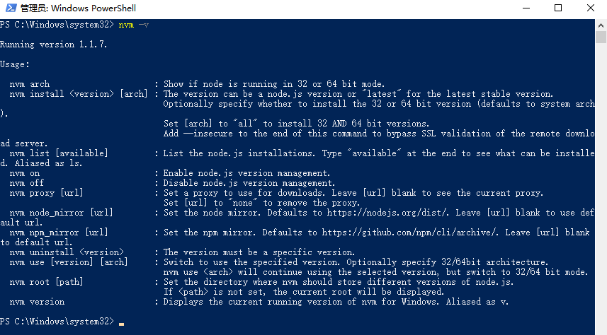
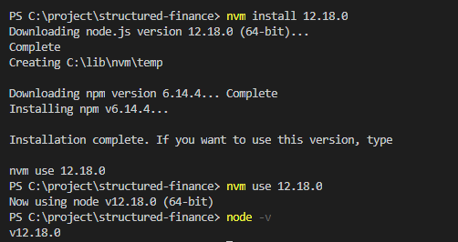
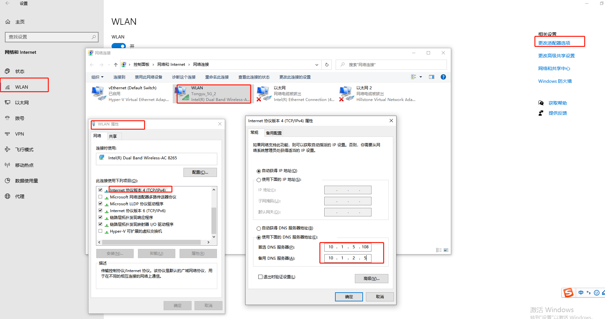
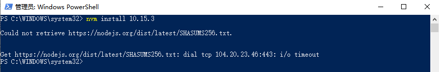
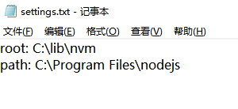
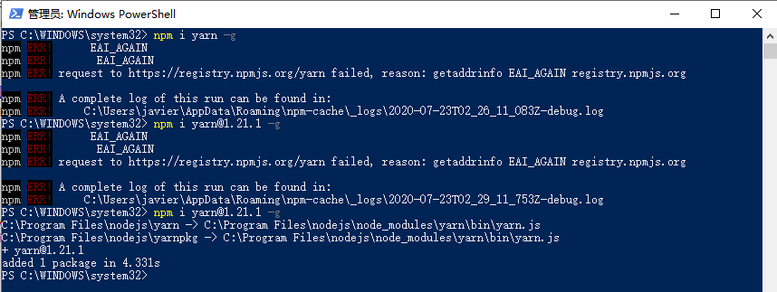
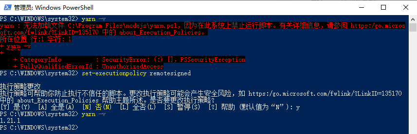
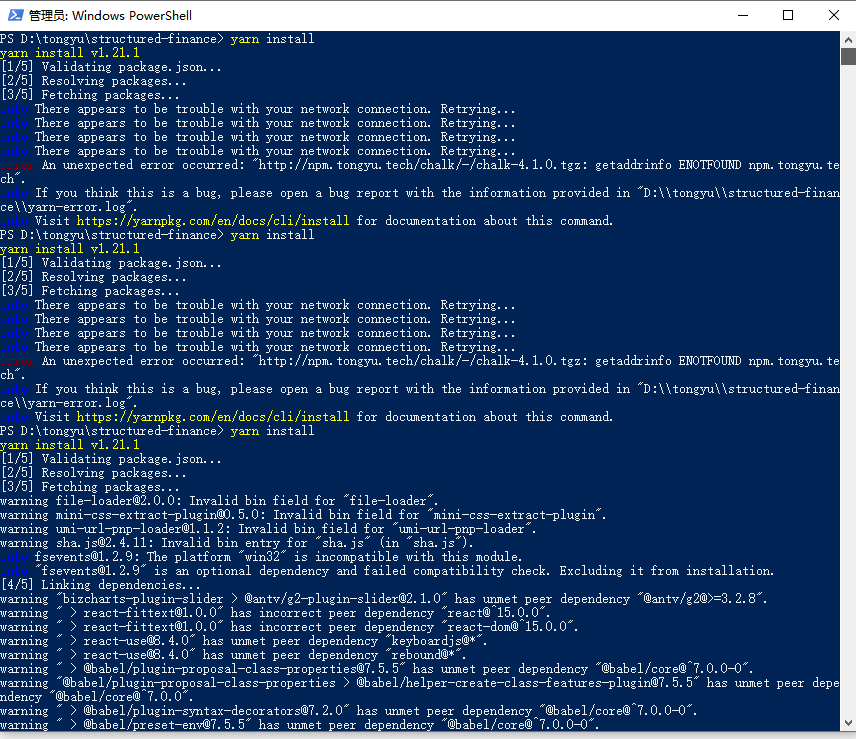

## @@@

- 新概念/框架/技术 先看官网，官网相当于是说明书

## 开发环境搭建

### 1. 使用 nvm 安装 node

### 2. 下载安装 Git

### 3. 下载安装 Vscode 以及常用插件

### 4. 安装 cnpm 替代 npm

你可以使用我们定制的 cnpm (gzip 压缩支持) 命令行工具代替默认的 npm:

```bash
npm install -g cnpm --registry=https://registry.npm.taobao.org
```

**问题：**

```bash
npm install antd -S
```

安装某个依赖后卡住不动，这种问题一般都是网络问题，建议换成淘宝的 NPM 镜像，设置方式为执行下面命令：

```bash
npm config set registry https://registry.npm.taobao.org
```

**参考：**

- [淘宝 NPM 镜像](http://npm.taobao.org/)

### 5.安装 yarn 替代 npm

**安装：**

```bash
npm/cnpm install yarn-g
npm/cnpm install yarn@1.16.0 -g  // 安装指定版本yarn
```

**参考：**

- [yarn 官网文档](https://yarn.bootcss.com/docs/usage/)

## nvm

**简介:** node 的版本管理工具 nvm

> 我们可能同时在进行多个个项目，而多个不同的项目所使用的 node 版本又是不一样的，或者是要用更新的 node 版本进行试验和学习。这种情况下，对于**维护多个版本的 node**将会是一件非常麻烦的事情，而 nvm 就是为解决这个问题而产生的，他可以**方便的在同一台设备上进行多个 node 版本之间切换**，而这个正是 nvm 的价值所在，详情可以查看官网 NVM 官网。

**安装:**

1. 下载 nvm
   如果已经单独安装了 node，建议卸载，然后继续向下看。直接进入[安装包下载地址](https://github.com/coreybutler/nvm-windows/releases)。选择 nvm-setup.zip，下载后直接安装。

2. 配置环境变量
   正常安装完毕，环境变量无需配置，可以进行查看，如果没有自动配置成功，需要手动进行配置。

3. 验证是否安装成功
   执行`nvm -v`，出现下图提示说明安装成功
   &emsp;&emsp; 

**使用:**

```js
nvm list/ls     // 本机中所有的node的版本列表
nvm install latest  // 安装最新版本
nvm install 4.8.4  // 安装指定版本node
nvm use 10.8.0  // 使用指定node版本
```



**参考:**

&emsp;&emsp;[nvm，nrm 介绍及使用](https://www.jianshu.com/p/ab63d08cced4)
&emsp;&emsp;[教你如何使用 nvm](https://www.jianshu.com/p/f8e175403dfb)


## windows Hosts
Hosts文件是一个用于存储计算机网络中节点信息的文件，它可以将主机名映射到相应的IP地址，实现DNS的功能，它可以由计算机的用户进行控制。


在Window系统中有个Hosts文件（没有后缀名），WIN7(C:\WINDOWS\system32\drivers\etc)。该文件其实是一个纯文本的文件，用普通的文本编辑软件如记事本等都能打开（但是==无法保存：解决方法==是复制到桌面，记事本打开修改后复制回来覆盖）。
用记事本打开hosts文件，首先看见了微软对这个文件的说明。这个文件是根据TCP/IPforWindows的标准来工作的，它的作用是包含IP地址和Host name(主机名)的映射关系，是一个映射IP地址和Hostname(主机名)的规定，规定要求每段只能包括一个映射关系，IP地址要放在每段的最前面，空格后再写上映射的Host name(主机名)。对于这段的映射说明用“#”分割后用文字说明。

```bash
# C:\WINDOWS\system32\drivers\etc\hosts
192.168.3.19 host.docker.internal
192.168.3.19 gateway.docker.internal

10.1.5.53 yhdr2.tongyu.tech
10.1.5.54 yhzq.tongyu.tech
10.1.5.27 shenwan.tongyu.tech
```
**工作方式:**

现在让我们来看看Hosts在Windows中是怎么工作的。
我们知道在网络上访问网站，**要首先通过DNS服务器把网络域名（www.XXXX.com）解析成XXX.XXX.XXX.XXX的IP地址后，我们的计算机才能访问**。要是对于每个域名请求我们都要等待域名服务器解析后返回IP信息，这样访问网络的效率就会降低，而Hosts文件就能提高解析效率。根据Windows系统规定，**在进行DNS请求以前，Windows系统会先检查自己的Hosts文件中是否有这个地址映射关系，如果有则调用这个IP地址映射，如果没有再向已知的DNS 服务器提出域名解析。也就是说Hosts的请求级别比DNS高**。

**作用:**

知道了Hosts文件的工作方式，那在具体使用中它有哪些作用呢?
- 1、加快域名解析
对于要经常访问的网站，我们可以通过在Hosts中配置域名和IP的映射关系，这样当我们输入域名计算机就能很快解析出IP，而不用请求网络上的DNS服务器。
- 2、方便局域网用户
在很多单位的局域网中，会有服务器提供给用户使用。但由于局域网中一般很少架设DNS服务器，访问这些服务要输入难记的IP地址，对不少人来说相当麻烦。现在可以分别给这些服务器取个容易记住的名字，然后在Hosts中建立IP映射，这样以后访问的时候我们输入这个服务器的名字就行了。
- 3、屏蔽网站
现在有很多网站不经过用户同意就将各种各样的插件安装到你的计算机中，有些说不定就是木马或病毒。对于这些网站我们可以利用Hosts把该网站的域名映射到错误的IP或自己计算机的IP，这样就不用访问了。我们在Hosts写上以下内容：
127.0.0.1#屏蔽的网站
0.0.0.0#屏蔽的网站
这样计算机解析域名就解析到本机或错误的IP，达到了屏蔽的目的。
- 4、顺利连接系统
对于Lotus的服务器和一些数据库服务器，在访问时如果直接输入IP地址那是不能访问的，只能输入服务器名才能访问。那么我们配置好Hosts文件，这样输入服务器名就能顺利连接了。

最后要指出的是，Hosts文件配置的映射是静态的，如果网络上的计算机更改了请及时更新IP地址，否则将不能访问。
**参考:**
- [HOST文件在WINDOWS下是什么作用](https://zhidao.baidu.com/question/5754099.html)
- [win10设置dns](https://baijiahao.baidu.com/s?id=1627990492539518092&wfr=spider&for=pc)

## DNS配置

## 问题

### 1. nvm install 失败

报错：`Could not retrieve https://nodejs.org/dist/latest/SHASUMS256.txt.`

&emsp;&emsp;

解决方法：

1. 在 nvm 安装目录(找不到可通过环境变量)下找到`settings.txt`，打开在最后添加下面内容：
   ```js
   node_mirror:npm.taobao.org/mirrors/node/
   npm_mirror:npm.taobao.org/mirrors/npm/yarnInstallError
   ```
   &emsp;&emsp;
   

参考资料：[使用 nvm-windows 安装 NodeJs 遇到的问题](https://blog.csdn.net/lisa2017_/article/details/107105016)

### 2. npm i yarn -g 失败

&emsp;&emsp;

解决方法：网络改成手机热点

> **mac上同样报错如下**

- 报错：`npm WARN checkPermissions Missing write access to /usr/local/lib/node_modules`
- 解决方法： 命令前加上`sudo`
### 3. 报错：无法加载文件 xxxx，因为在此系统上禁止运行脚本

报错：`无法加载文件 C:\Program Files\nodejs\npm.ps1，因为在此系统上禁止运行脚本。`

原因：现用执行策略是 Restricted（默认设置）
> 发现是在计算机上启动 Windows PowerShell 时，执行策略很可能是 Restricted（默认设置）。
>Restricted 执行策略不允许任何脚本运行。
>AllSigned 和 RemoteSigned 执行策略可防止 Windows PowerShell 运行没有数字签名的脚本。

>为什么要弄这么一个执行策略呢，**因为powershell能做的事情太多了，为了避免一些恶意脚本直接运行，一般家用的windows系统默认将执行策略设置成了“Restricted”，即受限制的**




解决方法： 

1. 以管理员身份运行PowerShell
2. 执行：get-ExecutionPolicy，回复Restricted，表示状态是禁止的
3. 执行：set-ExecutionPolicy RemoteSigned即可，更改执行策略
 
   注意：一定要以管理员的身份运行PowerShell，不是cmd窗口！

```bash
set-executionpolicy remotesigned # 输入y同意
```


**问题：** win

**参考：**
- [Powershell执行策略限制相关](https://www.cnblogs.com/luckyuns/p/12851317.html)
- [无法加载文件xxxx，因为在此系统上禁止运行脚本](https://blog.csdn.net/mehnr/article/details/104497019/)


### 4. yarn install 失败

报错：Fetching packages...`Three appears to be trouble with your network connection, Retrying...`
&emsp;&emsp;

解决方法：网络由手机热点改成网线/wifi


### 5. tyarn start 报错
```bash
tyarn start
   $ yarn run v1.22.4
   $ yarn check-env && yarn dev
   $ env-doctor check
   'env-doctor' 不是内部或外部命令，也不是可运行的程序
```

解决方法：先tyarn一下就好了

### 6. 后端本地联调时ping不通
可能是防火墙未关闭

## 公司
### 1. tyarn

[私有NPM仓库](http://confluence.tongyu.tech:8090/pages/viewpage.action?pageId=1168253)

[项目替换tyarn流程](http://confluence.tongyu.tech:8090/pages/viewpage.action?pageId=1168233)


**配置 tnpm 命令行别名：**

- Windows 环境
   - Git bash
      git bash 配置别名

      找到 Git 安装目录 D:\Program Files\Git\etc 找到 profile 文件，在该文件最后面添加一行

      tyarn 的别名配置请参考 tnpm，修改后的 shell rc 内容如下：
      ```bash
      #alias for tnpm
      alias tnpm="npm --registry=http://npm.tongyu.tech \
      --cache=$HOME/.npm/.cache/tnpm \
      --disturl=https://npm.taobao.org/mirrors/node \
      --userconfig=$HOME/.tnpmrc"

      #alias for tyarn
      alias tyarn="yarn --registry=http://npm.tongyu.tech \
      --cache-folder=$HOME/.yarn/.cache/tyarn \
      --use-yarnrc=$HOME/.tyarnrc"
      ```
      再次打开 Git Bash，测试 tnpm 和 tyarn 命令 tnpm -v tyarn-v，发现可以使用

   - Powershell
      ```bash
      Test-Path $profile // 检测是否存在powershell profile 配置文件
      New-Item -path $profile -itemtype file -Force // 上个命令输出为false就执行本命令，生成一个profile文件

      // 修改刚才产生的新文件,改文件可以直接在此电脑-文档-WindowsPowerShell中查看
      // 在空文件中添加以下代码
      function Start-npmWithAlias {
      npm --registry=http://npm.tongyu.tech --cache=$HOME/.npm/.cache/tnpm --disturl=https://npm.taobao.org/mirrors/node --userconfig=$HOME/.tnpmrc $args
      }

      function Start-yarnWithAlias {
      yarn --registry=http://npm.tongyu.tech --cache-folder=$HOME/.yarn/.cache/tyarn --use-yarnrc=$HOME/.tyarnrc $args
      }

      Set-Alias tnpm Start-npmWithAlias
      Set-Alias tyarn Start-yarnWithAlias

      // 保存改文件并重启powershell

      // 最后再次执行 tnpm -v 发现可以使用
      ```