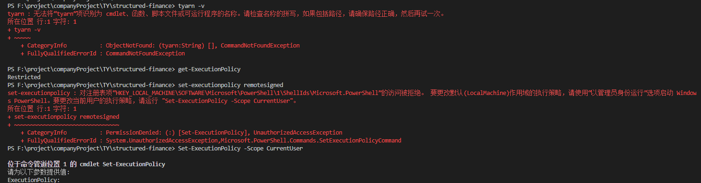

## @@@

- 新概念/框架/技术 先看官网，官网相当于是说明书

## 开发环境搭建

### 1. 使用 nvm 安装 node

### 2. 下载安装 Git

### 3. 下载安装 Vscode 以及常用插件

### 4. 安装 cnpm 替代 npm

你可以使用我们定制的 cnpm (gzip 压缩支持) 命令行工具代替默认的 npm:

```bash
npm install -g cnpm --registry=https://registry.npm.taobao.org
```

**问题：**

```bash
npm install antd -S
```

安装某个依赖后卡住不动，这种问题一般都是网络问题，建议换成淘宝的 NPM 镜像，设置方式为执行下面命令：

```bash
npm config set registry https://registry.npm.taobao.org
```

**参考：**

- [淘宝 NPM 镜像](http://npm.taobao.org/)

### 5.安装 yarn 替代 npm

**安装：**

```bash
npm/cnpm install yarn-g
npm/cnpm install yarn@1.16.0 -g  // 安装指定版本yarn
```

**参考：**

- [yarn 官网文档](https://yarn.bootcss.com/docs/usage/)

## Node

```bash
# 查看node安装路径
which node

# 显示版本，检查npm 是否正确安装。
npm -v

```

### nodejs 如何升级版本

**方法一：用 n 升级 nodejs** （测试了没成功）

```bash
# 全局安装n
$ npm install -g n

# 升级到最新稳定版
$ n stable

# 升级到最新版
$ n latest

# 升级到定制版
$ n v7.10.0

# 切换使用版本
$ n 7.10.0 (ENTER)

# 删除指定版本
$ n rm 7.10.0

# 用指定的版本执行脚本
$ n use 7.10.0 some.js
```

输入`n stable`报错，查询 n 的版本也是如下报错。

```bash
PS C:\Windows\system32> n -version

& : 无法将“bash.exe”项识别为 cmdlet、函数、脚本文件或可运行程序的名称。请检查名称的拼写，如果包括路径，请确保 路径正确
，然后再试一次。
所在位置 C:\Users\XL\AppData\Roaming\npm\n.ps1:15 字符: 5
+   & "bash$exe"  "$basedir/node_modules/n/bin/n" $args
+     ~~~~~~~~~~
    + CategoryInfo          : ObjectNotFound: (bash.exe:String) [], CommandNotFoundException
    + FullyQualifiedErrorId : CommandNotFoundException
```

```bash
PS C:\Windows\system32> Get-ExecutionPolicy -List

        Scope ExecutionPolicy
        ----- ---------------
MachinePolicy       Undefined
   UserPolicy       Undefined
      Process       Undefined
  CurrentUser       Undefined
 LocalMachine    RemoteSigned
```

```bash
PS C:\Windows\system32> Set-ExecutionPolicy RemoteSigned -Scope CurrentUser

执行策略更改
执行策略可帮助你防止执行不信任的脚本。更改执行策略可能会产生安全风险，如
https:/go.microsoft.com/fwlink/?LinkID=135170 中的 about_Execution_Policies 帮助主题所述。是否要更改执行策略?
[Y] 是(Y)  [A] 全是(A)  [N] 否(N)  [L] 全否(L)  [S] 暂停(S)  [?] 帮助 (默认值为“N”): Y
```

重启后再次查询如下。重新试之前的 n 相关命令还是一样报错没变化。

```bash
PS C:\Windows\system32> Get-ExecutionPolicy -List

        Scope ExecutionPolicy
        ----- ---------------
MachinePolicy       Undefined
   UserPolicy       Undefined
      Process       Undefined
  CurrentUser    RemoteSigned
 LocalMachine    RemoteSigned
```

> 参考链接

- [npm install -g n 运行错误](https://blog.csdn.net/qq_42709302/article/details/120188538)
- [无法将“XXX”项识别为 cmdlet、函数、脚本文件或可运行程序的名称。 对这个问题的解决方法](https://blog.csdn.net/sxeric/article/details/122403591)

**方法二：用 nvm 来管理 nodejs 版本**

```bash
# v14.15.3  2022/07/04之前都是这个版本，然后准备用nvm管理node版本

# 删除本机的node（应该看下`C:\Program Files\nodejs\node_modules`里面全局安装的依赖的）

# 下载的是nvm链接里面的`nvm-setup.exe`:4.63M

# 验证nvm是否安装成功
PS C:\Windows\system32> nvm -v

Running version 1.1.9.


# nvm安装node最新稳定版v16.15.1

PS C:\Windows\system32> nvm install 16.15.1
Downloading node.js version 16.15.1 (64-bit)...
Extracting...
Complete


Installation complete. If you want to use this version, type

nvm use 16.15.1

# nvm使用指定版本node
PS C:\Windows\system32> nvm use 16.15.1
Now using node v16.15.1 (64-bit)
PS C:\Windows\system32> node -v
v16.15.1

# npm 全局安装yarn
PS C:\Windows\system32> npm i yarn -g
PS C:\Windows\system32> yarn -v
1.22.19

# npm 全局安装clean-mark 也测试成功了
```

## nvm

**简介:** node 的版本管理工具 nvm

> 我们可能同时在进行多个个项目，而多个不同的项目所使用的 node 版本又是不一样的，或者是要用更新的 node 版本进行试验和学习。这种情况下，对于**维护多个版本的 node**将会是一件非常麻烦的事情，而 nvm 就是为解决这个问题而产生的，他可以**方便的在同一台设备上进行多个 node 版本之间切换**，而这个正是 nvm 的价值所在，详情可以查看官网 NVM 官网。

**安装:**

1. 下载 nvm
   如果已经单独安装了 node，建议卸载，然后继续向下看。直接进入[安装包下载地址](https://github.com/coreybutler/nvm-windows/releases)。选择 nvm-setup.zip，下载后直接安装。

2. 配置环境变量
   正常安装完毕，环境变量无需配置，可以进行查看，如果没有自动配置成功，需要手动进行配置。

3. 验证是否安装成功
   执行`nvm -v`，出现下图提示说明安装成功
   &emsp;&emsp; 

**使用:**

```js
nvm list/ls     // 本机中所有的node的版本列表
nvm install latest  // 安装最新版本
nvm install 4.8.4  // 安装指定版本node
nvm use 10.8.0  // 使用指定node版本
```


**参考:**

- [nvm，nrm 介绍及使用](https://www.jianshu.com/p/ab63d08cced4)
- [教你如何使用 nvm](https://www.jianshu.com/p/f8e175403dfb)

## NPM

### 设置 NPM 镜像源

```bash
Usage:
  npm config set <key> <value>
  npm config get [<key>]
  npm config delete <key>
  npm config list [--json]
  npm config edit
  npm set <key> <value>
  npm get [<key>]
```

```bash
npm config set registry http://xx.xx.xx.xx:8888/repository/npm-group

/npm i -g yarn// 以上是安装yarn

yarn config set registry http://xx.xx.xx.xx:8888/repository/npm-group
```

## windows Hosts

Hosts 文件是一个用于存储计算机网络中节点信息的文件，它可以将主机名映射到相应的 IP 地址，实现 DNS 的功能，它可以由计算机的用户进行控制。

在 Window 系统中有个 Hosts 文件（没有后缀名），WIN7(C:\WINDOWS\system32\drivers\etc)。该文件其实是一个纯文本的文件，用普通的文本编辑软件如记事本等都能打开（但是==无法保存：解决方法==是复制到桌面，记事本打开修改后复制回来覆盖）。
用记事本打开 hosts 文件，首先看见了微软对这个文件的说明。这个文件是根据 TCP/IPforWindows 的标准来工作的，它的作用是包含 IP 地址和 Host name(主机名)的映射关系，是一个映射 IP 地址和 Hostname(主机名)的规定，规定要求每段只能包括一个映射关系，IP 地址要放在每段的最前面，空格后再写上映射的 Host name(主机名)。对于这段的映射说明用“#”分割后用文字说明。

```bash
# C:\WINDOWS\system32\drivers\etc\hosts
192.168.3.19 host.docker.internal
192.168.3.19 gateway.docker.internal

10.1.5.53 yhdr2.tongyu.tech
10.1.5.54 yhzq.tongyu.tech
10.1.5.27 shenwan.tongyu.tech
```

**工作方式:**

现在让我们来看看 Hosts 在 Windows 中是怎么工作的。
我们知道在网络上访问网站，**要首先通过 DNS 服务器把网络域名（www.XXXX.com）解析成XXX.XXX.XXX.XXX的IP地址后，我们的计算机才能访问**。要是对于每个域名请求我们都要等待域名服务器解析后返回 IP 信息，这样访问网络的效率就会降低，而 Hosts 文件就能提高解析效率。根据 Windows 系统规定，**在进行 DNS 请求以前，Windows 系统会先检查自己的 Hosts 文件中是否有这个地址映射关系，如果有则调用这个 IP 地址映射，如果没有再向已知的 DNS 服务器提出域名解析。也就是说 Hosts 的请求级别比 DNS 高**。

**作用:**

知道了 Hosts 文件的工作方式，那在具体使用中它有哪些作用呢?

- 1、加快域名解析
  对于要经常访问的网站，我们可以通过在 Hosts 中配置域名和 IP 的映射关系，这样当我们输入域名计算机就能很快解析出 IP，而不用请求网络上的 DNS 服务器。
- 2、方便局域网用户
  在很多单位的局域网中，会有服务器提供给用户使用。但由于局域网中一般很少架设 DNS 服务器，访问这些服务要输入难记的 IP 地址，对不少人来说相当麻烦。现在可以分别给这些服务器取个容易记住的名字，然后在 Hosts 中建立 IP 映射，这样以后访问的时候我们输入这个服务器的名字就行了。
- 3、屏蔽网站
  现在有很多网站不经过用户同意就将各种各样的插件安装到你的计算机中，有些说不定就是木马或病毒。对于这些网站我们可以利用 Hosts 把该网站的域名映射到错误的 IP 或自己计算机的 IP，这样就不用访问了。我们在 Hosts 写上以下内容：
  127.0.0.1#屏蔽的网站
  0.0.0.0#屏蔽的网站
  这样计算机解析域名就解析到本机或错误的 IP，达到了屏蔽的目的。
- 4、顺利连接系统
  对于 Lotus 的服务器和一些数据库服务器，在访问时如果直接输入 IP 地址那是不能访问的，只能输入服务器名才能访问。那么我们配置好 Hosts 文件，这样输入服务器名就能顺利连接了。

最后要指出的是，Hosts 文件配置的映射是静态的，如果网络上的计算机更改了请及时更新 IP 地址，否则将不能访问。
**参考:**

- [HOST 文件在 WINDOWS 下是什么作用](https://zhidao.baidu.com/question/5754099.html)
- [win10 设置 dns](https://baijiahao.baidu.com/s?id=1627990492539518092&wfr=spider&for=pc)

## DNS 配置


## 问题

### 1. nvm install 失败

报错：`Could not retrieve https://nodejs.org/dist/latest/SHASUMS256.txt.`

&emsp;&emsp;

解决方法：

1. 在 nvm 安装目录(找不到可通过环境变量)下找到`settings.txt`，打开在最后添加下面内容：
   ```js
   node_mirror:npm.taobao.org/mirrors/node/
   npm_mirror:npm.taobao.org/mirrors/npm/yarnInstallError
   ```
   &emsp;&emsp;
   

参考资料：[使用 nvm-windows 安装 NodeJs 遇到的问题](https://blog.csdn.net/lisa2017_/article/details/107105016)

### 2. npm i yarn -g 失败

&emsp;&emsp;

解决方法：网络改成手机热点

> **mac 上同样报错如下**

- 报错：`npm WARN checkPermissions Missing write access to /usr/local/lib/node_modules`
- 解决方法： 命令前加上`sudo`

### 3. 报错：无法加载文件 xxxx，因为在此系统上禁止运行脚本

报错：`无法加载文件 C:\Program Files\nodejs\npm.ps1，因为在此系统上禁止运行脚本。`

原因：现用执行策略是 Restricted（默认设置）

> 发现是在计算机上启动 Windows PowerShell 时，执行策略很可能是 Restricted（默认设置）。
> Restricted 执行策略不允许任何脚本运行。
> AllSigned 和 RemoteSigned 执行策略可防止 Windows PowerShell 运行没有数字签名的脚本。

> 为什么要弄这么一个执行策略呢，**因为 powershell 能做的事情太多了，为了避免一些恶意脚本直接运行，一般家用的 windows 系统默认将执行策略设置成了“Restricted”，即受限制的**




解决方法：

1. 以管理员身份运行 PowerShell
2. 执行：get-ExecutionPolicy，回复 Restricted，表示状态是禁止的
3. 执行：set-ExecutionPolicy RemoteSigned 即可，更改执行策略

   注意：一定要以管理员的身份运行 PowerShell，不是 cmd 窗口！

```bash
set-executionpolicy remotesigned # 输入y同意
```

**问题：** win

**参考：**

- [Powershell 执行策略限制相关](https://www.cnblogs.com/luckyuns/p/12851317.html)
- [无法加载文件 xxxx，因为在此系统上禁止运行脚本](https://blog.csdn.net/mehnr/article/details/104497019/)

### 4. yarn install 失败

报错：Fetching packages...`Three appears to be trouble with your network connection, Retrying...`
&emsp;&emsp;

解决方法：网络由手机热点改成网线/wifi

### 5. tyarn start 报错

```bash
tyarn start
   $ yarn run v1.22.4
   $ yarn check-env && yarn dev
   $ env-doctor check
   'env-doctor' 不是内部或外部命令，也不是可运行的程序
```

解决方法：先 tyarn 一下就好了

### 6. 后端本地联调时 ping 不通

可能是防火墙未关闭

## 公司

### 1. tyarn

[私有 NPM 仓库](http://confluence.tongyu.tech:8090/pages/viewpage.action?pageId=1168253)

[项目替换 tyarn 流程](http://confluence.tongyu.tech:8090/pages/viewpage.action?pageId=1168233)

**配置 tnpm 命令行别名：**

- Windows 环境

  - Git bash
    git bash 配置别名

    找到 Git 安装目录 D:\Program Files\Git\etc 找到 profile 文件，在该文件最后面添加一行

    tyarn 的别名配置请参考 tnpm，修改后的 shell rc 内容如下：

    ```bash
    #alias for tnpm
    alias tnpm="npm --registry=http://npm.tongyu.tech \
    --cache=$HOME/.npm/.cache/tnpm \
    --disturl=https://npm.taobao.org/mirrors/node \
    --userconfig=$HOME/.tnpmrc"

    #alias for tyarn
    alias tyarn="yarn --registry=http://npm.tongyu.tech \
    --cache-folder=$HOME/.yarn/.cache/tyarn \
    --use-yarnrc=$HOME/.tyarnrc"
    ```

    再次打开 Git Bash，测试 tnpm 和 tyarn 命令 tnpm -v tyarn-v，发现可以使用

  - Powershell

    ```bash
    Test-Path $profile // 检测是否存在powershell profile 配置文件
    New-Item -path $profile -itemtype file -Force // 上个命令输出为false就执行本命令，生成一个profile文件

    // 修改刚才产生的新文件,改文件可以直接在此电脑-文档-WindowsPowerShell中查看
    // 在空文件中添加以下代码
    function Start-npmWithAlias {
    npm --registry=http://npm.tongyu.tech --cache=$HOME/.npm/.cache/tnpm --disturl=https://npm.taobao.org/mirrors/node --userconfig=$HOME/.tnpmrc $args
    }

    function Start-yarnWithAlias {
    yarn --registry=http://npm.tongyu.tech --cache-folder=$HOME/.yarn/.cache/tyarn --use-yarnrc=$HOME/.tyarnrc $args
    }

    Set-Alias tnpm Start-npmWithAlias
    Set-Alias tyarn Start-yarnWithAlias

    // 保存改文件并重启powershell

    // 最后再次执行 tnpm -v 发现可以使用
    ```
