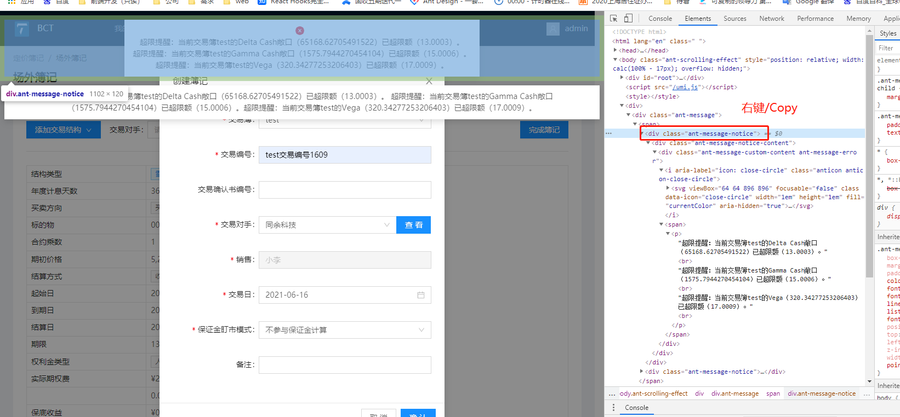
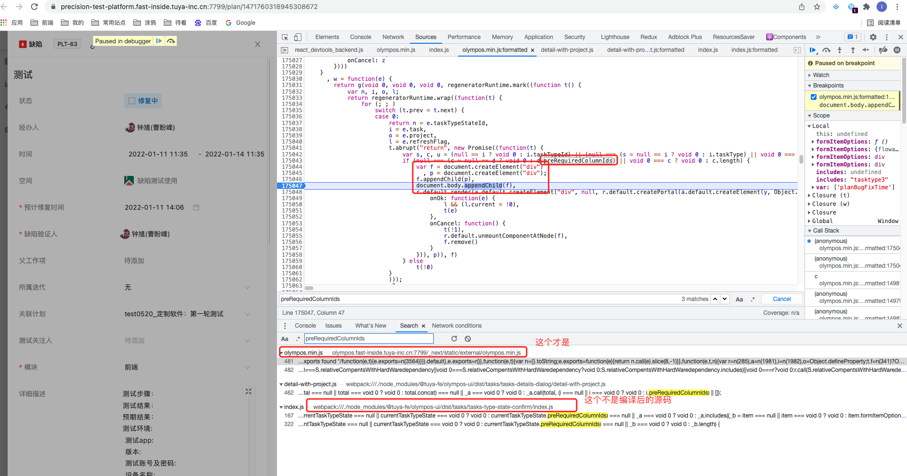

# chrome 浏览器

## Elements Dom 树

某些事件触发显示的 DOM 元素不好让其暂停显示查看 DOM 结构及样式，如 antd 的`message.info` 显示提示。

解决方案：找到其 DOM 节点，触发的瞬间快速的右键/copy/copy element。再编辑节点复制一下即可。效果如下。



## 全局搜索

开发者工具-菜单-search

如下为项目内的源代码，在控制台全局搜索找到如下图。

```jsx
export const confirm = async (options: IOptions) => {
  // taskTypeId = 'tasktype3'
  // taskTypeStateId = 'state3'
  const { taskTypeStateId, task, project, refreshFlag } = options;
  return new Promise((resolve) => {
    const taskTypeId = task?.taskTypeId || task?.taskType?.id;
    const currentTaskTypeState = getCurrentTaskTypeState(
      taskTypeId,
      taskTypeStateId,
      project?.taskTypes
    );
    // 如 currentTaskTypeState 变量是自己定义的，所以编译之后会变成诸如a/b/m这种的变量，但是 下面的 currentTaskTypeState?.preRequiredColumnIds 中的 preRequiredColumnIds不会被编译，直接在Search中搜索就能发现浏览器中编译之后的代码，然后可以
    if (currentTaskTypeState?.preRequiredColumnIds?.length) {
      const nodeWrapper = document.createElement("div");
      const nodeInner = document.createElement("div");
      nodeWrapper.appendChild(nodeInner);
      document.body.appendChild(nodeWrapper);
      ReactDOM.render(
        <div>
          {ReactDOM.createPortal(
            <TasksTypeStateConfirm
              {...options}
              onOk={(values) => {
                refreshFlag && (refreshFlag.current = true);
                resolve(values);
              }}
              onCancel={() => {
                resolve(false);
                ReactDOM.unmountComponentAtNode(nodeWrapper);
                nodeWrapper.remove();
              }}
            />,
            nodeInner
          )}
        </div>,
        nodeWrapper
      );
    } else {
      resolve(true);
    }
  });
};

export default confirm;
```

这里就可以打断点了，就能知道走了哪些逻辑。判断出 bug 原因。

