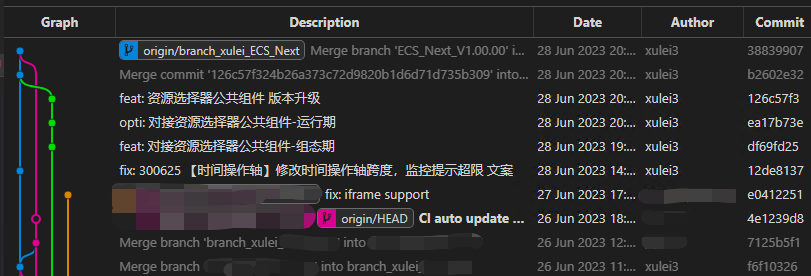

# 主命令框

- `F1` 或 `Ctrl+Shift+P`： 打开命令面板。在打开的输入框内，可以输入任何命令
  - 按一下 `Backspace` 会进入到 `Ctrl+P` 模式
  - 在 `Ctrl+P` 下输入 `>` 可以进入 `Ctrl+Shift+P` 模式
- 在 `Ctrl+P` 窗口下还可以:
  - 直接输入文件名，跳转到文件
  - `?`： 列出当前可执行的动作
  - `!`： 显示 Errors 或 Warnings，也可以 `Ctrl+Shift+M`
  - `:`： 跳转到行数，也可以 `Ctrl+G` 直接进入
  - `@`： 跳转到 symbol（搜索变量或者函数），也可以 `Ctrl+Shift+O` 直接进入
  - `@`： 根据分类跳转 symbol，查找属性或函数，也可以 `Ctrl+Shift+O` 后输入`:`进入
  - 根据名字查找 symbol，也可以 `Ctrl+T`

# 颜色主题设置

- `ctrl+k` + `ctrl+T`： 选择颜色主题
  - 手动设置：`文件/首选项/颜色主题`
  - 可选项
    - 深色+（默认深色）
    - `Dark + （default dark）`
    - `Monokai`
- 状态栏颜色设置：搜索`workbench.colorCustomizations`

```json
{
  "workbench.colorCustomizations": {
    "statusBar.background": "#1A1A1A", // rgb(0, 122, 204);
    "statusBar.background": "#530f64", // 紫色
    "statusBar.background": "#440f52", // 紫色
    "statusBar.noFolderBackground": "#0A0A0D",
    "statusBar.debuggingBackground": "#511f1f",
    "editor.selectionBackground": "#aa0000" // 选中后的背景色
  }
}
```

- 参考链接
  - [修改 VSCode 状态栏颜色](https://www.jianshu.com/p/b32a8731e55f)
  - [(多图)自定义修改 visual studio code 主题色，附绿色主题](https://blog.csdn.net/dscn15848078969/article/details/107578108)

# 常用快捷键

## 编辑器与窗口管理

- `Ctrl+Shift+N`： 打开一个新的 VsCode 窗口
- `Ctrl+Shift+W`： 关闭所有已保存的窗口
- `Ctrl+W`： 关闭当前的编辑器的当前窗口
- `Ctrl+N`： 新建文件
- `Ctrl+Tab`：
  - 当前编辑器的文件之间切换，松开生效，或者点击生效。
  - 左侧文件目录上方的**当前打开的编辑分组信息**也可快速点击切换
- `Ctrl+\`： 拆分编辑器，当前编辑文件复制出一个新的编辑器（类似于`Chrome`中的窗口复制）
- `Ctrl+1 Ctrl+2 Ctrl+3`： 切换左中右 3 个编辑器的快捷键
- `Ctrl+k` 然后按 Left 或 Right： 编辑器换位置，
- `Ctrl+Alt+左右箭头`：当前文件移动到左右打开

## 代码编辑

- `Ctrl+S`： 保存当前文件
- `Ctrl+K+S`： 保存所有未保存文件

### 预览

- **当前文件按函数名全部折叠/展开**
  - 折叠：`Ctrl+K 松开 Ctrl+0`
  - 展开：`Ctrl+K 松开 Ctrl+J`

### 格式调整

- `Tab`： 缩进
- `Tab+Shift`： 反缩进
- `Ctrl+[`、`Ctrl+]`： 代码行向左或向右缩进
- `Ctrl+C`： 复制当前行/当前选中内容
- `Ctrl+X`： 剪切当前行/当前选中内容
- `Ctrl+V`： 粘贴当前行/当前选中内容
- `Shift+Alt+F`： 代码格式化，或 `Ctrl+Shift+P` 后输入 `format code`
- `Alt+Up` 或 `Alt+Down`： 当前行 上/下移动一行
- `Shift+Alt+Up` 或 `Shift+Alt+Down`： 向上/下复制一行
- `Ctrl+Enter`： 在当前行下边插入一行
- `Ctrl+Shift+Enter`： 在当前行上方插入一行

### 光标相关

- `Alt + 左键单击`： 多光标，依次选定多个光标，同时编辑，适合多行光标在不同位置的
- `Alt + 左右箭头`：==**左右移动光标历史所在处（来回看属性定义和使用及其方便）**==
- `Alt+Shift+鼠标左键`： 选取区域多行同时编辑，适合多行光标在相同位置的
- `Alt+Shift+I`： 在选定的每一行的末尾插入光标
- `shift + 左右←→`： 移动光标选择字符
- `ctrl + shift + 左右←→`： 移动光标选择字符(一整段落)
- `Shift+Alt+Left` 和 `Shift+Alt+Right`： 扩展/缩小光标选取范围
  - 可以从每一行的最开始开始编辑、结尾开始编辑、复制粘贴也是可以的（需要借助`HOME`和`END`移动到每行选中区域的开始/结束）
- `Home`： 移动光标到行首
- `End`： 移动光标到行尾
- `Ctrl+Home`： 移动光标到文件开头
- `Ctrl+End`： 移动光标到文件结尾
- `Shift+Home`： 选择从行首到光标处
- `Shift+End`： 选择从光标到行尾
- `F12`： 移动到定义处，不如鼠标左键单击方便
- `Alt+F12`： 定义处缩略图（只看一眼而不跳转过去），不如`Alt+悬浮`香

- `双击文本`： 选中当前段落（英文逗号是段落分隔符，中文逗号不是）
- `三击文本`： 选中当前行
- `Ctrl+U`： 回退到上一个光标操作

### 重构代码

- 找到所有的引用： `Shift+F12`
- 同时修改本文件中所有匹配的： `Ctrl+F12`
- 重命名：比如要修改一个方法名，可以选中后按 F2，输入新的名字，回车，会发现所有的文件都修改了
- 跳转到下一个 Error 或 Warning：当有多个错误时可以按 F8 逐个跳转

### 搜索替换@@

- `Ctrl+F`： 当前文件中搜索
- `Ctrl+H`： 当前文件中搜索替换
- `Ctrl+P`： 当前项目工程中搜索文件，选择-回车打开
- `Ctrl+Shift+F`： 整个文件夹中查找

- 按包含文件夹或者排除文件夹来搜索

  - 第一行：搜索的关键词
  - 第二行：包含的文件：想在哪个文件夹中搜索，不填就是全局项目
    - 例子：如`blocks/`
  - 第三行：排除的文件：想排除的文件/文件夹，多个用逗号隔开`,`
    - 例子：排除文件夹如`blocks/teams,,blocks/spaces`
    - 例子：排除文件如`.scss`

- Tips
  - 全局搜索和页面内搜索的搜索输入框，**支持上下箭头选择历史搜索内容**。

### 代码

- `Ctrl+Z`： 撤销上一步操作
- `Ctrl+Y`： 回撤上一步操作，与`Ctrl+Z`相反
- `Ctrl+/`： 单行注释/取消注释
- `Alt+Shift+A`： 多行注释/取消注释

## 显示相关

- `F11`： 全屏
- `Ctrl +/-`： 窗口放大/缩小
- `Ctrl+B`： 侧边栏显/隐
- `Ctrl+Shift+E`： 显示资源管理器
- `Ctrl+Shift+F`： 显示搜索
- `Ctrl+Shift+G`： 显示 Git
- `Ctrl+Shift+D`： 显示 Debug
- `Ctrl+Shift+U`： 显示 Output
- `Shift + alt + R`：在左侧目录 Tree 中，可以快速打开当前选中文件所在文件夹（资源管理器）

## 其它

- `!+Enter`： 新建 html 模板代码
- `Shift+英文引号"`： 给选中内容加引号

## 参考链接

- [VS Code 常用快捷键总结](https://www.cnblogs.com/schut/p/10461840.html)
- [VScode 快捷键（最全）](https://www.cnblogs.com/jpfss/p/10956650.html)

# **源代码管理**

- 源代码`modified`的树目录中，是可以按`Shift`多选的（只能选连续的多个`modified`文件）。

  - 多选后，可右键批量`放弃更改`、`暂存更改`、`stash changes`。

- 【Stash】
  - 选择 `stash Change` 后，在 `Git Graph` 会看到当前分支 A 有个暂存的分叉，此时即使去到别的分支 B，甚至在 B 上提交 commit，也是能将更改暂存的 change 取到（pop 出来）B 分支上的。

# 功能

## `选择缩进`

vscode 中右下角`选择缩进`配置，功能有：

- `使用空格缩进（Indent Using Spaces）`
- `使用Tab缩进（Indent Using Tabs）`
- `从内容中检测缩进方式（Detect Indentation from Content）`
- `将缩进转换为空格（Convert Indentation to Spaces）`（转换文件）
- `将缩进转换为制表符（Convert Indentation to Tabs）`（转换文件）
- `裁剪尾随空格（Trim Trailing Whitespace）`（转换文件）

## Debug 代码

- ps: 是 React 项目，启动会有`App running at: - Local: http://localhost:8000`提示。

> **【流程】**

- 1.点击`运行和调试`（快捷键：`Ctrl+Shift+D`），添加调试文件的配置，配置如下：

  ```json
  {
    "version": "0.2.0",
    "configurations": [
      {
        // 类型选择chrome
        "type": "pwa-chrome",
        "request": "launch",
        "name": "Launch Chrome against localhost",
        "url": "http://localhost:8000",
        "webRoot": "${workspaceFolder}"
      }
    ]
  }
  ```

- 2.项目源码中找到目标所在位置，在文件每一行的行号的左侧点击即可新增断点。

- 3.点击`左上角调试按钮-绿色右指向三角`(快捷键：`F5`)，会新开个 Chrome 的 Tab 页打开`"http://localhost:8000"`，同时开始`调试程序`。

  - 此时打开 Chrome 的开发者工具，也能够看到代码中设置好的断点。

- 4.左侧底部可看到断点列表，可批量激活/反激活断点。同时可以观察调试控制台，可以输出`console`。

> **【与 chrome 中 debug 对比】**

- 直接 Chrome 访问`http://localhost:8000`也能 Debug，为何还要在 Vscode 中 Debug。

  - 编辑器设置断点比较方便，编辑器文件中的跳转、搜索等也能使用。

- Vscode 中 Debug 缺点
  - 悬浮显示、api 计算值显示等没有 Chrome 开发者工具中 Debug 方便
  - 悬浮对象上显示的属性，不管是否原型属性，颜色都一样，不像 Chrome 原型上的属性颜色会有区别，方便识别。

> **【实践】**

- Vscode 和 Chrome 配合使用
  - Vscode 来设置断点
  - 查看简单对象时，Vscode 看，查看复杂对象时，Chrome 看。

# 使用

- 如何重载项目：`Ctrl+shift+P`，输入`> Reload Project`
- 如何`TypeScript`重启 TS 服务器：`Ctrl+shift+P`，输入`>restart`
- 如何`ESLint`重启 ESLint 服务器：`Ctrl+shift+P`，输入`>restart`

# 插件

## Tips

**【vsix 安装的插件如何给另一个机器用】**

- 打开 A 机器 VSCode 的插件安装目录：`C:\Users\xulei\.vscode\extensions`。
- 复制`目标插件名文件夹`到 B 机器 VSCode 的插件安装目录。
- 在 B 机器 VSCode 的扩展中能够看到新复制的插件，但是是灰色 `disabled` 的，需要重启 VSCode 才能生效。

## `snippets` 代码片段

- 插件
  - `ES7+ React/Redux/React-Native snippets`：v4.4.3，5.5M
  - `HTML Snippets`：v0.2.1，8.1M
    - HTML Snippets，各种 HTML 标签片段，如果你 Emmet 玩的熟，完全可以忽略这个；
  - `JavaScript (ES6) code snippets`：v1.8.0，8.7M
    - Javascript (ES6) Code Snippets，常用的类声明、ES 模块声明、CMD 模块导入等，支持的缩写不下 20 种；

### Basic Methods

```js
// !!! 导出箭头函数
enf→	export const functionName = (params) => { }
// !!! 箭头函数
nfn→	const functionName = (params) => { }
met→	methodName = (params) => { }
cp→	    const { } = this.props
cs→  	const { } = this.state
```

### React Component

```js
rfce→	// 无状态函数组件
// import React from 'react'

// function index() {
//   return (
//     <div>index</div>
//   )
// }

// export default index


rafce→	// 无状态箭头函数组件
// import React from 'react'

// const index = () => {
//   return (
//     <div>index</div>
//   )
// }

// export default index


rcc→
// import React, { Component } from 'react'

// export default class index extends Component {
//   render() {
//     return (
//       <div>index</div>
//     )
//   }
// }


rpc→

// import React, { PureComponent } from 'react'

// export default class index extends PureComponent {
//   render() {
//     return (
//       <div>index</div>
//     )
//   }
// }
```

### 其它

```js
clo→
// console.log('object :>> ', object);


div.nav
// 创建一个div标签，类名为nav <div class="nav"></div>

```

## 自动补全插件

- 插件
  - `Auto Close Tag`： v0.5.14，7.4M
    - 适用于 JSX、Vue、HTML，在打开标签并且键入 `</` 的时候，能自动补全要闭合的标签；
  - `Auto Rename Tag`： v0.1.10，9.5M
    - 适用于 JSX、Vue、HTML，在修改标签名时，能在你修改开始（结束）标签的时候修改对应的结束（开始）标签，帮你减少 50% 的击键；
  - `Path Intellisense`： v2.8.1，7.3M
    - 文件路径补全，在你用任何方式引入文件系统中的路径时提供智能提示和自动完成；

## @`Git graph` = git lens 图表版

查看存储库的 Git 图表，并从图表执行 Git 操作。

- 经典功能
- File History：文件改动的提交历史记录
- Branches
  - switch: 切换到不同分支/某次 commit
  - create branch from: 从当前分支/commit 节点新建分支
- Stashes: 暂存列表管理
- Search And Compare：搜索 commit、比较不同分支/commit 节点之间的改动/提交变化

**【暂存分支的提交 merge 到开发分支后提交后的提交合并历史图是怎么样的】**

- 问题描述

  从 `branch_xulei` 分支回到某个 commit 节点新建 `tempBranch` 分支并提交多次，再 merge 到 `branch_xulei` 分支。

  然后推送到 `orgin/branch_xulei`，在别人的本地的 `Graph` 看到的提交合并历史图是什么样子？

  如何测试：换个目录重新 clone 项目，打开 Graph 查看分支提交合并历史图。

- 测试结果如下

本地项目 Graph 查看如下图：


新目录 clone 项目 Graph 查看如下图：


即别人的本地能看到某个分支的提交 merge 进来了，但是不知道分支名。

## `Code Spell Checker`： 拼写检查

`v2.2.4`

## `MPE`：MD 预览导出插件

- [使用教程](https://shd101wyy.github.io/markdown-preview-enhanced/#/zh-cn/)

## `Markdown All in One`：MD 编辑插件

- 键盘快捷键
  - `ctrl + B` : 文本加粗
- 列表编辑
  - `Enter`
  - `Tab、BackSpace`
- 格式化 : github 风格的 md
  - `Alt + Shift + F`
- 其它
  - `Ctrl + v` : 在所选文本上粘贴链接

## `Doxygen Documentation Generator`：注释

- from: `Christoph Schlosser` `8.2M`

**【实例-函数注释】：**

```jsx
/**
 * 去重List的某一个字段值
 * @param list { Array } 原数组
 * @param key { String } 字段key
 * @returns Array
 */
export const uniqueListFieldValue = (list: IPlainObject[], key: string) => {
  const targetFieldList = (list || [])?.map((v) => v[key])?.filter(Boolean);
  const uniquedFieldList = Array.from(new Set(targetFieldList || []));
  return uniquedFieldList;
};

// 使用函数的地方，悬浮显示函数的入参及其类型、描述信息和返回值类型，如下

// 去重List的某一个字段值
// @param list — 原数组
// @param key — 字段key
// @returns — Array
```

**【参考链接】：**

- [VSCODE 使用插件 Doxygen Documentation Generator](https://blog.csdn.net/my_id_kt/article/details/122852676)
- [vscode 注释汇总](https://blog.csdn.net/weixin_38318244/article/details/115631697)

## `Doxygen Documentation Generator`：文件修改信息、时间

`Document this`

# MarkDown

- [Markdown 的五大 VSCode 扩展插件](https://www.jdon.com/56553)
- [VSCode 自动格式化 md 文档](https://www.jianshu.com/p/4d5529848104)

# Tip


## 多个前端项目在一个vscode窗口中打开 vs 多个前端项目在不同的vscode窗口中打开


打开多个前端项目仓库时，可以选择将它们在一个VSCode窗口中打开，也可以选择在不同的VSCode窗口中打开。下面是这两种方式的区别、优劣势：

- 一、多个前端项目在一个VSCode窗口中打开：
  - 优势：
    - 统一环境: 方便在多个项目之间切换，所有项目共享相同的VSCode设置、插件和工作区。
    - 资源共享: 可以更容易地在各个项目之间复制粘贴代码，同时可以共享查找、替换、终端等工具。
    - 易于管理: 只需关注一个VSCode实例，减少了窗口和任务栏的混乱。
  - 劣势：
  	- 混乱: 在一个窗口中打开多个项目可能会使编辑器标签页变得拥挤，不利于项目之间的切换和管理。
  	- 资源消耗: 如果同时打开多个大型项目，可能会导致资源占用较高，影响编辑器的响应速度。

- 二、多个前端项目在不同的VSCode窗口中打开：
  - 优势：
    - 隔离环境: 每个项目在独立的VSCode窗口中打开，可以保持对每个项目的完全隔离，避免干扰和混乱。
  	- 资源分配: 每个项目的VSCode都是独立运行的，可以根据需要独立分配资源，管理更加灵活。
  - 劣势：
    - 切换麻烦: 需要经常在不同的VSCode窗口之间切换，可能会增加操作的复杂性和耗时。
  	- 配置重复: 每个项目的VSCode需要单独设置、配置插件等，可能会增加工作量。

- 结论：
  - 如果是在同时开发几个小型项目或者需要频繁切换多个项目，可以考虑在一个VSCode窗口中打开多个项目。
  - 如果是在开发较大型项目或需要对项目进行隔离，可以考虑在不同的VSCode窗口中打开多个项目。


最终选择取决于个人习惯、项目规模和工作流程的需求。

# 参考链接

- [vscode 常用快捷键](https://www.cnblogs.com/bindong/p/6045957.html)
- [vscode 插件官网](https://marketplace.visualstudio.com/vscode)
  - 若只能内网办公可下载插件`Download Extension`，然后在 vscode 中引入安装。
