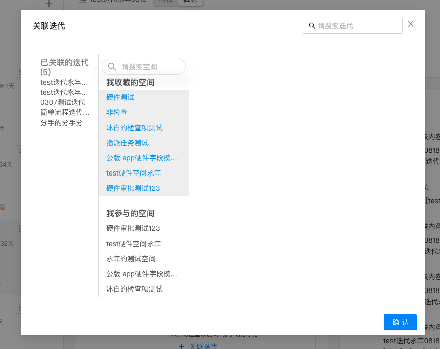

# 前端开发思路

本质：将用户输入的数据或者服务端获取的数据实时高效的展示在复杂的用户界面上

==万变不离其宗：==

- ==u=F(data) 界面是数据状态的映射==
- ==数据操作 数组/对象增删查改==
- ==先整体结构后局部细节==
- ==业务逻辑就是流程图，开发就是将页面流程图翻译成代码的过程==
- ==代码不精炼 = 数据操作不正确不精炼==

==Tips：==

- 先整体大概后局部细节：
  如将页面分为表单子组件，表格子组件，弹框子组件

- 增删查改注意数组每一项唯一 key 值字段：
  增改的时候，注意是否需要判断增的对象的 key 值字段、要改成的对象的 key 值字段 跟数组中的是否有重复

- ==代码不精炼 = 数据操作不正确不精炼：==
  写代码之前即数据操作前，先用文字将想要的页面效果表达出来，再选用合适的数据操作方法对数据进行合理的操作,

  ```jsx
  // 如增改的时候要判断每一项唯一 key 值字段是否重复，是还是否，即用`some/every`
  if (dataSource.some((v, i) => v.date === obj.date && i !== index)) {
    message.error(`xxx重复`);
  }

  // 改的时候可以用splice 或者map，最好用map
  const newData = dataSource.map((v, i) =>
    i === index ? { ...v, [indexColumnKey]: dateValue } : v
  );

  // 删除的时候肯定是用filter最好
  dataSource.filter((v, i) => i !== index);
  ```

# 前端开发流程

- 需求移交理解 （产品、前后端、测试）
  - 目前痛点、需求的目的、为了解决什么问题
  - 需求实现后真的能解决这些嘛
- ==参照 UI 交互构思 HTML、CSS（前端）==
  - 思考有哪些交互
  - 数据量多少，需要分页与否
- ==静态页面、功能逻辑开发 （前端）==
  - 有详细需求、原型： 可以开始静态页面开发
    - 写完结构后，在浏览器写样式，此时就算改代码重新编译，刚刚在浏览器写的样式还是会在
  - 询问后端是否有接口文档、Mock 数据（如 swagger、rapper2）
- 接口联调对接 （前后端）
- 自测（前端为主）：很重要
  - ==需求、UI 交互是否实现==
  - ==除了需求必要的改动之外，有没有引起额外多余的刷新/请求==
  - ==需求组件没问题，它的子/同级兄弟/父组件改变状态会不会引起需求组件的不必要渲染==
- 提测 （测试）

> 静态页面、功能逻辑开发过程是可以只关注结构、逻辑、先不调样式细节的，也就是说只看 vscode 编辑器就好，写差不多的结构、逻辑之后再调样式细节

如下实例


## 源代码阅读理解

- 以界面路由功能为出发点
- 从 render 函数还是从上到下阅读数据、事件、回调函数

## 性能优化

- React 组件性能优化
  - 主要是测试父组件重新 `render` 是否会引起子组件重新 `render`，代码基本功能完成后自测时候可以在父子组件中加 `console` 测试渲染情况。
  ```js
  // 在父子组件的return同级打印
  console.log("Filters子组件render");
  ```

## 细节

> **改 bug/改需求**

- 改 bug/修改需求时修改 state 数据的时候一定要注意之前的逻辑是不是会被受影响，不然很容易出现改了一个 bug 又搞出一个 bug 的问题

- bug 复现不了？

  - 开发的代码版本跟测试版本是否一致、环境是否一致
  - 浏览器版本是否一致

# 逻辑思维能力

> **拿到事情/需求后**

- 是什么？
  - 是这样吗（有没有隐含的背景、条件、联系等等？）？
- 为什么？
  - 为什么做？ 什么引起的？ 根本原因是什么？
- 怎么做？
- 做了会怎么样
  - 对别的地方会不会有什么影响？
  - js 实现复杂，用 CSS 能不能实现呢？

> **请教别人问题时**

- 说明是什么、当前效果、期望效果、自己的思考

## 学习新技术

- **WWW**：是什么、为什么、怎么做
  - 【`what`】是什么 \=\= 概念、定义
  - 【`why`】为什么 \=\= 目的、意义、解决什么问题痛点
  - 【`how`】怎么做 \=\= 具体过程、行动、方案、计划
- 记忆时，先主谓宾再定状补, 从而方便记忆。

```js
// 示例
Why 为什么要注重代码质量？
What 什么是代码本身的质量?
  why & How 代码质量下降恶性循环及原因及解决方案？
How 质量管控四个阶段
```

我一向认为对一门技术的学习方式应该是：

- 了解（知道它的相关介绍、用处）
- 用（了解常用 API）
- 用熟（对常用 API 能够用熟来，并了解一些高级 API）
- 解决问题（根据业务场景遇到的问题能够定位问题并解决）
- 看源码（深入源码的实现，此种情况主要是兴趣爱好驱动）

## 任务拆分 = 递归思想

**不管是任务、需求、功能、问题突然出现在你面前时候，要学会去科学的拆分、分解直到都是可以轻松解决的小任务，再组合起来，就是解决步骤**。

> **示例**

问题：使用 Promise 实现红绿黄灯交替重复亮

任务拆分如下

- **出现交替即重复字眼**，即拆分如下

  - 红绿黄灯依次间隔 3s、2s、1s 亮

    - 3 秒后 promise 返回，红灯亮
    - 2 秒后 promise 返回，绿灯亮
    - 1 秒后 promise 返回，黄灯亮
      **可以发现动作类似，可以归纳抽象**，因此抽象一个函数 light：n 秒后 promise 返回，执行动作

  - 循环下去
    **循环下去，所以有复用**，即一个函数 B，依次调用 A 执行相应操作，最后一步继续调用函数 B，使得循环下去

> promise 问题中，如何将问题解决步骤连接起来呢？
> 即通过 then 中返回一个新的 promise 并在其构造函数中结合 setTimeOut：

```js
Promise.resolve().then(
  () => new Promise((resolve) => setTimeout(() => resolve(), wait))
);
```

## 重复则抽象复用 = 复用

> **示例** [典型需求]-【新增文件/文件夹复制/移动到目标文件夹】

## 从结果倒逼过程 = 输出倒逼输入

这是学习的动力，也是学习的最佳实践。

**应用场景——背景——原理——实现方式 === 理解涉及的概念**

> **示例**:
>
> - IM 即时通讯的应用有：
>   - 实时聊天：微信、qq、在线客服
>   - 消息推送: 现今移动端 APP 标配的消息推送模块
> - 通信原理
> - 传统通信方式实现 IM 应用需要解决的问题
> - IM 实现原理
>   - 全双工低延迟的解决办法
>   - 跨域解决办法
> - WebSocket

# Tips

- 新点开链接跟手动刷新一个样子

# 参考连接

- [MDN 知识体系](https://developer.mozilla.org/zh-CN/docs/Web)

  - CSS（层叠样式表）
  - HTML（超文本标记语言）
  - HTTP
  - JavaScript
  - MathML
  - SVG
  - Web API 接口参考
  - Web App Manifest
  - Web Components
  - Web 媒体技术
  - Web 安全
  - Web 开发者指南
  - Web 性能
  - WebDriver
  - XML (可扩展标记语言)
  - XPath
  - 事件参考
  - 开源 Web 技术示例
  - 教程
  - 无障碍
  - 渐进式 Web 应用（PWA）

- [MDN-web docs JS](https://developer.mozilla.org/zh-CN/docs/Web/JavaScript)
- [MDN 术语表](https://developer.mozilla.org/zh-CN/docs/Glossary)
- [W3C](https://www.w3school.com.cn/index.html)
- [阮一峰 JS 教程](https://wangdoc.com/javascript/)
- [阮一峰 ES6 教程](https://es6.ruanyifeng.com/#README)
- [W3C-css 参考手册](https://www.w3cschool.cn/cssref/)
- [NPM 官网-查询依赖说明、用法、官网链接](https://www.npmjs.com/package/typescript)
- 技术社区网站
  - [思否-标签分类](https://segmentfault.com/tags)
  - [思否-JS 分类](https://segmentfault.com/t/javascript/blogs)
