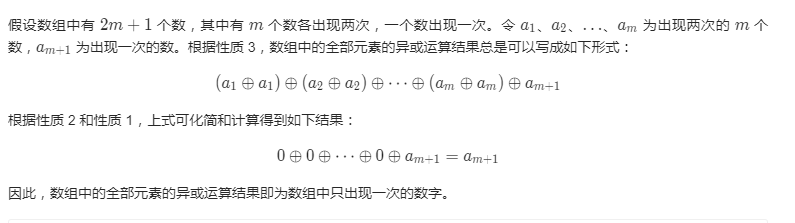

<!--
 * @Author: xulei
 * @Date: 2020-08-02 17:45:52
 * @LastEditors: xulei
 * @LastEditTime: 2020-09-06 17:13:39
 * @FilePath: \markDown\web前端\数据结构与算法\LeetCode题目.md
--> 
# LeetCode 经典题目分类
## 哈希表

### [1] 两数之和（简单）

**描述：**
>给定一个整数数组 nums 和一个目标值 target，请你在该数组中找出和为目标值的那 两个 整数，并返回他们的数组下标。
>你可以假设每种输入只会对应一个答案。但是，数组中同一个元素不能使用两遍。

**示例：**
>给定 nums = [2, 7, 11, 15], target = 9
>因为 nums[0] + nums[1] = 2 + 7 = 9
>所以返回 [0, 1]

**解法：**
* 暴力法：<br>
  两轮遍历，逐个比对：遍历每个元素 `x`，并查找是否存在一个值与 `target - x` 相等的目标元素。<br><br>
  ```js
  /**
  * @param {number[]} nums
  * @param {number} target
  * @return {number[]}
  */
  var twoSum = function (nums, target) {
    let a, b;
    const len = nums.length;
    for (var i = 0; i < len; i++) {
      const curValue = nums[i];
      for (var y = i + 1; y < len; y++) {
        const restValue = nums[y];
        if (curValue + restValue == target) {
          a = i;
          b = y;
        }
      }
    }
    return [a, b];
  };
  ```
* 哈希表法：<br>
  一轮遍历，查询当前哈希表中是否有和当前遍历元素相对应的目标元素，若有，则返回它们两个值的索引；将当前遍历元素和下标存入哈希表中（索引值为key，下标为value）。<br><br>
  ```js
  /**
  * @param {number[]} nums
  * @param {number} target
  * @return {number[]}
  */
  var twoSum = function (nums, target) {
    const len = nums.length;
    const obj = {};
    for (let i = 0; i < len; i++) {
      const curValue = nums[i];
      const restValue = target - curValue;
      if (restValue in obj) {
        const anotherIndex = obj[restValue];
        return curValue < restValue ? [i, anotherIndex] : [anotherIndex, i];
      }
      obj[curValue] = i;
    }
    return [];
  };
  ```

[画图解题](https://leetcode-cn.com/problems/two-sum/solution/jie-suan-fa-1-liang-shu-zhi-he-by-guanpengchn/)

**执行结果：**

| 方法  | 执行用时 | 击败用户百分比 | 内存消耗 | 击败用户百分比 |
| :-- | -- | -- | -- | -- |
| 暴力法 | 144ms | 38.74% | 38.2MB | 54.98% |
| 哈希表法 | 84ms | 68.51% | 38.6MB | 28.96% |

**复杂度分析：**
| 方法 | 时间复杂度 |  空间复杂度 | 分析
| :-- | -- | -- | --
| 暴力法 | $O(n^2)$ | $O(1)$ | 遍历数组耗费 $O(n)$，对于每个元素，试图通过遍历数组的其余部分来寻找它所对应的目标元素，这将耗费 $O(n)$ 的时间。因此时间复杂度：$O(n^2)$。
| 哈希表法 | $O(n)$ | $O(n)$ | 遍历一遍数组，时间复杂度：$O(n)$，所需的额外空间取决于哈希表中存储的元素数量，该表最多需要存储 n 个元素。空间复杂度：$O(n)$

### [202] 快乐数（简单）

**描述：**
>编写一个算法来判断一个数 n 是不是快乐数。
>「快乐数」定义为：对于一个正整数，每一次将该数替换为它每个位置上的数字的平方和，然后重复这个过程直到这个数变为 1，也可能是 无限循环 但始终变不到 1。如果 可以变为  1，那么这个数就是快乐数。
>如果 n 是快乐数就返回 True ；不是，则返回 False 。

**示例：**
>输入：19
>输出：true
>解释：
>$1^2$ + $9^2$ = 82
>$8^2$ + $2^2$ = 68
>$6^2$ + $8^2$ = 100
>$1^2$ + $0^2$ + $0^2$ = 1

**分析：**
首先写一个函数：数位分离，求平方和
```js
function getNext(n) {
  let sum = 0;
  while (n !== 0) {
    const rest = n % 10;
    sum += rest * rest;
    n = Math.floor(n / 10);
  }
  return sum;
}
```
**解法：**
* 笨方法：<br>
  不符合题目要求，加了个超次的变量 `totalTimes` ，超过1000次没有变成1则就不是快乐数，太复杂，不灵性。<br><br>
  ```js
  /**
  * @param {number} n
  * @return {boolean}
  */
  var isHappy = function (n) {
    let num = n;
    let totalTimes = 0
    while (num !== 1) {
      totalTimes += 1;
      if (totalTimes > 1000) {
        break;
      }
      num = getNext(num);
    }
    return totalTimes > 1000 ? false : true
  };
  ```
* 用 HashSet 检测循环：<br>
  详见官方题解<br>
  我们可以先举几个例子。我们从 7 开始。则下一个数字是 49（因为 7^2=49），然后下一个数字是 97（因为 4^2 + 9^2=97）。我们可以不断重复该的过程，直到我们得到 1。因为我们得到了 1，我们知道 7 是一个快乐数，函数应该返回 true。
  

  再举一个例子，让我们从 116 开始。通过反复通过平方和计算下一个数字，我们最终得到 58，再继续计算之后，我们又回到 58。由于我们回到了一个已经计算过的数字，可以知道有一个循环，因此不可能达到 1。所以对于 116，函数应该返回 false。
  

  根据我们的探索，我们猜测会有以下三种可能。
  1. 最终会得到 1。
  2. 最终会进入循环。
  3. 值会越来越大，最后接近无穷大。
  
  第三个情况比较难以检测和处理。我们怎么知道它会继续变大，而不是最终得到 1 呢？我们可以仔细想一想，每一位数的最大数字的下一位数是多少。
  
  | Digits | Largest | Next |
  | :-- | -- | --: |
  | 1 | 9 | 81 |
  | 2 | 99 | 162 |
  | 3 | 999 | 243 |
  | 4 | 9999 | 324 |
  | 13 | 9999999999999 | 1053 |

  对于 3 位数的数字，它不可能大于 243。这意味着它要么被困在 243 以下的循环内，要么跌到 1。4 位或 4 位以上的数字在每一步都会丢失一位，直到降到 3 位为止。所以我们知道，最坏的情况下，算法可能会在 243 以下的所有数字上循环，然后回到它已经到过的一个循环或者回到 1。但它不会无限期地进行下去，所以我们排除第三种选择。

  即使在代码中你不需要处理第三种情况，你仍然需要理解为什么它永远不会发生，这样你就可以证明为什么你不处理它。<br>
  **算法**：

  算法分为两部分，我们需要设计和编写代码。

  1. 给一个数字 n，它的下一个数字是什么？
  2. 按照一系列的数字来判断我们是否进入了一个循环。
  
  <br>
  第 1 部分我们按照题目的要求做数位分离，求平方和。

  第 2 部分可以使用 HashSet 完成。每次生成链中的下一个数字时，我们都会检查它是否已经在 HashSet 中。

  * 如果它不在 HashSet 中，我们应该添加它。
  * 如果它在 HashSet 中，这意味着我们处于一个循环中，因此应该返回 false。
  
  <br>
  我们使用 HashSet 而不是向量、列表或数组的原因是**因为我们反复检查其中是否存在某数字。检查数字是否在哈希集中需要 O(1) 的时间，而对于其他数据结构，则需要O(n) 的时间**。选择正确的数据结构是解决这些问题的关键部分。<br>
 
  ```js
  /**
  * @param {number} n
  * @return {boolean}
  */
  var isHappy = function (n) {
    let num = n;
    const list = new Set();
    while (num !== 1) {
      if (list.has(num)) {
        break;
      }
      list.add(num);
      num = getNext(num);
    }
    return num === 1;
  };
  ```


* 快慢指针法：<br>
  通过反复调用 getNext(n) 得到的链是一个**隐式的链表。隐式意味着我们没有实际的链表节点和指针，但数据仍然形成链表结构**。起始数字是链表的头 “节点”，链中的所有其他数字都是节点。next 指针是通过调用 getNext(n) 函数获得。

  那么这个问题就可以转换为检测一个链表是否有环。<br>
  **算法**：
  我们不是只跟踪链表中的一个值，而是跟踪两个值，称为快跑者和慢跑者。在算法的每一步中，慢速在链表中前进 1 个节点，快跑者前进 2 个节点（对 getNext(n) 函数的嵌套调用）。

  * 如果 n 是一个快乐数，即没有循环，那么快跑者最终会比慢跑者先到达数字 1。

  * 如果 n 不是一个快乐的数字，那么最终快跑者和慢跑者将在同一个数字上相遇。
  <br>

  ```js
  /**
  * @param {number} n
  * @return {boolean}
  */
  var isHappy = function (n) {
    let slow = n;
    let fast = getNext(n);
    while (fast != 1 && fast != slow) {
      slow = getNext(slow);
      fast = getNext(getNext(fast));
    }
    return fast == 1;
  };

  ```

**执行结果：**

| 方法  | 执行用时 | 击败用户百分比 | 内存消耗 | 击败用户百分比 |
| :-- | -- | -- | -- | -- |
| 笨方法 | 176ms | 5.03% | 38.5MB | 84.85% |
| HashSet 检测循环 | 80ms | 65.51% | 38.6MB | 75.76% |
| 快慢指针法 | 96ms | 21.26% | 38.8MB | 68.18% |

**复杂度分析：**

| 方法 | 时间复杂度 | 空间复杂度 | 分析
| :-- | -- | -- | --
| 笨方法 | $O(\log{n})$ | $O(\log{n})$  | 见官网
| HashSet 检测循环 | $O(\log{n})$ | $O(\log{n})$  | 见官网
| 快慢指针法 | $O(\log{n})$ | $O(1)$ | 对于这种方法，我们不需要哈希集来检测循环。指针需要常数的额外空间

### [204] 计数质数（简单）

**描述：**
> 统计所有小于非负整数 n 的质数的数量。

>质数（素数）：一个数如果只能被1和它本身整除，那么这个数就是质数。


**示例：**
>输入：10
>输出：4
>解释：小于 10 的质数一共有 4 个, 它们是 2, 3, 5, 7 。

**分析：**
首先写一个函数：判断一个数是不是质数
```js
function isPrime (n) {
  let t = Math.sqrt(n);
  for (let i = 2; i <= t; i++) {
    if (n % i === 0) {
      return false;
    }
  }
  return true;
};
```
为什么 i 不需要遍历到 n，而只需要遍历到 Math.sqrt(n) 呢？ 举个例子：
```js

12 = 2 × 6
12 = 3 × 4
12 = sqrt(12) × sqrt(12)
12 = 4 × 3
12 = 6 × 2
```

可以看到，后两个乘积就是前面两个反过来，反转临界点就在 sqrt(n)。

换句话说，如果在 `[2,sqrt(n)]` 这个区间之内没有发现可整除因子，就可以直接断定 n 是素数了，因为在区间 `[sqrt(n),n]` 也一定不会发现可整除因子。

这样，isPrime 函数的时间复杂度降为 O(sqrt(N))

**解法：**

* 循环法：<br>
  ```js
  var countPrimes = function (n) {
    let num = 0;
    for (let i = 2; i < n; i++) {
      if (isZhiShu(i)) {
        num++;
      }
    }
    return num;
  };
  ```

* 高效法：<br>
  [如何高效判定、筛选素数](https://leetcode-cn.com/problems/count-primes/solution/ru-he-gao-xiao-pan-ding-shai-xuan-su-shu-by-labula/)
  高效解决这个问题的核心思路是和上面的常规思路反着来：

  首先从 2 开始，我们知道 2 是一个素数，那么 2 × 2 = 4, 3 × 2 = 6, 4 × 2 = 8... 都不可能是素数了。

  然后我们发现 3 也是素数，那么 3 × 2 = 6, 3 × 3 = 9, 3 × 4 = 12... 也都不可能是素数了。

  看到这里，你是否有点明白这个排除法的逻辑了呢？先看我们的第一版代码：
  ```js
  var countPrimes = function(n) {
    // 将数组都初始化为 true
    let list = new Array(n).fill(true); // [true, ....]

    for (let i = 2; i < n; i++)
      if (list[i]) {
        // i 的倍数不可能是素数了
        for (let j = 2 * i; j < n; j += i) {
          list[j] = false;
        }
      }

    let count = 0;
    for (let i = 2; i < n; i++) {
      if (list[i]) count++;
    }

    return count;
  }
  ```
  如果上面这段代码你能够理解，那么你已经掌握了整体思路，但是还有两个细微的地方可以优化。

  首先，回想刚才判断一个数是否是素数的 isPrime 函数，由于因子的对称性，其中的 for 循环只需要遍历 [2,sqrt(n)] 就够了。这里也是类似的，我们外层的 for 循环也只需要遍历到 sqrt(n)：

  ```js
  const t = Math.sqrt(n)
  for (let i = 2; i < t; i++)
  ```
  除此之外，很难注意到内层的 for 循环也可以优化。我们之前的做法是：
  ```js
  for (int j = 2 * i; j < n; j += i) {
    isPrim[j] = false;
  }
  ```
  这样可以把 i 的整数倍都标记为 false，但是仍然存在计算冗余。

  比如 `n = 25，i = 4` 时算法会标记 `4 × 2 = 8，4 × 3 = 12` 等等数字，但是这两个数字已经被 `i = 2 和 i = 3` 的 `2 × 4 和 3 × 4` 标记了。

  我们可以稍微优化一下，让 j 从 i 的平方开始遍历，而不是从 2 * i 开始：
  ```js
  for (int j = i * i; j < n; j += i) {
      isPrim[j] = false;
  }
  ```

  这样，素数计数的算法就高效实现了，其实这个算法有一个名字，叫做 Sieve of Eratosthenes(厄拉多塞筛法)。看下完整的最终代码：
  ```js
  var countPrimes = function (n) {
    // 将数组都初始化为 true
    let list = new Array(n).fill(true); // [true, ....]
    const t = Math.sqrt(n);

    for (let i = 2; i < t; i++) {
      if (list[i]) {
        // i 的倍数不可能是素数了
        for (let j = i * i; j < n; j += i) {
          list[j] = false;
        }
      }
    }

    let count = 0;
    for (let i = 2; i < n; i++) {
      if (list[i]) count++;
    }
    return count;
  };
  ```
  ps:计数的for循环也可以去掉，把 `count++` 放到第一个 for 循环的 if 中 `if (list[i]) { count++ }` 中， 不过要把第一for 循环 改成 `for (let i = 2; i < n; i++)`才行。


**执行结果：**

| 方法  | 执行用时 | 击败用户百分比 | 内存消耗 | 击败用户百分比 |
| :-- | -- | -- | -- | -- |
| 循环法 | 856ms | 22.81% | 37.6MB | 93.75% |
| 高效法(第一版) | 168ms | 53.51% | 51.2MB | 30.21% |
| 高效法(最终版) | 120ms | 74.97% | 51.3MB | 29.16% |

**复杂度分析：**

| 方法 | 时间复杂度 | 空间复杂度 | 分析
| :-- | -- | -- | --
| 循环法 | $O(n\sqrt[2]{n})$ | $O(1)$ | 外层循环时间复杂度为$O(n)$，isPrime函数时间复杂度为$O(\sqrt[2]{n})$，没有用到额外的空间，所以空间复杂度为$O(1)$
| 高效法(最终版) | $O(n\log\log{n})$ | $O(n)$  | 

### [205] 同构字符串（简单）

**描述：**
> 给定两个字符串 s 和 t，判断它们是否是同构的。
如果 s 中的字符可以被替换得到 t ，那么这两个字符串是同构的。
所有出现的字符都必须用另一个字符替换，同时保留字符的顺序。两个字符不能映射到同一个字符上，但字符可以映射自己本身。

>质数（素数）：一个数如果只能被1和它本身整除，那么这个数就是质数。


**示例：**
>输入: s = "egg", t = "add"
输出: true

>输入: s = "foo", t = "bar"
输出: false

> 输入: s = "paper", t = "title"
输出: true

> 输入: s = "ab", t = "aa"
输出: false

> 输入: s = "ab", t = "ca"
输出: true

**分析：**
目标：遍历字符串，每个位置上的字符在s中出现过的位置跟t上对应位置上的字符在t中出现过的位置都相同

- 如果s和t的长度不一样，返回false
- 遍历s: 利用hash表
  - 如果`s[i]`不在哈希表中，需要考虑两种情况，
    - 如果`t[i]`在哈希表的values中，返回false
    - 否则`hashtable[s[i]] = t[i]`
  - 如果`s[i]`在哈希表中，
    - 如果`hashtables[s[i]] != t[i]`，则返回false


**解法：**

* hash表遍历法：<br>
  ```js
  function isIsomorphic(s, t) {
    const obj = {};
    if (s.length !== t.length) {
      return false;
    }
    for (let i = 0; i < s.length; i++) {
      if (obj[s[i]]) {
        if (obj[s[i]] !== t[i]) {
          return false
        }
      } else {
        const values = Object.values(obj);
        if (values.includes(t[i])) {
          return false
        }
        obj[s[i]] = t[i]
      }
    }
    return true;
  }

  console.log(isIsomorphic('paper', 'title')) // true
  console.log(isIsomorphic('paper', 'titl')) // false
  console.log(isIsomorphic('foo', 'bar')) // false
  console.log(isIsomorphic('aba', 'baa')) // false
  console.log(isIsomorphic('ab', 'aa')) // false  
  console.log(isIsomorphic('ab', 'ca')) // true
  ```
* indexof()：<br>
  ```js
  function isIsomorphic(s, t) {
    if (s.length !== t.length) {
        return false;
    }
    for (let i = 0; i < s.length; i++) {
        if (s.indexOf(s[i]) !== t.indexOf(t[i])) {
            return false;
        }
    }
    return true;
  }

  console.log(isIsomorphic('paper', 'title')) // true
  console.log(isIsomorphic('paper', 'titl')) // false
  console.log(isIsomorphic('foo', 'bar')) // false
  console.log(isIsomorphic('aba', 'baa')) // false
  console.log(isIsomorphic('ab', 'aa')) // false  
  console.log(isIsomorphic('ab', 'ca')) // true
  ```
**执行结果：**

| 方法  | 执行用时 | 击败用户百分比 | 内存消耗 | 击败用户百分比 |
| :-- | -- | -- | -- | -- |
| hash表遍历法 | 104ms | 30.39% | 40MB | 36.81% |
| indexof() | 88ms | 66.4% | 38.5MB | 73.94% |

**复杂度分析：**

| 方法 | 时间复杂度 | 空间复杂度 | 分析
| :-- | -- | -- | --
| hash表遍历法 | $O(n)$ | $O(n)$ | 一层循环时间复杂度为$O(n)$，所需的额外空间取决于哈希表中存储的元素数量，该表最多需要存储`s.length`个元素。空间复杂度：$O(n)$ |
| indexof() | $O(n)$ | $O(1)$ | 一层循环时间复杂度为$O(n)$ |

### [217] 存在重复元素（简单）

**描述：**
> 给定一个整数数组，判断是否存在重复元素。
如果任意一值在数组中出现至少两次，函数返回 true 。如果数组中每个元素都不相同，则返回 false 。

**示例：**
>输入: [1,2,3,1]
输出: true


>输入: [1,2,3,4]
输出: false

>输入: [1,1,1,3,3,4,3,2,4,2]
输出: true

**解法：**

- **hash表遍历法：**

  分析：（自解耗时：10M）
  - 遍历数组，利用map
    - 如果元素存在map中，则返回true
    - 否则将元素存到map中
  - 返回false
  ```js
  var containsDuplicate = function (nums) {
    const obj = {};
    const len = nums.length;
    for (let i = 0; i < len; i += 1) {
      const item = obj[nums[i]];
      if (item || item === 0) {
        return true;
      } else {
        obj[nums[i]] = 1
      }
    }
    return false;
  };
  console.log(containsDuplicate([1, 2, 3, 1]))
  console.log(containsDuplicate([1, 2, 3, 4]))
  console.log(containsDuplicate([1, 1, 1, 3, 3, 4, 3, 2, 4, 2]))
  ```
- **Set遍历法：**
  ```js
  const set = new Set();
  for (let i = 0; i < nums.length; i++) {
    if (!set.has(nums[i])) {
      set.add(nums[i]);
    } else {
      return true;
    }
  }
  return false;
  ```
**执行结果：**

| 方法  | 执行用时 | 击败用户百分比 | 内存消耗 | 击败用户百分比 |
| :-- | -- | -- | -- | -- |
| hash表遍历法 | 88ms | 73.71% | 45.2MB | 13.35% |
| Set遍历法 | 80ms | 89.09% | 43.1MB | 60.83% |

**复杂度分析：**

| 方法 | 时间复杂度 | 空间复杂度 | 分析
| :-- | -- | -- | --
| hash表遍历法 | $O(n)$ | $O(n)$ | 一层循环时间复杂度为$O(n)$，所需的额外空间取决于哈希表中存储的元素数量，该表最多需要存储`num.length`个元素。空间复杂度：$O(n)$ |
| Set遍历法 | $O(n)$ | $O(n)$ | 一层循环时间复杂度为$O(n)$ |


### [219] 存在重复元素 II  （简单）

**描述：**
> 给定一个整数数组和一个整数 k，判断数组中是否存在两个不同的索引 i 和 j，使得 nums [i] = nums [j]，并且 i 和 j 的差的 绝对值 至多为 k。

**示例：**
>输入: nums = [1,2,3,1], k = 3
输出: true


>输入: nums = [1,0,1,1], k = 1
输出: true  

>输入: nums = [1,2,3,1,2,3], k = 2
输出: false

**解法：**
- **hash表遍历法：**

  分析：（自解耗时：13M）
  - 遍历数组，利用map
    - 如果元素值存在map中
      - 如果当前元素值的下标跟存在map中的最新下标差的绝对值不大于k，则返回true
    - 否则将元素存到map中（元素值作为key：最新下标为value）
  - 返回false
  ```js
  var containsDuplicate = function (nums) {
    const obj = {};
    const len = nums.length;
    for (let i = 0; i < len; i += 1) {
      const item = obj[nums[i]];
      if (item || item === 0) {
        if (Math.abs(obj[nums[i]] - i) <= k) {
          return true
        }
      }
      obj[nums[i]] = i
    }
    return false;
  };
  ```
- **Set遍历法：**
  ```js
  var containsDuplicate = function (nums, k) {
    const set = new Set();
    const len = nums.length;
    for (let i = 0; i < len; i += 1) {
      if (set.has(nums[i])) {
        return true;
      }
      set.add(nums[i])
      if (set.size > k) {
        set.delete(nums[i - k])
      }
    }
    return false;
  };
  ```

**执行结果：**

| 方法  | 执行用时 | 击败用户百分比 | 内存消耗 | 击败用户百分比 |
| :-- | -- | -- | -- | -- |
| hash表遍历法 | 92ms | 70.46% | 44.3MB | 14.25% |
| Set遍历法 | 88ms | 77.66% | 41.7MB | 68.95% |

**复杂度分析：**

| 方法 | 时间复杂度 | 空间复杂度 | 分析
| :-- | -- | -- | --
| hash表遍历法 | $O(n)$ | $O(n)$ | 一层循环时间复杂度为$O(n)$，所需的额外空间取决于哈希表中存储的元素数量，该表最多需要存储`s.length`个元素。空间复杂度：$O(n)$ |
| Set遍历法 | $O(n)$ | $O(n)$ | 一层循环时间复杂度为$O(n)$ |
## 位运算：

### **异或运算介绍**
>异或（xor）是一个数学运算符。它应用于逻辑运算。异或的数学符号为"⊕"，计算机符号为"xor"。异或运算 $\bigoplus$ 有以下三个性质：
> * 任何数和 0 做异或运算，结果仍然是原来的数，即 a $\bigoplus$ 0 = a
> * 任何数和其自身做异或运算，结果是 0，即 a $\bigoplus$ a = 0
> * 异或运算满足交换律和结合律，即 a $\bigoplus$ b $\bigoplus$ a = b $\bigoplus$ a $\bigoplus$ a = b $\bigoplus$ (a $\bigoplus$ a) = b $\bigoplus$ 0 = b

> 二进制下异或运算规则：
```js
1 ⊕ 1 = 0
0 ⊕ 0 = 0
1 ⊕ 0 = 1
0 ⊕ 1 = 1
```
> 因此十进制下`相同数字异或结果为0`，`数字a与0异或结果仍为原来的数字a`。

### [136] 只出现一次的数字（简单）

**描述：**
>给定一个非空整数数组，除了某个元素只出现一次以外，其余每个元素均出现两次。找出那个只出现了一次的元素。

**说明：**
>你的算法应该具有线性时间复杂度。 你可以不使用额外空间来实现吗？

**示例：**
>输入: [2,2,1]&emsp;&emsp;输出: 1
>输入: [4,1,2,1,2]&emsp;&emsp;输出: 4

**分析：**
[官方题解](https://leetcode-cn.com/problems/single-number/solution/zhi-chu-xian-yi-ci-de-shu-zi-by-leetcode-solution/)
>如果没有时间复杂度和空间复杂度的限制，这道题有很多种解法，可能的解法有如下几种。
> * 使用集合存储数字。遍历数组中的每个数字，如果集合中没有该数字，则将该数字加入集合，如果集合中已经有该数字，则将该数字从集合中删除，最后剩下的数字就是只出现一次的数字。
> * 使用哈希表存储每个数字和该数字出现的次数。`遍历数组即可得到每个数字出现的次数，并更新哈希表，最后遍历哈希表，得到只出现一次的数字`。
> * 使用集合存储数组中出现的所有数字，并计算数组中的元素之和。由于集合保证元素无重复，因此计算集合中的所有元素之和的两倍，即为每个元素出现两次的情况下的元素之和。由于数组中只有一个元素出现一次，其余元素都出现两次，因此用集合中的元素之和的两倍减去数组中的元素之和，剩下的数就是数组中只出现一次的数字。

>上述三种解法都需要额外使用 $O(n)$ 的空间，其中 n 是数组长度。如果`要求使用线性时间复杂度和常数空间复杂度`，上述三种解法显然都不满足要求。那么，如何才能做到线性时间复杂度和常数空间复杂度呢？

**解法：**
  

  ```js
  /**
  * @param {number[]} nums
  * @return {number}
  */
  var singleNumber = function(nums) {
      const len = nums.length;
      for(var i = 1; i<len;i++) {
          nums[0] ^= nums[i]; // nums[0] = nums[0] ^ nums[i]
      }
      return nums[0];
  };
  ```

  ```js
  // 数组遍历使用reduce
  var singleNumber = function (nums) {
    return nums.reduce((a, b) => a ^ b);
  };

  ```
**执行结果：**

| 方法  | 执行用时 | 击败用户百分比 | 内存消耗 | 击败用户百分比 |
| :-- | -- | -- | -- | -- |
| 异或运算法 | 96ms | 32.3% | 38.3MB | 67.75% |
| 异或运算法（reduce） | 80ms | 56.71% | 38.2MB | 78.91% |

**复杂度分析：**

|  | 时间复杂度 |  空间复杂度 | 分析
| -- | -- | -- | --
| 异或运算法 | $O(n)$ | $O(1)$ | 遍历数组耗费 $O(n)$。因为直接使用题目提供的数组做运算，没有用到额外的空间，所以空间复杂度为$O(1)$

## 快慢指针：
### **思想**
> 在龟兔赛跑的寓言中，跑的快的称为 “乌龟”，跑得快的称为 “兔子”。不管乌龟和兔子在循环中（环形跑道）从哪里开始，它们最终都会相遇。这是因为**兔子每走一步就向乌龟靠近一个节点（在它们的移动方向上）**。


常用来解决检测链表是否有环的问题


## 说明
* js算法执行后的执行用时、内存消耗不太准确，同一个算法提交结果有差异。仅供参考。