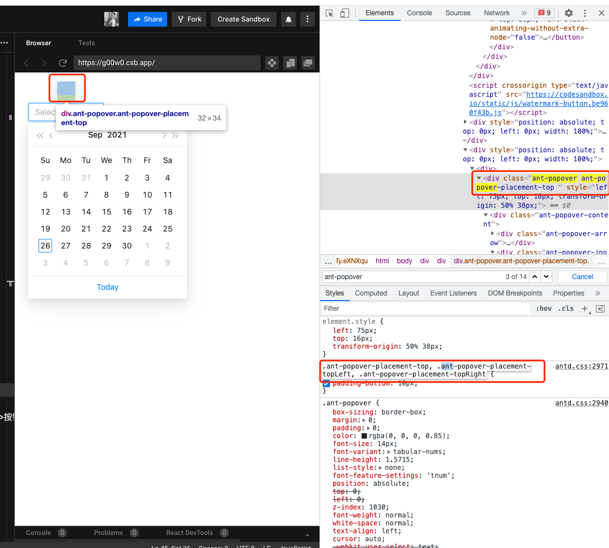

# 调试

- 在【开发者工具-element】中调试样式是很方便的

- 如下，鼠标点击【styles 里面的一个选择器】所选择的元素就能在界面上显示出来。
  

# 手动添加 cookie

[Chrome 浏览器手动添加 Cookie 的方法](https://segmentfault.com/a/1190000040597170)

```jsx
document.cookie="keyName=cookeiValue"；
```

服务端请求可以看到携带了 cookie，但是浏览器请求头 headers 中没有携带 cookie，查看 cookie 栏，发现是被过滤掉了，提示如下
`this cookie was blocked because its path was not an exact match for or a superdirectory of the request url's path`
即：此 cookie 被阻止，因为它的路径与请求 url 的路径不完全匹配或超级目录

最终解决方法：

```js
1. 地址栏输入 chrome://flags/
2. 搜索 Partitioned cookies
3. 将其开关从default改成Enabled // 控制是否启用了 Partitioned cookie 属性
4. 重启chrome
5. 将cookie的path改成/
```
