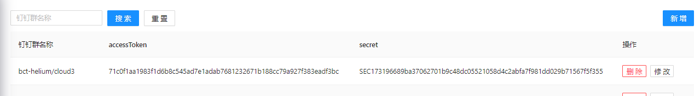
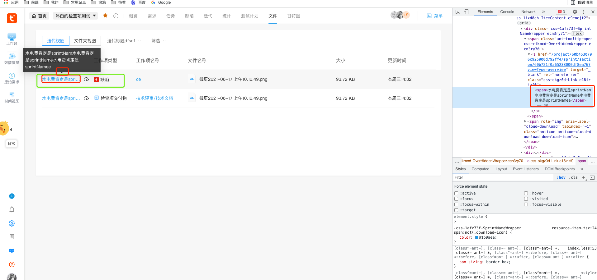

# Row Col



```js
<Row justify="space-between" gutter={12} style={{ marginBottom: 10 }}>
  <Col>
    <Row>
      <Col>
        <Input
          value={searchData}
          onChange={onInputChange}
          placeholder="钉钉群名称"
        />
      </Col>
      <Col>
        <Button
          type="primary"
          onClick={handleClickSearch}
          style={{ marginLeft: 10, marginRight: 10 }}
        >
          搜索
        </Button>
        <Button onClick={handleClickReset}>重置</Button>
      </Col>
    </Row>
  </Col>

  <Col>
    <Button
      type="primary"
      onClick={() => {
        setFormModalVisible(true);
      }}
    >
      新增
    </Button>
  </Col>
</Row>
```

## Row 设置 Gutter 后水平栅格间隔没有生效

**【问题描述】**：

- 通过给`:global(.ant-col)`设置样式能生效，但是还是没有水平间隔

**【解决方法】**：

- 通过给`<Clo />`的子元素设置样式（`border`），发现水平间隔正常了。

```tsx
// .AntdColInner {
//     border: 1px solid #bfbfbf;
//     display: flex;
//     justify-content: center;
//     align-items: center;
//   }

const keys = useMemo(() => {
  return [
    NUMBER_KEYS_CONFIG,
    COMPARISON_KEYS_CONFIG,
    MATH_KEYS_CONFIG,
    LOGIC_KEYS_CONFIG,
  ].map((configList, index) => (
    <Row gutter={[8, 8]} key={index}>
      {configList?.map((configItem) => (
        <Col key={configItem.bindKey} span={configItem.span}>
          <div className={styles.AntdColInner}>{configItem.title}</div>
        </Col>
      ))}
    </Row>
  ));
}, []);
```

# Modal

弹窗内容中的元素的 `className` 如果要想生效，Modal 必须设置`wrapClassName={styles.StepConfigModal}`，且`.less`文件中 className 需要写在`styles.StepConfigModal`下。

```js
<Modal
  visible={this.state.modalVisible}
  confirmLoading={this.state.confirmLoading}
  title={modalType === "edit" ? "出入金修改" : "出入金录入"}
  // onOk={this.handleModalOk}
  onCancel={this.handleModalCancel}
  maskClosable={false}
  footer={[
    <Button onClick={this.handleModalCancel}>取消</Button>,
    <Button
      key="submit"
      type="primary"
      /* loading={loading} */ onClick={this.handleModalOk}
    >
      确定
    </Button>,
  ]}
>
  // ....
</Modal>
```

# Popover

- 如何修改 antd 中 popover 自带的样式，通过`overlayClassName`属性
- popover/ToolTip 设置在 root 标签外面，如何设置样式，
  创建的节点不在 root 节点内，因此 antd 提供了 `overlayClassName` 来在外层设置了一个 class

```css
&-popover {
  .ant-popover-inner {
    max-height: 96vh;
    overflow: scroll;
  }
}
```

# Tabs

- 如何只将别的组件（tabs 下有几个 tabpane）下的 tabpane 引入到别的页面的 Tabs 下

```jsx
// codesandbox示例代码如下
import React from "react";
import ReactDOM from "react-dom";
import "antd/dist/antd.css";
import "./index.css";
import { Tabs } from "antd";

const { TabPane } = Tabs;

function callback(key) {
  console.log(key);
}

function Test() {
  const list = [4, 5, 6].map((item) => {
    return (
      // <Tabs>
      <TabPane tab={item} key={item}>
        Content of Tab Pane {item}
      </TabPane>
      // </Tabs>
    );
  });
  return list;
}

const Demo = () => (
  <Tabs defaultActiveKey="1" onChange={callback}>
    <TabPane tab="Tab 1" key="1">
      Content of Tab Pane 1
    </TabPane>
    {Test()}
    {/* <Test /> // 这种写法就不能正常显示，因为返回的不是直接的Tabpane，而是一些别的东西 */}
  </Tabs>
);

ReactDOM.render(<Demo />, document.getElementById("container"));
```

```jsx
//实际项目中代码
const TeamProject = () => {
  return (
    <React.Fragment>
      <TabPane key="myProject" tab="我的空间">
        // xxx
      </TabPane>
      <TabPane key="team" tab="团队空间">
        // xxx
      </TabPane>
    </React.Fragment>
  );
};

import TeamProject from "../team-project";
const tabItems = useMemo(() => {
  const items = [
    {
      title: lang.work,
      key: "work",
      component: <Work refreshTodoItemsNums={fetchTodoItemsNum} />,
    },
    {
      title: lang.sprint,
      key: "sprint",
      component: <Sprint />,
    },
    {
      title: lang.approval,
      key: "approval",
      component: <Approval />,
    },
  ];
  return items;
}, []);
return (
  <div css={MainCss}>
    <Tabs type="card">
      {tabItems.map((tab) => (
        <Tabs.TabPane tab={tab.title} key={tab.key}>
          {tab.component}
        </Tabs.TabPane>
      ))}
      {TeamProject({})}

      {/* <TeamProject /> // 这种写法就不能正常显示，因为返回的不是直接的Tabpane，而是一些别的东西 */}
    </Tabs>
  </div>
);
```

- `Tabs.TabPane`下的组件如果没有高度，需要给`.ant-tabs-content`一个 `height: 100%`

```css
.tabs-part {
  .ant-tabs-content {
    height: 100%;
  }
  .ant-tabs-top > .ant-tabs-nav {
    margin-bottom: 0;
  }
}
```

# Tooltip

**Tooltip 卡片设置样式:**

```jsx
<Tooltip
  overlayStyle={{ width: 500, maxWidth: 500 }}
  title={i18n.spaceOverviewTipList?.map((v, i) => (
    <div key={i} style={{ marginBottom: 5 }}>
      {v}
    </div>
  ))}
>
```

**包裹的文字无论多长都让 Tooltip 显示在内容容器的正中间**

Tooltip 的箭头一直在它子元素的中间，所以子元素肯定是个固定宽度的元素



```jsx
// 内容的容器元素：一般给个最大宽度，超出...显示，这样就能让 Tooltip 显示在内容的容器元素的正中间
const OverHiddenWrapper = styled.span`
  overflow: hidden;
  text-overflow: ellipsis;
  white-space: nowrap;
`;

// 内容，a链接文本可能会很长
export const RenderTitle = ({ sprintName, sprintId, projectId }) => {
  return (
    <Link
      href={`/project/${projectId}/sprint/section/${sprintId}?viewType=overview`}
      target="_blank"
      rel="noreferrer"
      onClick={(e) => e?.stopPropagation()}
    >
      <span>{sprintName}</span>
    </Link>
  );
};

<Tooltip title={sprintName} placement={"top"}>
  <OverHiddenWrapper>
    <RenderTitle
      sprintName={sprintName}
      sprintId={resource?.sprintId}
      projectId={projectId}
    />
  </OverHiddenWrapper>
</Tooltip>;
```

# Skeleton

单行的骨架屏如何设置百分比宽度，只给个`widht: '100%'`没有用，再设置个 className 即可

```jsx
.rowSkeleton {
  width: 100%;
}

<Skeleton.Input
  active
  className="rowSkeleton"
  style={{ width: "100%", height: 16, marginBottom: 12 }}
/>
```
