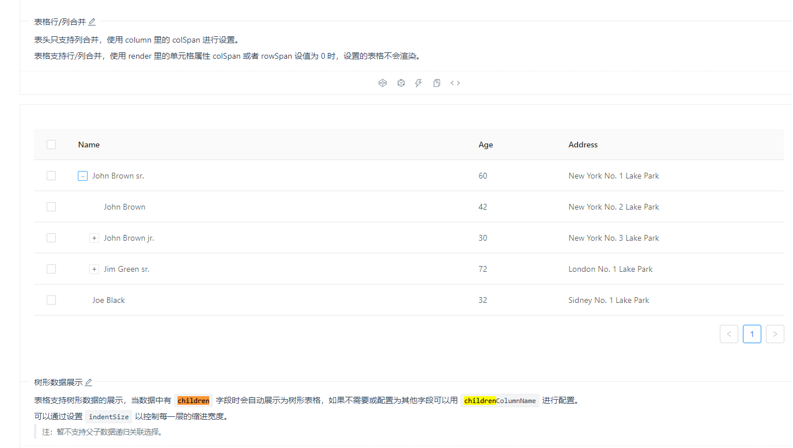
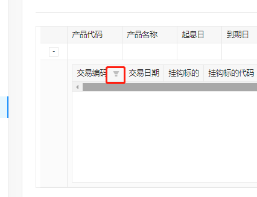
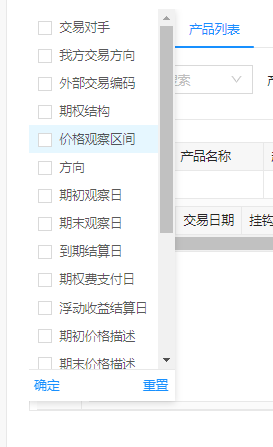
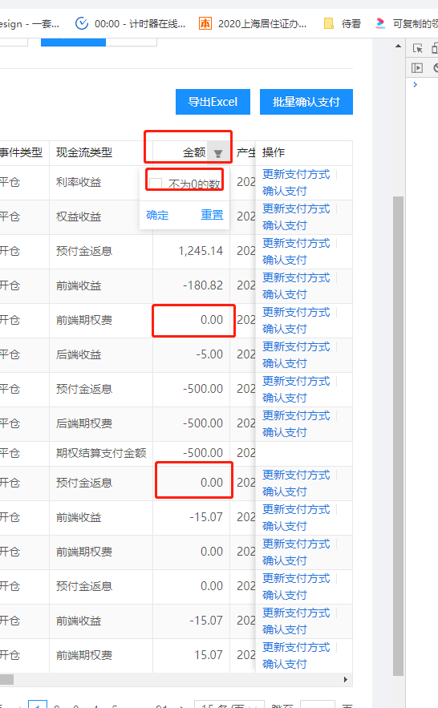
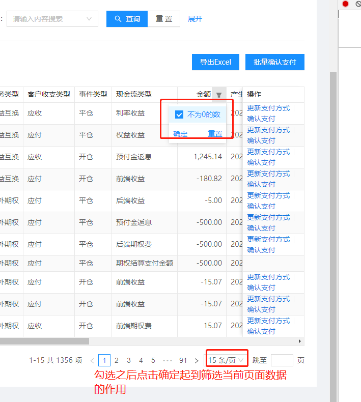

### rowSelection

| 参数             | 说明                                             | 类型             | 备注                                                                     |
| ---------------- | ------------------------------------------------ | ---------------- | ------------------------------------------------------------------------ |
| getCheckboxProps | 选择框的默认属性配置（如让某条 record 不能勾选） | Function(record) | `getCheckboxProps: record => ({ disabled: record.status === '已推送' })` |

### 树形数据展示 可展开

[链接](https://3x.ant.design/components/table-cn/#components-table-demo-expand-children)


### Column

| 参数    | 说明             | 类型     | 备注 |
| ------- | ---------------- | -------- | ---- |
| filters | 表头的筛选菜单项 | object[] |

#### sorter 排序

- 假分页排序（前端排序）

```js
  {
    title: '产品代码',
    dataIndex: 'product_code',
    key: 'product_code',
    sorter: (a, b) => (a.product_code || '').localeCompare(b.product_code || '', 'zh'),
    sortDirections: ['ascend', 'descend'],
  },
  {
    title: '起息日',
    dataIndex: 'value_date',
    key: 'value_date',
    sorter: (a, b) => (a.value_date || '').localeCompare(b.value_date || ''),
    sortDirections: ['ascend', 'descend'],
  },
    {
    title: '现价(￥)',
    dataIndex: 'price',
    sorter: (a, b) => a.price - b.price,
    sortDirections: ['ascend', 'descend'],
    render: val => formatNumber(val, 4),
  },
```

- 真分页排序（注意：无法查一页数据后前端来给这一页排序，因为没有意义）
  - columns 设置为`sorter: true`即可

```js
onChange = (page, filters, sorter) => {
  const { query, pathname } = location;
  const orderValue = Object.keys(sorter).length === 0 ? '' : `${sorter.field}`;
  const sortValue = sorter.order ? sorter.order.substring(0, sorter.order.length - 3) : '';
  dispatch({
    type: 'marktingModel/query',
    payload: {
      page: page.current,
      pageSize: page.pageSize,
      orderBy: orderValue,
      sort: sortValue,
    },
  });
};

public onChange = ({ current, pageSize }, filter, { order, field }) => {
  if (!order || !field) {
    return this.onFetch({ current, pageSize });
  }
  /* if (field === 'valueDate' || field === 'maturityDate') {
    return this.onFetch({ current, pageSize }, { orderby: `${field} ${SORT_MAP[order]} id` });
  } */
  return this.onFetch({ current, pageSize }, { sortOrder: order, sortField: field });
};

  public onFetchTable = async (paramsPagination = {}, sorter = {}) => {
    const res = await judgePagePermissionByRoleIdAndPageName('viewProductList');
    if (!res) {
      return;
    }
    const page = paramsPagination.current || this.state.pagination.current;
    const pageSize = paramsPagination.pageSize || this.state.pagination.pageSize;
    const formData = Form2.getFieldsValue(this.state.searchFormData);
    this.setState({ loading: true });
    const { error, data } = await getProducts({
      params: transformParams(['productCode', 'taskName'], formData),
      likes: transformParams(['productShortDescription'], formData),
      dates: transformDateParams(['subscriptionDate'], formData),
      page: page - 1,
      pageSize,
      ...sorter,
    });
    this.setState({ loading: false });
    if (error) return;
    this.setState(state => ({
      dataSource: Array.isArray(data.page) ? data.page : [],
      total: data.totalCount || 0,
      pagination: {
        ...state.pagination,
        ...paramsPagination,
      },
    }));
  };

<SmartTable
  pagination={{ ...pagination, total }}
  onChange={this.onChange}
>
</SmartTable>
```

##### 排序概念

- 用 DESC 表示按倒序排序(即：从大到小排序) ---降序排列
- 用 ASC 表示按正序排序(即：从小到大排序)---升序排列

#### filters 表头的筛选菜单项

```js
const TRADE_CODE_FILTERS_COLUMNS = [
  {
    title: '交易对手',
    dataIndex: 'counterparty',
    key: 'counterparty',
  }]

export const getChildrenColumns = (tradeCodeFiltersKeys = []) => [
  {
    title: '交易编码',
    dataIndex: 'tradeConfirmId',
    key: 'tradeConfirmId',
    filters:
      TRADE_CODE_FILTERS_COLUMNS.map(v => ({
        text: v.title,
        value: v.dataIndex,
      }))
  },
  {
    title: '交易日期',
    dataIndex: 'tradeDate',
    key: 'tradeDate',
    render: val => val && moment(val).format('YYYY-MM-DD'),
  },
    ...(tradeCodeFiltersKeys.length
    ? TRADE_CODE_FILTERS_COLUMNS.filter(v => tradeCodeFiltersKeys.includes(v.dataIndex))
    : []),
]

public onExpandedChange = (pagination, filter, sorter) => {
  console.log('filter', filter);
  const tradeCodeFiltersKeys = _.get(filter, 'tradeCode', []);
  this.setState({
    tradeCodeFiltersKeys,
  });
};

<Table
  columns={getChildrenColumns(tradeCodeFiltersKeys)}
  onChange={this.onExpandedChange}
/>


```




#### 列筛选

只能筛选当前页面，且相当于是表单中的一个控件




```js
const [filterData, setFilterData] = useState([]);

// pageSize & 页码
const handleTableChange = (paginationParams, filters, sorter) => {
  const { current, pageSize } = paginationParams;
  const isNotCurrentPage = !(
    current === pagination.current && pageSize === pagination.pageSize
  );

  if (isNotCurrentPage) {
    if (_.get(filters, "cashFlowAmount.length")) {
      fetchTable({ current, pageSize }, null, true);
    } else {
      fetchTable({ current, pageSize });
    }
    setPagination({ current, pageSize });
    return;
  }
  if (_.get(filters, "cashFlowAmount.length")) {
    setFilterData(dataSource.filter((item) => item.cashFlowAmount !== 0));
  } else {
    setFilterData(dataSource);
  }
};

const fetchTable = async (
  paginationParams,
  formData = null,
  setFilterDataFlag = false
) => {
  const { current: page, pageSize } = paginationParams;
  const formDataParam = formData || handleSearchForm();
  setLoading(true);
  const {
    data: { result, error },
  } = await fetch[
    "POST/capital-service/api/rpc/method=capMarginReceivablePayableSearch"
  ]({
    request: formDataParam,
    page: page - 1,
    pageSize,
  });
  setLoading(false);
  if (error) {
    return;
  }
  setTotal(result.totalCount || 0);
  const tempData = Array.isArray(result.page)
    ? result.page.map((v) => ({
        ...v,
        comment: Form2.createField(v.comment),
      }))
    : [];
  setDataSource(tempData);
  setFilterData(
    setFilterDataFlag
      ? tempData.filter((item) => item.cashFlowAmount !== 0)
      : tempData
  );
};
```

```js
// 金额筛序列筛选的状态如果改变则点击确定后肯定是回到第一页，组件设计如此无法修改
//  即把他当成是上面表单的一个控件
- 没点过金额筛选的时候切换页码时的数据
  filters: {}
  paginationParams: {
    current,
    pageSize
  }
- 勾选并点击确定
  filters: {
    cashFlowAmount: ["0"]
  }
  paginationParams: {
    current: 1,
    pageSize: 15
  }

- 反勾选并点击确定 / 重置
  filters: {
    cashFlowAmount: []
  }
  paginationParams: {
    current: 1,
    pageSize: 15
  }

- 勾选状态下切换页码
  filters: {
    cashFlowAmount: ["0"]
  }
  paginationParams: {
    current,
    pageSize
  }
```

## scroll

table 未设置 scroll，则列太多后会超出布局显示，设置`scroll.x`即可

```jsx
// const w = columns.reduce((p, n) => p + +(n?.width || 120), 0)


const width = (columns as any).reduce((total, cur) => {
  total += cur.width

  return total
}, 0)

scroll={{
  y: 600,
  x: width
}}
```

## 功能

### 导出

```js
public getColumns = async () => {
  const { dataSource = [] } = this.state;
  this.setState({ loading: true });
  const filename = '风控列表.xlsx';
  const shellHeadData = TABLE_COLUMNS.map(v => {
    if (v.title) {
      return v.title.includes('%') ? v.title.slice(0, -3) : v.title;
    }
    return '';
  });
  const handledDataSource = dataSource.map(v =>
    _.mapValues(v, (value, key) => {
      if (key === 'customizationStatus') {
        return value && CUSTOMIZATION_STATUS_MAP[value];
      }
      if (key === 'holderType') {
        return value && HOLDER_TYPE_MAP[value];
      }
      return value;
    }),
  );
  const shellDataIndex = TABLE_COLUMNS.map(v => v.dataIndex);
  const ws_name = 'SheetJS';
  const shellData = handleShellData(handledDataSource, shellDataIndex, shellHeadData);
  const wb = XLSX.utils.book_new();
  const ws = XLSX.utils.aoa_to_sheet(shellData);
  XLSX.utils.book_append_sheet(wb, ws, ws_name);
  XLSX.writeFile(wb, filename);
  this.setState({ loading: false });
};
```

## 问题

### 嵌套子表格 和 固定列 错位问题

antd 3.x 的 bug， 4.x 已经解决

### 唯一 rowKey 设置的不符合

- 若`rowKey={record.id}` ，而两条 record 的 id 又一样，第一次渲染没问题，再次更新 dataSource 时，就会出现其中一条 record 一直存在 table 中无法删除的问题，除非组件卸载。

#### table 数据 dataSource 改变了但是界面未更新

table 缺少 rowKey 造成的

```js
// rowKey	表格行 key 的取值，可以是字符串或一个函数
rowKey={record => record.operateTime + record.productCode}
```

### column 对应的 key 在 record 的某个属性的下面

不需要处理，render 的时候多取一级即可。
