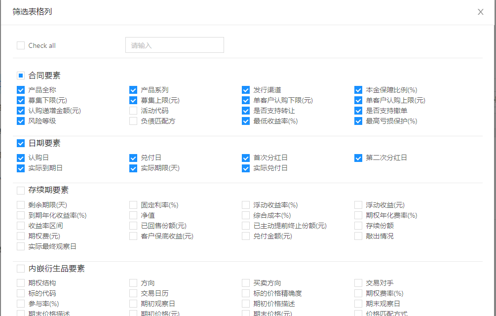

# 数据录入

## Input

**【Input 组件设置`autoComplete="off"`无效】**

问题描述：antd 的 Input 组件不支持`autoComplete="off"`。

解决方法：设置`autoComplete="new-password"`

```tsx
<Form.Item name="User" label="用户">
  <Input autoComplete="new-password" />
</Form.Item>
```

## DatePicker

```jsx
import locale from 'antd/es/date-picker/locale/zh_CN' // 在next中ssr是node环境，用的是寻找的是lib，所有es会转义成commomn.js，改成下面的lib就好了

import locale from 'antd/lib/date-picker/locale/zh_CN'


<DatePicker
  format="YYYY年MM月DD日"
  css={css`
    width: 160px;
  `}
  suffixIcon={null}
  locale={locale} // 引入
  allowClear={false}
  placeholder={lang.actualEndTime}
  defaultValue={moment()}
  onChange={(date) => {
    actualEndTimeRef.current = date!
  }}
  disabledDate={(current) => {
    return !!(
      current &&
      item?.actualStartDate &&
      current < moment(item?.actualStartDate).endOf('day')
    )
  }}
/>
```

## Checkbox 多选框

[实现参照 antd Checkbox 多选框 全选](https://3x.ant.design/components/checkbox-cn/#components-checkbox-demo-check-all)


## Radio 单选框

### 按钮组

```jsx
export type IRadioType = "all" | "self" | "other";

const [radioType, setRadioType] = useState < IRadioType > "all";

const onRadioGroupChange = (e) => {
  const value = e?.target?.value;
  setRadioType(value);
};

return (
  <Radio.Group
    onChange={onRadioGroupChange}
    value={radioType}
    style={{
      marginLeft: "50%",
      transform: "translateX(-50%)",
    }}
  >
    <Radio.Button value="all">全部</Radio.Button>
    <Radio.Button value="self">
      {isFunctionTeam ? "本团队" : "本业务线"}
    </Radio.Button>
    <Radio.Button value="other">其它</Radio.Button>
  </Radio.Group>
);
```

## Select

```js
// 若使用options数据化配置选项内容，则需要添加Option
<Select
  options={[
    { label: "是", value: true },
    { label: "否", value: false },
  ]}
  defaultValue={false}
  style={{ width: 120 }}
  onChange={handleChange}
>
  <Option value={true}></Option>
  <Option value={false}></Option>
</Select>
```

- API

| API        |                                                     说明                                                      |              类型              |
| :--------- | :-----------------------------------------------------------------------------------------------------------: | :----------------------------: | --------------- | ------------------------------ |
| onChange   |                               选中 option，或 input 的 value 变化时，调用此函数                               | `function(value, option:Option | Array<Option>)` |
| onDeselect | ==取消选中时调用（即单个 Option 被 xx）==，参数为选中项的 value (或 key) 值，仅在 multiple 或 tags 模式下生效 |        `function(string        | number          | LabeledValue)`                 |
| onSelect   |                   ==被选中时调用（即单个 Option 被 xx）==，参数为选中项的 value (或 key) 值                   |        `function(string        | number          | LabeledValue, option: Option)` |

### 级联 Select 支持多选

> 参考资料

- [antd 级联选择- 多选](https://blog.csdn.net/weixin_46976320/article/details/108096835)
- [如何开发一个 Antd 级联多选控件-晓楷的文章](https://zhuanlan.zhihu.com/p/342659477)

## Tree 树形控件

- API

| API                 |         说明         |    类型    | 默认值 | 备注                                                                                    |
| :------------------ | :------------------: | :--------: | ------ | --------------------------------------------------------------------------------------- |
| defaultExpandedKeys | 默认展开指定的树节点 | `string[]` | []     | 在弹窗中的单选 Tree 中可以实现打开弹窗，展示选中节点的效果， 值使用的就是`selectedKeys` |

## Upload 上传

### 上传实例一

- `upload`上传如何限制文件的类型：在`beforeUpload`中判断处理

**参考资料：**

- [react-antd 导入导出 Excel](https://www.jianshu.com/p/a9aeffc69f09)
- [React 项目，基于 antd 读取 excel 文件](https://www.jianshu.com/p/dfa58474cd46)
- [input type="file"](https://www.jianshu.com/p/134473c8d162)

**实例：**

```js
onUploadStatusChanged = (info) => {
  if (_.isEmpty(info)) {
    this.setState({
      fileList: [],
    });
    return;
  }
  const result = info.file || {};

  if (_.get(result, "response.error")) {
    this.setState({
      fileList: [
        {
          ...result,
          status: "error",
        },
      ],
    });
    message.error(`接口返回错误:${_.get(result, "response.error.message")}`);
    return;
  }

  if (result.status) {
    this.setState({
      fileList: [result],
    });
    if (result.status === "done") {
      if (!_.get(result, "response.error")) {
        message.success(`模板${_.get(result, "name")}上传成功`);
        return;
      }
      message.error(`${_.get(result, "response.error.message")}`);
    }
  }
};

const uploadProps = {
  name: "file",
  action: `${HOST_TEST}document-service/api/upload/rpc`,
  headers: {
    authorization: `Bearer ${Storage.getItem("token")}`,
  },
  showUploadList: false,
  onChange: (info) => this.onUploadStatusChanged(info),
  fileList,
  // 两种onChange都能成功上传
  /* onChange: (info) => {
    console.log("info", info);
    if (info.file.status === "done") {
      message.success(`${info.file.name}上传成功`);
      this.onFetchTable();
    } else if (info.file.status === "error") {
      message.error(`${info.file.name}上传失败, ${info.file.response.error}`);
    }
  }, */
};

<Upload
  data={{
    method: "docTemplateCreate",
    params: JSON.stringify({
      templateGroupId: record.uuid,
    }),
  }}
  {...uploadProps}
>
    <a>上传文件</a>
</Upload>;
```

### 上传实例二

- **上传标的白名单：** 既要讲 excel 文件传到后端，还要讲 excel 数据解析后传给后端

原来是直接掉一个接口上传文件，存到数据库（字符流形式）

现在是两个接口

- 上传 excel 文件，存到服务器（）
- 前端读取刚刚的 excel 文件，将数据调接口传给后端

```js
const uploadProps = {
  name: "file",
  action: `${HOST_TEST}document-service/api/upload/rpc`,
  accept: ".xls, .xlsx, .xlsm",
  headers: {
    authorization: `Bearer ${Storage.getItem("token")}`,
  },
  data: {
    method: "docTemplateCreate",
    params: JSON.stringify({
      templateGroupId,
    }),
  },
  showUploadList: false,
  beforeUpload: this.handleFile,
  onChange: (info) => this.onUploadStatusChanged(info), // onUploadStatusChanged方法同实例一
  fileList,
  /* onChange: info => {
    console.log('info', info);
    if (info.file.status === 'done') {
      message.success(`${info.file.name}上传成功`);
      this.onFetchTable();
    } else if (info.file.status === 'error') {
      message.error(`${info.file.name}上传失败, ${info.file.response.error}`);
    }
  }, */
};

handleFile = (file) => {
  /* Boilerplate to set up FileReader */
  const reader = new FileReader(); // 通过FileReader对象读取文件
  const rABS = !!reader.readAsBinaryString; // 二进制
  // 开始读取文件流
  reader.onload = (event) => {
    /* Parse data */
    const data = event.target.result;
    const workbook = XLSX.read(data, { type: rABS ? "binary" : "array" }); // 以二进制流方式读取得到整份excel表格对象
    /* Get first worksheet */
    const sheetName = workbook.SheetNames[0];
    const sheets = workbook.Sheets[sheetName];
    const xlsxData = XLSX.utils.sheet_to_json(sheets, { range: 0, raw: true }); // range: 0 从第一行开始

    this.uploadXlsxData({
      xlsxData,
      cols: workbook.SheetNames,
      fileName: file.name,
    }); // 读取excel数据并传给后端
  };
  if (rABS) {
    reader.readAsBinaryString(file);
  } else {
    reader.readAsArrayBuffer(file);
  }
};

<Upload {...uploadProps}>
  <Button key="submit" type="primary">
    上传最新白名单
  </Button>
</Upload>;
```

### 上传实例三 `<input type="file" />`

accept={SheetJSFT}

```js
const UPLOAD_TYPE = ["jpg", "xls", "xlsx", "doc", "docx", "rar", "pdf"];
const SheetJSFT = UPLOAD_TYPE.map((x) => `.${x}`).join(",");

<Button style={{ marginBottom: 20 }}>
  <Icon type="upload" />
  上传附件
  <input
    type="file"
    id="file"
    onChange={handleFileChange}
    multiple
    accept={SheetJSFT} // 只能在选择文件的时候过滤掉不满足类型的文件（不让你看到但还是能传）所以还得再onChange中判断并过滤提示
    style={{
      position: "absolute",
      top: 0,
      left: 0,
      width: "100%",
      height: "100%",
      fontSize: "0",
      opacity: 0,
      display: "block",
      cursor: "pointer",
    }}
  />
</Button>;

const handleFileChange = async (e) => {
  const { files } = e.target;
  const { length } = files;
  if (length < 1) {
    message.error("请选择文件上传");
    return;
  }
  if (length > 20) {
    message.error("最多同时支持20个文件上传");
    return;
  }
  const data = [];
  // eslint-disable-next-line no-plusplus
  for (let i = 0; i < files.length; i++) {
    const fileType = _.get(files[i], "name", "")
      .split(".")
      .slice(-1)
      .toString();
    if (UPLOAD_TYPE.includes(fileType)) {
      data.push(files[i]);
    }
  }
  if (files.length !== data.length) {
    message.info(`仅支持上传类型为${UPLOAD_TYPE.join()}的附件`);
  }
  setLoading(true);
  const rsp = await Promise.all(
    data.map((item) => {
      const formData = new FormData();
      formData.append("method", "partyDocCreateOrUpdate");
      formData.append("params", JSON.stringify({ name: item.name }));
      formData.append("file", item);
      return uploadAttachment(formData);
    })
  );
  setLoading(false);
  const errorRsp = rsp.filter((item) => item.error);
  const successRsp = rsp.filter((item) => !item.error);
  message.info(
    `上传成功 ${successRsp.length} 个附件，上传失败 ${errorRsp.length} 个附件`
  );
};

// 客户信息的附件上传
export async function uploadAttachment(params) {
  return request(
    `${HOST_TEST}document-service/api/upload/rpc`,
    {
      method: "POST",
      body: params,
    },
    true
  );
}
```

# Tips

- DataPicker 和 select 都有个 open 属性，用来控制弹层显示与否。
