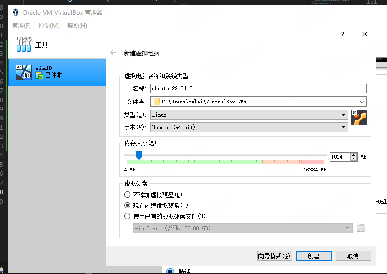

# 安装ubuntu系统
- 创建虚拟硬盘：文件位置`D:/VirtualBox/ubuntu_22.04.3/ubuntu_22.04.vdh` ，`虚拟硬盘文件类型`选择`VHD（虚拟硬盘）`，`文件大小`选择200G，`存储在物理硬盘上`选择动态分配，存储位置同样选择到D盘。

## 桥接网卡

- 装完`ubuntu_22.04.3`后，`ifconfig`查询ip，发现IP是`10.0.2.15`，而不是`192.168.xx.xx`。
- 如何解决：通过桥接网卡
  - 虚拟机`设置-网络-网卡1`
    - `连接方式`：选择`桥接网卡`
    - `界面名称`：选择`Intel(R) Ethernet Connection（14）I219-LM`
  - 设置完后，`ubuntu`右上角`有线设置`，先关闭，再打开。
  - `ifconfig`查询ip，能否发现IP变成`192.168.13.109`

## 安装软件

### Chrome
- 1.下载chrome`google-chrome-stable_123.0.6312.58-1_amd64.deb`，放到共享文件夹内。
- 2.ubuntu系统内取出来，同目录执行安装命令：
`sudo dpkg -i google-chrome-stable_123.0.6312.58-1_amd64.deb`